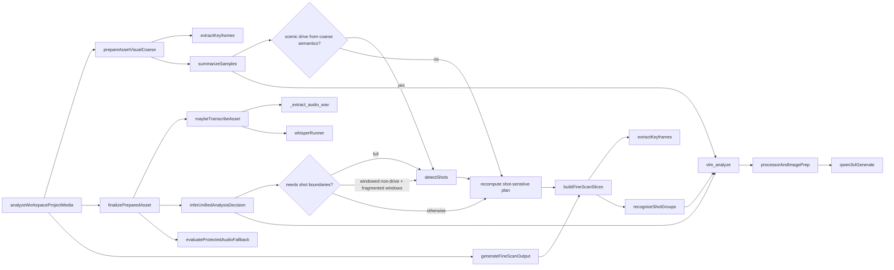

# Kairos — Analyze 性能优化文档

> 本文档专门用于收口 Kairos `Analyze` 阶段的性能优化思路。
> 当前目标不是立即跑 benchmark，而是先把热点、测量口径和后续优化方向整理成一个统一入口，避免后续优化时只盯着某一个局部。

## 1. 范围

本文只关注 Kairos 的 `Analyze` 主链性能，不覆盖：

- `Ingest` 的导入吞吐
- `Script / Timeline / Export` 的后续链路
- 风格分析 `kairos-style-analysis`

本文尤其关注当前最常见、最贵的这条路径：

- Windows + NVIDIA + CUDA
- `Qwen3-VL` 作为 VLM
- `Whisper` 作为 ASR
- `ffmpeg` 负责抽帧、scene detect、音频抽取

## 2. 当前 Analyze 链路

当前媒体分析并不是单一的“跑一次 VLM”，而是一个由 `ffmpeg + VLM + ASR + pipeline orchestration` 共同组成的流水线。



这意味着：

- 端到端耗时不可能只由单次 `Qwen3-VL generate` 决定
- 某些热点来自“单次调用很贵”
- 某些热点来自“调用次数太多”
- 还有一部分热点来自 `ffmpeg` 的串行子进程与多次读盘

## 3. 当前已知热点

### 3.1 VLM 推理本身

当前 CUDA 路径在 `ml-server/kairos_ml/vlm_runner.py` 中固定使用：

- `attn_implementation="sdpa"`
- `dtype=torch.float16`
- `device_map="auto"`

VLM warm-path 主要成本通常会落在：

- 图片打开与 `RGB` 转换
- processor 预处理
- CUDA tensor 搬运
- `_model.generate(...)`
- 输出 decode

在当前实现里，真正的 Qwen3-VL 推理热点主要不是“是否调用 VLM”，而是：

- 单次请求本身贵
- 同一条素材会多次调用

### 3.2 VLM 调用次数放大

这是当前最值得警惕的结构性问题之一。

在 `src/modules/media/project-analyze.ts` 中：

- `prepareAssetVisualCoarse()` 会在粗扫阶段调用一次 `summarizeSamples()`
- `finalizePreparedAsset()` 会在决策阶段再调用一次 `inferUnifiedAnalysisDecision()`

也就是说，对大多数视频素材，coarse path 里就已经可能发生两次 VLM 请求。

在 `src/modules/media/recognizer.ts` 中：

- `recognizeShotGroups()` 是按 group 串行调用 `recognizeFrames()`
- 细扫 slice 越多，VLM 请求数越容易线性膨胀

当前两个最典型的 multiplicity 热点是：

- `recognizeShotGroups()` 的逐组串行 VLM
- `extractKeyframes()` 的逐时间点串行 `ffmpeg`

## 4. 非 VLM 热点

### 4.1 `ffmpeg` scene detect

`src/modules/media/shot-detect.ts` 中的 `detectShots()` 会对整条视频做一遍完整的 scene-detect pass。

`2026-04-03` 更新：

- 它已经不再作为所有视频的 unconditional coarse step
- 现在默认会先走 coarse keyframes / coarse VLM / ASR / provisional decision
- 只有 deferred gate 命中时才会补跑 `scene detect`
- 当前 gate 分成三层：
  - `video + fineScanMode === full` 的 hard gate
  - selected `windowed` non-drive 的 fragmented-window soft gate
  - scenic `drive` 复用 coarse VLM 语义的单独 soft gate
- `scene detect` 的采样 fps 现在也分两档：
  - 显式 runtime override 始终优先
  - 其他 non-drive deferred path 默认 `2fps`
  - `drive` 使用时长感知 fps，按目标帧预算收口在 `0.5 ~ 2fps`
- gate 命中后只重算 shot-sensitive planning，不重跑 coarse VLM / ASR
- `2026-04-03` 的最新 `5` 条样本验证也说明：
  - broadened scenic `drive` path 加上动态 fps 后，端到端 `165.9s -> 122.8s`，`sceneDetectMs`：`57.6s -> 15.6s`
  - 但 strict `D1` 仍然更快：`107.3s -> 122.8s` 是 `+14.5%`
  - 唯一命中的 `074b9c90...` 仍然 `0` shots，说明动态 fps 目前主要是在回收成本，不是稳定换回 shot boundaries

这意味着它仍然是一个真实热点，但不再应该被视为“所有视频都必须先交的固定税”。

它的特点是：

- 更偏 CPU / decode / IO
- 对长视频成本明显
- 即使 VLM 很快，这一步也可能成为前置瓶颈

### 4.2 `ffmpeg` 抽帧

`src/modules/media/keyframe.ts` 里的 `extractKeyframes()` 现在是：

- 每个时间点起一次 `ffmpeg`
- 串行执行
- 每次都包含 seek、decode、scale、写图

这类成本经常不是单次特别大，而是被时间点数量放大。

它会同时影响：

- coarse scan 抽样帧
- fine scan 的 slice 代表帧

### 4.3 ASR 路径

`ml-server/kairos_ml/whisper_runner.py` 的 ASR 不是纯 Whisper 推理，而是两段：

1. 先用 `ffmpeg` 把输入媒体抽成 16k 单声道 WAV
2. 再交给 Whisper backend 做识别

所以 ASR 的端到端耗时包含：

- 媒体解复用 / 转码
- WAV 读盘
- Whisper 推理

当前它和 VLM 是并列的重路径，而不是附属小开销。

### 4.4 pipeline 写盘与 orchestration

除了模型和 `ffmpeg`，还有一些“单次不重，但可能累计”的开销：

- `writeKairosProgress()` 每次都会原子写盘
- 每个 asset 会写 `analysis/asset-reports/<assetId>.json`
- Analyze 结束还会重新读 `assets / reports / chronology` 再刷新 chronology
- Node 到 ML server 的 HTTP round-trip 也会被调用次数放大

这类开销单次通常不是最大头，但项目规模一大时仍然值得量化。

### 4.5 `drive` speech / visual 语义分离

这项工作不直接降低 wall time，但它已经成为当前 Analyze 设计里的正式约束。

当前 `drive` 路径里：

- `clipType` 仍保持正式类型 `drive`
- `IInterestingWindow` / `IKtepSlice` / recall candidate 额外携带 `semanticKind`
- `drive` 的 `speech` 和 `visual` windows 不再 merge
- `speech` slices 更偏 transcript / narration 语义，`visual` slices 更偏景色 summary 与速度建议

这件事的重要性在于：

- scenic `drive` 的创作收益目前主要来自 coarse VLM 视觉窗口被保留下来
- 这份收益不应再因为后续性能优化而被重新抹平
- 所以后续任何针对 `drive` 的优化，都不应默认把 speech / visual 当成同一种窗口处理

## 5. 当前优先级判断

在没有实测数据前，当前最可能的热点优先级大致如下：

### 第一梯队

- `Qwen3-VL` warm-path 推理
- coarse + fine-scan 里的 VLM 调用次数放大
- `extractKeyframes()` 的逐时间点串行 `ffmpeg`

### 第二梯队

- `detectShots()` 的全片 scene detect
- ASR 的 `ffmpeg` 抽 WAV + Whisper 推理

### 第三梯队

- progress 写盘
- chronology 末尾刷新
- report 写盘
- HTTP transport 开销

这个排序的含义不是第三梯队可以忽略，而是：

- 如果第一梯队没量清楚，先优化第三梯队通常不会带来明显收益

## 6. 优化原则

### 6.1 先做观测，再做 backend 替换

不能先假定 `flash_attention_2` 就一定是主解。

因为它只会影响：

- VLM CUDA 路径

它不会直接改善：

- `ffmpeg` 抽帧
- `detectShots`
- ASR WAV 抽取
- Whisper 推理
- timeline / chronology 写盘

### 6.2 区分“单次慢”与“次数多”

同样都是 VLM 耗时高，优化方向可能完全不同：

- 如果单次 `generate` 占比最高，优先考虑 `flash_attention_2`、模型参数和 backend
- 如果总数太多，优先减少 coarse/fine scan 的调用次数

### 6.3 区分 cold-start 与 warm-path

第一次请求的耗时经常包含：

- model load
- import
- processor 初始化

但日常 Analyze 更关心的是 warm-path。

所以 profiling 必须至少拆成：

- cold-start
- warm request

### 6.4 pipeline benchmark 与 micro benchmark 都要有

只看单次 `/vlm/analyze` 延迟会误导。

因为真实 Analyze 的总时间还取决于：

- 素材数量
- 每条素材触发的 VLM 次数
- fine scan slice 数
- 抽帧数量
- ASR 是否触发

## 7. 建议的 profiling 口径

推荐把性能数据分成四层：

### 7.1 Node 侧 stage timing

在这些位置记录 wall time：

- `prepareAssetVisualCoarse()`
- `finalizePreparedAsset()`
- `generateFineScanOutput()`
- chronology refresh

### 7.2 `ffmpeg` timing

至少分开统计：

- `detectShots()`
- `extractKeyframes()`
- ASR 的 `_extract_audio_wav`

### 7.3 ML server timing

VLM 需要拆成：

- cold load
- image open
- processor prep
- H2D
- `generate`
- decode

ASR 需要拆成：

- WAV extraction
- Whisper inference

### 7.4 请求次数与放大量

除了时间，还必须记 count：

- 每个 asset 的 coarse VLM 请求数
- 每个 asset 的 fine-scan VLM 请求数
- 每个 asset 的 keyframe timestamp 数
- 每个 asset 是否触发 ASR

## 8. 建议的结果输出形式

为了方便后续 benchmark，建议后续 profiling 结果最终能稳定输出为结构化数据，而不是只散落在日志中。

建议至少包含这些字段：

```json
{
  "pipelineTotalMs": 0,
  "assetCount": 0,
  "coarse": {
    "totalMs": 0,
    "vlmRequestCount": 0,
    "keyframeCount": 0
  },
  "fineScan": {
    "totalMs": 0,
    "vlmRequestCount": 0,
    "keyframeCount": 0,
    "sliceCount": 0
  },
  "asr": {
    "totalMs": 0,
    "requestCount": 0
  },
  "ffmpeg": {
    "sceneDetectMs": 0,
    "keyframeExtractMs": 0,
    "wavExtractMs": 0
  },
  "io": {
    "progressWriteMs": 0,
    "reportWriteMs": 0,
    "chronologyRefreshMs": 0
  }
}
```

这里的重点不是字段名本身，而是后续能稳定回答：

- 时间花在哪
- 请求打了多少次
- 是单次慢，还是总量大

## 9. `flash_attention_2` 在这个问题里的位置

`flash_attention_2` 当前应被视为：

- 一个很重要的 VLM backend 优化变量
- 但不是整个 Analyze 性能问题的总代名词

如果后续实测表明：

- `generate` 是绝对大头

那么 `flash_attention_2` 很可能值得优先接入。

但如果后续实测表明：

- VLM 次数过多
- `ffmpeg` 抽帧更重
- ASR 占比已经很高

那么仅仅换 attention backend，收益会明显被稀释。

同时要明确：

- `flash_attention_2` 属于 `CUDA / PyTorch` 路线变量
- 不属于当前 `mac + MLX` 路线的默认比较维度

## 10. 同档位模型替换也是正式评估变量

除了 `flash_attention_2` 之外，另一个应正式纳入评估规划的变量是：

- 在同一参数档位内更换 VLM 本体

当前 Kairos 的目标并不是单纯追求更快，而是：

- 如果效果明显更好
- 且推理开销基本不增加
- 就可以接受模型替换

这意味着后续评估不能只做“性能优化 A/B”，还应包含“效果优先型 A/B”。

### 10.1 这类模型替换的关注点

对 Kairos 当前 Analyze 链路，最值得关注的不是模型在通用 benchmark 上是否更强，而是它对现有结构化输出是否更稳、更有用。

当前最值得比较的输出包括：

- `scene_type`
- `subjects`
- `place_hints`
- `narrative_role`
- `description`
- JSON 结构稳定性

换句话说，如果候选新模型能在这些字段上带来更高质量，而延迟和显存没有明显恶化，就值得认真考虑替换。

### 10.2 质量优先型 A/B 的评估标准

建议把模型 A/B 的接受标准收口为：

- 结构化输出更稳定，字段缺失、跑偏、格式污染更少
- `subjects / place_hints / description` 的细节质量更高
- 幻觉更少，尤其是地点和对象识别
- 多图总结更连贯
- warm-path 延迟基本不增加
- 显存占用没有明显上升
- 不额外放大 OOM 风险

这里的关键不是追求所有指标都赢，而是：

- 效果改善是否足够明显
- 开销是否仍保持在“可接受的同档位”内

### 10.3 这类模型替换与 `flash_attention_2` 的关系

这两件事不是互斥，而是两条不同维度的变量：

- `flash_attention_2`：主要回答“同模型下，VLM backend 能否更快/更省”
- 同档位模型替换：主要回答“在开销基本不变前提下，效果能否更好”

所以更合理的比较方式通常不是二选一，而是分成三层：

1. 当前模型 + 当前 backend
2. 当前模型 + 更优 backend
3. 候选新模型 + 相同 backend

这样才能分清：

- 收益来自 attention backend
- 还是来自模型本体

### 10.4 按平台收口评估边界

这类评估必须按平台分开，不要混成一套口径：

- `Windows + CUDA`
  - 可以同时评估：
    - 同档位模型替换
    - `sdpa` vs `flash_attention_2`
- `mac + MLX`
  - 当前默认只评估：
    - 同档位模型替换
  - 不把 `flash_attention_2` 作为对比项

原因很简单：

- `mac` 当前走的是 `MLX` 路线
- 这里最重要的是模型本体换了以后效果是否更好
- 不应把 CUDA attention backend 的问题混进 `mac` 评估里

### 10.5 当前建议

如果后续进入真实 benchmark，建议把“同档位模型替换”定义成质量优先分支，而不是先验地把它视为性能优化分支。

也就是说：

- 如果新模型效果更好，但开销基本持平，可以接受
- 如果新模型效果只有轻微提升，但开销明显变大，不应优先替换
- 如果新模型效果更好，同时 `flash_attention_2` 又能把性能拉回当前水平，那会是非常值得的组合路线

对 `mac + MLX` 环境，再额外补一条明确约束：

- 默认只做“模型 A/B”
- 不做 `flash_attention_2` 对比
- 判断标准以结构化输出质量提升为主，性能只要求“不明显变差”

## 11. 后续优化路线图

### 路线 A：VLM 单次推理最贵

优先做：

- `sdpa` vs `flash_attention_2`
- 可能的 processor / 图像尺寸优化
- 必要时再考虑模型规模或生成参数

### 路线 B：VLM 次数放大最贵

优先做：

- 减少 coarse path 的重复 VLM 调用
- 限制 `inferUnifiedAnalysisDecision()` 的触发条件
- 调整 fine-scan group 粒度
- 评估是否可以批量化或并行化部分 group 请求

### 路线 C：`ffmpeg` 最贵

优先做：

- 降低 coarse sample 数
- 降低 fine-scan 抽帧密度
- 把逐时间点抽帧改成更批量的方式
- 评估 scene detect 的 proxy 配置和硬件解码路径
- 对 scenic `drive`，验证 gradual-change recall 是否应由 coarse semantic visual windows 主导，而不是继续强依赖 shot boundaries

### 路线 D：ASR 最贵

优先做：

- 单独统计 WAV 提取与 Whisper 推理占比
- 优化 Whisper chunk / batch 配置
- 限制低价值素材的 ASR 触发条件

### 路线 E：I/O 与 orchestration 已经可见

优先做：

- 降低 progress 写盘频率
- 避免不必要的全量 chronology 重载
- 收紧 report / progress 的更新节奏

### 路线 F：效果优先，且同档位开销基本不变

优先做：

- 为候选新模型建立同 prompt、同素材、同字段的 A/B 对照
- 把评估重点放在 `subjects / place_hints / description / narrative_role` 的质量
- 明确 warm-path 延迟、显存和 OOM 风险是否仍在当前可接受范围
- 只在“效果提升明显且成本基本不涨”时考虑模型替换
- 在 `mac + MLX` 环境，把这条路线视为默认模型升级路线，不再附带 `FA` 比较

## 12. 当前结论

在目前没有正式 benchmark 数据之前，可以先把结论收口为：

- `Analyze` 的热点不是单一问题，而是 `VLM + ffmpeg + ASR + orchestration` 的组合问题
- `Qwen3-VL` 很可能仍是最贵的单项，但它未必就是整个端到端 wall time 的唯一主因
- `flash_attention_2` 只会优化 VLM 这一路，因此必须放在全链路 profiling 之后再评估真实收益
- 同档位模型替换也应被纳入正式评估，但它更接近“质量升级变量”，不是单纯的性能优化变量
- `mac + MLX` 环境下，模型评估默认只做模型本体 A/B，不把 `flash_attention_2` 作为比较项
- 当前最值得优先量化的是：
  - VLM 单次 warm-path 推理时间
  - VLM 请求次数放大量
  - `extractKeyframes()` 的累计 `ffmpeg` 成本
  - 候选模型在结构化输出质量上的实际增益

如果后续要真正进入实现阶段，建议顺序是：

1. 先补 profiling 埋点
2. 跑 baseline
3. 再做 `sdpa` vs `flash_attention_2` A/B
4. 再比较同档位候选模型是否满足“效果更好、开销基本不增”
5. 最后再决定真正优先优化哪一段
