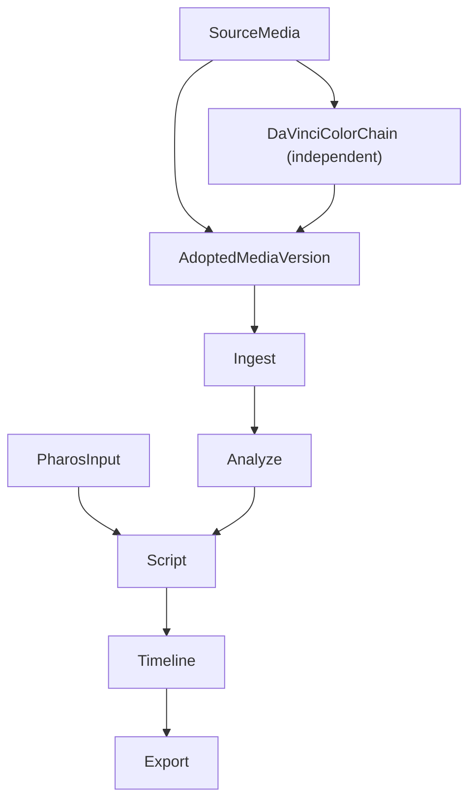

# Kairos — 架构设计 v2

> 当前实现形态：Node.js 库 + Agent Skill（临时承载版本）
> 正式主链：Pharos-first 的素材编排流程；DaVinci 调色是与主链解耦的独立增强链路
>
> 如需先快速理解当前方案全貌，优先阅读 [`../AGENTS.md`](../AGENTS.md) 与 [`current-solution-summary.md`](./current-solution-summary.md)。

## 0. 2026-03-31 增补

当前代码实现相对这份 v2 架构稿，已经覆盖了正式流程中的若干关键阶段：

1. `coarse-first analyze` 已把 ASR 纳入视频细扫前链路
   - coarse report / slice 可携带 `transcript / transcriptSegments / speechCoverage`
   - 语音窗口会和视觉窗口一起进入 `interestingWindows`
   - 当前执行顺序已经稳定为：
     - 有音轨视频：`coarse-scan -> audio-analysis -> finalize -> deferred scene detect(if needed)`
     - 无音轨视频：`coarse-scan -> finalize -> deferred scene detect(if needed)`
   - `asset report.clipTypeGuess` 是 finalize 后的语义结论；视频素材的正式 `visualSummary + decision` 只在 `finalize` 单次 unified VLM 中产出
   - `talking-head` 当前有 audio-led window strategy，会优先把连续 speech windows 收口成更适合原声消费的窗口
   - `drive` 的 `speech` 和 `visual` windows / slices 已正式分语义，并通过 `semanticKind` 继续向后传递
2. 脚本召回和 outline 已消费 transcript 证据
   - transcript 不再只是附属说明，而是候选召回和 beat 写作的正式输入
   - 如果某拍最终保留原声，outline / timeline 会把选区吸附到完整 `transcriptSegments` 边界；必要时 beat 时长会向上扩，避免切在句中
3. 风格分析与脚本阶段的交接语义已经收口
   - Workspace 风格档案不再只是“叙事语气说明”，还应明确输出阶段节奏、素材角色、运镜语法、功能位分配、素材禁区 / 镜头禁区与稳定参数
   - 这些信息默认是 Script / recall / outline 的直接输入，不应主要依赖 LLM 重新从长文里猜一次镜头组织规则
   - 这里记录的是“观测到的高频偏好”，只有明确写成禁区或硬约束时才应强制下游
4. 字幕已支持双路径
   - 旁白路径：来自 `beat.text`
   - 原声路径：来自 `slice.transcriptSegments`
   - `preserveNatSound / muteSource` 为显式覆盖；未标注时允许根据 transcript 匹配度、`speechCoverage`、segment role 自动推论
5. GPS 链路已形成当前最小闭环
   - 项目内外部轨迹统一收口到 `gps/tracks/*.gpx` 与 `gps/merged.json`
   - `embedded GPS` 的正式语义已扩展为“素材同源且可绑定”的 GPS：文件 metadata / EXIF、同 basename `.SRT`、以及 root 级 DJI FlightRecord 日志切片（按文件头识别，不依赖强文件名）
   - dense same-source 轨迹现在会规范化写到 `gps/same-source/tracks/*.gpx` + `gps/same-source/index.json`，资产上只保留轻量 `embeddedGps` 引用
   - ingest 会额外刷新 `gps/derived.json`，把 embedded-derived sparse points 与 manual-itinerary-derived sparse windows 统一编译成 `project-derived-track`
   - Analyze 默认遵循 `embedded GPS > project GPX > project-derived-track`
   - DJI / QuickTime / EXIF 的 embedded GPS 解析已覆盖更宽字段变体，而不再只看最小 key 集
   - 照片的拍摄时间已切到 EXIF 原始时间链：`DateTimeOriginal(+OffsetTimeOriginal) > CreateDate(+OffsetTimeDigitized/OffsetTime) > GPSDateTime > container > filename > filesystem`
   - 照片若自身 EXIF 带 GPS，会直接写成 `embeddedGps(metadata)` 真值；只有没有自身 GPS 时，才继续走 project GPX / `project-derived-track` 的时间匹配
   - `config/manual-itinerary.md` 现在有两层正式语义：正文用于弱空间线索，末尾“素材时间校正”表格用于人工 capture time override；未解决的表格行会阻塞 Analyze
6. 正式流程与当前实现的关系已经更明确
   - 正式主链仍以 `Pharos` 为主输入
   - 当前实现仍是临时承载版本，但已经覆盖主链中的多个阶段
   - `DaVinci color` 应理解为与主链解耦的独立增强链路，而不是主链中的固定顺序步骤
7. 剪映导出链路已经切换到当前本地实现
   - 不再依赖外部 `jianying-mcp` 或独立 `Jianying Server`
   - 由 Node 侧直接调用 vendored `pyJianYingDraft` Python CLI
   - Python 运行时优先走项目内固定 `.venv` 或显式 `jianyingPythonPath`
   - 默认导出会先在 `projects/<projectId>/adapters/jianying-staging/` 生成 staging 草稿，再复制到真实 `jianyingDraftRoot`
   - staging 目录和最终草稿目录都必须是全新的具体目录，禁止覆盖、清空或重建已有目录
   - 如果任务是修改已有草稿，必须先核对草稿目录和可读元数据，再允许写入
   - 对带显式 `speed` 的时间线，Jianying 导出适配层会做 backend compatibility normalization，吸收 `pyJianYingDraft` 的微秒级时长重算偏差，但不会反向污染正式 `KTEP timeline`
8. 时间线旁白模型已经升级
   - `beat` 可选携带 `utterances[]`，显式表达多段配音及 `pauseBeforeMs / pauseAfterMs`
   - 字幕按有声岛落位，不再默认占满整个 beat
   - 时间线默认输出规格改为项目级可配置，fallback 为 `3840x2160 @ 30fps`
   - 当某拍不走 source speech 时，命中的视频 clip 会带上“静音原音”意图，由导出适配器映射到具体 NLE
   - 显式 `beat.actions.speed` 当前只是请求信号，只有 `drive / aerial` clip 会消费；其他类型 clip 即使同拍也强制保持 `1x`
   - clip placement 当前优先贴合 `beat.targetDurationMs`，不会再让显式 speed beat 按原始 source 时长自由漂移
9. Analyze 恢复与资源口径已经补到项目级正式设计
   - coarse prepared state 会写入 `analysis/prepared-assets/<assetId>.json`，只保存 finalize 之前的准备输入
   - ASR / protection 中间态会写入 `analysis/audio-checkpoints/<assetId>.json`
   - `asset report` 新增 `fineScanCompletedAt / fineScanSliceCount`，用于恢复 `fine-scan`
   - `retry / resume` 后 ETA 改为按当前阶段重新估算，且当前阶段完成样本少于 `3` 条时不显示 ETA
   - ML server 会在 `VLM` 和 `Whisper` 之间互斥卸载，避免两套模型同时常驻显存
   - 保护音轨只在资产已绑定 `protectionAudio` 时进入 `audio-analysis` 决策辅助，且默认不做独立健康检查
   - protection transcript 当前不覆盖正式 `report.transcriptSegments`，只作为 finalize prompt 的辅助信号
10. 本地运行时与控制台已经形成当前正式操作面
   - `Supervisor` 统一承载本地服务与 job 编排
   - `apps/kairos-console/` 采用 React + 工作流优先路由，而不是单页工作台
   - `Analyze` 与 `Style` 监控当前直接由 `/analyze` 与 `/style` 主路由承载
   - `Style` 当前承载的是 **Workspace 级风格库 / 风格来源配置 / style-analysis monitor**，而不是某个单项目私有风格页
   - 旧 `/analyze/monitor` 与 `/style/monitor/:categoryId?` 仅保留兼容跳转
   - `scripts/kairos-progress.*` 与旧静态监控页只保留兼容 / 调试用途，不再是新的正式入口
   - React Analyze 页当前已直接消费 fine-scan pipeline monitor model，并把 `prefetch / recognition / ready queue / active workers` 作为结构化 UI 展示
   - 可复用的风格资产当前统一收口为 Workspace 级：
     - `config/styles/`
     - `config/style-sources.json`
     - `analysis/reference-transcripts/`
     - `analysis/style-references/`

因此，后续阅读本稿时，应把这些能力理解为“正式流程中已被当前实现覆盖的阶段”，而不是另一套独立的“中间版本架构”。

## 0.1 当前变更纪律

凡是需求、行为、接口、工作流、正式入口或用户路径变更，当前正式顺序固定为：

1. 先进入 `Plan` 模式；如果宿主没有显式 `Plan mode`，先产出结构化计划并确认
2. 计划确认后，先更新相关设计文档
3. 再开始实现
4. 实现完成后，回查并同步受影响的设计文档、rules 和 skills

如果变更影响正式入口、监控页、工作流主路径或用户操作方式，还必须同步更新：

- `README.md`
- `AGENTS.md`
- `designs/current-solution-summary.md`
- `designs/architecture.md`

## 0.2 正式流程与独立链路



当前应按下面的关系理解系统：

- `Pharos` 是正式主链的主输入之一
- 主链消费的是项目当前采用的素材版本，它可以是原始素材，也可以是独立调色链路产出的版本
- `DaVinci color` 可以独立运行、多次更新，并在需要时产出供主链消费的素材版本
- 若主链消费的是派生素材版本，则该版本必须保留媒体创建时间、`create_time`、GPS 等关键元信息，避免破坏 chronology、Pharos 对齐与空间推断
- 无 `Pharos` 时允许走兼容路径，但这是 fallback，不改变 `Pharos-first` 的正式定义

## 1. 系统全景

```
┌──────────────────────────────────────────────────────────────┐
│                     React Console                            │
│  （工作流控制台：配置、监控、Review Queue、任务入口）          │
└───────────────────────┬──────────────────────────────────────┘
                        │ HTTP API / 状态聚合
┌───────────────────────▼──────────────────────────────────────┐
│                    Supervisor Runtime                         │
│  services: dashboard / ml   jobs: ingest / analyze / script │
└───────────────────────┬──────────────────────────────────────┘
                        │ 调用（函数调用 + 结构化数据交换）
┌───────────────────────▼──────────────────────────────────────┐
│                      Agent Skill                              │
│  （交互层：用户通过对话驱动工作流，审阅 script-brief、写脚本等） │
│  ★ LLM 能力由 Agent 宿主提供，Kairos 不自行对接                │
└───────────────────────┬──────────────────────────────────────┘
                        │
┌───────────────────────▼──────────────────────────────────────┐
│                    Kairos Core Library                        │
│  ┌──────────┐ ┌──────────┐ ┌──────────┐ ┌──────────┐        │
│  │  Ingest  │ │  Color   │ │  Script  │ │   Cut    │        │
│  │  素材管理 │ │  调色辅助 │ │ 脚本准备/生成 │ │  粗剪编排 │        │
│  └────┬─────┘ └────┬─────┘ └────┬─────┘ └────┬─────┘        │
│       │            │            │            │               │
│  ┌────▼────────────▼────────────▼────────────▼─────┐         │
│  │              共享基础设施层                        │         │
│  │  ProjectManager · MediaIndex · LocalModels ·    │         │
│  │  FFmpegRunner · GPSMatcher · ConfigStore        │         │
│  └──────────────────────────────────────────────────┘         │
└───────┬──────────────┬──────────────┬────────────────────────┘
        │              │              │
   ┌────▼────┐   ┌─────▼─────┐  ┌────▼──────┐
   │ FFmpeg  │   │ 本地模型   │  │ DaVinci   │
   │ (子进程) │   │ ONNX/     │  │ Resolve   │
   └─────────┘   │ Whisper   │  │ (MCP)     │
                 └───────────┘  └───────────┘
```

## 2. 分层架构

### Layer 0 — 外部依赖

| 依赖 | 通信方式 | 用途 |
|------|----------|------|
| **FFmpeg / ffprobe** | child_process | 元数据提取、代理文件生成、关键帧抽取、场景切换检测 |
| **ONNX Runtime** | Node.js 绑定 (onnxruntime-node) | CLIP/BLIP 本地推理（视觉特征提取、场景聚类） |
| **Whisper** | whisper.cpp HTTP server 或 child_process | 语音识别（旁白提取、风格档案分析） |
| **Agent LLM** | Skill 宿主提供 | 脚本生成、场景总结、精剪建议等所有 LLM 能力（Phase 1 不自行对接云端大模型） |
| **DaVinci Resolve** | MCP (davinci-resolve-mcp) | 调色、时间线创建、素材导入、渲染 |
| **逆地理编码** | HTTP API | GPS 坐标 → 地名 |

### Layer 1 — 共享基础设施 (`src/infra/`)

核心库的公共能力，所有业务模块共享。

| 模块 | 职责 |
|------|------|
| `project` | 项目生命周期管理（创建、加载、阶段状态机） |
| `media-index` | 素材索引的 CRUD、查询、持久化（JSON，预留 SQLite） |
| `ffmpeg` | FFmpeg/ffprobe 封装，跨平台硬件加速检测，任务队列 |
| `local-models` | 本地小模型管理：CLIP/BLIP（ONNX）特征提取 + Whisper 语音识别 |
| `gps` | 内嵌 GPS 提取、GPX 解析、轨迹合并、时间匹配、逆地理编码 |
| `config` | 用户配置 / 项目配置 / 风格档案的读写 |
| `task-queue` | 后台任务队列（预处理、批量分析），基于 p-queue |
| `logger` | 结构化日志 |

补充口径：

- `config/runtime.json` 仍是项目级 / workspace 级运行时覆盖入口
- 可复用风格档案与风格来源配置不是项目级 store，而是 workspace 级共享配置

### Layer 2 — 业务模块 (`src/modules/`)

四大工作流阶段，每个模块对应需求文档的一个功能域。

#### 2.1 Ingest — 素材导入与管理

```
src/modules/ingest/
├── scanner.ts          # 递归扫描目录，识别媒体文件
├── metadata.ts         # ffprobe 元数据提取 + EXIF 读取
├── proxy-generator.ts  # FFmpeg 代理文件生成（720p H.264）
├── gps-writer.ts       # 历史命名；当前语义是绑定素材空间线索，不回写原始照片 EXIF
├── scene-detector.ts   # CLIP 特征提取 + 聚类 + LLM 场景描述
├── pharos-reader.ts    # Pharos 分镜数据读取（接口预留）
└── index.ts            # Ingest 模块入口，编排扫描→元数据→代理→GPS→场景
```

**关键流程**：
```
扫描目录
  → ffprobe 提取元数据（并行，p-limit 控制并发）
  → EXIF 读取照片信息
  → 照片优先解析 `DateTimeOriginal(+OffsetTimeOriginal)`，再回落 `CreateDate(+OffsetTimeDigitized/OffsetTime)`、`GPSDateTime`、容器时间、文件名和文件系统时间
  → 提取素材自身同源 GPS（DJI 视频 metadata / 照片 EXIF / sidecar SRT / root 级 FlightRecord 切片）
  → 照片若自身 EXIF 带 GPS，直接写资产 `embeddedGps(metadata)`；否则才继续做时间匹配
  → 把 dense same-source 轨迹规范化到 `gps/same-source/tracks/*.gpx` + `gps/same-source/index.json`
  → 资产只写 lightweight `embeddedGps` 引用（`trackId / pointCount / representative / time-window`），不再内联 dense `points[]`
  → ingest 刷新项目级 `gps/derived.json`，统一收口 embedded-derived sparse points 与 `manual-itinerary` 编译结果
  → 若弱时间源与项目时间线明显冲突，把待校正素材追加到 `config/manual-itinerary.md` 的“素材时间校正”表格，并阻塞后续 Analyze
  → Analyze 若内嵌 GPS 不可用，则先走项目级 `gps/merged.json` / `gps/tracks/*.gpx` 时间匹配，再回落 `gps/derived.json` 的保守匹配（无插值）
  → FFmpeg 生成 720p 代理文件（后台队列）
  → CLIP 提取代理文件视觉特征 → 向量聚类 → LLM 生成场景描述
  → 写入 media/index.json + media/scenes.json
```

补充口径：

- Ingest 读取的是项目当前采用的素材版本，而不是强制要求原始素材始终在线
- 如果输入来自独立调色/转换链路，该链路需要先保证关键元信息被保留下来

#### 2.2 Color — 调色辅助

```
src/modules/color/
├── log-resolver.ts     # 按设备配置解析素材色彩空间（不做自动识别）
├── cst-mapper.ts       # 色彩空间 → CST/LUT 映射规则
├── exposure-analyzer.ts # FFmpeg signalstats 分析曝光/白平衡
├── grade-planner.ts    # 生成调色方案（节点树 + 参数）
├── resolve-executor.ts # 通过 MCP 在达芬奇中执行调色
└── index.ts
```

**Log 格式配置**（不做自动识别，按拍摄设备配置 + 单素材覆盖）：
```typescript
type ColorSpace = 'slog3' | 'dlog-m' | 'rec709' | 'hlg';

// 设备级色彩空间配置：每台设备一个默认 Log 格式
interface DeviceColorConfig {
  deviceId: string;        // 设备标识，如 "zve1" / "a7r5" / "mavic4pro"
  deviceName: string;      // 显示名，如 "Sony ZV-E1"
  colorSpace: ColorSpace;  // 该设备的默认色彩空间
}

// 单素材覆盖：针对个别素材指定不同的色彩空间
interface ClipColorOverride {
  clipId: string;          // 素材 ID
  colorSpace: ColorSpace;  // 覆盖的色彩空间
}

// 项目配置
interface ColorConfig {
  devices: DeviceColorConfig[];       // 设备列表
  clipOverrides?: ClipColorOverride[]; // 单素材覆盖（可选）
  fallback: ColorSpace;               // 未匹配设备的默认值
}

// 默认预设
const defaultColorConfig: ColorConfig = {
  devices: [
    { deviceId: 'zve1',      deviceName: 'Sony ZV-E1',       colorSpace: 'slog3' },
    { deviceId: 'a7r5',      deviceName: 'Sony A7R5',        colorSpace: 'slog3' },
    { deviceId: 'a7r3',      deviceName: 'Sony A7R3',        colorSpace: 'slog3' },
    { deviceId: 'mavic4pro', deviceName: 'DJI Mavic 4 Pro',  colorSpace: 'dlog-m' },
  ],
  fallback: 'rec709',  // 未关联设备的素材默认为已调色/标准
};
// Ingest 阶段通过 EXIF 的 Make/Model 自动关联设备；无法识别设备的素材使用 fallback
// 用户可对单条素材手动覆盖色彩空间（clipOverrides）
```

**关键流程**：
```
读取素材索引
  → 按素材的拍摄设备匹配色彩空间配置（EXIF Make/Model → deviceId）
  → 检查 clipOverrides，单素材覆盖优先
  → 未匹配设备的使用 fallback（默认 Rec.709）
  → 按色彩空间分组，确定 CST/LUT 映射
  → FFmpeg signalstats 分析关键帧的亮度/色度统计
  → 计算 Lift/Gamma/Gain 校正量（目标：YAVG 归一化到 IRE 40-70）
  → 生成节点方案：Node1=CST → Node2=曝光校正 → Node3=可选LUT
  → MCP 调用达芬奇：创建节点树 + 写入参数
```

#### 2.3 Script — 脚本生成

```
src/modules/script/
├── style-analyzer.ts   # 风格档案：成片分析（场景切换检测 + Whisper + LLM）
├── narrative-builder.ts # 叙事骨架构建（分镜+GPS+素材内容 → 段落结构）
├── script-generator.ts  # LLM 脚本生成（注入风格档案 + 叙事骨架）
├── content-deriver.ts   # 素材内容推导（片头、精彩回顾等非分镜段落）
├── script-editor.ts     # 脚本编辑操作（增删改段落 + 上下文衔接）
├── script-store.ts      # 脚本版本管理
└── index.ts
```

**关键流程**：
```
（首次）导入成片 MP4 → 生成风格档案
  → FFmpeg 场景切换检测 → 提取叙事结构
  → Whisper 转写旁白 → LLM 分析语言风格
  → 存储 style-profile.json
  → 风格档案除长文总结外，还应写出阶段节奏、素材角色、运镜语法、功能位偏好与禁区
  → 参数表尽量使用稳定 key，供后续 Script / recall / outline 直接读取

脚本生成：
  → 从 workspace `config/styles/` 选择用户指定的 style category
  → `/script` 先自动保存 `styleCategory`
  → Console 以 persistent workflow prompt + hana modal 明确提示当前 handoff，而不是只给低对比行内说明
  → Agent 读取 Pharos 分镜数据 + 素材索引 + 场景数据 + GPS 轨迹，并生成初版 `script-brief`
  → 用户先在 `/script` 中审阅和手动保存 brief
  → Supervisor / Console 再做 deterministic prep
     - 仅在 `script-brief.workflowState = ready_to_prepare` 后允许运行
     - 校验 slices / styleCategory / workspace style profile
     - 刷新 `analysis/material-digest.json`
     - 成功后推进到 `ready_for_agent`
  → Agent 再读取 brief + digest + style profile，推进段落规划、outline 与正式脚本写作
     - 优先消费 style profile 中明确写出的节奏阶段、素材角色、运镜语言、功能位分配、参数表与 anti-patterns
     - 不应把 style profile 仅当作叙事语气说明，再完全依赖 LLM 从长文里二次猜镜头语法
  → 由 Agent 存储 `script/current.json` + 版本快照
```

补充口径：

- 正式脚本流程以 `Pharos` 为主输入
- 项目只记录“本项目选用哪个 workspace style category”，不在项目内持有共享 style 库
- workspace style profile 当前应理解为“双层产物”：
  - 一层给人阅读：解释节奏、素材与镜头语言背后的风格观察
  - 一层给下游直接消费：参数、禁区、功能位与稳定 section 语义
- `script` Supervisor job 当前是 prep-only，不负责自动生成 `script/current.json`
- `script/script-brief.json` 当前是脚本阶段流程状态真值；`script/script-brief.md` 会同步机器可恢复元信息
- 如果用户已经修改过当前 brief，而又想让 Agent 重新生成初版 brief，正式路径是 `/script` 页里的覆盖确认，而不是 Agent 直接覆盖
- 无 `Pharos` 时，当前实现允许基于素材分析结果、brief 与行程信息走兼容路径

#### 2.4 Cut — 粗剪与剪辑辅助

```
src/modules/cut/
├── timeline-builder.ts  # 从脚本构建时间线数据结构
├── resolve-importer.ts  # MCP：导入素材到达芬奇 Media Pool
├── resolve-timeline.ts  # MCP：创建时间线 + 按脚本排列片段
├── subtitle-generator.ts # 从脚本旁白生成字幕轨
├── photo-handler.ts     # 照片静帧处理（Ken Burns 参数）
├── refine-advisor.ts    # 精剪建议引擎（节奏/转场/B-Roll）
└── index.ts
```

**关键流程**：
```
读取脚本
  → timeline-builder 构建时间线结构（轨道、片段、入出点、转场）
  → MCP 创建达芬奇项目/时间线
  → MCP 导入素材到 Media Pool
  → MCP 按时间线结构排列片段
  → 字幕生成 → MCP 添加字幕轨
  → 照片素材 → 设置 Ken Burns 效果参数
  → （可选）精剪建议：LLM 分析时间线，给出优化建议
```

### Layer 3 — 交互层 (`src/skill/`)

当前实现的用户交互通过 Agent Skill 实现。

```
src/skill/
├── index.ts             # Skill 入口，注册命令
├── workflows/
│   ├── ingest.ts        # 素材导入工作流
│   ├── color.ts         # 调色辅助工作流
│   ├── script.ts        # 脚本生成工作流
│   └── cut.ts           # 粗剪工作流
└── prompts/
    ├── system.ts        # Skill 系统提示词
    └── templates.ts     # 交互模板（脚本展示、确认编辑等）
```

## 3. AI 能力架构

当前实现的 AI 能力分两层：**LLM 由 Agent 宿主提供，本地小模型由 Kairos 自行管理**。

### 3.1 设计原则

- **不自行对接云端大模型**：当前实现基于 Agent Skill 运行，LLM 能力天然由宿主提供（用户的对话本身就在 LLM 上下文中）
- **Kairos Core 只管本地小模型**：CLIP/BLIP（视觉特征提取）、Whisper（语音识别），这些需要 Kairos 自行加载和推理
- **Skill 层负责 LLM 编排**：脚本生成、场景总结、精剪建议等需要大模型的任务，由 Skill 层通过 prompt 模板 + 结构化数据交给 Agent LLM 处理
- **后续再考虑独立 AI Provider**：如果迁移到 Tauri 桌面应用并脱离 Agent 环境，再引入多 Provider 架构

### 3.2 LLM 能力（Agent 宿主）

Skill 层不直接调用任何 LLM API，而是通过设计 prompt 模板和结构化数据格式，让 Agent 的 LLM 完成推理。

| LLM 任务 | 数据输入（Kairos Core 准备） | 输出（LLM 返回，Skill 解析） |
|----------|---------------------------|---------------------------|
| 场景描述生成 | CLIP 特征聚类结果 + 关键帧描述 + GPS 地名 | 场景描述文本 + 情绪标签 |
| 脚本生成 | 素材索引 + 场景数据 + Pharos 分镜 + GPS 轨迹 + 风格档案 | 结构化脚本 JSON（ScriptSegment[]） |
| 脚本编辑 | 当前脚本 + 用户修改意图 | 更新后的脚本段落 |
| 风格分析 | Whisper 旁白文本 + 场景切换统计 | 风格档案 JSON（StyleProfile） |
| 精剪建议 | 时间线结构 + 素材内容描述 | 优化建议列表 |

**工作模式**：
```
Kairos Core Library                    Agent Skill                    Agent LLM
      │                                      │                                │
      │  ① 准备结构化数据                      │                                │
      │  （素材索引/CLIP特征/project GPX/Whisper文本） │                        │
      │ ──────────────────────────────────▶   │                                │
      │                                      │  ② 组装 prompt（模板 + 数据）     │
      │                                      │ ─────────────────────────────▶  │
      │                                      │                                │  ③ LLM 推理
      │                                      │  ④ 结构化结果                    │
      │                                      │ ◀─────────────────────────────  │
      │  ⑤ 解析并持久化                        │                                │
      │ ◀──────────────────────────────────   │                                │
```

### 3.3 本地小模型（Kairos 自行管理）

```typescript
// src/infra/local-models/
interface LocalModels {
  // CLIP 视觉特征提取
  clipEmbed(imagePaths: string[]): Promise<number[][]>;

  // BLIP 图像描述（可选，Phase 1 可用 CLIP + Agent LLM 替代）
  blipCaption?(imagePath: string): Promise<string>;

  // Whisper 语音识别
  whisperTranscribe(audioPath: string, options?: WhisperOptions): Promise<TranscriptSegment[]>;
}

interface WhisperOptions {
  language?: string;       // 默认 'zh'
  model?: string;          // 'base' | 'small' | 'medium'
  translateToEn?: boolean;
}

interface TranscriptSegment {
  start: number;   // 秒
  end: number;
  text: string;
}
```

| 模型 | 运行方式 | 用途 | 输入 |
|------|---------|------|------|
| **CLIP ViT-B/16** | onnxruntime-node | 视觉特征提取、场景聚类 | 代理文件关键帧（224×224） |
| **Whisper** | whisper.cpp (child_process) | 旁白转写、风格分析 | 音频文件 |

### 3.4 Phase 2 演进

若后续迁移到 Tauri，Kairos 脱离 Agent 环境后需要独立的 LLM 对接：
- 引入统一 AI Provider 接口（OpenAI / Anthropic / Ollama）
- 本地小模型层不变，直接复用
- Skill 层的 prompt 模板迁移为 AI Provider 的调用参数

## 4. MCP 集成架构

Kairos 作为 MCP Client，通过 davinci-resolve-mcp Server 与达芬奇通信。

```
Kairos (MCP Client)
    │
    │  MCP Protocol (stdio / SSE)
    │
    ▼
davinci-resolve-mcp Server
    │
    │  DaVinci Resolve Scripting API (Python)
    │
    ▼
DaVinci Resolve Studio (≥18.5)
```

### 4.1 MCP 操作分类

| 类别 | 操作 | Resolve API 对象 |
|------|------|-----------------|
| 调色 | AddSerialNode, SetNodeLUT, SetCDL, ResetAllGrades | Graph |
| 时间线 | CreateTimeline, AddTrack, AppendToTimeline | Timeline |
| 素材 | ImportMedia, GetMediaPool, AddSubFolder | MediaPool |
| 渲染 | AddRenderJob, SetRenderSettings, StartRender | Deliver |
| 项目 | CreateProject, OpenProject, GetCurrentProject | ProjectManager |

### 4.2 错误处理

- MCP 连接失败 → 提示用户检查 Resolve 是否运行 + MCP Server 是否启动
- 操作超时 → 重试 3 次，间隔递增
- Resolve 版本不兼容 → 检测版本号，降级到支持的 API 子集
- 免费版 → 提示需要 Studio 版本

## 5. 数据流

### 5.1 核心数据模型

```typescript
// 素材
interface MediaClip {
  id: string;                    // nanoid
  filePath: string;              // 原始文件绝对路径
  proxyPath?: string;            // 代理文件路径
  type: 'video' | 'photo' | 'audio';
  metadata: {
    duration?: number;           // 秒
    resolution?: { width: number; height: number };
    fps?: number;
    codec?: string;
    colorSpace?: 'slog3' | 'dlog-m' | 'rec709' | 'hlg';  // 由文件夹配置决定
    capturedAt: Date;
  };
  gps?: { lat: number; lng: number; altitude?: number };
  placeName?: string;            // 逆地理编码结果
  sceneId?: string;
  tags: string[];                // 用户标记
  clipEmbedding?: number[];      // CLIP 特征向量
}

// 场景
interface Scene {
  id: string;
  clipIds: string[];
  timeRange: { start: Date; end: Date };
  location?: string;
  description: string;           // AI 生成
  mood: string;                  // 情绪标签
  pharosShotId?: string;         // 关联的 Pharos 分镜
}

// 脚本段落
interface ScriptSegment {
  id: string;
  type: 'intro' | 'scene' | 'transition' | 'highlight' | 'outro';
  narration: string;             // 旁白/字幕文字
  clipRefs: Array<{
    clipId: string;
    inPoint?: number;            // 秒
    outPoint?: number;
  }>;
  estimatedDuration: number;     // 秒
  mood: string;
  notes?: string;                // 用户批注
}

// 风格档案
interface StyleProfile {
  id: string;
  name: string;
  sourceFiles: string[];         // 分析的成片文件路径
  narrative: {
    introRatio: number;          // 片头占比
    outroRatio: number;          // 片尾占比
    avgSegmentDuration: number;  // 平均段落时长
    brollFrequency: number;      // B-Roll 插入频率
    pacePattern: string;         // 节奏描述
  };
  voiceStyle: {
    person: '1st' | '2nd' | '3rd';  // 叙述人称
    tone: string;                    // 语气描述
    density: 'sparse' | 'moderate' | 'dense';  // 信息密度
    sampleTexts: string[];           // 代表性文本片段
  };
  sections?: Array<{
    title: string;
    content: string;
    tags?: string[];
  }>;                               // 长文 section，同时承载节奏/素材/运镜等稳定标题语义
  antiPatterns?: string[];          // 风格禁区；更适合被下游直接读取
  parameters?: Record<string, string>; // 稳定 key-value，供 Script / recall / outline 直接消费
  createdAt: Date;
  updatedAt: Date;
}

// 调色方案
interface GradePlan {
  clipId: string;
  colorSpace: string;
  nodes: Array<{
    index: number;
    type: 'cst' | 'lut' | 'correction';
    params: Record<string, unknown>;
  }>;
}
```

### 5.2 数据流向

```
                     ┌─────────────┐
                     │  原始素材目录  │ (只读引用，除 GPS 写入)
                     └──────┬──────┘
                            │
              ┌─────────────▼─────────────┐
              │      Ingest Module         │
              │  元数据 + GPS + 代理 + 场景  │
              └─────┬───────────┬─────────┘
                    │           │
         ┌──────────▼──┐  ┌────▼───────────┐
         │ media/      │  │ cache/proxy/   │
         │ index.json  │  │ (代理文件)      │
         │ scenes.json │  └────┬───────────┘
         └──────┬──────┘       │
                │         ┌────▼───────────┐
                │         │ CLIP/BLIP      │
                │         │ 视觉特征提取    │
                │         └────────────────┘
                │
     ┌──────────▼──────────┐
     │   Script Module     │
     │ 分镜+GPS+场景+风格   │
     │     → LLM 生成脚本   │
     └──────────┬──────────┘
                │
     ┌──────────▼──────────┐
     │  script/current.json │
     └──────────┬──────────┘
                │
     ┌──────────▼──────────┐     ┌───────────────┐
     │    Cut Module        │────▶│ DaVinci       │
     │ 脚本 → 时间线 → MCP  │     │ Resolve       │
     └─────────────────────┘     └───────────────┘
```

## 6. 技术栈总结

### 当前实现 — Node.js 库 + Agent Skill

| 层级 | 选型 | 理由 |
|------|------|------|
| 运行时 | **Node.js 20+ / TypeScript 5.7+** | ESM，快速迭代 |
| 包管理 | **pnpm** | 快、磁盘友好 |
| 视频处理 | **fluent-ffmpeg** + 原生 child_process | 元数据、代理、关键帧 |
| EXIF | **exifreader** + **piexifjs**（写入 GPS） | 照片元数据读写 |
| GPX | **gpx-parser-builder** | GPX 解析 |
| AI 本地推理 | **onnxruntime-node** | CLIP/BLIP 模型加载 |
| AI 语音识别 | **whisper.cpp** (child_process) | 旁白转写 |
| LLM 能力 | **Agent 宿主** | 脚本生成、场景总结等（Phase 1 不引入独立 LLM SDK） |
| MCP Client | **@modelcontextprotocol/sdk** | MCP 协议通信 |
| 任务队列 | **p-queue** | 并发控制，无 Redis 依赖 |
| 校验 | **zod** | 配置和数据模型校验 |
| 测试 | **vitest** | 快、TS 原生支持 |
| 日志 | **pino** | 结构化、高性能 |

### 后续演进 — Tauri 桌面应用

- 核心库不变，Tauri sidecar 嵌入 Node.js
- React 前端调用核心库的 API
- 代理文件用于应用内视频预览

## 7. 目录结构

```
kairos/
├── src/
│   ├── infra/                    # Layer 1: 共享基础设施
│   │   ├── project/              # 项目管理
│   │   ├── media-index/          # 素材索引
│   │   ├── ffmpeg/               # FFmpeg 封装
│   │   ├── local-models/          # 本地小模型管理（CLIP/BLIP/Whisper）
│   │   ├── gps/                  # GPS 处理
│   │   ├── config/               # 配置管理
│   │   ├── task-queue/           # 后台任务队列
│   │   └── logger/               # 日志
│   │
│   ├── modules/                  # Layer 2: 业务模块
│   │   ├── ingest/               # 素材导入与管理
│   │   ├── color/                # 调色辅助
│   │   ├── script/               # 脚本生成
│   │   └── cut/                  # 粗剪与剪辑辅助
│   │
│   ├── skill/                    # Layer 3: Agent Skill 交互层
│   │   ├── workflows/            # 各阶段工作流
│   │   └── prompts/              # 提示词模板
│   │
│   ├── types/                    # 共享类型定义
│   │   ├── media.ts
│   │   ├── scene.ts
│   │   ├── script.ts
│   │   ├── style.ts
│   │   ├── grade.ts
│   │   └── project.ts
│   │
│   └── index.ts                  # 库入口
│
├── models/                       # 本地 ONNX 模型文件
│   └── clip-vit-b-16/
│
├── designs/                      # 设计文档
├── tests/                        # 测试
├── package.json
├── tsconfig.json
└── vitest.config.ts
```

## 8. 关键设计决策

### D1. JSON 优先，SQLite 备选

当前实现使用 JSON 文件存储所有项目数据。原因：
- 人类可读，调试友好
- 可纳入 Git 版本管理
- 1000 条素材以内性能足够（~3MB，解析 <50ms）
- 若超过 5000 条，通过 Repository 抽象层无缝切换 better-sqlite3

### D2. 本地小模型 + Agent LLM 双层 AI

当前实现不自行对接任何云端大模型：
- **LLM 能力由 Agent 宿主提供**：Skill 层通过 prompt 模板 + 结构化数据交换驱动 LLM，无需引入 openai/anthropic SDK
- **本地小模型用 ONNX Runtime**：CLIP 推理极轻量（单张图片 <100ms），直接加载模型，不走 HTTP
- **Whisper 用 whisper.cpp**：child_process 调用，无需额外进程管理
- 后续若迁移 Tauri，再引入独立 AI Provider 架构

### D3. MCP 优先，子进程 Fallback

达芬奇操作优先走 MCP：
- davinci-resolve-mcp 覆盖 100% Resolve API（324 方法）
- 标准协议，生态兼容
- 若 MCP Server 不可用，降级到直接调用 Python 脚本（child_process）

### D4. 代理文件为模型服务

代理文件（720p H.264）的首要用途是喂给本地视觉模型：
- CLIP 输入分辨率 224×224，720p 代理绰绰有余
- 分析调色后的代理（而非 Log 原始素材），内容理解更准确
- 后续 Tauri 版本复用为预览素材

### D5. 后台预处理

耗时操作（代理生成、CLIP 特征提取、场景检测）通过 p-queue 异步执行：
- 用户导入素材后可继续其他操作
- 预处理结果持久化到 `cache/preprocess/`，中断可恢复
- 并发度 = CPU 核心数 × 50%，避免打满系统
