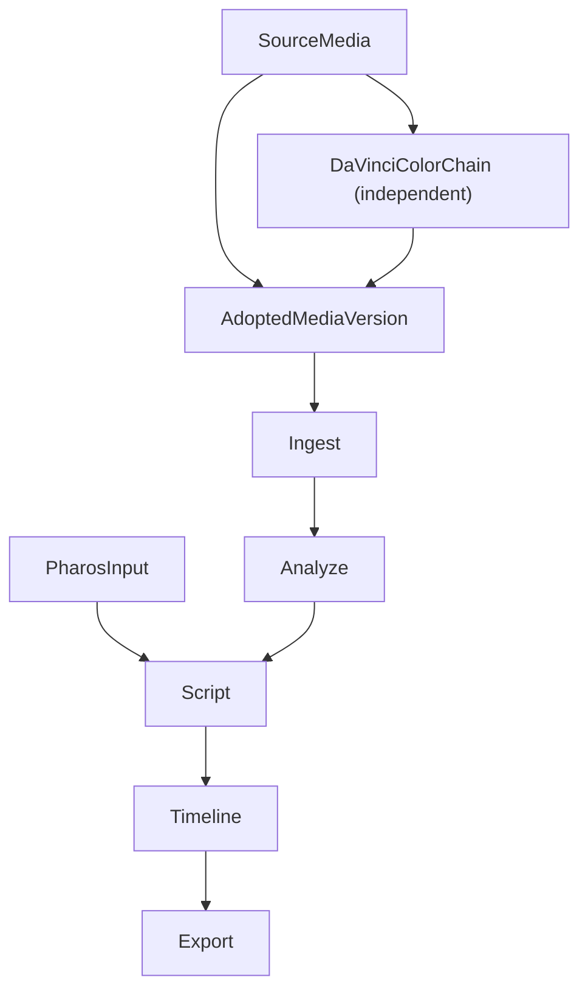

# Kairos — 架构设计 v2

> 当前实现形态：Node.js 库 + Agent Skill（临时承载版本）
> 正式主链：Pharos-first 的素材编排流程；DaVinci 调色是与主链解耦的独立增强链路
>
> 如需先快速理解当前方案全貌，优先阅读 [`../AGENTS.md`](../AGENTS.md) 与 [`current-solution-summary.md`](./current-solution-summary.md)。

## 0. 2026-03-31 增补

## 0.15 2026-05-15 Ingest / Pharos / 手动时间 Gate 补记

当前 Ingest / GPS 刷新正式承担 Pharos context 和素材时间 gate：

- 项目内 `pharos/<trip_id>/plan.json + record.json? + gpx/` 是 Pharos 的固定输入目录；`analysis/pharos-context.json` 必须带有输入 fingerprint
- fingerprint 覆盖 trip 筛选、`plan.json`、`record.json`、`gpx/*.gpx` 的相对路径、大小与修改时间；fingerprint 缺失或变化时，Ingest / GPS 刷新必须自动重建 context，避免复用 stale empty cache
- `gps-refresh` 不扫描素材，但应刷新项目 GPX merged cache、`gps/derived.json` 与 Pharos context；`ingest` 在扫描素材后也必须刷新同一套空间/Pharos 缓存
- Analyze 不隐式补跑 Pharos 解析，只消费最近一次 Ingest / GPS 刷新的 `analysis/pharos-context.json`
- Pharos 上游协议 hash 不匹配时，必须先同步当前 `../Pharos/designs` 到 Kairos 设计文档、rules、skills、实现/测试影响，并刷新 `.ai/pharos-protocol-baseline.json`；baseline 未重新匹配前不继续普通 Pharos 功能工作
- 素材 root 可声明 `captureTimePolicy`：
  - `mode: "auto"` 是默认行为
  - `mode: "manual-required"` 表示该 root 的指定素材类型不可信任容器 / EXIF / 文件名 / filesystem 时间，必须由单素材手动时间修正落成 `manual` capture time
  - `requiredKinds` 默认覆盖所有可导入图片/视频；延时导出 root 可只声明 `["video"]`
- `manual-required` 生成的素材时间 blocker 必须要求显式日期和时间；不能用当前文件时间或建议日期自动补齐日期后视为已解决
- 对本次成功扫描到的 root，Ingest 以当前扫描结果为准剪掉该 root 中已经不存在的旧资产；missing root 的既有资产保持不动，避免未挂载磁盘导致误删

## 0.14 2026-05-14 DaVinci color log 前置 review addon 分组补记

当前 `/color` 自动 Group 继续保持 Resolve Group 扁平结构，但分桶语义收口为：

- `logProfile` 是前置分组轴，来自显式 sidecar 真值，缺失时回退 root `color.colorSpaceProfile`
- 同一 log bucket 内，每条 clip 只选择一个最高优先级 addon，顺序固定为：
  - `portrait-review`
  - `lowlight`
  - 高置信 `colorCastClass`
  - 明显 `exposureSceneClass`
- addon 不跨 log 合并；例如 `slog3 + overexposed` 与 `rec709 + overexposed` 是两个不同 Resolve Groups
- `portrait-review` 来自 `orientationStatus=portrait`，用于在当前 log 下单独交给人工 review；它不改变竖屏 Gyro/DRT、repair template 或横屏 timeline transform 合同
- `exposureSceneClass` 是解 log / 技术 LUT 后 proxy 画面的 review 信号；仅明显 `high-contrast / overexposed / underexposed` 参与分桶，`normal / unknown` 只作为诊断显示；`high-contrast` 包含逆光/剪影或车内窗外这类高光面积可能较窄但亮暗尾部跨度很大的场景；`overexposed` 保持保守，包含硬剪过曝和高亮面积/亮度明显偏高的画面，不把泛洗白路面或高键灰雾画面批量纳入；`underexposed` 包含单帧雪景等低饱和高键白参考区域被压灰且无真实高光尾部的 `white-reference-underexposed` 诊断，并保留白参考覆盖率、目标 EV 提亮量、提亮后高光余量；该子类保持 `exposureSceneClass=underexposed` 但 Resolve Group addon 使用 `white-reference-underexposed`
- 这些 review addon 只影响 Resolve Group 分桶和 `/color` 展示，不自动开启 `Dehaze / NR / Gyro`

## 0.13 2026-05-13 剪辑规则与多 Edit Unit 补记

当前 Script / Timeline 结构控制从旧的 workspace style profile 中拆出，正式归到人工维护的 `剪辑规则`：

- `config/edit-rules/*.md` 是 workspace 级剪辑规则库和唯一规则正文来源；分类由 markdown frontmatter / 文件名扫描得到
- `editRuleCategory` 是 Script / Timeline 结构输入；它独立于可选 `styleCategory`
- `edits/<editId>/planning/flow-plan.json` 是 LLM 基于 raw edit rule、项目上下文和固定 capability catalog 生成的显式执行计划；未人工确认或 hash stale 时，Script / Timeline 不得进入 `material.recall / script.generate / timeline.generate`
- `config/styles/` 与 `config/style-sources.json` 仍由 Style Analysis 维护，但现在只作为文案 / 艺术风格参考，用于最终旁白、字幕文本、语气和表达禁区
- Style Analysis 不再尝试从参考视频自动抽象正式剪辑规则；缺少 style reference 不阻塞粗剪，只在最终旁白 / 字幕表达阶段提示

旅行类默认剪辑规则的正式顺序是：

1. 先用当前 Pharos `plan / record / gpx` 建构行程整体印象
2. 再用素材分析结果补漏，重点结合口播、GPS、record 与实际素材缺口
3. 生成按天、重点时间、行车、航拍与关键事件组织的初版剪辑框架文本
4. 人工 review 调整结构，通过后才进入第一次粗剪
5. 人工与 LLM 围绕 Resolve timeline 交互式修改
6. 第一次粗剪定稿后锁定 Resolve timeline
7. 读取锁定草稿，生成源语音字幕与单篇旁白稿，人工审查后导入字幕

项目存储也从“一个 project 一个剪辑”扩展为“一个 project 多个 Edit Unit”：

- 共享层仍在 project 根：`pharos/`、`store/`、`analysis/`、`media/chronology.json`、`color/`
- 剪辑层按 edit 隔离：`edits/<editId>/script/`、`edits/<editId>/timeline/`、`edits/<editId>/subtitles/`
- legacy 单剪辑路径 `script/`、`timeline/`、`subtitles/` 默认映射为 `edits/main`
- Script / Timeline / Subtitle API 都应接受可选 `editId`，未传时默认为 `main`
- Resolve edit mapping 固定为：Project `${projectBrief.name} [Edit]`，Timeline `${editLabel} [${editId}]`
- 第一次粗剪锁定后写入 `edits/<editId>/timeline/locked-rough-cut.json`
- v1 post-lock 只正式化字幕与旁白文本；音量均一、BGM、ducking、TTS 暂不纳入正式范围

## 0.12 2026-04-24 DaVinci Resolve scripting 本地知识文档补记

当前 DaVinci Resolve scripting 不再只依赖外部链接或历史实现记忆：

- Kairos 已新增本地工作文档 `.ai/knowledge/davinci-resolve-scripting.md`
- 该文档吸收用户指定的 X-Raym Gist 镜像与本机 Resolve 官方 `README.txt` 的关键 API 口径
- 任何 DaVinci Resolve scripting、`/color`、Resolve export、DRX/DRT、LUT automation、render job、Group、node graph 或 vendored Resolve host 任务，必须先读该本地文档
- 版本敏感方法仍需按当前安装版 Resolve `README.txt` 实测/核对，不能从记忆或旧设计推断
- 当前明确记录的高风险点包括：官方 docs 有 `SetNodeEnabled()` 但没有可靠 `GetNodeEnabled()`，`GetToolsInNode()` 只能证明 OFX shell 存在，不能证明 Gyroflow 已完成 source-specific load

## 0.11 2026-04-23 DaVinci color 固定节点图与项目级批处理补记

当前 `/color` 已从 donor/seed 对外语义继续收口到“固定 clip repair 节点图 + 项目级 deterministic orchestration”。

本轮冻结后的正式口径如下：

- `Supervisor color` 的正式动作链扩展为：
  - `prepare_root`
  - `sync_groups`
  - `execute_root`
  - `sync_batch_metadata`
  - `sync_batch_sidecars`
  - `validate_batch`
  - `prepare_all_roots`
  - `export_all_roots`
- `/color` 官方路径继续不引入 agent；项目级批处理也是同一个 deterministic Supervisor color job
- `prepare_all_roots` 的正式合同是：
  - 使用当前 `/color` read model 中 enabled roots 的正式 priority 顺序
  - 顺序对每个 root 执行 `prepare_root`
  - 任一 root 失败时继续后续 roots
  - 只要存在失败 root，整个 job 最终记为 failed
- `export_all_roots` 的正式合同是：
  - 使用当前 `/color` read model 中 enabled roots 的正式 priority 顺序
  - 顺序对每个 root 执行 `execute_root`
  - 每个 root 的 `execute_root` 只完成 render all、最终 replace 和 render manifest 记录
  - metadata 修复、sidecar 同步与 validation 都是用户后续对单 root/latest batch 手动触发的独立动作
  - 任一 root 失败时继续后续 roots
  - 只要存在失败 root，整个 job 最终记为 failed
- clip repair 的正式用户口径不再是 donor matrix，而是统一固定五节点图：
  - 所有可执行视频 clip：`Gyro -> Dehaze -> User1 -> User2 -> NR`
  - `Gyro` 是第 1 个技术头节点，所有 clip 都预留；每次 `prepare_root` 都按最终 clip Gyro enable 判定重申 node1 开关，`gyroEligible=true` 请求开启并显示为 `ready-to-load`，`gyroEligible=false` 请求关闭并回读为 `seeded-disabled`
  - `ready-to-load` 只证明 Gyroflow OFX shell 存在且 Kairos 已请求正确 node 启停；它不证明 Gyroflow 已执行 source-specific `Load for current file`
  - `Dehaze` 是第 2 个保留节点，默认禁用
  - `User1 / User2` 是最小 user zone，默认开启；用户只能在 `Dehaze` 之后、`NR` 之前扩展更多用户节点
  - `NR` 是所有视频 clip 的固定尾节点，默认禁用，正式开关入口只在 Resolve
  - `lowlight` 继续是中点单帧 creative 标签，不自动开启 `Dehaze / NR`
  - `gyroEligible` 是一个最终布尔值：当前安装 Gyroflow/OFX 支持设备匹配 + 对应运动元信息，或同名 `.gyroflow` 工程；DJI `dvtm_*` 只能作为元信息线索，不能单独开启 Gyro，也不允许反推出 log profile
- `prepare_root` 对 canonical clip graph 的正式行为是“保留现状不重排，但重申最终 Gyro 开关”：
  - 规范图重跑时保留现有 clip grade、用户节点顺序，以及用户已手动设置的 Dehaze/NR 开关
  - 规范图重跑仍必须按最终 `gyroEligible` 布尔值重新请求 node1 开/关，因为 Gyro 是技术判断，不是 creative 用户区
  - 中间 user zone 必须保持在 `reservedNodeIndices.userStart -> userEnd` 范围内
- ZV-E1 / Sony 竖屏 Gyro 使用方向感知路径：
  - ffprobe 的 `rotate/display matrix` 解析为 clip orientation truth
  - 横屏使用 `config/default.drt`；竖屏 timeline transform 跟随 Resolve 显示方向，DRT 选择跟随 Gyroflow 的相反方向口径：ffprobe 源 `rotation=90` 写 `RotationAngle=-90` 并使用 `config/gyroflow-portrait--90.drt`，ffprobe 源 `rotation=-90/270` 写 `RotationAngle=90` 并使用 `config/gyroflow-portrait-90.drt`
  - 缺少方向 DRT 时只禁用该 clip 的自动 Gyro seed 并标记 `pending-orientation-template`，不阻塞素材导入、Group、LUT 或 timeline transform
  - 竖屏 clip 会在 timeline item 上自动设置 `RotationAngle / ZoomX / ZoomY / ZoomGang / Pan / Tilt`，默认旋转并放大填满横屏导出；对横向编码但 display-matrix 竖屏的素材，缩放按 Gyroflow/DRT 实际输出的横屏内接画面补偿，避免 3840x2160 画布中只剩约 2160x1216 有效画面
  - portrait DRT hash 缺失或过期时，`prepare_root` 只重跑命中的 chunk，并对 stale portrait clip 先执行 `ResetAllGrades()` 清掉旧 repair/OFX state，再重新应用方向 DRT；最终 `sync_groups` 必须把当前 DRT hash 持久化回 clip snapshot
- 缺少固定槽位的旧图正式记为 `legacy-layout`
  - 本轮允许在 workspace `config/default.drt` 存在时破坏性重建到 canonical layout；不存在时 bulk prepare 跳过自动 repair seed 并标记 `pending-template`
  - 如果用户把新节点加在 `NR` 后面，下次 `prepare_root` 也会按 legacy layout 处理并重建
  - 这是 clip repair 迁移代价，不影响 Resolve Group creative 真相
- `color/groups/<rootId>.json` 的 clip snapshot 正式扩展为：
  - `gyroEligible`
  - `gyroflowStatus`
  - `dehazeStatus`
  - `nrStatus`
  - `clipRepairStatus`
  - `layoutStatus`
  - `reservedNodeIndices`（含 `userStart / userEnd`）

## 0.10 2026-04-22 DaVinci color Resolve-first creative / clip repair 分层补记

当前 `/color` 已继续从“root export + group sync”推进到“Resolve-first creative truth + clip-level repair seeding”。

本轮冻结后的正式口径如下：

- Resolve 内的正式调色真相分成三层：
  - `Group Pre-Clip`：Kairos 自动技术底板（LUT / transform）
  - `Clip`：repair/local-exception 层，不承担主 creative
  - `Group Post-Clip`：唯一正式 creative 真相
- `/color` 不新增 creative 参数表单；Kairos 只负责准备结构、镜像状态、执行导出
- root 级长期配置仍然只保留：
  - `root.color.renderPreset`
  - `root.color.colorSpaceProfile`
  - `root.color.transformPresetKey?`
- `color/groups/<rootId>.json` 的正式快照语义已扩展为 group + clip 两层：
  - group 级至少包含 `logProfile`、`orientationStatus`、`lowlight`、`colorCastClass`、`exposureSceneClass`、`postClipCreativeStatus`
  - clip 级至少包含 `gyroEligible`、`gyroflowStatus`、`dehazeStatus`、`nrStatus`、`clipRepairStatus`、`layoutStatus`
- 自动 Group 的正式分桶轴当前收口为：
  - `logProfile`
  - first-match addon：`portrait-review -> lowlight -> 高置信 colorCastClass -> 明显 exposureSceneClass`
- `gyro` 不再参与 Group 分桶；它正式回到 clip repair 层，只负责说明该 clip 是否需要 `Gyroflow shell`
- `lowlight` 的正式合同当前收口为：
  - 来源：每条 clip 的中点单帧视觉分类
  - 语义：creative-first 标签，用于 Group creative 分桶，并次级提示 repair 默认态
  - 约束：不等价于“必须降噪”
- `colorCastClass` 的正式合同当前收口为：
  - 来源：每条 clip 的廉价单帧 proxy 数值分类，默认取 clip 中点帧；若该 clip 能按 workspace profile/device 或 root `transformPresetKey` 解析到技术 LUT，则先用同路径 `.cube` 做 proxy 技术转换，再排除天空、高饱和、底部黄橙遮挡和曝光异常区域后估计中性像素偏移。强冷蓝偏移归入 `cool-cyan`，绿青混合偏移归入 `green-cyan`；`prepare_root` 还会对同一 root / 同一 log profile 内连续素材做轻量平滑，避免单个中点帧偏中性时把连续冷色路段切碎；已诊断为 `white-reference-underexposed` 的 clip 不参与这种弱连续性提升
  - 语义：用于把 `cool-cyan / green-cyan / green / warm / mixed` 色偏素材拆到独立 Group，方便 `Group Post-Clip` 做白平衡修正
  - 约束：不判断偏色原因是否一定来自前挡膜；`neutral / unknown` 不参与自动 Group 分桶
- clip repair 的正式合同当前已收口为固定节点图：
  - 同 clip 旧 repair 在 `prepare_root` rerun 时继续优先通过 Resolve `CopyGrades` 保留；portrait DRT hash 迁移例外，必须先对该 clip 执行 `ResetAllGrades()`，再重新应用方向 DRT
  - brand-new clip 若没有旧 repair，宿主必须建立 canonical layout，而不是把 donor matrix 当成用户口径
  - 所有视频 clip 统一为 `Gyro -> Dehaze -> User1 -> User2 -> NR`
  - `gyroEligible` 只决定 Gyro 默认/重申启停，不决定是否存在 Gyro 节点
  - `Dehaze / NR` 默认状态都是 `seeded-disabled`
  - 当前 Resolve 运行态下 `ExportStills(..., drx)` 不稳定且返回失败，不能作为正式主线
  - clean `DRT` 是唯一正式自动宿主模板：旧 `gyro-only.drt + CopyGrades + render` 路径已实测能触发 Gyroflow 当前文件加载；`DRX` 仅保留为人工诊断材料，不能作为 bulk prepare fallback 或 load 证据
- `gyroflowStatus` 当前正式至少包含：
  - `not-applicable`
  - `not-seeded`
  - `seeded-disabled`
  - `ready-to-load`
  - `active`
- `nrStatus` 当前正式至少包含：
  - `not-seeded`
  - `seeded-disabled`
  - `seeded-enabled`
- 默认 repair 行为当前固定为：
  - `gyroEligible=true`：优先保留 canonical 既存 repair；brand-new / legacy clip 则规范到 `Gyro -> Dehaze -> User1 -> User2 -> NR`，并在每次 `prepare_root` 请求 Gyro 开启
  - `gyroEligible=false`：优先保留 canonical 既存 repair；brand-new / legacy clip 同样规范到 `Gyro -> Dehaze -> User1 -> User2 -> NR`，并在每次 `prepare_root` 请求 Gyro 关闭
  - `lowlight=true`：继续只影响 creative/group 标签与状态提示，不自动启用 `Dehaze / NR`
  - canonical clip graph 重跑时不重排 user zone
- `sync_groups` 只镜像 Resolve 当前真相：
  - 如果用户手动改了 clip repair 或 group creative，Kairos 只回读状态，不做重置
  - `Gyroflow` 只有在宿主能明确读到已加载/已生效证据时才允许记为 `active`

## 0.9 2026-04-21 DaVinci color 技术 profile / transform preset / workspace LUT 同步补记

当前 `/color` 已继续从“root render preset + creative tags”收口到“技术输入真值 + workspace profile/device -> Resolve LUT 映射 + Group Pre-Clip LUT 底板”。

本轮冻结后的正式口径如下：

- root 级长期配置仍然放在 `config/project-brief.json` mappings 上，但正式字段扩成：
  - `root.color.renderPreset`
  - `root.color.colorSpaceProfile`
  - `root.color.transformPresetKey?`
- `root.color.renderPreset` 当前正式口径是：
  - `container`
  - `videoCodec`
  - `audioCodec`
  - `bitrateKbps?`
  - UI 文案与用户输入单位统一显示为 `kb/s`
  - `root.color.renderPreset` 只接受正式字段 `bitrateKbps`；旧 bitrate 别名字段不再参与读取或持久化
- `color.colorSpaceProfile` 的正式语义改为“技术输入类型 key”，不是 creative look，也不再承载 primaries / gamut 细节
  - 当前 canonical 推荐值先收口为：`slog3 | dlog | dlog-m | hlg | rec709`
  - schema 当前允许开放字符串 key；更细粒度真值只进入内部诊断，不进入主配置 key
- clip 技术输入真值的正式优先级固定为：
  1. 素材自身 metadata
  2. sidecar XML
  3. root `color.colorSpaceProfile`
- DJI 路径当前必须先读素材自身私有 metadata；若没有明确真值，正式结果就是 `unknown`
  - 不允许按机型默认值或模糊 `Dvtm_*` 字段强行识别成 `dlog-m`
- workspace 技术预设映射当前正式放在：
  - `config/color-transform-presets.json`
- workspace LUT 资产当前正式放在：
  - `config/luts/`
- `config/color-transform-presets.json` 的正式结构为：
  - `profiles: { [colorSpaceProfile]: { [deviceFamily|default]: resolveLutPath } }`
  - 叶子值正式表示 Resolve LUT 相对路径
  - 用户不手写 regex；Kairos 必须把素材 metadata 真值归一成内置设备族 key，再与配置中的设备族名匹配
  - `root.color.transformPresetKey` 作为 project/root 级 override 时，也直接表示 Resolve LUT 相对路径
- 默认技术预设解析优先级固定为：
  1. `root.color.transformPresetKey`
  2. `effective colorSpaceProfile + normalized device family -> workspace profiles[...]`
  3. 无命中则不自动应用默认技术底板
- `prepare_root` 在任何 Resolve-side mutation 前，必须先做 LUT preflight：
  - 只同步当前 root 实际引用到且 workspace 中存在同路径文件的 LUT
  - 同步源固定为 `config/luts/<relative-path>`
  - 同步目标固定为当前设备 Resolve 默认 LUT 目录
  - 同步策略固定为“只补缺，不覆盖、不删除、不全量重装”
  - 若 workspace 中没有同路径 LUT，Kairos 不得立刻 blocked；应继续把该路径作为 Resolve LUT 路径交给宿主验证可见性
- 默认技术底板当前正式应用在 Resolve `ColorGroup Pre-Clip`
  - 当前 round 只支持 LUT preset，不纳入 PowerGrade / CST preset 抽象
  - 应用动作必须通过 `ColorGroup.GetPreClipNodeGraph()` + `Graph.SetLUT()`
  - 若 Group 为 Kairos 新建，可在空白 Pre-Clip graph 上建立最小节点并套 LUT
  - 若 Group 已有非空用户 grade，则必须跳过，记录 `skipped-existing-grade`
  - `sync_groups` 继续只做镜像，不回写任何技术预设
- 若 LUT 已复制到默认目录，但当前 Resolve 会话仍不可见：
  - `prepare_root` 需要返回 blocked
  - blocker 文案必须明确提示用户在 Resolve 里 `Refresh LUT List / Update Lists`，必要时重启 Resolve
- `/color` read model 与 UI 当前需要明确区分：
  - `detected profile`
  - `effective profile`
  - `root fallback`
  - `unknown`
  - `resolvedTransformPresetKey`
  - `lutSyncStatus`
  - `transformStatus`

## 0.8 2026-04-20 DaVinci color v2 真值分组与导出合同补记

当前 `/color` 已从“technical fingerprint 驱动的 root prep”继续收口到“素材真值 + root 真值驱动的 Resolve 调色工作流”。

本轮冻结后的正式口径如下：

- root 级长期配置仍然放在 `config/project-brief.json` mappings 上，但正式字段扩成：
  - `root.color.renderPreset`
  - `root.color.colorSpaceProfile`
- `color.colorSpaceProfile` 的语义是“该 root 原始素材默认拍摄色彩配置”，只在 clip 真值缺失时作为 fallback
  - 当前正式枚举先收口为：`slog3 | dlog | dlog-m | hlg | rec709`
- Resolve naming 当前固定为人类可读约定：
  - Resolve Project: `${projectBrief.name} [Color]`
  - root namespace / grading timeline: 从 root `label` 派生
- `prepare_root` 在正式创建/复用 grading timeline 前，必须先计算该 root 的 dominant `(width, height, fps)` 组合
  - timeline 必须显式写入：
    - `timelineResolutionWidth`
    - `timelineResolutionHeight`
    - `timelineOutputResolutionWidth`
    - `timelineOutputResolutionHeight`
    - `timelineFrameRate`
    - `timelinePlaybackFrameRate`
- 同一 root 仍然只维护一条 grading timeline；mixed-spec clip 进入该 timeline 时按 Resolve 常规适配
- `execute_root` 的正式 render 合同已经收紧为：
  - root grading timeline 是唯一导出真相；Group 只承担 Resolve 组织 / 诊断 / sync 语义，不再承担 render 配置或 batch ownership
  - batch 是执行与重试粒度，默认覆盖该 root timeline 上的全部可执行 clips，但允许显式携带 `clipKeys[]` 做 subset / retry
  - 覆盖已有最终目标前，Supervisor 必须先生成最终 `dayX/Cxxxx.ext` 覆盖预览，并用 `overwritePlanHash` 锁定确认范围；未确认或 hash 变化时不得启动 Resolve
  - Resolve 宿主必须先完整生成所有 render jobs，再调用一次 render all；任一 `AddRenderJob()` 失败时不得调用 `StartRendering`
  - Resolve 宿主按 `rawRelativePath` 父目录分组，为每个目录复制正式 root grading timeline 并修剪到该目录 clips；每个 render job 的 `TargetDir` 直接是最终 `localPath/<relativeDir>/`
  - 正式输出命名固定为 `sourceStem + targetExtension`，并依赖 Resolve File Name = Source Name；不得设置 `CustomName` 或 `UniqueFilenameStyle`
  - Windows Resolve 21 + MP4/H.265 固定码率由 host-owned generated render preset XML 承担：在 queue render jobs 前，Resolve host 必须从 Kairos root `renderPreset` 生成干净 XML、写入 `h264_datarate`、`encoder_command_param_map.rc=CBR`、`encoder_command_param_map.bitrate=root.renderPreset.bitrateKbps`、导入并加载，再直接 `ExportRenderPreset(presetName)` 校验 named preset；不得从当前 Deliver 页保存 preset 再 patch，也不得把该平台上会拒绝 H.265 的公开 `VideoQuality` key 当成正式路径。`SaveAsNewRenderPreset` 会抓当前 UI 粘滞状态，不能作为导入后校验来源
  - Windows H.265 root 当前正式锁定 Intel Quick Sync：transient preset 必须写入并校验 `RecordFormatSubType=hvc1_qsv`、`h264_profile=2`、`preset=balance`、`rc=CBR`、`bitrate=<bitrateKbps>`；encoder map 不得保留质量模式 `quality` 字段；后续 `SetRenderSettings` 只设置目录、帧范围、分辨率、帧率与音频等队列参数，不能再用 `CustomName` 或 prefix/suffix 名称兜底
  - Windows generated preset 还必须清空 `RecordPrefix / RecordSuffix / DestSuffix`，保持 `RecordClipUniqueName=false`、`UsePrefixAndSuffixFromSrc=1`、`RecordAllowDupImg=1`，并在 named preset 校验中确认这些 Source Name / duplicate-name 字段；`UsePrefixAndSuffixFromSrc=0` 会使 Resolve queue 成 `00000000.mp4 and more`；Windows Resolve 21 live probe 证明 `RecordAllowDupImg=0` 即使 queue 中 `OutputFilename` 是 source name，也会实际输出到单层 `Event_Version.../<sourceName>.mp4`；`AlternateInFolder` 不是可靠的直出根目录判据，用户手动正确配置可导出为 `AlternateInFolder=1` 仍直出
  - 每个 `AddRenderJob()` 后必须用 `GetRenderJobList()` 校验 `OutputFilename` 是本批 Source Name；不匹配时删除该 job 并在 `StartRendering()` 前失败，不能等渲染后 validation 才发现
  - 非 Windows 主机继续走 Resolve 公共 render setting 路径；当 `VideoQuality` 可用时，直接由它承载 `root.renderPreset.bitrateKbps`
  - 项目目录只保存 `color/batches/<batchId>/...` JSON archive，不能作为视频 staging；Kairos 不创建视频 holding 目录；仅允许把 Resolve 在最终 TargetDir 内生成的单层 `Event_Version...` 临时子目录中的唯一源名文件提升回最终路径
  - Resolve 完成后必须直接校验最终 `manifest.entries[].outputPath`；出现 prefix/suffix 输出名视为 render setting 失败
  - Resolve 完成后 `execute_root` 只写 render manifest：
    - `latestBatchStatus = rendered`
    - `latestValidationStatus = pending`
    - `manifest.metadataRepair.status = pending`
    - `manifest.managedSidecarSet = []`
  - `sync_batch_metadata` 是显式后处理动作：
    - 对指定或 latest batch 的最终输出做 metadata normalize
    - metadata normalize 必须限流执行并写文件级 progress，不能一次性为整个 root 拉起无界 ffmpeg
    - `creation_time` 改写为源文件 `capturedAt`
    - 源文件带 GPS 时，最终输出必须带可被 `ffprobe` 读回的容器位置标签
    - 更新 `manifest.metadataRepair` 和 `entries[].outputMetadataSnapshot`
  - `sync_batch_sidecars` 是显式后处理动作：
    - 只同步同 basename `.srt/.wav/.flac/.m4a/.aac/.mp3`
    - `.xml/.gyroflow` 只服务 prepare/source truth，不作为成片 sidecar 导出
    - 更新 `entries[].sidecars` 和 `managedSidecarSet`
  - 后处理动作可在 `manifest.json` 缺失但 `plan.json` 中所有最终输出都已存在时恢复 manifest；这是中断/旧失败 batch 的恢复路径，不允许对缺输出的 batch 伪造成功
- 自动 Group 已退出 `colorspace / gamma / codec / resolution / fps` technical fingerprint 语义，改为纯创意 / review 标签：
  - `log`
  - first-match addon：`portrait-review -> lowlight -> 高置信 colorCastClass -> 明显 exposureSceneClass`
- `gyro` 已回到 clip repair 维度，不再参与 Group key 生成
- `log` 的正式判定优先级为：
  1. 显式 sidecar 真值
  2. root `color.colorSpaceProfile`
- Sony 路径当前只从显式 XML sidecar 读取 `CaptureGammaEquation / CaptureColorPrimaries / Gyroscope`，且只有当前 Gyroflow/OFX 支持的 Sony 型号带 `Gyroscope` 时才开启 Gyro
- DJI 路径默认不深扫 embedded private telemetry / `dvtm_*`，也不从中推断 log 或 gyro。DJI 若没有同名 `.gyroflow` 或 root `color.colorSpaceProfile` 等显式输入，技术输入正式保持 `unknown`
- Group truth 继续以 Resolve 为准：
  - `/color` 通过 `sync_groups` 镜像 Resolve 当前 group name
  - `groupKey` 的正式语义改为 normalized Resolve group name slug
- `validate_batch` 当前继续以媒体参数、metadata 同步状态与 sidecar 同步状态为主，但 warning 与 blocking 需要分层：
  - 源有 `capturedAt / GPS` 但 `manifest.metadataRepair.status !== completed` 时是硬阻塞，提示先运行 `sync_batch_metadata`
  - 源目录存在应同步 sidecar 但 manifest 或最终输出缺失时是硬阻塞，提示先运行 `sync_batch_sidecars`
  - `.xml/.gyroflow` 不参与 sidecar validation
  - `create_time` 当前降级为 warning-only
- `/color` 前后端兼容层必须清掉历史 `resolveColorPythonPath / resolveColorScriptApiRoot` blocker 口径
  - 新的 host preflight ready/blocked 真值必须覆盖旧缓存，不允许继续显示遗留 Python-path 提示

## 0.7 2026-04-20 DaVinci color 健壮性与可观测性补记

在 P0 把单 root 执行闭环接通后，P1 的正式收口点是两件事：

- Resolve host 在动作前先给出可缓存、可重检的 preflight 诊断，而不是等用户点击后才报错
- `/color` 正式消费 `color/batches/<batchId>/...` archive，把 batch / validation 历史变成单页可观测面

当前冻结后的正式口径如下：

- `Supervisor color` 的正式动作链收口为：
  - `prepare_root`
  - `sync_groups`
  - `execute_root`
  - `validate_batch`
- `preflight` 是 ColorExecutor 与 Python host 的内部辅助操作，不是新的正式 workflow action
- `color/current.json` 顶层新增 `hostPreflight`，其正式职责是缓存：
  - `status`
  - `checkedAt`
  - `productName`
  - `versionString`
  - `isStudio`
  - `warnings[]`
  - `blockingReasons[]`
  - `renderSupport`
- `renderSupport` 当前是 Node 侧执行守卫的正式输入，至少要覆盖：
  - container 列表
  - 每个 container 可用的视频 codec
  - 是否支持 `AudioCodec`
  - 是否支持固定码率路径；当前 vendored host 只有在 Windows MP4/H.265 上把 Intel Quick Sync generated render preset XML 作为正式路径，非 Windows 仍优先使用公开 `VideoQuality`
- `prepare_root / sync_groups / execute_root` 在真正触发 Resolve 变更前都必须先执行 preflight：
  - `blocked` 直接拒绝动作
  - `degraded` 允许进入已知兼容矩阵内的动作
  - `execute_root` 还必须在 Node 侧先校验当前 root `renderPreset` 是否受宿主支持
- 当前 color host 的正式兼容下限固定为 `DaVinci Resolve Studio >= 18.5`
  - 非 Studio：`blocked`
  - `< 18.5`：`blocked`
  - `>= 18.5` 且部分能力需要 method probe / legacy path：`degraded`
- 当前 retry 只覆盖瞬时宿主故障：
  - host 连接失败
  - child process timeout
  - Resolve render timeout
  - 短时 app unavailable
- 缺配置、缺素材、render preset 不支持、batch superseded、validation fail 等语义错误不进入 retry
- `IColorBatchValidation` 当前正式扩展为：
  - `summary.targetCount / renderedCount / passedCount / failedCount`
  - `blockingReasons[]`
- archive 继续保留在 `color/batches/<batchId>/plan.json|manifest.json|validation.json`
- `/color` 当前不把 archive 回写进 `current.json`，而是通过独立聚合视图按 root 展示：
  - `Recent Batches`
  - `Validation Failures`
- `/color` 当前继续保持单页 root 卡片，但每个 root 现在都带可折叠的：
  - `Host Diagnostics`
  - `Recent Batches`
  - `Validation Failures`

## 0.6 2026-04-19 DaVinci color 执行闭环补记

本轮已冻结的下一步目标，是把独立调色链从“最小配置 + deterministic prep 控制面”补成“官方 Python 宿主 + group sync + execute/validate 闭环”：

- `color` 的长期用户配置仍然只保留 `config/project-brief.json` root mappings 上的最小 `root.color.renderPreset`
- `resolveProjectName / rootNamespace / gradingTimelineName` 继续按约定生成，不回退成用户配置项
- `ColorExecutor` 作为 color 专用宿主边界正式入场，宿主路线冻结为仓库内置的同机 official Python Scripting API sidecar
- `Supervisor color` job 将从单一 root prep 扩成 action dispatcher：
  - `prepare_root`
  - `sync_groups`
  - `execute_root`
  - `validate_batch`
- 正式 Group 真相来自 Resolve 宿主，不再由 Kairos 提供 bootstrap / candidate Group
- root timeline 是第一版正式 group sync 范围；Kairos 只同步该 root grading timeline 上实际出现的 clips/group
- `color/groups/<rootId>.json` 将成为 root 级 formal host snapshot
- `color/batches/<batchId>/plan.json`、`manifest.json`、`validation.json` 将成为 batch 级正式 archive
- `color/current.json` 将扩展为 root 级 current truth，保存 host prep、group sync、latest batch 和 latest validation；Group current 只保留诊断/显示所需状态
- validation 只依赖 `rawLocalPath + final output + manifest`，不依赖 ingest asset truth
- 当前 P0 正式口径继续收窄为“单 root 真闭环”：
  - `prepare_root` 必须真实导入 `rawLocalPath` 素材、维护 root bin 镜像、维护可执行 grading timeline
  - Resolve Groups 由宿主维护并可继续在 Resolve 内调整；`/color` 不再增加独立 `Confirm Groups` 步骤
  - `sync_groups` 只镜像 Resolve 当前现状；同步后的非空 Group 直接视为 `ready`
  - 覆盖确认必须发生在 `execute_root` 启动 Resolve 前，并通过 `overwritePlanHash` 锁定最终目标集合

这意味着 `/color` 的官方定位将从“prep/status 面”推进到“独立调色执行控制面”，但仍保持：

- 不与主链耦合
- 不新增 raw/graded 多版本协议
- 不把长期配置重新塞回 `color/config.json`
- 不把 Group 变成 Kairos 自建配置对象

## 0.5 2026-04-19 DaVinci color 最小配置收口补记

当前实现已把独立调色链的长期配置进一步收口为“`project-brief` 单真值 root 配置 + `color/` runtime/archive”：

- 长期用户配置不再写 `projects/<projectId>/color/config.json`
- root 级长期 color 配置只保留最小 `renderPreset`，并直接挂在 `config/project-brief.json` 对应 root mapping 上
- `resolveProjectName / rootNamespace / gradingTimelineName / Group naming` 全部按约定规则推导，不再是可编辑配置项
- `/color` 当前只允许编辑 root 级 `renderPreset`；页面信息架构收口为 `Root 摘要 -> 当前 Root Hero -> 所有 Root 常驻可编辑配置 -> Groups -> 次级诊断/归档`
- 所有 root 的用户可编辑项必须保持在主信息流中直接可见且同页可维护，不允许藏到折叠详情里；高级折叠区只保留只读技术诊断与 archive
- `/color` 不再提供 bootstrap Group、候选 Group 或 raw JSON fallback
- `projects/<projectId>/color/current.json` 继续承载当前运行真相；`projects/<projectId>/color/batches/<batchId>/...` 保留给 batch/runtime 归档
- 当前 Resolve 宿主路线冻结为“同机 official Python Scripting API sidecar”，不再把 MCP 作为 color 官方主线

因此，当前 `/color` 应被理解为“项目 root 上的最小 render preset + Resolve-managed groups + runtime/archive + execution/validation 控制面”。

## 0.4 2026-04-18 DaVinci color 基础设施落地补记

当前实现已先落地 `2026-04-17--davinci-color-independent-workflow-v1` 中已冻结的基础设施部分：

- `project-brief` 路径映射可选带 `原始路径` 与有序 `备选路径N / 原始路径N`
- `/ingest-gps` 当前以结构化 `素材 Root` 编辑器作为正式用户入口，并在保存时把这些字段写入 `project-brief.json` 单真值并回写 `project-brief.md` 镜像
- `/ingest-gps` 同时是正式 Ingest / GPS 刷新控制面：保存配置不会自动重扫，`运行 Ingest` 触发 Supervisor `ingest` job 并刷新资产、同源 GPS、derived track、Pharos context 与 chronology；`刷新 GPS 缓存` 触发 `gps-refresh` job，只刷新项目级 GPX merged cache、`gps/derived.json` 与 `analysis/pharos-context.json`
- `/analyze` 不隐式补跑 ingest；它只读取既有 `store/assets.json`、项目 GPX / `gps/derived.json`、Pharos GPX 与 chronology，并提供 `刷新空间结果` 的 `spatial-refresh` 轻量入口来修补已有 Analyze 产物空间层
- `IMediaRoot.rawPath` 与 `alternatePaths` 已进入正式配置链；`device-media-maps.local.json` 不再参与正式路径解析
- 若解析后的 `rawLocalPath` 位于当前素材目录内部，ingest 会把该子树视为正式排除项，而不是把 raw 与当前输出一起扫描
- 项目级 `color/` 目录已作为独立调色链最小 runtime/archive store 进入项目结构
- `Supervisor + React console` 已有最小 `/color` 主路由，用于显示 root 级调色状态与最小 `renderPreset`
- `/color` 当前会自动发现已配置 `rawPath` 的素材根，补齐约定 Resolve 命名 / codec 展示字段，并派生缺失 `rawLocalPath`、缺失 bitrate 等阻塞信息
- `Supervisor` 当前已接入 `color` deterministic prep job，可推进 `sync_root_bins -> prepare_root_timeline` 的 Kairos 侧持久化状态与 live progress
- `/color` 当前只保留 root 级 `renderPreset` 直编；命名与 Group 不再作为用户配置项

本轮仍未落地的部分包括：

- Resolve `Media Pool / Bin` 真同步
- 长期 `grading timeline` 的 Resolve 宿主侧真准备
- 多 Group 候选生成与 clip 归组
- `Render Queue` 执行、`execute_root` 真渲染与 `validation` 真校验

因此当前应把 `/color` 理解为“独立调色链的单 root 官方闭环已经接通，并且正式补上了宿主 preflight / retry / 兼容守卫与 archive 可观测性”。

当前代码实现相对这份 v2 架构稿，已经覆盖了正式流程中的若干关键阶段：

1. `coarse-first analyze` 已把 ASR 纳入视频细扫前链路
   - coarse report / slice 可携带 `transcript / transcriptSegments / speechCoverage`
   - 语音窗口会和视觉窗口一起进入 `interestingWindows`
   - 当前默认 ASR 质量目标已经切到跨平台同一档：
     - Apple Silicon 继续使用 `mlx-whisper / whisper-large-v3-turbo`
     - Windows + CUDA 与 CPU fallback 当前优先使用完整可用的本地 `faster-whisper / large-v3`（CTranslate2）checkpoint，默认目标从 `turbo` 切回完整 `large-v3`
     - 非 MLX 路径不允许在正式 `/asr` 请求里隐式等待远端模型下载；如果目标大模型只有不完整 cache，必须立刻回退到完整可用的本地 Whisper checkpoint
     - Analyze caller 现在默认固定 `language='zh'`；TS 侧会把 Han 文本统一归一为简体中文，再写入 `report.transcript / transcriptSegments / spans`
     - Apple Silicon / MLX 与 `faster-whisper` 路径都会请求词级时间戳；TS 继续把这些词级时间重建为更适合剪辑消费的 refined transcript segments
     - TS 侧统一重建 refined transcript segments：有 `words` 时按词级停顿细分，没有 `words` 时按 segment 文本的标点与长度做保守细分
     - 简体归一只作用于 Han 文本；英文、数字和其他脚本保持原样，不做 LLM 文本纠错
   - 当前执行顺序已经稳定为：
     - 有音轨视频：`coarse-scan -> audio-analysis -> finalize -> deferred scene detect(if needed)`
     - 无音轨视频：`coarse-scan -> finalize -> deferred scene detect(if needed)`
   - `asset report.clipTypeGuess` 是 finalize 后的语义结论；视频素材的正式 `visualSummary + decision` 只在 `finalize` 单次 unified VLM 中产出
   - `talking-head` 当前有 audio-led window strategy，会优先把连续 speech windows 收口成更适合原声消费的窗口
   - `drive` 的 `speech` 和 `visual` windows / slices 已正式分语义，并通过 `semanticKind` 继续向后传递
   - Analyze 持久化 `store/spans.json` 时，附近 speech windows / shot-split speech slices 应先合并成稳定 source-speech spans；细粒度停顿继续由 `transcriptSegments` 表达
2. 脚本召回和 outline 已消费 transcript 证据
   - transcript 不再只是附属说明，而是候选召回和 beat 写作的正式输入
   - `KTEP 2.0` 下 source-speech beat 已改成 `audioSelections[] + visualSelections[]`；前者定义原声 timing truth，后者保留 companion visuals
   - 如果某拍最终保留原声，outline / timeline 会先把 `audioSelections[]` 组织成 merged audio units；视频仍保持单轨串剪，不再让 speech normalization 破坏性删掉 companion visuals
   - `source-speech` 当前以过滤后的口语 transcript 为真值：导航播报、录制口令和设备提示不应进入 merged audio units，也不应成为 source-speech 字幕
   - Analyze 当前产出的 `transcriptSegments` 已经是 refined transcript segmentation；Timeline 应先信任这些较细的语音段，而不是再次按粗 segment 重新切句
3. 风格分析与脚本阶段的交接语义已经收口
   - Workspace 风格档案不再只是“叙事语气说明”，还应明确输出阶段节奏、素材角色、运镜语法、功能位分配、素材禁区 / 镜头禁区与稳定参数
   - 这些信息默认是 Script / recall / outline 的直接输入，不应主要依赖 LLM 重新从长文里猜一次镜头组织规则
   - 这里记录的是“观测到的高频偏好”，只有明确写成禁区或硬约束时才应强制下游
  - Script / Timeline 当前会在内部把这些现有 style 信号解析成一个轻量运行时 `ResolvedArrangementSignals`，用于判断当前风格主轴更偏时间推进、空间推进、情感推进还是结果回看；它不是新的公开 schema
  - `/script` 改 `styleCategory` 时，旧的项目级脚本产物现在必须立即整体失效；系统要清空旧 `material-overview`、brief 草稿、outline、arrangement artifacts 和 `script/current.json`，而不是继续让新风格复用旧产物
  - Script stage packet 现在是 clean-context subagent 的唯一正式输入；runtime 不应再在 packet 之外偷偷附加主线程历史、`previousDraft` 或 `revisionBrief`
  - 正式 stage 执行后端必须使用宿主 packet runner / 真实 clean-context subagent 链；官方路径不允许外接 `ILlmClient` fallback
  - workspace / project runtime 可通过 `config/runtime.json` 的 `agentPacketRunnerCommand` / `agentPacketRunnerArgs` / `agentPacketRunnerCwd` 声明这个 packet runner
  - 首轮 stage 调用默认应保持 lean packet，只在 reviewer 要求返工时再把 previous draft 带回 writer
   - `script/current.json` 的正式落盘形状固定为 bare `IKtepScript[]`；若 transport 因 JSON-object 模式返回 `{ segments: [...] }`，必须由 stage runner 在持久化前解包，不能变成主代理的临时补锅动作
   - `script-current` 每次 attempt 只允许一次正式 `beat-writer` 调用；不能先额外跑一轮整稿 writer 再进入 reviewer 链
   - writer / reviewer 调用失败时，`script/agent-pipeline.json` 必须立即写出真实失败态，不能继续停留在旧阶段的 `pending`
   - `buildMaterialSlotsDocument()` 当前是 `script/material-slots.json` 的唯一正式作者；`route-slot-planner` 已退出正式 recall 写入链，只能保留为非权威审查 / 诊断
   - `beat-writer` 的正式权限当前收缩到表达层：只允许改写 `text / utterances / notes / muteSource / preserveNatSound`，不得改写 `audioSelections / visualSelections / linkedSpanIds`
   - `outline` 在交给 `beat-writer` 前应先做轻量 deterministic 去噪与聚合：明显设备口令 / 导航播报 / noisy-ASR 不应默认视为 source-speech 锚点，连续的非口播证据应合并成更少的 beat
   - `Script -> Timeline` 之间当前新增一层正式段级粗剪子阶段：deterministic rough-cut base -> `segment-cut-refiner` -> `segment-cut-reviewer` -> `timeline/current.json`
   - 风格档案最终落成当前正式改成 clean-context subagent 流水线，而不是一个通用 style prompt 直接吃完整批量报告：
   - deterministic prep 会额外写 `analysis/style-references/{category}/agent-summary.json`
     - `style-profile-synthesizer` 只读取自己的 packet / summary，并先写 `style-draft.json`
     - `style-profile-reviewer` 只读取 summary + draft，并写 `style-review.json`
     - reviewer blockers 是落成正式 `config/styles/{category}.md` 的硬闸门
     - 正式执行后端必须使用宿主 packet runner / 真实 subagent 链；官方路径不允许外接 `ILlmClient` fallback
     - workspace / project runtime 可通过 `config/runtime.json` 的 `agentPacketRunnerCommand` / `agentPacketRunnerArgs` / `agentPacketRunnerCwd` 声明这个 packet runner
4. 字幕已支持双路径
   - 旁白路径：来自 `beat.text`
   - 原声路径：来自 `beat.audioSelections[]` 构建出的 merged audio units
   - `preserveNatSound / muteSource` 为显式覆盖；未标注时，只要 `audioSelections[]` 有可用 transcript / speech coverage，粗剪默认优先保留原声
   - 对 source-speech 字幕，时间线会先做清洗、短分句切 cue 与噪声判断；若某个 cue 明显不适合作为成片字幕，只跳过该 cue；只有整段都不可读时，才保留原声且不回退到 `beat.text`
   - 只有当 refined transcript cue 仍然过长时，时间线才应做二次硬切；二次硬切要优先依赖停顿 / 边界，再按 cue 长度 / 语速做加权重对时，而不是平均分配整段时长
5. GPS 链路已形成当前最小闭环
   - 项目内外部轨迹统一收口到 `gps/tracks/*.gpx` 与 `gps/merged.json`
   - `embedded GPS` 的正式语义已扩展为“素材同源且可绑定”的 GPS：文件 metadata / EXIF、同 basename `.SRT`、以及 root 级 DJI FlightRecord 日志切片（按文件头识别，不依赖强文件名）
   - dense same-source 轨迹现在会规范化写到 `gps/same-source/tracks/*.gpx` + `gps/same-source/index.json`，资产上只保留轻量 `embeddedGps` 引用
   - ingest 会额外刷新 `gps/derived.json`，把 embedded-derived sparse points 与 manual-itinerary-derived sparse windows 统一编译成 `project-derived-track`
   - Analyze 默认遵循 `embedded GPS > Pharos GPX > 普通 project GPX > project-derived-track`
   - `/analyze` 的 `spatial-refresh` deterministic job 可在不启动 ML、不抽帧、不转写的情况下刷新已有 `asset-reports`、`chronology` 与 `spans grounding` 的空间层；它只消费已经写入 `store/assets.json` 的 embedded GPS 绑定，不能替代 Ingest 发现新 `.SRT`、FlightRecord、root 或 capture-time 修正
   - DJI / QuickTime / EXIF 的 embedded GPS 解析已覆盖更宽字段变体，而不再只看最小 key 集
   - 照片的拍摄时间已切到 EXIF 原始时间链：`DateTimeOriginal(+OffsetTimeOriginal) > CreateDate(+OffsetTimeDigitized/OffsetTime) > GPSDateTime > container > filename > filesystem`
   - 照片若自身 EXIF 带 GPS，会直接写成 `embeddedGps(metadata)` 真值；只有没有自身 GPS 时，才继续走 project GPX / `project-derived-track` 的时间匹配
  - `config/manual-itinerary.md` 现在有两层正式语义：正文用于弱空间线索，末尾“素材时间校正”配置用于人工 capture time override；未解决的条目会阻塞 Analyze
  - 时间阻塞当前只针对弱时间源；高置信 `exif` / `manual` 不会再被文件名日期直接反驳
  - 时间阻塞当前会同时参考项目时间线、文件名完整时间戳漂移，以及已纳入 `Pharos` trip 的整体时间边界
  - 项目内跨设备时钟漂移当前正式通过 ingest root 统一修正，而不是继续让 timeline 末端猜：
    - `config/project-brief.json` 对应 mapping 的 `clockOffsetMs?` 表示项目内该 root 的统一时钟偏移
    - 单素材 `captureTimeOverrides` 继续存在，但只作为 root offset 上层例外
    - `media/chronology.json` 的 `sortCapturedAt` 当前是唯一正式时序真值，优先级为 `capturedAtOverride -> asset.capturedAt + root.clockOffsetMs -> asset.capturedAt`
  - `locationText` 当前正式收口为 reverse geocode 结果，而不是 route prose：
    - reverse geocode provider 选择、cache key、fallback 与 balanced location 字符串格式对齐 `../Nostos/tools/scan-tool/geocode.ts`
    - `cache key = lng,lat`，各保留 `6` 位小数
    - 中国境内优先 Amap，境外优先 Geoapify；primary provider 为空时允许回退 secondary provider
    - Amap 先 `regeo`，为空时回退 `place/around`
    - Geoapify 先 reverse geocode，为空时回退 places
    - 若素材/span 命中了 planned `Pharos shot`，则 `Pharos` 只提供时间归属；空间候选必须来自 trip GPX 的按时取点，而不是 shot 自带 GPS
    - `drive` 使用素材/span 的首尾时刻各取一个 GPX 点做反查；非 `drive` 使用素材/span 的中间时刻取一个 GPX 点；没有命中有效 GPX 点时，再回落到正式空间层选中的单点坐标
    - manual-itinerary 的 `from / via / to`、trip/day title、route prose 继续留在 `summary / decision reasons / routeRole`，不再直接写进 `locationText`
6. 正式流程与当前实现的关系已经更明确
   - 正式主链仍以 `Pharos` 为主输入
   - 当前实现仍是临时承载版本，但已经覆盖主链中的多个阶段
   - `DaVinci color` 应理解为与主链解耦的独立增强链路，而不是主链中的固定顺序步骤
7. 剪映导出链路已经切换到当前本地实现
   - 不再依赖外部 `jianying-mcp` 或独立 `Jianying Server`
   - 由 Node 侧直接调用 vendored `pyJianYingDraft` Python CLI
   - Python 运行时优先走项目内固定 `.venv` 或显式 `jianyingPythonPath`
   - 默认导出会先在 `projects/<projectId>/adapters/jianying-staging/` 生成 staging 草稿，再复制到真实 `jianyingDraftRoot`
   - staging 目录和最终草稿目录都必须是全新的具体目录，禁止覆盖、清空或重建已有目录
   - 如果任务是修改已有草稿，必须先核对草稿目录和可读元数据，再允许写入
   - 对带显式 `speed` 的时间线，Jianying 导出适配层会做 backend compatibility normalization，吸收 `pyJianYingDraft` 的微秒级时长重算偏差，但不会反向污染正式 `KTEP timeline`
8. 时间线旁白模型已经升级
   - `beat` 可选携带 `utterances[]`，显式表达多段配音及 `pauseBeforeMs / pauseAfterMs`
   - 字幕按有声岛落位，不再默认占满整个 beat
   - 时间线默认输出规格改为项目级可配置，fallback 为 `3840x2160 @ 30fps`
   - 当某拍不走 source speech 时，命中的视频 clip 会带上“静音原音”意图，由导出适配器映射到具体 NLE
   - 显式 `beat.actions.speed` 当前只是请求信号，只有 `drive / aerial` clip 会消费；其他类型 clip 即使同拍也强制保持 `1x`
   - 对 silent `drive / aerial` 粗剪 beat，如果 Analyze 已给出 `speedCandidate` 且脚本没有显式写 `actions.speed`，时间线默认按 `2x` 自动加速
   - clip placement 当前默认保留 selection 的自然 source 时长 / edit-friendly bounds；`targetDurationMs` 在粗剪里只保留为可选审阅提示
- source-speech 当前正式落成“单视频轨串剪 + 独立 `dialogue` 音频轨”；`nat` 仅保留给 protection/ambient fallback，视频主轨不再承担正式原声音轨职责
- source-speech audio units 默认按 `<= 3000ms` gap 合并，并在合法范围内保留 `120ms` / `180ms` breathing
- 最终可听的 `dialogue` / `nat` clip 会在导出编排层做 `-16 LUFS` 目标的非破坏性 clip gain 归一化
- 如果同一 `asset` 同时产出 source-speech 与 silent `drive / aerial`，时间线应先锁定 source-speech 的 source ranges，再把 silent montage 剪成非重叠 remainder；同一 source window 不得同时出现在两条路径里
  - 如果同一 `drive / aerial asset` 被多个 silent montage beat 重复引用，placement 还应继续扣掉前面已消费的 source ranges；后续 beat 只能使用新的 remainder
     - photo-only beat 默认落成 `1s` 静默镜头；只有显式 `holdMs` 才延长，且默认不生成字幕
- Timeline 的 chronology guard、beat 排序与 selection 排序当前都必须统一消费 `media/chronology.json` 的 `sortCapturedAt`，不再允许私自回退到原始 `asset.capturedAt`
9. Analyze 恢复与资源口径已经补到项目级正式设计
   - coarse prepared state 会写入 `analysis/prepared-assets/<assetId>.json`，只保存 finalize 之前的准备输入
   - ASR / protection 中间态会写入 `analysis/audio-checkpoints/<assetId>.json`，当前正式保存口径是 selected transcript、transcript source、audio health 与 protection routing
   - unified `finalize` 的每次原始 VLM 输出会写入 `projects/<projectId>/.tmp/media-analyze/finalize-attempts/<assetId>/attempt-*.json`，用于区分 token 截断和普通格式漂移
   - `asset report` 新增 `fineScanCompletedAt / fineScanSliceCount`，用于恢复 `fine-scan`
   - `retry / resume` 后 ETA 改为按当前阶段重新估算，且当前阶段完成样本少于 `3` 条时不显示 ETA
   - ML server 会在 `VLM` 和 `Whisper` 之间互斥卸载，避免两套模型同时常驻显存
   - `audio-analysis -> finalize` 的正式切换也遵守同一条规则：进入 `VLM` 前必须先卸载 `Whisper`，不再为单素材热路径保留双驻留
   - 当 unified `finalize` 返回 invalid JSON 时，Analyze 当前会按更高 VLM token 预算自动重试；默认重试序列为 `512 -> 768 -> 1152`
   - `finalize` prompt 会限制 `decision_reasons` 为短列表，优先保住结构化 JSON 完整性而不是冗长枚举
   - 保护音轨只在资产已绑定 `protectionAudio` 时进入 `audio-analysis` 路由决策；当前正式策略是 embedded / protection 双健康检查后只跑一侧 ASR
   - 如果 protection 被选中，它会直接成为正式 `report.transcriptSegments` 来源，而不再只是 finalize prompt 的辅助信号
   - 当前默认非 MLX ASR 会优先解析完整可用的本地 `faster-whisper large-v3` / CTranslate2 checkpoint；若只发现不完整 cache，则直接回退到完整可用的本地 Whisper checkpoint，避免 Analyze 因首请求下载卡死
   - 当前默认非 MLX ASR 会在同一常驻 `faster-whisper` 模型上顺序处理活跃素材，优先保证 `large-v3` 文本质量与词级时间戳稳定性
   - 当前 VLM 默认模型改为 `Qwen3.5-9B`：
     - Apple Silicon / MLX 本地优先目录：`models/Qwen3.5-9B-MLX-8bit`
     - Apple Silicon / MLX 默认远端 ID：`mlx-community/Qwen3.5-9B-MLX-8bit`
     - Apple Silicon / MLX 仍保留旧本地目录 `models/Qwen3-VL-4B-Instruct-8bit` 作为 fallback
     - transformers 本地优先目录：`models/Qwen3_5-9B`
     - transformers 默认远端 ID：`Qwen/Qwen3.5-9B`
10. 本地运行时与控制台已经形成当前正式操作面
   - `Supervisor` 统一承载本地服务与 job 编排
   - `apps/kairos-console/` 采用 React + 工作流优先路由，而不是单页工作台
   - `Analyze` 与 `Style` 监控当前直接由 `/analyze` 与 `/style` 主路由承载
   - 只要改动影响正式本地运行入口、Supervisor API、`/analyze`、`/style`、`/color` 或 `apps/kairos-console/`，验证必须同时包含根仓 `pnpm build` 与 `npm --prefix apps/kairos-console run build`
   - 根仓 `pnpm build` 当前不会产出 React console bundle；前端资产必须单独 build，才能宣称 UI 变更已完成验证
   - `Style` 当前承载的是 **Workspace 级风格库 / 风格来源配置 / style-analysis monitor**，而不是某个单项目私有风格页
   - `/ingest-gps` 当前承载 `ingest` 与 `gps-refresh` job 的正式按钮入口；按钮状态与最近结果必须来自 Supervisor job record
   - `/analyze` 当前同时承载 `analyze` 与 `spatial-refresh` job 的正式按钮入口；页面必须分别显示活跃 Analyze 与空间刷新 job，避免把轻量刷新误读成重跑 Analyze
   - `/style` 当前必须把 monitor category 解析成单一真值，禁止把默认分类与最近完成 job 的状态混用
   - `/style` monitor 当前正式应展示三层信息：高层阶段、当前视频上下文，以及 `keyframes / vlm / queue` 等细粒度运行态
   - `scripts/kairos-supervisor.* start` 当前只负责拉起 `Supervisor + React console`；不会自动拉起 ML，也不会恢复旧 job
   - `progress.json` 当前必须被理解为 durable cache，而不是 live job 证据；live 状态只来自 Supervisor job record
   - ML-backed 顶层 Kairos job 的结束态统一要求 `ML stopped`；`spatial-refresh` 是 no-ML repair job，不进入 ML lifecycle
   - Console 刷新时，默认项目上下文优先跟随最新的 active project-scoped job；没有活跃项目 job 时才回退到本地记忆的选择
   - 当多个项目 display name 相同，项目选择器必须显式展示 `projectId`，避免监控与配置页混到旧项目
   - 旧 `/analyze/monitor` 与 `/style/monitor/:categoryId?` 仅保留兼容跳转
   - workspace `style-analysis` 当前应被实现为 deterministic prep job，而不是“agent-backed 但 runner 缺失”的占位壳子
   - React Analyze 页当前已直接消费多阶段 Analyze pipeline monitor model：
     - `coarse-scan` 展示素材级抽帧 worker、活跃素材和 prepared checkpoint
     - `audio-analysis` 展示 local queue、ASR queue 与活跃 worker
     - `fine-scan` 继续展示 `prefetch / recognition / ready queue / active workers`
   - 可复用的风格资产当前统一收口为 Workspace 级：
     - `config/styles/`
     - `config/style-sources.json`
     - `analysis/reference-transcripts/`
     - `analysis/style-references/`
   - `config/style-sources.json` 是唯一正式 style 索引；`config/styles/*.md` 只承载 profile 内容，不再维护独立 `catalog.json`

因此，后续阅读本稿时，应把这些能力理解为“正式流程中已被当前实现覆盖的阶段”，而不是另一套独立的“中间版本架构”。

## 0.3 2026-04-08 语义准备链更新

当前实现已经开始把旧的 `slice + 五轴语义 + 单阶段 arrangement` 迁到 Flow Planner 驱动的剪辑准备链：

- Analyze 正式素材单元优先收口为 `Span`
- 项目内正式持久化路径改为 `store/spans.json`
- `Span` 当前主承载：
  - `materialPatterns[]`
  - `grounding`
- Analyze 自动生成的 `materialPatterns` 默认不再带 `excerpt`
  - 召回继续依赖 `phrase / grounding / span transcript`
  - `excerpt` 仍保留兼容类型，但不再把整段字幕文本当作 pattern excerpt 持久化
- 项目级正式词集当前只保留一层，并通过 `config/project-brief.md/.json` 维护：
  - `材料模式短语`
- Script prep 现在正式改为：
  1. `Edit Rule Markdown + Capability Catalog + Project Context -> confirmed Flow Plan`
  2. `Analyze -> Material Overview`
  3. `Material Overview + Script Brief + confirmed planning artifacts -> Segment Plan`
  4. `Segment Plan -> Material Slots -> Bundle Lookup -> Chosen SpanIds -> Beat / Script`
- `Chosen SpanIds -> Beat / Script` 不再等价于“一个 chosen span 直接落成一个 beat”：
  - `material-slots` 负责高召回收集候选 span
  - `material-slots` 的 deterministic base draft 是 formal high-recall floor；writer 可以补充 / 重排，但不能静默删除 base `chosenSpanIds`
  - outline 负责在不破坏证据链的前提下做 deterministic 去噪和相邻非口播 evidence 聚合
  - `beat-writer` 再在这个更干净的 outline 上写正式 `IKtepScript[]`
- `Bundle` 当前是 `materialPatterns` 粗索引层，不是独立叙事身份
- `Segment` 当前不再作为固定 archetype 闭集，而是 LLM-first 的项目级动态段落对象
- `style` 只作为最终表达参考；规则 markdown 不再被代码解析成 `arrangementStructure` 或其他启发式结构信号

## 0.1 当前变更纪律

凡是需求、行为、接口、工作流、正式入口或用户路径变更，当前正式顺序固定为：

1. 先进入 `Plan` 模式；如果宿主没有显式 `Plan mode`，先产出结构化计划并确认
2. 计划确认后，先更新相关设计文档
3. 再开始实现
4. 实现完成后，回查并同步受影响的设计文档、rules 和 skills

如果变更影响正式入口、监控页、工作流主路径或用户操作方式，还必须同步更新：

- `README.md`
- `AGENTS.md`
- `designs/current-solution-summary.md`
- `designs/architecture.md`

## 0.2 正式流程与独立链路


```mermaid
flowchart TD
  pharos[PharosInput]
  sourceMedia[SourceMedia]
  colorChain["DaVinciColorChain (independent)"]
  adoptedMedia[AdoptedMediaVersion]
  ingest[Ingest]
  analyze[Analyze]
  script[Script]
  timeline[Timeline]
  exportFlow[Export]

  sourceMedia --> adoptedMedia
  sourceMedia --> colorChain
  colorChain --> adoptedMedia
  adoptedMedia --> ingest
  ingest --> analyze
  pharos --> script
  analyze --> script
  script --> timeline
  timeline --> exportFlow
```

当前应按下面的关系理解系统：

- `Pharos` 是正式主链的主输入之一
- `Pharos` 当前通过项目内固定镜像目录接入：`projects/<projectId>/pharos/<trip_id>/`
- 项目初始化会直接创建 `projects/<projectId>/pharos/`；Console 读取项目配置时也应补齐缺失目录，而不是继续要求用户手动建根目录
- `/ingest-gps` 当前应明确展示这个固定目录，并提醒用户把 `trip_id/plan.json`、`record.json` 与 `gpx/` 镜像投放到这里
- `project-brief.md` 只承担可选 trip 筛选语义，不再配置外部 `Pharos` 目录路径
- `/ingest-gps` 除了单素材“素材时间校正”卡片外，当前还应并列提供 root 级设备时钟偏移 editor，用 `±HH:MM:SS` 输入并保存 `clockOffsetMs`
- 单素材拍摄时间修正只能通过“素材时间校正”卡片 / `config/manual-itinerary.json.captureTimeOverrides` 维护；`导入 / GPS Review` 不再显示或反写 `capture-time-correction`，避免同一素材被两份表单覆盖
- `/ingest-gps` 保存配置后必须让用户显式运行 `运行 Ingest` 或 `刷新 GPS 缓存`；Analyze 前如果用户刚改过素材 Root、FlightRecord、manual-itinerary、root 时钟偏移或 capture-time overrides，应先完成对应刷新
- planned `Pharos shot` 当前正式拆成两层：
  - shot 归属优先按 `record.json.actual_time` 匹配；只有该 shot 没有可用 actual time 时，才回退到 `plan` 的 planned time segment；shot GPS 字段不参与时间归属
  - 空间位置只按 trip `gpx/*.gpx` 对素材/span 的时间做反算；`plan.gps / gps_start / gps_end / actual_gps` 仅保留人读参考，不再是 Kairos 的正式空间真值
- 主链消费的是项目当前采用的素材版本，它可以是原始素材，也可以是独立调色链路产出的版本
- `DaVinci color` 可以独立运行、多次更新，并在需要时产出供主链消费的素材版本
- 若主链消费的是派生素材版本，则该版本必须保留媒体创建时间、`create_time`、GPS 等关键元信息，避免破坏 chronology、Pharos 对齐与空间推断
- 无 `Pharos` 时允许走兼容路径，但这是 fallback，不改变 `Pharos-first` 的正式定义

## 1. 系统全景

```
┌──────────────────────────────────────────────────────────────┐
│                     React Console                            │
│  （工作流控制台：配置、监控、Review Queue、任务入口）          │
└───────────────────────┬──────────────────────────────────────┘
                        │ HTTP API / 状态聚合
┌───────────────────────▼──────────────────────────────────────┐
│                    Supervisor Runtime                         │
│  services: dashboard / ml   jobs: ingest / analyze /        │
│  style-analysis / script / timeline / export               │
└───────────────────────┬──────────────────────────────────────┘
                        │ 调用（函数调用 + 结构化数据交换）
┌───────────────────────▼──────────────────────────────────────┐
│                      Agent Skill                              │
│  （交互层：用户通过对话驱动工作流，审阅 script-brief、写脚本等） │
│  ★ LLM 能力由 Agent 宿主提供，Kairos 不自行对接                │
└───────────────────────┬──────────────────────────────────────┘
                        │
┌───────────────────────▼──────────────────────────────────────┐
│                    Kairos Core Library                        │
│  ┌──────────┐ ┌──────────┐ ┌──────────┐ ┌──────────┐        │
│  │  Ingest  │ │  Color   │ │  Script  │ │   Cut    │        │
│  │  素材管理 │ │  调色辅助 │ │ 脚本准备/生成 │ │  粗剪编排 │        │
│  └────┬─────┘ └────┬─────┘ └────┬─────┘ └────┬─────┘        │
│       │            │            │            │               │
│  ┌────▼────────────▼────────────▼────────────▼─────┐         │
│  │              共享基础设施层                        │         │
│  │  ProjectManager · MediaIndex · LocalModels ·    │         │
│  │  FFmpegRunner · GPSMatcher · ConfigStore        │         │
│  └──────────────────────────────────────────────────┘         │
└───────┬──────────────┬──────────────┬────────────────────────┘
        │              │              │
   ┌────▼────┐   ┌─────▼─────┐  ┌────▼──────┐
   │ FFmpeg  │   │ 本地模型   │  │ DaVinci   │
   │ (子进程) │   │ ONNX/     │  │ Resolve   │
   └─────────┘   │ Whisper   │  │ (Python   │
                 └───────────┘  │  Host)    │
                                └───────────┘
```

## 2. 分层架构

### Layer 0 — 外部依赖

| 依赖 | 通信方式 | 用途 |
|------|----------|------|
| **FFmpeg / ffprobe** | child_process | 元数据提取、代理文件生成、关键帧抽取、场景切换检测 |
| **ONNX Runtime** | Node.js 绑定 (onnxruntime-node) | CLIP/BLIP 本地推理（视觉特征提取、场景聚类） |
| **Whisper** | whisper.cpp HTTP server 或 child_process | 语音识别（旁白提取、风格档案分析） |
| **Agent LLM** | Skill 宿主提供 | 脚本生成、场景总结、精剪建议等所有 LLM 能力（Phase 1 不自行对接云端大模型） |
| **DaVinci Resolve** | child_process + official Python Scripting API sidecar | 调色、Group 同步、时间线创建、素材导入、渲染 |
| **逆地理编码** | HTTP API | GPS 坐标 → 地名 |

### Layer 1 — 共享基础设施 (`src/infra/`)

核心库的公共能力，所有业务模块共享。

| 模块 | 职责 |
|------|------|
| `project` | 项目生命周期管理（创建、加载、阶段状态机） |
| `media-index` | 素材索引的 CRUD、查询、持久化（JSON，预留 SQLite） |
| `ffmpeg` | FFmpeg/ffprobe 封装，跨平台硬件加速检测，任务队列 |
| `local-models` | 本地小模型管理：CLIP/BLIP（ONNX）特征提取 + Whisper 语音识别 |
| `gps` | 内嵌 GPS 提取、GPX 解析、轨迹合并、时间匹配、逆地理编码 |
| `config` | 用户配置 / 项目配置 / 风格档案的读写 |
| `task-queue` | 后台任务队列（预处理、批量分析），基于 p-queue |
| `logger` | 结构化日志 |

补充口径：

- `config/runtime.json` 仍是项目级 / workspace 级运行时覆盖入口
- 可复用风格档案与风格来源配置不是项目级 store，而是 workspace 级共享配置

### Layer 2 — 业务模块 (`src/modules/`)

四大工作流阶段，每个模块对应需求文档的一个功能域。

#### 2.1 Ingest — 素材导入与管理

```
src/modules/ingest/
├── scanner.ts          # 递归扫描目录，识别媒体文件
├── metadata.ts         # ffprobe 元数据提取 + EXIF 读取
├── proxy-generator.ts  # FFmpeg 代理文件生成（720p H.264）
├── gps-writer.ts       # 历史命名；当前语义是绑定素材空间线索，不回写原始照片 EXIF
├── scene-detector.ts   # CLIP 特征提取 + 聚类 + LLM 场景描述
├── pharos-reader.ts    # Pharos 项目内镜像读取与规范化
└── index.ts            # Ingest 模块入口，编排扫描→元数据→代理→GPS→场景
```

**关键流程**：
```
扫描目录
  → ffprobe 提取元数据（并行，p-limit 控制并发）
  → EXIF 读取照片信息
  → 照片优先解析 `DateTimeOriginal(+OffsetTimeOriginal)`，再回落 `CreateDate(+OffsetTimeDigitized/OffsetTime)`、`GPSDateTime`、容器时间、文件名和文件系统时间
  → 提取素材自身同源 GPS（DJI 视频 metadata / 照片 EXIF / sidecar SRT / root 级 FlightRecord 切片）
  → 照片若自身 EXIF 带 GPS，直接写资产 `embeddedGps(metadata)`；否则才继续做时间匹配
  → 把 dense same-source 轨迹规范化到 `gps/same-source/tracks/*.gpx` + `gps/same-source/index.json`
  → 扫描 `project/pharos/<trip_id>/plan.json + record.json? + gpx/` 并生成共享 `pharos-context`
  → 资产只写 lightweight `embeddedGps` 引用（`trackId / pointCount / representative / time-window`），不再内联 dense `points[]`
  → ingest 刷新项目级 `gps/derived.json`，统一收口 embedded-derived sparse points 与 `manual-itinerary` 编译结果
  → 若弱时间源与项目时间线、文件名完整时间戳或已纳入 `Pharos` trip 边界明显冲突，把待校正素材追加到 `config/manual-itinerary.md` 的“素材时间校正”配置，并阻塞后续 Analyze
  → Console 的 `/ingest-gps` 当前会把这些阻塞项渲染成卡片式修正器，支持 `保持当前 / 使用建议 / 手动修正`
  → Console 的 `/ingest-gps` 通过 Supervisor `ingest` job 显式触发上述扫描和刷新；单纯保存配置不会自动执行
  → Analyze 若内嵌 GPS 不可用，则先走 Pharos GPX timed spatial，再走普通项目级 `gps/merged.json` / `gps/tracks/*.gpx` 时间匹配，最后回落 `gps/derived.json` 的保守匹配（无插值）
  → FFmpeg 生成 720p 代理文件（后台队列）
  → CLIP 提取代理文件视觉特征 → 向量聚类 → LLM 生成场景描述
  → 写入 media/index.json + media/scenes.json
```

补充口径：

- Ingest 读取的是项目当前采用的素材版本，而不是强制要求原始素材始终在线
- 如果输入来自独立调色/转换链路，该链路需要先保证关键元信息被保留下来
- `Pharos` 相关的正式消费顺序为：
  - 项目内 `pharos/<trip_id>/` 镜像作为输入仓
  - 项目级 `pharos/` 根目录由项目初始化和 Console 配置读取自动准备；用户不需要再手动先建这个根目录
  - `plan.json` 必需，`record.json` 与 `gpx/` 可缺失
  - 解析状态由 Supervisor / Console 显示为 `空 / 解析成功 / 解析失败`
  - planned shot 的匹配优先按 `record.json.actual_time`，没有 actual time 时才回退到 `plan` 的 planned time segment；两者都缺少可归一化时间时才视为不可匹配
  - Analyze 的正式空间优先级为 `embedded > Pharos GPX > 普通 project GPX > project-derived-track`
  - 同名 `.SRT` / DJI FlightRecord 绑定后的 same-source 轨迹属于 `embedded`，必须压过 Pharos GPX；Pharos GPX 不能覆盖素材同源 GPS 真值
  - `project/pharos/<trip_id>/gpx/*.gpx` 命中后产出的是 `Pharos` 的 GPX-timed 空间候选，而不是 shot 自带 GPS；若对应时刻无有效点，应保留 `pharos ref` 但不产出 `Pharos` 坐标

#### 2.2 Color — 调色辅助

```
src/modules/color/
├── workspace-state.ts  # 从 `project-brief` root 单真值 + current/groups 生成 /color 读模型
├── project-color.ts    # color action dispatcher：prepare/sync/execute/validate
├── resolve-executor.ts # Node ↔ vendored Python Resolve sidecar 边界
└── index.ts
```

**当前正式持久化边界**：
- 长期用户配置只保留在 `config/project-brief.json` root mappings 的 `root.color.renderPreset`
- `resolveProjectName / rootNamespace / gradingTimelineName / group naming` 全部按约定生成，不再是用户配置项
- `color/current.json` 保存 root/group 级 current truth
- `color/groups/<rootId>.json` 保存宿主同步下来的正式 Group 快照
- `color/batches/<batchId>/plan.json|manifest.json|validation.json` 保存每次执行归档
- `color/resolve-projects/<safe-project-name>/latest.drp` 与 `color/resolve-project-map.json` 保存 Resolve 工程同步快照 truth

**关键流程**：
```
读取 `project-brief` 单真值 root 配置 + 路径候选解析结果 + runtime config
  → `/color` 自动发现已配置 `rawPath` 的 roots，并派生约定命名与 blockers
  → `prepare_root` 按稳定 50-clip chunks 调用 official Python host，真实同步 `rawLocalPath` 到 root namespace bin 树，把所有 chunks 追加到同一条 root grading timeline，并按 explainable technical signals 创建/复用 Resolve Groups；全部 chunks 完成后才自动导出一次轻量 DRP
  → `sync_groups` 同步该 root grading timeline 上实际出现的正式 Groups，并写 `color/groups/<rootId>.json`
  → `execute_root` 按需扫描 `rawLocalPath`，生成 root clip inventory，并可按 `clipKeys[]` 裁成 batch，写 `plan.json`
  → official Python host 按 raw 父目录复制临时时间线并直接渲染到当前 root `localPath/<relativeDir>/`
  → Kairos 校验最终 `dayX/sourceStem.ext` 输出完整且没有 Resolve 前后缀命名
  → Kairos 写 `manifest.json` 并更新 `current.json` 的 latest batch 指针为 rendered/pending
  → 用户手动触发 `sync_batch_metadata` 修复最终输出 metadata
  → 用户手动触发 `sync_batch_sidecars` 同步同 basename 字幕/备份音轨
  → 用户手动触发 `validate_batch` 在 Node 侧 probe 原始文件、同名 sidecar 与 root 输出，对账路径/扩展名/媒体参数/metadata，写 `validation.json`
```

#### 2.3 Script — 脚本生成

```
src/modules/script/
├── style-analyzer.ts   # 风格档案：成片分析（场景切换检测 + Whisper + LLM）
├── narrative-builder.ts # 叙事骨架构建（分镜+GPS+素材内容 → 段落结构）
├── script-generator.ts  # LLM 脚本生成（注入风格档案 + 叙事骨架）
├── content-deriver.ts   # 素材内容推导（片头、精彩回顾等非分镜段落）
├── script-editor.ts     # 脚本编辑操作（增删改段落 + 上下文衔接）
├── script-store.ts      # 脚本版本管理
└── index.ts
```

**关键流程**：
```
（首次）导入成片 MP4 → 生成风格档案
  → FFmpeg 场景切换检测 → 提取叙事结构
  → Whisper 转写旁白 → LLM 分析语言风格
  → 存储 style-profile.json
  → 风格档案除长文总结外，还应写出阶段节奏、素材角色、运镜语法、功能位偏好与禁区
  → 参数表尽量使用稳定 key，供后续 Script / recall / outline 直接读取

脚本生成：
  → 从 workspace `config/styles/` 选择用户指定的 style category
  → `/script` 先自动保存 `styleCategory`
  → Console 以 persistent workflow prompt + hana modal 明确提示当前 handoff，而不是只给低对比行内说明
  → Agent 读取 Pharos 分镜数据 + 素材索引 + 场景数据 + GPS 轨迹，并生成 `script/material-overview.md` 与初版 `script-brief`
  → 用户先在 `/script` 中审阅和手动保存 brief
  → Supervisor / Console 再做 deterministic prep
     - 仅在 `script-brief.workflowState = ready_to_prepare` 后允许运行
     - 校验 spans / styleCategory / workspace style profile
     - 刷新 `script/material-overview.facts.json`
     - 刷新 `analysis/material-bundles.json`
     - 成功后推进到 `ready_for_agent`
  → Agent 再读取 overview + brief + style profile，推进 clean-context staged pipeline：
     - `[main agent]` 只负责路由、状态核对、packet 准备、用户 handoff 与 reviewer 闸门执行
     - `[main agent]` 不得把缺失的 subagent / reviewer 阶段静默折叠成单代理本地起稿
     - `script/spatial-story.json` + `script/spatial-story.md` 先把 chronology / spans / Pharos / GPS 真值收口为空间叙事提示
     - `script/agent-contract.json` 把 goals / constraints / review notes、style must / forbidden、GPS hints、Pharos must-cover hints、chronology guardrails 锁成唯一真值
     - `segment-architect` 只读取自己的 `script/agent-packets/segment-plan.json`
     - `route-slot-planner` 只读取自己的 `script/agent-packets/material-slots.json`
     - `beat-writer` 只读取自己的 `script/agent-packets/script-current.json`
     - `script-reviewer` 每个阶段都单独审查，并写 `script/reviews/{stage}.json`
     - `script-reviewer` 的 blocker 是推进下一阶段和落成 `script/current.json` 的硬闸门
     - 如果当前宿主策略或用户授权不允许 formal subagent / reviewer 链执行，主代理必须先停下说明原因，不能继续按“单代理兼任全部阶段”落稿
     - 内部推进状态写到 `script/agent-pipeline.json`
  → Agent staged pipeline 最终再按已确认 Flow Plan 推进 `segment plan -> material slots -> chosenSpanIds -> outline -> script/current.json`
     - Flow Plan 与已审 planning artifacts 主导结构决策
     - style reference 只弱影响最终表达
     - 当 chronology / route continuity / continuous process 是当前 edit 的正式约束时，它必须来自确认后的 Flow Plan、已审 planning artifact 或用户 brief，而不是代码关键词解析规则 markdown
     - edit rule / style 不默认推出总时长或段落预算
     - 粗剪 recall 默认是高召回保留，不再做固定上限的代表性抽样；`material-bundles` 是全量索引，`material-slots` 可以展开成多 slot / 多 beat，并优先保留过程证据、阶段证据、事件节点和可用原声
     - `buildMaterialSlotsDocument()` 直接生成正式 `material-slots`；silent span drops / recall regression 必须由 reviewer / runner 明确拦下，而不是交给 `route-slot-planner` 改写正式 truth
     - 关键过程视频若承载不可替代的时间推进、事件推进、人物关系推进或有效原声，应保留成独立 beat，而不是被 summary 段或更静态的成果材料吞掉
     - `targetDurationMs` 只保留为可选审阅提示；除非用户明确给出成片时长、交付窗口或某段硬时长，否则不要在 brief / segment plan / material-slots / beat 中自动补全，也不再驱动粗剪召回、裁剪或扩展
  → 由 Agent 存储 `script/current.json` + 版本快照
```

补充口径：

- 正式脚本流程以 `Pharos` 为主输入
- 项目只记录“本项目选用哪个 workspace style category”，不在项目内持有共享 style 库
- workspace style profile 当前应理解为“双层产物”：
  - 一层给人阅读：解释节奏、素材与镜头语言背后的风格观察
  - 一层给下游直接消费：参数、禁区、功能位与稳定 section 语义
- `script` Supervisor job 当前是 prep-only，不负责自动生成 `script/current.json`
- `script/script-brief.json` 当前是脚本阶段流程状态真值；`script/script-brief.md` 会同步机器可恢复元信息
- Agent 内部各阶段当前必须遵守两个硬约束：
  - 独立、干净、最小化上下文，不继承主线程长历史
  - 独特身份 prompt，不允许复用一个通用 writer prompt
- 如果用户已经修改过当前 brief，而又想让 Agent 重新生成初版 brief，正式路径是 `/script` 页里的覆盖确认，而不是 Agent 直接覆盖
- 无 `Pharos` 时，当前实现允许基于素材分析结果、brief 与行程信息走兼容路径

#### 2.4 Cut — 粗剪与剪辑辅助

```
src/modules/cut/
├── timeline-builder.ts  # 从脚本构建时间线数据结构
├── resolve-importer.ts  # official Python host：导入素材到达芬奇 Media Pool
├── resolve-timeline.ts  # official Python host：创建时间线 + 按脚本排列片段
├── subtitle-generator.ts # 从脚本旁白生成字幕轨
├── photo-handler.ts     # 照片静帧处理（Ken Burns 参数）
├── refine-advisor.ts    # 精剪建议引擎（节奏/转场/B-Roll）
└── index.ts
```

**关键流程**：
```
读取脚本
  → deterministic prep 从 `script/current.json + store/spans.json + media/chronology.json + asset reports` 写 `timeline/rough-cut-base.json`
  → `segment-cut-refiner` 按段细化 beat 顺序、合法 window、source-speech 保留与 subtitle cue 草稿，并写 `timeline/segment-cuts/<segmentId>.json`
  → `segment-cut-reviewer` 逐段审查 recall / chronology / speed / subtitle / source-speech guardrails，并写 `timeline/reviews/<segmentId>.json`
  → reviewer 全部通过后，timeline-builder 再构建时间线结构（轨道、片段、入出点、转场）
  → 若当前 style 主轴偏时间 / 路程推进，则在 placement 阶段复核主 selection 的 chronology，不允许静默输出倒序 timeline
  → official Python host 创建达芬奇项目/时间线
  → official Python host 导入素材到 Media Pool
  → official Python host 按时间线结构排列片段
  → 字幕生成 → official Python host 添加字幕轨
  → 照片素材 → 设置 Ken Burns 效果参数
  → （可选）精剪建议：LLM 分析时间线，给出优化建议
```

补充口径：

- Timeline 当前正式引入内部段级粗剪资产：
  - `timeline/rough-cut-base.json`
  - `timeline/segment-cuts/<segmentId>.json`
  - `timeline/agent-packets/<segmentId>.json`
  - `timeline/reviews/<segmentId>.json`
  - `timeline/agent-pipeline.json`
- `timeline/rough-cut-base.json` 负责锁定每段的时间带 guard、beat 与 span 归属、可调 window 边界、默认 merged audio units、默认速度建议和 subtitle cue 草稿
- `segment-cut-refiner` 只允许在本段内拆并 / 重排 beat、在候选边界内调 window、覆盖 `drive / aerial` 速度、细化 source-speech 与 subtitle 切分
- `segment-cut-reviewer` 必须把召回回退、跨段换料、跨时间带回捞、非 `drive / aerial` 加速、speech window 越界和 chronology / Pharos / style 漂移视为 blocker
- `placeClips()` 与 `planSubtitles()` 当前必须优先消费 reviewed segment-cut 产物；如果段级审查产物缺失、失败或 reviewer 未通过，Timeline 应明确阻塞，不能静默回退到旧的 raw-beat assembly
- Timeline placement 不再把单张照片当作默认的预算填充器；若脚本没有显式长停要求，照片应尽量保持短自然停留
- 当 chronology guardrail 检测到倒序时，placement 会先尝试同段内安全重排；仍无法恢复合法顺序时应直接拒绝生成，而不是静默产出错序成片
- Script prep 与 Timeline placement 当前共享同一份 chronology 真值；root 级 `clockOffsetMs` 变化后必须先刷新 `media/chronology.json`，再重建 script prep / script / timeline，不能继续沿用旧顺序产物

### Layer 3 — 交互层 (`src/skill/`)

当前实现的用户交互通过 Agent Skill 实现。

```
src/skill/
├── index.ts             # Skill 入口，注册命令
├── workflows/
│   ├── ingest.ts        # 素材导入工作流
│   ├── color.ts         # 调色辅助工作流
│   ├── script.ts        # 脚本生成工作流
│   └── cut.ts           # 粗剪工作流
└── prompts/
    ├── system.ts        # Skill 系统提示词
    └── templates.ts     # 交互模板（脚本展示、确认编辑等）
```

## 3. AI 能力架构

当前实现的 AI 能力分两层：**LLM 由 Agent 宿主提供，本地小模型由 Kairos 自行管理**。

### 3.1 设计原则

- **不自行对接云端大模型**：当前实现基于 Agent Skill 运行，LLM 能力天然由宿主提供（用户的对话本身就在 LLM 上下文中）
- **Kairos Core 只管本地小模型**：CLIP/BLIP（视觉特征提取）、Whisper（语音识别），这些需要 Kairos 自行加载和推理
- **Skill 层负责 LLM 编排**：脚本生成、场景总结、精剪建议等需要大模型的任务，由 Skill 层通过 prompt 模板 + 结构化数据交给 Agent LLM 处理
- **后续再考虑独立 AI Provider**：如果迁移到 Tauri 桌面应用并脱离 Agent 环境，再引入多 Provider 架构

### 3.2 LLM 能力（Agent 宿主）

Skill 层不直接调用任何 LLM API，而是通过设计 prompt 模板和结构化数据格式，让 Agent 的 LLM 完成推理。

| LLM 任务 | 数据输入（Kairos Core 准备） | 输出（LLM 返回，Skill 解析） |
|----------|---------------------------|---------------------------|
| 场景描述生成 | CLIP 特征聚类结果 + 关键帧描述 + GPS 地名 | 场景描述文本 + 情绪标签 |
| 脚本生成 | 素材索引 + 场景数据 + Pharos 分镜 + GPS 轨迹 + 风格档案 | 结构化脚本 JSON（ScriptSegment[]） |
| 脚本编辑 | 当前脚本 + 用户修改意图 | 更新后的脚本段落 |
| 风格分析 | Whisper 旁白文本 + 场景切换统计 | 风格档案 JSON（StyleProfile） |
| 精剪建议 | 时间线结构 + 素材内容描述 | 优化建议列表 |

**工作模式**：
```
Kairos Core Library                    Agent Skill                    Agent LLM
      │                                      │                                │
      │  ① 准备结构化数据                      │                                │
      │  （素材索引/CLIP特征/project GPX/Whisper文本） │                        │
      │ ──────────────────────────────────▶   │                                │
      │                                      │  ② 组装 prompt（模板 + 数据）     │
      │                                      │ ─────────────────────────────▶  │
      │                                      │                                │  ③ LLM 推理
      │                                      │  ④ 结构化结果                    │
      │                                      │ ◀─────────────────────────────  │
      │  ⑤ 解析并持久化                        │                                │
      │ ◀──────────────────────────────────   │                                │
```

### 3.3 本地小模型（Kairos 自行管理）

```typescript
// src/infra/local-models/
interface LocalModels {
  // CLIP 视觉特征提取
  clipEmbed(imagePaths: string[]): Promise<number[][]>;

  // BLIP 图像描述（可选，Phase 1 可用 CLIP + Agent LLM 替代）
  blipCaption?(imagePath: string): Promise<string>;

  // Whisper 语音识别
  whisperTranscribe(audioPath: string, options?: WhisperOptions): Promise<TranscriptSegment[]>;
}

interface WhisperOptions {
  language?: string;       // 默认 'zh'
  model?: string;          // 'base' | 'small' | 'medium'
  translateToEn?: boolean;
}

interface TranscriptSegment {
  start: number;   // 秒
  end: number;
  text: string;
}
```

| 模型 | 运行方式 | 用途 | 输入 |
|------|---------|------|------|
| **CLIP ViT-B/16** | onnxruntime-node | 视觉特征提取、场景聚类 | 代理文件关键帧（224×224） |
| **Whisper** | whisper.cpp (child_process) | 旁白转写、风格分析 | 音频文件 |

### 3.4 Phase 2 演进

若后续迁移到 Tauri，Kairos 脱离 Agent 环境后需要独立的 LLM 对接：
- 引入统一 AI Provider 接口（OpenAI / Anthropic / Ollama）
- 本地小模型层不变，直接复用
- Skill 层的 prompt 模板迁移为 AI Provider 的调用参数

## 4. Resolve Host 集成架构

Kairos 当前通过同机 vendored Resolve backend（`vendor/resolve-color-host/` + fixed `.venv`）调用官方 `DaVinci Resolve Scripting API` 与达芬奇通信。

```
Kairos (Node.js Core)
    │
    │  child_process + structured JSON request/response
    │
    ▼
vendor/resolve-color-host/resolve-color-host.py
    │
    │  DaVinci Resolve Scripting API (Python)
    │
    ▼
DaVinci Resolve Studio (≥18.5)
```

### 4.1 Host 操作分类

| 类别 | 操作 | Resolve API 对象 |
|------|------|-----------------|
| 调色 | AddSerialNode, SetNodeLUT, SetCDL, ResetAllGrades | Graph |
| 时间线 | CreateTimeline, AddTrack, AppendToTimeline | Timeline |
| 素材 | ImportMedia, GetMediaPool, AddSubFolder | MediaPool |
| 渲染 | AddRenderJob, SetRenderSettings, StartRender | Deliver |
| 项目 | CreateProject, OpenProject, GetCurrentProject, SaveProject, ExportProject | ProjectManager / Project |

### 4.2 错误处理

- vendored Resolve backend 未就绪 → 提示用户检查 `vendor/resolve-color-host/` 与固定 `.venv`
- sidecar 无法导入 Resolve Scripting API → 提示用户检查 Resolve Studio 安装与默认 Scripting API 位置
- 操作超时 → 重试 3 次，间隔递增
- Resolve 版本不兼容 → 检测版本号，降级到支持的 API 子集
- 免费版 → 提示需要 Studio 版本

## 5. 数据流

### 5.1 核心数据模型

```typescript
// 素材
interface MediaClip {
  id: string;                    // nanoid
  filePath: string;              // 原始文件绝对路径
  proxyPath?: string;            // 代理文件路径
  type: 'video' | 'photo' | 'audio';
  metadata: {
    duration?: number;           // 秒
    resolution?: { width: number; height: number };
    fps?: number;
    codec?: string;
    colorSpace?: 'slog3' | 'dlog-m' | 'rec709' | 'hlg';  // 由文件夹配置决定
    capturedAt: Date;
  };
  gps?: { lat: number; lng: number; altitude?: number };
  placeName?: string;            // 逆地理编码结果
  sceneId?: string;
  tags: string[];                // 用户标记
  clipEmbedding?: number[];      // CLIP 特征向量
}

// 场景
interface Scene {
  id: string;
  clipIds: string[];
  timeRange: { start: Date; end: Date };
  location?: string;
  description: string;           // AI 生成
  mood: string;                  // 情绪标签
  pharosShotId?: string;         // 关联的 Pharos 分镜
}

// 脚本段落
interface ScriptSegment {
  id: string;
  type: 'intro' | 'scene' | 'transition' | 'highlight' | 'outro';
  narration: string;             // 旁白/字幕文字
  clipRefs: Array<{
    clipId: string;
    inPoint?: number;            // 秒
    outPoint?: number;
  }>;
  estimatedDuration: number;     // 秒
  mood: string;
  notes?: string;                // 用户批注
}

// 风格档案
interface StyleProfile {
  id: string;
  name: string;
  sourceFiles: string[];         // 分析的成片文件路径
  narrative: {
    introRatio: number;          // 片头占比
    outroRatio: number;          // 片尾占比
    avgSegmentDuration: number;  // 平均段落时长
    brollFrequency: number;      // B-Roll 插入频率
    pacePattern: string;         // 节奏描述
  };
  voiceStyle: {
    person: '1st' | '2nd' | '3rd';  // 叙述人称
    tone: string;                    // 语气描述
    density: 'sparse' | 'moderate' | 'dense';  // 信息密度
    sampleTexts: string[];           // 代表性文本片段
  };
  sections?: Array<{
    title: string;
    content: string;
    tags?: string[];
  }>;                               // 长文 section，同时承载节奏/素材/运镜等稳定标题语义
  antiPatterns?: string[];          // 风格禁区；更适合被下游直接读取
  parameters?: Record<string, string>; // 稳定 key-value，供 Script / recall / outline 直接消费
  createdAt: Date;
  updatedAt: Date;
}

// 调色方案
interface GradePlan {
  clipId: string;
  colorSpace: string;
  nodes: Array<{
    index: number;
    type: 'cst' | 'lut' | 'correction';
    params: Record<string, unknown>;
  }>;
}
```

### 5.2 数据流向

```
                     ┌─────────────┐
                     │  原始素材目录  │ (只读引用，除 GPS 写入)
                     └──────┬──────┘
                            │
              ┌─────────────▼─────────────┐
              │      Ingest Module         │
              │  元数据 + GPS + 代理 + 场景  │
              └─────┬───────────┬─────────┘
                    │           │
         ┌──────────▼──┐  ┌────▼───────────┐
         │ media/      │  │ cache/proxy/   │
         │ index.json  │  │ (代理文件)      │
         │ scenes.json │  └────┬───────────┘
         └──────┬──────┘       │
                │         ┌────▼───────────┐
                │         │ CLIP/BLIP      │
                │         │ 视觉特征提取    │
                │         └────────────────┘
                │
     ┌──────────▼──────────┐
     │   Script Module     │
     │ 分镜+GPS+场景+风格   │
     │     → LLM 生成脚本   │
     └──────────┬──────────┘
                │
     ┌──────────▼──────────┐
     │  script/current.json │
     └──────────┬──────────┘
                │
     ┌──────────▼──────────┐     ┌───────────────┐
     │    Cut Module        │────▶│ DaVinci       │
     │ 脚本 → 时间线 → Host │     │ Resolve       │
     └─────────────────────┘     └───────────────┘
```

## 6. 技术栈总结

### 当前实现 — Node.js 库 + Agent Skill

| 层级 | 选型 | 理由 |
|------|------|------|
| 运行时 | **Node.js 20+ / TypeScript 5.7+** | ESM，快速迭代 |
| 包管理 | **pnpm** | 快、磁盘友好 |
| 视频处理 | **fluent-ffmpeg** + 原生 child_process | 元数据、代理、关键帧 |
| EXIF | **exifreader** + **piexifjs**（写入 GPS） | 照片元数据读写 |
| GPX | **gpx-parser-builder** | GPX 解析 |
| AI 本地推理 | **onnxruntime-node** | CLIP/BLIP 模型加载 |
| AI 语音识别 | **whisper.cpp** (child_process) | 旁白转写 |
| LLM 能力 | **Agent 宿主** | 脚本生成、场景总结等（Phase 1 不引入独立 LLM SDK） |
| Resolve Host Bridge | **child_process + vendored Resolve backend** | 与同机 Resolve Studio 的官方 Python Scripting API 通信 |
| 任务队列 | **p-queue** | 并发控制，无 Redis 依赖 |
| 校验 | **zod** | 配置和数据模型校验 |
| 测试 | **vitest** | 快、TS 原生支持 |
| 日志 | **pino** | 结构化、高性能 |

### 后续演进 — Tauri 桌面应用

- 核心库不变，Tauri sidecar 嵌入 Node.js
- React 前端调用核心库的 API
- 代理文件用于应用内视频预览

## 7. 目录结构

```
kairos/
├── src/
│   ├── infra/                    # Layer 1: 共享基础设施
│   │   ├── project/              # 项目管理
│   │   ├── media-index/          # 素材索引
│   │   ├── ffmpeg/               # FFmpeg 封装
│   │   ├── local-models/          # 本地小模型管理（CLIP/BLIP/Whisper）
│   │   ├── gps/                  # GPS 处理
│   │   ├── config/               # 配置管理
│   │   ├── task-queue/           # 后台任务队列
│   │   └── logger/               # 日志
│   │
│   ├── modules/                  # Layer 2: 业务模块
│   │   ├── ingest/               # 素材导入与管理
│   │   ├── color/                # 调色辅助
│   │   ├── script/               # 脚本生成
│   │   └── cut/                  # 粗剪与剪辑辅助
│   │
│   ├── skill/                    # Layer 3: Agent Skill 交互层
│   │   ├── workflows/            # 各阶段工作流
│   │   └── prompts/              # 提示词模板
│   │
│   ├── types/                    # 共享类型定义
│   │   ├── media.ts
│   │   ├── scene.ts
│   │   ├── script.ts
│   │   ├── style.ts
│   │   ├── grade.ts
│   │   └── project.ts
│   │
│   └── index.ts                  # 库入口
│
├── models/                       # 本地 ONNX 模型文件
│   └── clip-vit-b-16/
│
├── designs/                      # 设计文档
├── tests/                        # 测试
├── package.json
├── tsconfig.json
└── vitest.config.ts
```

## 8. 关键设计决策

### D1. JSON 优先，SQLite 备选

当前实现使用 JSON 文件存储所有项目数据。原因：
- 人类可读，调试友好
- 可纳入 Git 版本管理
- 1000 条素材以内性能足够（~3MB，解析 <50ms）
- 若超过 5000 条，通过 Repository 抽象层无缝切换 better-sqlite3

### D2. 本地小模型 + Agent LLM 双层 AI

当前实现不自行对接任何云端大模型：
- **LLM 能力由 Agent 宿主提供**：Skill 层通过 prompt 模板 + 结构化数据交换驱动 LLM，无需引入 openai/anthropic SDK
- **本地小模型用 ONNX Runtime**：CLIP 推理极轻量（单张图片 <100ms），直接加载模型，不走 HTTP
- **Whisper 用 whisper.cpp**：child_process 调用，无需额外进程管理
- 后续若迁移 Tauri，再引入独立 AI Provider 架构

### D3. 同机 Vendored Resolve Backend 优先

达芬奇自动化当前优先走同机 vendored Resolve backend：
- 直接调用官方 `DaVinci Resolve Scripting API`
- Node 侧只保留结构化 request/response contract，不把宿主细节散到 core
- 官方路径固定收口到 `vendor/resolve-color-host/` 与固定 `.venv`

### D4. 代理文件为模型服务

代理文件（720p H.264）的首要用途是喂给本地视觉模型：
- CLIP 输入分辨率 224×224，720p 代理绰绰有余
- 分析调色后的代理（而非 Log 原始素材），内容理解更准确
- 后续 Tauri 版本复用为预览素材

### D5. 后台预处理

耗时操作（代理生成、CLIP 特征提取、场景检测）通过 p-queue 异步执行：
- 用户导入素材后可继续其他操作
- 预处理结果持久化到 `cache/preprocess/`，中断可恢复
- 并发度 = CPU 核心数 × 50%，避免打满系统
