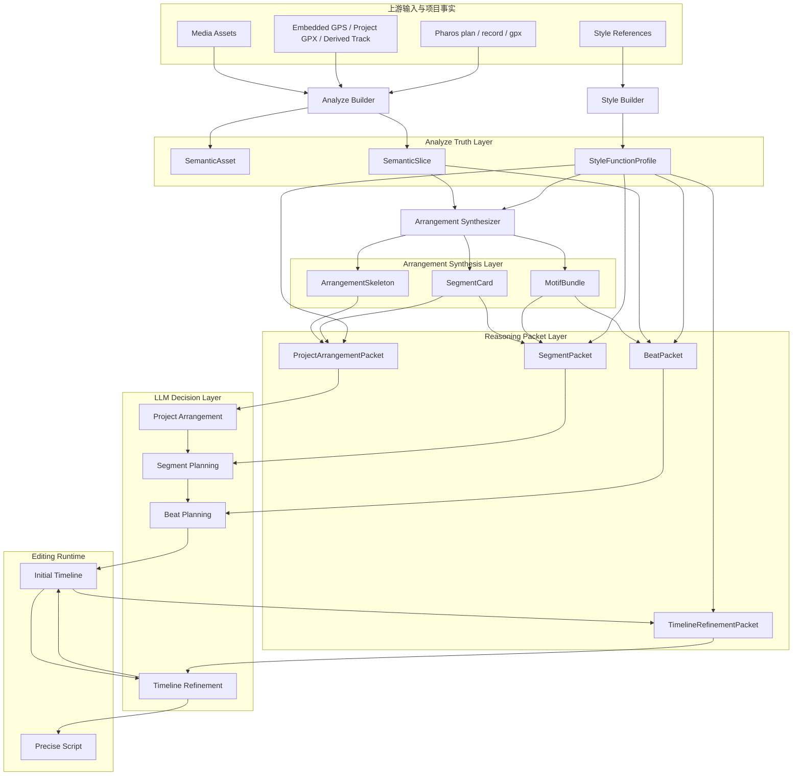
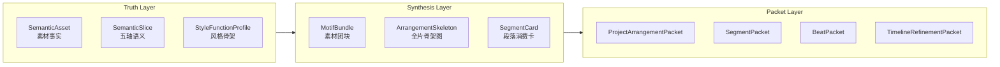
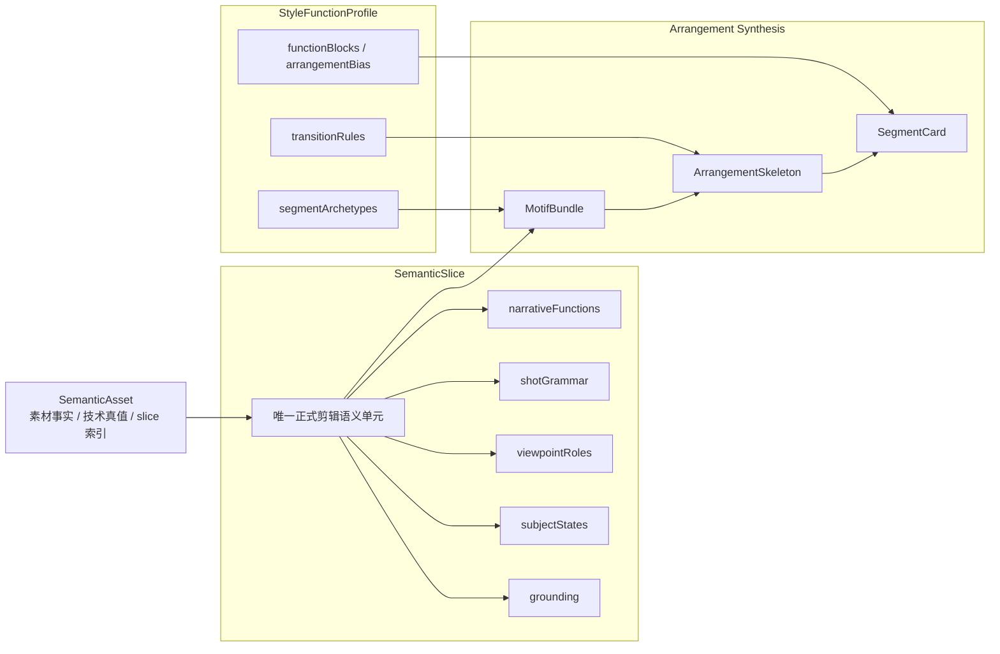
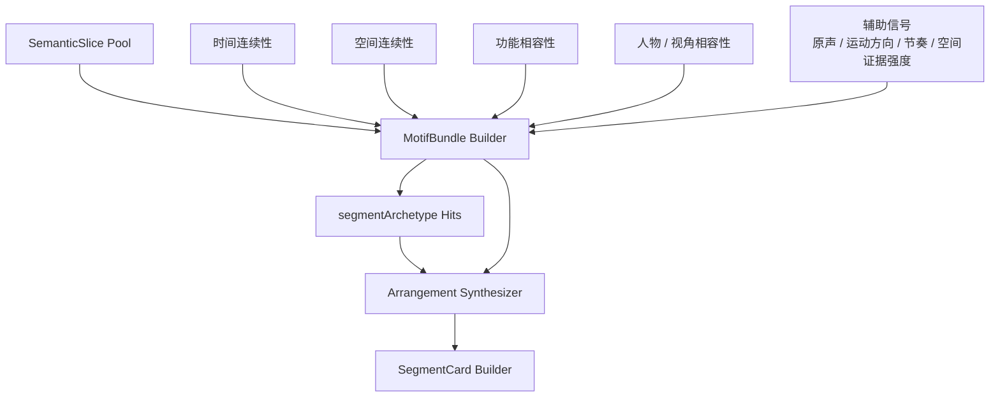
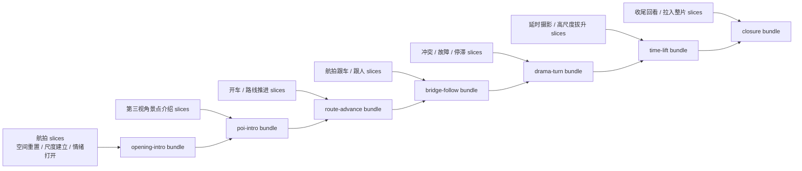
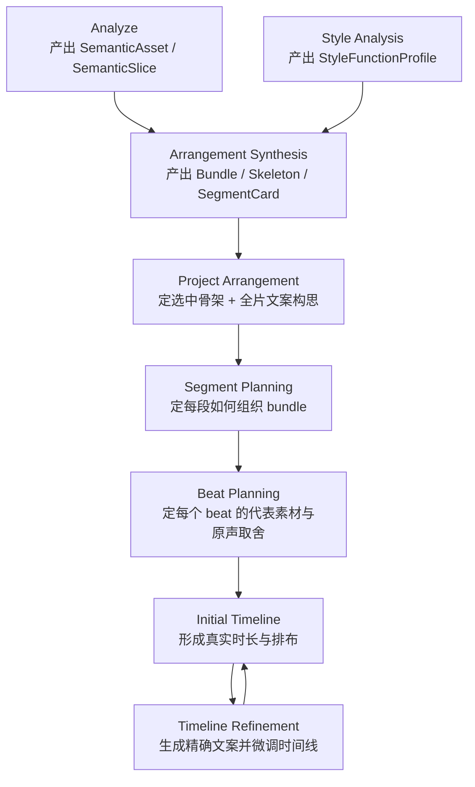
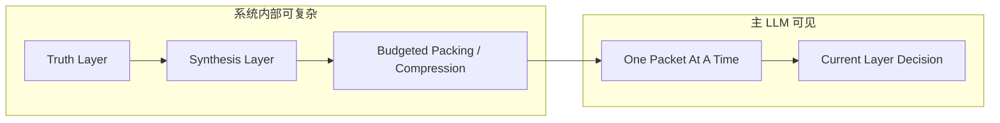
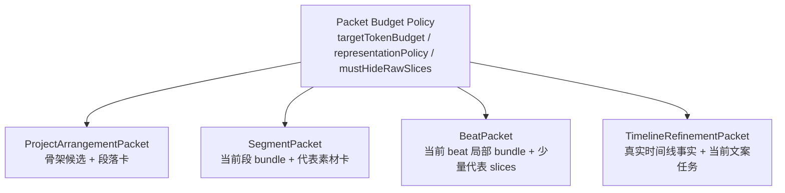
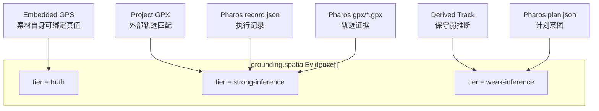
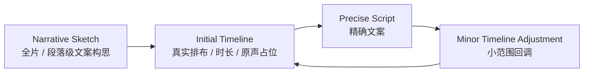

# Kairos v2 剪辑语义协议图解稿

## Status

当前状态：配套图解评审稿。

这份文档是 [Kairos v2 剪辑语义协议：真值层、综合层与推理包层](/Users/dtysky/Projects/dtysky/Kairos/designs/archive/2026-04-07--editing-semantic-protocol-v2.md) 的补充说明，职责不是重复正文，而是用流程图和架构图把边界画清楚，帮助快速判断这轮重构是不是把复杂性放在了正确的位置。

本稿同样属于评审文档，不代表已经实现，不代表已经切分支，也不代表已经同步主文档。

## 1. 一眼看懂：这轮到底在改什么

这轮不是在给旧 Analyze 多加几个标签，也不是把 Style 再写长一点，而是在重排整条链路的职责。

旧链路的问题可以浓缩成一句话：

`系统内部缺少正式综合层，主 LLM 被迫直接面对过多半结构化上下文。`

v2 的核心变化也可以浓缩成一句话：

`系统内部允许复杂，但复杂性要先沉淀成真值和综合对象，主 LLM 每一轮只看当前层的最小决策包。`

## 2. 总体架构图

下面这张图是 v2 的总架构。最重要的观察点有三个：

- 第一层是真值层，保存长期可复用的正式语义。
- 第二层是综合层，把 slice 长成 bundle、骨架和段落卡。
- 第三层才是主 LLM 可见的 packet。

### 这张图想表达的不是“模块有哪些”，而是“复杂性应该停在哪里”

`SemanticAsset / SemanticSlice / StyleFunctionProfile` 是正式真值。`MotifBundle / ArrangementSkeleton / SegmentCard` 是正式综合对象。只有 packet 才允许进入主 LLM。上游 `Pharos`、GPS 和素材事实都先进入 builder，再沉淀成 truth 和 synthesis objects，不能直接绕过前两层进入推理层。

## 3. 三层正式协议图

这张图专门说明为什么 v2 不能继续停留在“两层协议”。

### 这里的关键边界

Truth Layer 负责“这段素材是什么”。Synthesis Layer 负责“这些素材为什么会长成开场、景点介绍、路途推进、drama、拔升和收束”。Packet Layer 负责“主模型这一轮只该看什么”。

## 4. 真值层与综合层内部结构图

Truth Layer 不是给主模型看的。Synthesis Layer 也不是。它们一起构成系统内部准确、不冗余、长期可复用的正式真源与正式综合。

### 这里的关键边界

`SemanticAsset` 不负责编排。`SemanticSlice` 不直接定义整片骨架。`StyleFunctionProfile` 不会变成 slice 的一个子字段，它通过原型和连接规则去约束综合层。`MotifBundle`、`ArrangementSkeleton`、`SegmentCard` 不是实现细节，而是正式对象。

## 5. Slice 如何长成全片骨架

这张图是本轮新增的核心图。它解释“为什么不能直接从 slices 跳到 arrangement prompt”。

### 这条链路的正式含义

系统先看素材之间能不能自然聚成“同一段落的候选团块”，再看这些团块命中哪些风格原型，最后再按连接规则长成一套或多套骨架。主模型接手时，面对的已经不是原始素材海洋，而是综合后的骨架和段落卡。

## 6. 你的例子如何被综合出来

这张图把“引入航拍 -> 第三视角景点介绍 -> 开车 -> 跟车跟人 -> drama -> 延时拔升 -> 收尾”画成正式综合过程，而不是 travel 模板硬编码。

### 这张图表达的核心口径

这里没有任何一步要求系统先拿到“旅游片固定模板”。真正正式化的是：素材怎样因为时间、空间、功能和视角相容而长成 bundle；bundle 怎样因为风格原型和连接规则而长成骨架。

## 7. Analyze 到精确文案的流程图

这张图解释“为什么文案不是一次写完”。它把人的真实工作方式正式化了。

### 这条链路的正式含义

`Project Arrangement` 不是在写终稿，它负责从综合层候选里挑出整片骨架并产出全片构思。`Segment Planning` 和 `Beat Planning` 继续逐层收窄。`Timeline Refinement` 才是精确文案的正式入口，因为只有到了这一步，系统才真正知道 clip 如何排、原声占多少、字幕窗口在哪。

## 8. 主 LLM 可见性边界图

这张图是这轮最重要的约束图。它说明：不是系统变简单，而是主模型看到的世界必须更小。

### 配套的强规则

- 主模型不直接看全量 `SemanticSlice[]`
- 主模型不直接看全量 `MotifBundle[]`
- 主模型不直接看整份 style markdown
- 主模型不直接看长历史讨论
- 主模型不直接看 loose GPS / Pharos hints

系统内部可以拥有这些信息，但它们必须在进入主模型之前被吸收、排序、裁剪、分层。

## 9. Packet 预算图

这张图不是性能图，而是防幻觉图。packet 的意义之一，就是把每一层的候选集合压到一个主模型还能稳定做决策的表示范围，但不再把数量写死成协议常量。

### 这里的真正目的

这不是为了“漂亮的层级感”，而是为了阻止主模型在每一层都重新回到全局搜索。复杂项目可以有更多段落卡和更多 bundle，但首先扩展的是综合层表示，不是直接扩展主模型可见的 raw inputs。

## 10. Pharos / GPS / 空间证据进入图

这张图说明为什么 `Pharos` 不能再只是 prompt 里的地点提示文字。

### 这张图表达的核心口径

不是所有空间来源都一样强。`Embedded GPS` 可以直接作为可绑定真值。`Project GPX`、`Pharos record.json` 和 `Pharos gpx/*.gpx` 代表更强的外部时空证据，适合作为 `strong-inference`。`Derived Track` 与 `Pharos plan.json` 仍然有价值，但它们更多是保守弱推断，不应直接被当作可落字幕或地理重置的真值。

后续无论是做 `geo-reset`、`route-advance` 还是地点介绍，都必须明确依赖哪一档证据，而不是“看起来挺像这里”。

## 11. 两阶段文案与时间线微调图

这张图专门说明：文案不是全在最后，也不是先写完再硬贴时间线。

### 为什么要这样

如果没有前期文案构思，全片编排就会失去叙事方向，只剩素材拼装。

如果没有时间线后的精确文案，终稿文字就会脱离真实时长、原声占位和字幕窗口，最后只能靠强行压字数或强行拉时长补救。

如果不允许小范围回调，系统就会在“文案服从时间线”与“时间线服从文案”之间反复摇摆，却没有正式边界。v2 的口径是：允许小范围双向微调，但不允许重新推翻全片结构。

## 12. 这份图解稿希望帮助你快速判断的几件事

看完这份图解稿，最值得确认的不是细节词表，而是下面几个大判断。

第一，三层协议是不是切干净了。Truth Layer 和 Synthesis Layer 是否都被限定在系统内部，主 LLM 是否真的只吃 packet。

第二，主链是不是从“直接面对海量上下文”改成了“先综合，再按层次逐步缩小问题”。

第三，`MotifBundle -> ArrangementSkeleton -> SegmentCard` 这条综合链是不是已经被正式承认，而不是继续藏在实现里。

第四，文案是不是已经被正式分成“构思”和“精修”两阶段，而不是继续悬在中间。

第五，`Pharos/GPS` 是否终于从 loose hints 变成了正式证据对象。

第六，packet 的限流是否已经从固定数量帽改成预算控制和表示隔离。

## 13. 读图顺序建议

如果只想快速判断这次方向对不对，建议按这个顺序看：

1. 总体架构图
2. 三层正式协议图
3. Slice 如何长成全片骨架
4. 你的例子如何被综合出来
5. 主 LLM 可见性边界图
6. Packet 预算图

如果这六张图都认同，再回头看正文，就会容易很多。
