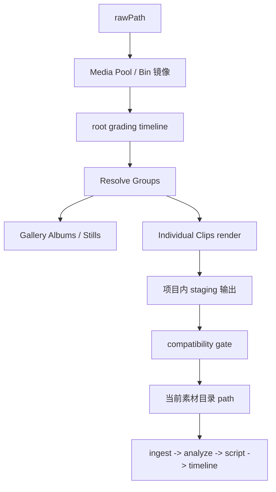

# Kairos DaVinci 独立调色链 v1

## Status

当前状态：评审稿。

本稿的目标不是直接冻结节点参数或插件实现细节，而是先把 Kairos 里的达芬奇调色链正式收口成一条独立工作流，并明确它和主链、素材根、来源目录树、当前素材目录之间的边界。

本稿当前确认的新结论是：

- `DaVinci color` 继续是独立增强链路，不是主链固定前置步骤。
- 主链继续只认“当前素材目录”，不引入 raw/graded 多版本资产协议。
- 每个素材根的当前目录继续由现有 `path` / `localPath` 表示。
- `/color` 额外引入可选 `rawPath` / `rawLocalPath`，只供调色链使用。
- `/color` 不再发明与 Resolve 平行的一套“调色组”概念；正式对象以 DaVinci 原生对象为准：
  - `Resolve Project`
  - `Media Pool / Bin`
  - `Timeline`
  - `Group`
  - `Gallery / Album / Still`
  - `Render Queue`
- 每个 Kairos 项目对应一个长期 `Resolve Project`。
- 每个 `root` 在 Resolve 中对应：
  - 一套完整镜像 `rawPath` 的 `Media Pool Bin` 树
  - 一条长期 `grading timeline`
  - 多个 Resolve `Group`
  - 多个按 `Group` 归属的 `Gallery Album`
- `Timeline` 在本流程中是技术工作平面，不是叙事时间线。
- 渲染采用 `Individual Clips` 语义，并以 Resolve `Group` 为最小正式执行粒度。
- 输出目录继续镜像来源树，输出文件名保留源文件 `stem`，扩展名统一规范为 `.mp4`。
- v1 默认输出固定为 `MP4 + H.265 + AAC`，并要求每个 `root` 显式配置目标码率。
- v1 正式纳入 `Group` 级创意 look；look 挂在 Resolve `Group`，不挂在 `Timeline`。
- `gyro / stabilization / denoise / WB trim / exposure trim` 正式按 Resolve `Clip` 级能力建模，不伪装成 Group 原生能力。
- v1 的处理参数 schema 直接按 DaVinci 原生对象和术语建，不额外抽象一层通用处理模型。
- clip 级参数只开放有限正式参数集，不尝试把整个 Resolve Inspector 全量结构化。
- compatibility gate 对关键元数据做强校验：至少 `capturedAt`、容器 / EXIF 侧 `create_time` 与 GPS 保真；文件系统 `create_time` 只做 best effort 记录，不作为阻塞 promote 的硬门槛；源里不存在的字段保持缺失，不写 Kairos 推断伪值。

本稿当前仍然刻意不解决以下问题，它们留到下一轮：

- 参数 schema 与插件映射细节
- match 的具体执行策略
- 关键 metadata 的具体保真实现路径
- `Group` look 的具体载体与参数边界

## Summary

Kairos 当前已经承认一条稳定事实：主链消费的是项目当前采用的素材目录，而不是强制要求原始素材始终在线。此前设计里已经为 `DaVinci color` 预留了“独立增强链路”的位置，但一直没有把来源目录树、Resolve 原生对象、当前素材目录和导出覆盖语义定死。

本稿确认的 v1 方向是：

- 不把调色流程和剪辑主链耦合。
- 不让 Analyze / Script / Timeline 感知调色内部状态。
- 不新增 raw/graded 资产版本协议。
- 保持用户和系统的主链心智模型不变：项目里仍然只有“当前素材目录”。
- 以 DaVinci 原生对象为第一设计语言；只有 Resolve 表达不了的内容，才由 Kairos 补充元数据。

调色链只做三件事：

1. 从可选的 `rawPath` 读取原始素材。
2. 在 Resolve 原生对象上组织和执行调色。
3. 在用户确认后，把经过校验的调色结果覆盖到当前素材目录。

因此，主链看到的仍然只是一个普通素材根；调色链只是这个素材根的独立维护工具。

## Problem Statement

如果直接把调色链设计成“主链前置阶段”，会立刻遇到三个问题。

第一，剪辑主链会被迫理解 raw/graded 版本关系。这样不但会把 ingest / analyze / script / timeline 都拖进版本模型，还会让“到底当前在用哪一版素材”变成系统级状态，而不是目录级事实。

第二，真实素材目录和 Resolve 工作对象并不一致。实际项目里，素材常常按 `zve1/day1/day2/day3` 这样的来源树存放，但在达芬奇里真正稳定、可复用的对象是：

- `Media Pool / Bin`
- `Timeline`
- `Group`
- `Gallery / Album / Still`
- `Render Queue`

如果 Kairos 再自创一层与之平行的“调色组”模型，就会让配置、执行和宿主对象映射长期对不上。

第三，如果当前素材目录和调色输出目录分裂成两套概念，就必须新增显式“采纳”协议、版本切换协议和大量兼容逻辑，而这并不是 v1 真正想解决的问题。

因此，本稿选择更窄、更稳的 v1：

- 主链目录语义不变
- `/color` 是目录维护链，而不是资产版本链
- `rawPath` 是调色输入，不是主链正式输入
- Resolve 原生对象优先，Kairos 只补必要元数据

## Core Model

### 1. 素材根语义

对每个素材根，v1 固定三层语义：

- `path` / `localPath`
  - 当前素材根工作目录
  - Kairos 主链实际读取目录
  - `/color` 的当前输出目录
- `rawPath` / `rawLocalPath`
  - 可选原始素材目录
  - 只供 `/color` 使用
  - 不进入主链正式心智模型
- `rootId`
  - 稳定身份
  - 不能因为当前目录内容变化或调色覆盖而重新生成

这意味着：

- 没有 `rawPath` 的素材根，仍然是有效主链素材根，只是不参与 `/color`
- 有 `rawPath` 的素材根，才会出现在 `/color`
- `/color` 不切换当前目录，只维护当前目录里的输出内容

### 2. `rawPath` 与来源目录树

`rawPath` 不是固定保留目录名。

它是一个由用户明确维护的可选字段，可能：

- 位于当前素材根目录内部
- 位于当前素材根目录外部

v1 不要求它必须叫 `raw/`，也不要求所有素材根都提供它。

`rawPath` 下的目录树正式承担两件事：

- 来源追溯
- 最终导出镜像

它不再承担 Kairos 自定义分组语义；来源目录树会直接镜像到 Resolve `Media Pool / Bin`。

### 3. 当前素材目录的正式语义

当前素材目录继续是主链唯一正式入口。

也就是说，后续 ingest / analyze / script / timeline / export 都继续只认：

- `path` / `localPath`

系统不再引入：

- 当前采用版本指针
- raw/graded 资产映射协议
- 版本切换后的双轨引用

### 4. `sourceRelativePath` 的正式地位

每条 clip 必须保留稳定的 `sourceRelativePath`，它相对于 `rawPath` 计算。

它至少用于：

- 来源追溯
- `Media Pool / Bin` 镜像
- staging 渲染镜像
- 当前输出覆盖定位
- compatibility gate 对账

来源 day 信息和目录层级不再依赖 Kairos 自定义组概念表达，而是通过 `sourceRelativePath` 和 Resolve `Media Pool / Bin` 结构保留。

## Resolve Object Model

### 1. 正式对象列表

v1 以后调色链的正式对象语言固定为：

- `Resolve Project`
- `Media Pool / Bin`
- `Timeline`
- `Group`
- `Gallery / Album / Still`
- `Render Queue`

Kairos 自身只保留：

- `root`
- `rawPath`
- `path`
- `sourceRelativePath`
- 本地执行记录、manifest 和 validation 结果

### 2. 工程映射

每个 Kairos 项目对应一个长期 `Resolve Project`。

v1 不采用：

- 每次执行临时建一个 Resolve 工程
- 每个 root 一个独立 Resolve 工程
- 每次运行都复制一套新的工程对象层级

### 3. 对象身份与命名

v1 要求所有长期 Resolve 对象都具备稳定身份，不能因为用户改了显示名、重新运行同步或调整来源目录内容，就重新生成一套新对象。

正式要求如下：

- `Resolve Project`
  - 一个 Kairos 项目只对应一个长期工程
  - 工程身份由 `projectId` 锚定
- `root`
  - 每个 `root` 在 Resolve 内必须有稳定命名空间
  - 该命名空间由 `rootId` 锚定
- `Timeline`
  - 每个 `root` 只有一条长期 `grading timeline`
  - timeline 身份由 `rootId` 锚定
- `Group`
  - 每个 Resolve `Group` 必须有稳定名字
  - group 身份在同一 `root` 内稳定，不因二次执行而漂移
- `Album`
  - 每个 `Group` 对应一个长期 `Gallery Album`
  - Album 身份与对应 `Group` 绑定

建议的稳定命名规则是：

- `Resolve Project`: `kairos__<projectId>`
- root 顶层命名空间: `root__<rootId>`
- root `grading timeline`: `root__<rootId>__grading`
- Resolve `Group`: `root__<rootId>__group__<groupKey>`
- `Gallery Album`: `root__<rootId>__group__<groupKey>`

其中：

- `groupKey` 是 Kairos 持久化保存的稳定键
- 用户可见显示名可以单独维护
- 任何显示名变更都不应触发重建长期对象

### 4. 长期对象与一次执行的边界

v1 要明确区分“长期对象”和“一次执行记录”。

长期对象包括：

- `Resolve Project`
- root 命名空间
- `Media Pool / Bin`
- root `grading timeline`
- Resolve `Group`
- `Gallery Album`

一次执行记录包括：

- 某次 `Render Queue` 项
- 本次 staging 输出
- 本次 manifest / validation / promote 结果

这意味着：

- 重跑同一个 `Group` 时，应尽量复用同一个 `Group`、同一个 `Album`、同一条 root timeline
- 历史运行信息保存在 Kairos 的 batch/manifest/validation 中，不靠在 Resolve 里堆积旧 timeline 或旧 album 快照表达

### 5. `Media Pool / Bin`

每个 `root` 在 Resolve 中必须拥有一套完整镜像 `rawPath` 的 `Media Pool Bin` 树。

也就是说：

- `rawPath` 的目录层级要完整映射到 `Bin`
- 用户可以在 Resolve 里直接追溯原始来源目录
- day 目录树仍然保留，但它的职责是来源追溯，不是工作分组
- Bin 同步默认是就地 reconcile，不是先删后建

### 6. `Timeline`

每个 `root` 在 Resolve 中拥有一条长期 `grading timeline`。

这条 timeline 的正式语义是：

- 技术工作平面
- 供 Color page、Group、Clip 和 Timeline 级节点承载调色状态
- 不承担叙事浏览责任

v1 固定：

- 每个 `root` 只维护一条长期 `grading timeline`
- timeline 内 clip 默认按 `capturedAt` 排序
- `capturedAt` 相同或缺失时，按 `sourceRelativePath` 做稳定次序
- 它不是主链里 `timeline/current.json` 的叙事时间线

### 7. `Group`

每条 clip 在 v1 中只能属于一个 Resolve `Group`。

Resolve `Group` 的正式职责是：

- 共享输入变换
- 共享技术基础
- 组内统一调整
- 组级创意 look

它不再通过 Kairos 自创的 `grade group` 命名表达；Kairos 只保存“哪个 clip 属于哪个 Resolve `Group`”这一事实。

每条 clip 只能属于一个 Resolve `Group`，不允许为了表达多维处理再保留第二层平行组关系。

#### 候选 `Group` 生成

v1 里的 Resolve `Group` 不是手写空壳对象，而是由 Kairos 先生成候选，再由用户确认。

候选生成只允许使用可解释的技术信号，至少包括：

- 输入 profile / 色彩空间 / 机型来源
- 亮度环境
- 是否需要 gyro
- 是否需要降噪

明确不允许作为 v1 候选生成信号的内容包括：

- `aroll / broll / drive` 这类角色语义
- Analyze 场景语义
- 脚本或时间线叙事语义
- 情绪或风格类黑盒推断

也就是说：

- `Group` 的候选生成可以服务技术链和工作组织
- 但 v1 不自动推断创意 look
- 组级创意 look 由用户明确选择、审阅并持久化

候选生成的正式行为是：

- 系统先为每条 clip 生成一份可解释的技术特征摘要
- 按特征摘要聚合为候选 Resolve `Group`
- 若已有正式 `Group` 的稳定特征与候选一致，则优先复用现有 `Group`
- 若没有可复用对象，则创建新的候选 `Group`

#### `groupKey` 与审阅

每个 Resolve `Group` 的长期身份由 `groupKey` 锚定。

`groupKey` 的正式语义是：

- 它是 Kairos 持久化保存的稳定键
- 它服务于 Resolve 对象复用、manifest 追踪和用户审阅
- 它不等于用户可见显示名

正式审阅流程是：

- 候选 `Group` 先进入 `draft`
- 用户可以改显示名、合并、拆分、把 clip 重新分配到别的 `Group`
- 只有确认后的 `Group` 才进入正式配置并写回 `color/config.json`
- 已确认 `Group` 的 `groupKey` 后续必须稳定复用

### 8. `Gallery / Album / Still`

每个 Resolve `Group` 对应一个 `Gallery Album`。

其正式职责是：

- 承载该 Group 的参考 still
- 服务组内统一和对照
- 不承担跨 Group 的风格传递

系统会先为每个 Group 选候选参考 clip / still，用户可改。

#### 候选参考 still 选择

v1 的候选参考 still 选择必须是可解释的，不能依赖黑盒美学判断。

正式规则如下：

- 只从当前 `Group` 内的 clip 中选择
- 优先选择技术状态更稳定的 clip
- 若存在明显异常 clip，应避免把它作为默认参考
- 若存在多个同样合格的候选，使用稳定次序打破平局

候选评估时至少考虑：

- 是否为可正常处理的视频 clip
- 是否存在明显异常的单片覆写需求
- 是否存在明显极端亮度或明显噪点问题
- 是否属于高运动、参考难度更高的镜头

默认平局规则是：

- 先按 `capturedAt`
- 再按 `sourceRelativePath`

用户修改后的参考 clip / still 必须持久化到正式配置中，并在后续重跑时默认复用。

### 9. `Render Queue`

正式渲染采用 Resolve 的 `Render Queue`，语义为：

- 每次执行以 Resolve `Group` 为最小正式单位
- 渲染方式为 `Individual Clips`
- 每次渲染整条源素材，不做裁剪和变速

`Render Queue` 项目是宿主对象；Kairos 只负责记录这次运行对应的计划、manifest、validation 和 promote 结果。

#### `Render Queue` 项命名与身份

v1 需要明确区分：

- Resolve 的 `Render Queue` 项
- Kairos 的一次运行记录

前者是宿主可见对象，后者是 Kairos 自己的受管记录。

因此：

- `Render Queue` 项本身不作为长期身份锚点
- 每次执行都对应一个新的 Kairos `batchId`
- `batchId` 才是本轮 plan / review / manifest / validation / promote 的统一关联键

建议的 `Render Queue` 项显示命名规则为：

- `root__<rootId>__group__<groupKey>__batch__<batchId>`

这个名字只服务于人工排查和宿主定位，不应反向成为 Kairos 的唯一真相。

#### 重跑与复用

同一个 Resolve `Group` 可以被重复执行。

v1 的正式语义是：

- 长期对象继续复用：
  - `Resolve Project`
  - `Media Pool / Bin`
  - root `grading timeline`
  - Resolve `Group`
  - `Gallery Album`
- 一次执行总是新建一轮新的运行记录：
  - 新的 `batchId`
  - 新的 staging 输出目录
  - 新的 manifest / validation 结果
  - 新的 `Render Queue` 项

如果同一 `Group` 存在多个历史 batch：

- 只有最新且成功通过 validation 的 batch 能成为“待 promote 候选”
- 已被更新 batch 取代的旧 batch 必须标记为 `superseded`
- `superseded` 的旧 batch 不允许再 promote，避免把当前输出回滚到非当前审阅版本

#### 渲染完整性与失败语义

v1 不允许把一个 `Group` 的部分成功渲染结果当作可 promote 成果。

正式规则是：

- 某个 `Group` 的目标 clip 集合，在本轮 render 中必须全部形成 staging 输出
- 只要有任一目标 clip 缺失、渲染失败、路径不对或编码契约不符，该 batch 就不能进入可 promote 状态
- validation 只对“完整 staging 集合”运行；不完整集合直接记为失败

也就是说，v1 默认不支持：

- partial promote
- 只替换成功片段、跳过失败片段
- 在当前素材目录里留下半更新状态

#### staging 目录与 `Render Queue` 的关系

Resolve 的 `Render Queue` 只负责把渲染结果写到 Kairos 提供的 staging 位置。

正式要求是：

- 每个 batch 都有独立 staging 根目录
- staging 内部必须镜像该 `Group` 对应的 `sourceRelativePath` 树
- Resolve 不能直接把结果写进当前素材目录
- Kairos promote 前必须以 manifest 为准重新核对 staging 文件集合

## Workflow

### 1. `/color` 的正式位置

新增官方 Console 路由：

- `/color`

新增官方 Supervisor job：

- `color`

`/color` 和以下路由并列：

- `/analyze`
- `/style`
- `/script`
- `/timeline-export`
- `/project`

它不是 `/project` 下的附属按钮，也不是 Agent-only 临时流程页，而是正式一级工作流入口。

### 2. `/color` 的正式职责

`/color` 负责：

- 发现哪些素材根配置了 `rawPath`
- 编辑 root 级调色配置
- 同步 `rawPath -> Media Pool / Bin` 镜像
- 维护 root 的长期 `grading timeline`
- 维护 Resolve `Group`
- 维护每个 Group 的 `Gallery Album / Still`
- 启动 Resolve 执行调色
- 在 staging 完成后做 compatibility gate
- 在用户确认后，将当前输出目录更新为新结果

`/color` 不负责：

- 驱动 Analyze / Script / Timeline
- 生成主链语义产物
- 让后续流程理解 raw/graded 版本关系

### 3. v1 正式链路

正式执行顺序如下：

1. `/color` 从 `rawPath` 扫描视频素材
2. 同步来源目录树到 Resolve `Media Pool / Bin`
3. 维护 root 的长期 `grading timeline`
4. 维护 clip 到 Resolve `Group` 的归属
5. 为每个 Group 建立 `Gallery Album / Still`
6. `color` job 以 Resolve `Group` 为粒度驱动 `Individual Clips` 渲染
7. Resolve 先输出到 staging
8. Kairos 对 staging 做 compatibility gate
9. gate 通过后，用户明确确认覆盖当前输出
10. Kairos 将该 Group 的 staging 结果 promote 到当前素材目录
11. 主链继续无感读取当前素材目录

## Processing Layers

### 1. Group / Clip / Timeline 分工

v1 的正式调色层级固定为：

- `Group`
  - 共享输入变换
  - 共享技术基础
  - 组内统一调整
  - 组内 reference still / shot match
  - 组级创意 look
- `Clip`
  - gyro / stabilization
  - 降噪
  - 单片白平衡 / 曝光 trim
  - 少量必要覆写
- `Timeline`
  - `root` 级最终收口
  - 允许整体 finishing / output 收口
  - 不承担主要调色职责

### 2. Resolve 原生节点顺序

v1 的正式节点顺序固定为 Resolve 原生四层：

1. `Group Pre-Clip`
2. `Clip`
3. `Group Post-Clip`
4. `Timeline`

其正式职责分别是：

1. `Group Pre-Clip`
   - 输入色彩空间归一化
   - 共享 CST / 输入变换
   - 该 Group 全体 clip 必须共享的基础技术前处理
2. `Clip`
   - gyro
   - 降噪
   - 单片白平衡 / 曝光 trim
   - 单片例外修正
3. `Group Post-Clip`
   - 组内统一调整
   - 组内 reference still / shot match
   - 该 Group 共享的统一收口
   - 该 Group 的创意 look
4. `Timeline`
   - `root` 级最终收口
   - 输出级 finishing
   - 面向该 root 全体输出的最终安全校正

### 3. 各层允许承载的处理

`Group` 层允许承载：

- 输入色彩空间归一化
- 共享 CST / 共享基础技术节点
- 组内统一白平衡 / 曝光基准
- 组内 reference still / match 相关节点
- 组级 LUT / PowerGrade / creative look

`Clip` 层允许承载：

- gyro / stabilization
- 降噪
- 单片白平衡 / 曝光 trim
- 单片例外修正
- 无法共享的个别技术差异

`Timeline` 层允许承载：

- `root` 级最终收口
- 统一输出级 finishing
- 面向该 root 全体输出的最终安全校正

### 4. 各层明确不该承载的处理

`Group` 层不应承载：

- 只对单片成立的 gyro / stabilization / 降噪
- 依赖个别素材问题的修补
- 跨 Group 的统一风格传递

`Clip` 层不应承载：

- 本应被整个 Group 共享的输入变换
- 需要整组共同维护的统一基础
- 本应由 Group 统一审阅和持久化的创意 look
- 本应在 root 最终输出层完成的统一收口

`Timeline` 层不应承载：

- 本应在 `Group` 层共享的技术基础
- 本应在 `Clip` 层完成的单片修正
- 大部分风格主语义
- 叙事或段落级 look 设计

### 5. v1 要覆盖的能力

v1 正式纳入以下能力：

- 输入变换 / CST
- 共享技术基础
- Group 级 creative look
- gyro / stabilization
- 降噪
- 基础校正
  - 白平衡
  - 曝光
- 组内 reference still / shot match
- root 级最终收口

### 6. v1 明确不做

以下能力不进入本稿的 v1：

- 照片调色
- 独立音频调色链
- 基于 Analyze 语义的镜头聚类
- 角色驱动的 look 分类
- 时间戳命名导出
- 复杂二级局部调色
- 依赖叙事目标的跨 Group 匹配

## Output Contract

### 1. 当前目录是正式输出根

当前素材根的 `path` / `localPath` 本身就是 `/color` 的正式输出根。

因此 v1 不再引入：

- 独立 graded root 指针
- 版本目录切换协议
- 采纳后 path 改写

相反，v1 的语义是：

- `path` 始终不变
- `/color` 只是更新 `path` 下的当前输出内容

### 2. staging 是强制中间层

为了避免 Resolve 直接改写当前工作目录，v1 强制引入 staging。

建议的正式落盘位置是：

- `projects/<projectId>/.tmp/color/<jobId>/render/`

Resolve 只写 staging。
只有在 validation 通过且用户确认后，Kairos 才能把 staging promote 到当前素材目录。

### 3. Individual Clips 导出契约

v1 的正式渲染契约是：

- 渲染方式固定为 `Individual Clips`
- 每次正式执行以一个 Resolve `Group` 为最小单位
- 每条 clip 输出整条源素材时长
- 不做裁剪
- 不做变速

### 4. 输出路径与命名

v1 的输出路径契约是：

- 输出目录严格镜像来源目录树
- `sourceRelativePath` 仍是定位和回写的主键
- 输出文件名保留源文件 `stem`
- 输出扩展名统一规范为 `.mp4`

例如：

- `A001.MOV -> A001.mp4`
- `day1/road/A001.MOV -> day1/road/A001.mp4`

源文件完整原名仍保留在 manifest / 元数据中，方便追溯。

### 5. 输出编码

v1 默认输出固定为：

- 容器：`MP4`
- 视频编码：`H.265`
- 音频编码：`AAC`

并且：

- 默认保留原音
- 每个 `root` 必须显式配置目标码率

### 6. 覆盖当前输出是受控例外

v1 明确允许：

- 用户确认后覆盖当前素材目录里的旧 graded 输出

但这条规则必须满足：

- 永远不能覆盖或删除 `rawPath`
- 必须先经过 compatibility gate
- 必须由用户显式确认
- 必须由 Kairos promote，不允许 Resolve 直接写当前工作目录

也就是说，`/color` 对一般 export-path-safety 是一条受控例外：

- 普通导出链路默认不允许覆盖
- `/color` 允许覆盖“当前 graded 输出”
- 但绝不允许动 raw 输入

### 7. promote 的正式语义

promote 不是简单复制文件，而是“把当前素材目录同步成新的受管输出镜像”。

v1 的正式语义应为：

- promote 粒度是单个 Resolve `Group`
- 对该 Group manifest 覆盖范围内已有文件做覆盖
- 创建该 Group 新生成的文件
- 删除该 Group 旧 manifest 中存在、但新 manifest 已不存在的旧 graded 文件
- 删除范围仅限该 Group 的受管输出集合
- 绝不进入 `rawPath` 子树

这条规则的目的是避免当前素材目录里长期残留旧的 graded 文件，导致主链误 ingest 过期素材。

## Compatibility Gate

### 1. 为什么需要 gate

因为主链不会理解调色内部状态，所以 `/color` 只能在“新输出仍然可被主链当作同一批当前素材”时，才允许无感 promote。

否则，虽然目录还是同一个，但实际媒体事实已经变化，主链缓存和分析结果会失真。

### 2. v1 的硬校验项

v1 至少校验以下项目：

- `sourceRelativePath` 镜像是否保留
- 输出文件名是否与源 `stem` 对齐，扩展名是否正确规范为 `.mp4`
- Group 覆盖范围内的文件集合数量是否一致
- kind 是否一致
- 分辨率是否一致
- fps 是否一致
- 时长是否一致或只在极小技术误差内波动
- 关键元信息是否保真

其中“关键元信息”至少包括：

- `capturedAt`
- 容器 / EXIF 侧 creation metadata
- GPS / 空间相关元信息
- chronology / spatial inference / Pharos 对齐依赖的其他核心字段

并且：

- 源里已有的关键字段必须保真
- 源里没有的关键字段保持缺失
- 不允许写入 Kairos 推断伪值
- 文件系统 `create_time` 只做 best effort 记录与对照，不作为 v1 promote 的硬阻塞项

### 3. gate 的结果语义

如果 gate 通过：

- 允许用户确认 promote
- 主链可继续无感使用当前目录

如果 gate 失败：

- 禁止 promote 到当前目录
- 必须向用户说明失败原因
- 该 Group 不能直接接入主链

本稿当前不允许“带着失败 gate 强行覆盖当前输出”这种路径。

## Mainflow Boundary

### 1. 主链不感知 `/color` 内部状态

以下信息不应成为主链正式输入：

- 当前 color batch
- Resolve 项目状态
- Resolve `Group`
- `Gallery / Album / Still`
- `Timeline` 级收口状态
- raw/graded 映射

主链继续只读取：

- 当前素材目录
- 其中已有的正式媒体文件

### 2. scanner 对 `rawPath` 的处理

若 `rawPath` 位于当前素材目录内部，主链 scanner 必须显式排除该子树。

若 `rawPath` 位于当前素材目录外部，则主链无需做额外排除。

因此，v1 要把“排除 `rawPath`”视为 ingest 的正式目录规则，而不是颜色链私有约定。

### 3. roots without `rawPath`

没有 `rawPath` 的素材根：

- 继续是有效主链素材根
- 不出现在 `/color`
- 不受 `/color` 影响

这能覆盖两类真实场景：

- 本身已经是当前可剪版本的素材根
- 某些素材根根本不打算走达芬奇调色

## Data Model

### 1. 用户可见配置扩展

`project-brief` 的路径映射块新增可选字段：

- `原始路径：...`

现有字段语义保持：

- `路径：...` 继续表示当前素材目录

### 2. 设备本地映射扩展

设备路径映射新增：

- `rawLocalPath?: string`

现有字段保持：

- `localPath` 继续表示当前素材目录

### 3. 项目级 `color/` 数据

v1 新增项目级 `color/` 目录，至少包括：

- `color/config.json`
  - root 级调色配置
  - root 级输出 preset
  - root 对应的 Resolve 工程映射
  - `Media Pool / Bin` 镜像状态
  - Resolve `Group` 定义与 clip 分配
  - `groupKey`
  - 每个 Group 的技术特征摘要
  - 每个 Group 的 creative look 配置
  - 每个 Group 的 `Gallery Album / Still`
  - 默认参考 clip / still
  - clip 级 materialized 处理配置
    - `gyro / stabilization`
    - `denoise`
    - `wb / exposure trim`
  - `Timeline` 最终收口配置
- `color/current.json`
  - 当前 UI 状态
  - 当前 root timeline 状态
  - 当前可执行的 Group
  - 当前 staging / validation / promote 状态
- `color/batches/<batchId>/plan.json`
  - 本轮 Group 计划
  - clip 清单
  - 候选 `Group` 生成依据
  - 默认参考 clip / still
- `color/batches/<batchId>/review.json`
  - 用户审阅结果
- `color/batches/<batchId>/manifest.json`
  - raw -> staging -> current 的镜像清单
  - `sourceRelativePath` 对应关系
  - 输出文件名规范化结果
- `color/batches/<batchId>/validation.json`
  - compatibility gate 结果
  - 关键 metadata 校验结果

### 4. `manifest.json` 正式字段契约

`manifest.json` 是 Kairos 对“这次运行实际产生了哪些受管输出”的正式记录。

它的正式职责是：

- 记录本轮目标 clip 集合
- 记录 staging 结果和 promote 目标之间的一一对应
- 为 validation 和 promote 提供唯一依据
- 为后续清理旧受管输出提供上一轮对照

v1 至少需要这些顶层字段：

- `projectId`
- `rootId`
- `groupKey`
- `batchId`
- `status`
  - `draft | rendered | validated | promoted | failed | superseded`
- `sourceRoot`
- `stagingRoot`
- `currentRoot`
- `renderPreset`
  - `container`
  - `videoCodec`
  - `audioCodec`
  - `bitrate`
- `filesystemTimestamps`
  - `sourceCreateTime`
  - `outputCreateTime`
- `entries`

每个 `entries[]` 项至少需要：

- `sourceRelativePath`
- `sourcePath`
- `sourceStem`
- `sourceExtension`
- `normalizedOutputFilename`
- `stagingRelativePath`
- `stagingPath`
- `promoteRelativePath`
- `promoteTargetPath`
- `renderStatus`
  - `pending | rendered | failed`
- `sourceMetadataSnapshot`
- `outputMetadataSnapshot`

其中正式约束是：

- `entries[]` 的主键是 `sourceRelativePath`
- `normalizedOutputFilename` 必须等于 `sourceStem + .mp4`
- `promoteRelativePath` 必须与 `sourceRelativePath` 的目录部分一致，只允许文件扩展名规范化
- `outputMetadataSnapshot` 只记录实际探测到的输出事实，不补写推断值
- 文件系统时间戳只作为辅助记录，不参与 v1 的硬通过判定

`manifest.json` 还应显式记录一份本 batch 的 `managedOutputSet`，语义为：

- 这轮 promote 有权覆盖、创建、删除的受管输出集合
- 删除范围只允许落在该集合对应的当前输出路径上
- 删除权限不能越过当前 `Group` 的历史受管边界，更不能触及 `rawPath`

### 5. `validation.json` 正式字段契约

`validation.json` 是 compatibility gate 的正式结果，不是调试日志。

它至少需要这些顶层字段：

- `projectId`
- `rootId`
- `groupKey`
- `batchId`
- `status`
  - `pass | fail`
- `validatedAt`
- `summary`
  - `targetCount`
  - `renderedCount`
  - `passedCount`
  - `failedCount`
- `blockingReasons`
- `entries`

每个 `entries[]` 项至少需要：

- `sourceRelativePath`
- `normalizedOutputFilename`
- `stagingPath`
- `promoteTargetPath`
- `checks`
  - `pathMirror`
  - `filenameNormalized`
  - `mediaKind`
  - `resolution`
  - `fps`
  - `duration`
  - `capturedAt`
  - `createTime`
  - `gps`
  - `filesystemCreateTime`
- `result`
  - `pass | fail`

每个 check 的最小结果语义应为：

- `pass`
- `fail`
- `not_present_in_source`

其中：

- `not_present_in_source` 只允许用于源里本来缺失的字段
- 只要任一硬校验项为 `fail`，该 entry 就必须记为 `fail`
- 只要任一 entry 为 `fail`，整个 `validation.json.status` 就必须是 `fail`
- `filesystemCreateTime` 允许仅记录 `pass | fail | unknown` 作为辅助信息，但它不会单独把 entry 判为 `fail`

`blockingReasons` 需要面向用户可解释，至少能回答：

- 是哪条 clip 失败
- 失败发生在路径、媒体参数还是关键 metadata
- 为什么这会阻止无感 promote

### 6. `current.json` 的运行真相

`color/current.json` 是 `/color` 页面和 Supervisor 之间共享的“当前运行真相”，但它不是长期工程配置。

它至少要区分三类状态：

- 长期存在的 root 工作状态
  - 是否已镜像 `Media Pool / Bin`
  - 是否已建立长期 `grading timeline`
  - 当前正式 `Group` 列表
- 当前可执行或可 promote 的运行状态
  - 哪些 `Group` 处于 `ready / running / staged / blocked`
  - 哪个 batch 是当前待 promote 候选
- 短期 UI 辅助状态
  - 当前选中的 root
  - 当前展开的 Group
  - 最近一次 validation 摘要

正式约束是：

- 长期配置只写 `config.json`
- 某次运行的事实只写对应 `batches/<batchId>/...`
- `current.json` 只保存“当前指向谁”的状态，不复制长期配置和历史详情

### 4. root-level preset

v1 的输出 preset 以素材根为单位配置，不是全项目统一，也不是逐 Group 配置。

原因是：

- 不同素材根常常对应不同机位或不同来源习惯
- 逐 Group 配置对 v1 来说过细
- 全项目统一则无法满足真实多机位项目

### 5. v1 参数 schema 原则

v1 的处理参数 schema 直接按 DaVinci 原生对象和语义建模。

正式原则是：

- `Group`、`Clip`、`Timeline` 分别保存各自原生层级允许承载的处理
- 不再额外抽象一层通用“处理意图协议”
- v1 只开放有限正式参数集，不试图把整个 Resolve Inspector 或全部节点参数完整映射出来

其中 clip 级正式参数集当前收口为：

- `gyro / stabilization`
- `denoise`
- `white balance trim`
- `exposure trim`

除此之外的 Resolve clip 能力，除非下一轮正式纳入，否则都不进入 v1 schema。

## Console

### 1. `/color` 页面最小职责

`/color` 页面至少应包含这些功能区：

- 可调色素材根列表
- `rawPath` 配置
- root 级输出 preset 配置
- `Media Pool / Bin` 镜像状态
- root 的长期 `grading timeline` 状态
- Resolve `Group` 预览与维护
- Group 对应的 `Gallery Album / Still`
- Group 级执行状态
- validation 结果
- promote 确认入口

### 2. root / Group 状态

每个素材根在 `/color` 中至少要暴露：

- 是否已配置 `rawPath`
- 是否已完成 `Media Pool / Bin` 镜像
- 是否已建立长期 `grading timeline`
- 当前是否存在运行中的 Resolve `Group`
- 当前是否存在待 promote 的 Group

每个 Resolve `Group` 至少有以下状态：

- `draft`
  - 待确认
- `ready`
  - 已确认，可执行
- `running`
  - 正在 Resolve 执行
- `staged`
  - staging 完成，待 validation / 待确认
- `blocked`
  - gate 失败或执行失败

v1 不要求把 `/color` 状态写成复杂 workflow 协议，只要求这些用户可见状态在 UI 上可恢复、可刷新、可继续。

## Supervisor

### 1. `color` job 的正式属性

新增：

- `jobType = color`
- `executionMode = deterministic`

它不依赖 ML，也不复用 `export-resolve`。

### 2. `color` job 的最小阶段

v1 至少拆为：

- `sync_root_bins`
- `prepare_root_timeline`
- `execute_group`
- `validate_group`
- `await_confirm_group`
- `promote_group`

其中：

- `sync_root_bins` 负责 `rawPath -> Media Pool / Bin`
- `prepare_root_timeline` 负责长期 `grading timeline`
- `execute_group` 结束后不能直接改当前素材目录
- 必须先落 staging
- 必须先完成 validation
- promote 必须等用户确认

### 3. 并发与互斥

v1 不要求 Resolve 侧并发执行多个正式渲染。

正式互斥规则建议为：

- 同一 `rootId + groupKey` 在任意时刻只能有一个活跃 batch
- 同一 root 的 `promote_group` 不能并发执行
- 当某个 Group 已经存在 `running` 或 `await_confirm_group` 的 batch 时，新的同组执行请求必须：
  - 先显式取消旧候选，或
  - 把旧候选标记为 `superseded`

这样做的目的，是避免：

- staging 与 promote 目标互相覆盖
- `/color` 页面同时出现多个“当前可 promote”真相
- 用户把较旧的已审阅结果 promote 到当前目录

### 4. promote 的阻塞条件

`promote_group` 只有在以下条件全部满足时才允许开始：

- 当前 batch 的 `validation.json.status = pass`
- 当前 batch 未被标记为 `superseded`
- 当前 batch 仍然是该 `Group` 的最新可 promote 候选
- 用户已对这次 promote 做显式确认

如果其中任一条件失效：

- promote 必须拒绝执行
- `/color` 必须提示用户当前候选已失效、被新结果取代或尚未通过 validation

## Open Items For Next Round

以下几部分被明确留到下一轮讨论，它们不是本稿的缺漏，而是刻意延后冻结：

### 1. 处理链细节

下一轮需要明确：

- 各处理阶段的可配置参数 schema
- 单片覆写允许哪些字段
- 如何映射到具体 Resolve 插件或节点

### 2. 参考与风格层

下一轮需要明确：

- match 的具体执行策略
- `Group` creative look 的正式字段、参数边界与默认载体
- LUT / PowerGrade / creative look 之间的最小兼容模型

### 3. metadata 实现细节

下一轮需要明确：

- `capturedAt / create_time / GPS` 在不同容器和编码器下的具体保真方案
- 哪些 metadata 通过转封装或写回 sidecar 维持，哪些必须由导出工具直接保留
- 若宿主导出能力无法保留关键 metadata，Kairos 是否需要正式拒绝该 preset

## Success Criteria

v1 成功的最低标准是：

- 用户可以给某个素材根配置 `rawPath`
- `/color` 可以独立从 `rawPath` 同步 `Media Pool / Bin`
- 每个 `root` 只维护一条长期 `grading timeline`
- 每条 clip 只能属于一个 Resolve `Group`
- Resolve `Group` 候选生成必须可解释，并可复用既有正式 `Group`
- 每个 `Group` 都可以持久化自己的 creative look
- 每个 `Group` 都有自己的 `Gallery Album / Still`
- 每个 `Group` 的默认参考 still 都能生成、修改并持久化
- `color` job 可以按 Resolve `Group` 驱动 `Individual Clips` 输出 staging
- Kairos 可以按 Resolve `Group` 对 staging 做 compatibility gate
- 每次执行都会生成独立 `batchId`、manifest 和 validation 结果
- 同组旧 batch 被新 batch 取代后不能再次 promote
- 输出目录继续镜像来源树
- 输出文件名保留源 `stem`，扩展名统一为 `.mp4`
- 源素材音频存在时，默认随导出结果保留
- clip 级 schema 只开放有限正式参数集，并至少覆盖 `gyro / stabilization`、`denoise`、`WB / exposure trim`
- 关键 metadata 保真时允许 promote，不保真时阻塞 promote
- 主链无需理解调色内部状态，继续把当前素材目录当普通素材根使用

## Notes

本稿落地时，先作为 archive 评审稿存在。

在 Resolve 处理链细节和风格层边界冻结之前，不同步以下正式主文档：

- `README.md`
- `AGENTS.md`
- `designs/current-solution-summary.md`
- `designs/architecture.md`

这些同步工作应放到下一轮，在调色链正式收口为稳定方案后一起完成。
