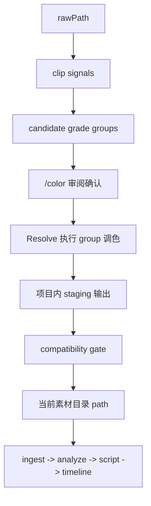

# Kairos DaVinci 独立调色链 v1

## Status

当前状态：评审稿。

本稿的目标不是直接冻结 Resolve 节点参数或插件细节，而是先把 Kairos 里的达芬奇调色链正式收口成一条独立工作流，并明确它和主链、素材根、来源目录树、当前素材目录之间的边界。

本稿当前确认的新结论是：

- `DaVinci color` 继续是独立增强链路，不是主链固定前置步骤。
- 主链继续只认“当前素材目录”，不引入 raw/graded 多版本资产协议。
- 每个素材根的当前目录继续由现有 `path` / `localPath` 表示。
- `/color` 额外引入可选 `rawPath` / `rawLocalPath`，只供调色链使用。
- `day1/day2/day3` 这类来源目录树只负责来源追溯与最终导出镜像，不再决定 Resolve 里的正式工作分组。
- `/color` 的正式工作单元是每个 root 内部的 `grade group`；它代表一套共享处理配方的工作组，而不是目录组、角色组或叙事组。
- v1 的候选分组采用“规则建议 + 人工确认”，不做黑盒聚类。
- Resolve 采用“每个 Kairos 项目一个长期工程、先按 root 分区、再按 grade group 组织”的结构。
- `color` job 的执行与覆盖粒度都是 `grade group`，不是整 root 一次性跑完。
- `/color` 的调色结果不是“切换 adopted pointer”，而是“经过 staging + 校验后，覆盖当前素材目录里的受管输出”。

本稿当前仍然刻意不解决以下问题，它们留到下一轮：

- 具体节点顺序、参数 schema 与插件映射细节
- 参考 clip / still 的精确自动选择规则
- LUT / PowerGrade / 创意 look 是否进入后续版本

## Summary

Kairos 当前已经承认一条稳定事实：主链消费的是项目当前采用的素材目录，而不是强制要求原始素材始终在线。此前设计里已经为 `DaVinci color` 预留了“独立增强链路”的位置，但一直没有把来源目录树、Resolve 工作组织、当前素材目录和导出覆盖语义定死。

本稿确认的 v1 方向是：

- 不把调色流程和剪辑主链耦合。
- 不让 Analyze / Script / Timeline 感知调色内部状态。
- 不新增 raw/graded 资产版本协议。
- 保持用户和系统的主链心智模型不变：项目里仍然只有“当前素材目录”。

调色链只做三件事：

1. 从可选的 `rawPath` 读取原始素材。
2. 在每个 root 内部，把 clip 组织成按处理配方划分的 `grade groups`。
3. 在用户确认后，把经过校验的调色结果覆盖到当前素材目录。

因此，主链看到的仍然只是一个普通素材根；调色链只是这个素材根的独立维护工具。

## Problem Statement

如果直接把调色链设计成“主链前置阶段”，会立刻遇到三个问题。

第一，剪辑主链会被迫理解 raw/graded 版本关系。这样不但会把 ingest / analyze / script / timeline 都拖进版本模型，还会让“到底当前在用哪一版素材”变成系统级状态，而不是目录级事实。

第二，真实素材目录和 Resolve 工作组织并不一致。实际项目里，素材常常按 `zve1/day1/day2/day3` 这样的来源树存放，但在调色时更关心的是：

- 输入 profile / 色彩空间
- 是否低照
- 是否需要 gyro
- 是否需要降噪
- 是否适合同组 still / match

如果仍然把叶子目录当正式工作组，调色工作会被错误地绑死在来源目录结构上。

第三，如果当前素材目录和调色输出目录分裂成两套概念，就必须新增显式“采纳”协议、版本切换协议和大量兼容逻辑，而这并不是 v1 真正想解决的问题。

因此，本稿选择更窄、更稳的 v1：

- 主链目录语义不变
- `/color` 是目录维护链，而不是资产版本链
- `rawPath` 是调色输入，不是主链正式输入
- Resolve 工作组由“处理配方”决定，不由 day 目录决定

## Core Model

### 1. 素材根语义

对每个素材根，v1 固定三层语义：

- `path` / `localPath`
  - 当前素材根工作目录
  - Kairos 主链实际读取目录
  - `/color` 的当前输出目录
- `rawPath` / `rawLocalPath`
  - 可选原始素材目录
  - 只供 `/color` 使用
  - 不进入主链正式心智模型
- `rootId`
  - 稳定身份
  - 不能因为当前目录内容变化或调色覆盖而重新生成

这意味着：

- 没有 `rawPath` 的素材根，仍然是有效主链素材根，只是不参与 `/color`
- 有 `rawPath` 的素材根，才会出现在 `/color`
- `/color` 不切换当前目录，只维护当前目录里的输出内容

### 2. `rawPath` 与来源目录树

`rawPath` 不是固定保留目录名。

它是一个由用户明确维护的可选字段，可能：

- 位于当前素材根目录内部
- 位于当前素材根目录外部

v1 不要求它必须叫 `raw/`，也不要求所有素材根都提供它。

`rawPath` 下的目录树正式承担两件事：

- 来源追溯
- 最终导出镜像

它不再承担 Resolve 工作分组语义。

### 3. 当前素材目录的正式语义

当前素材目录继续是主链唯一正式入口。

也就是说，后续 ingest / analyze / script / timeline / export 都继续只认：

- `path` / `localPath`

系统不再引入：

- 当前采用版本指针
- raw/graded 资产映射协议
- 版本切换后的双轨引用

### 4. `grade group` 的正式语义

`grade group` 是每个 root 内部的正式工作单元。

它的语义固定为：

- 一组共享处理配方的 clip 集合

它不是：

- 来源目录组
- `aroll / broll / drive` 这类角色组
- Analyze 场景组
- Timeline 叙事组

v1 对 `grade group` 施加以下边界：

- 只能存在于单个 root 内，不能跨 root
- 候选分组由系统规则建议生成
- 正式分组必须由用户确认后落盘
- 允许“组默认 + 单片覆写”

### 5. `sourceRelativePath` 的正式地位

每条 clip 必须保留稳定的 `sourceRelativePath`，它相对于 `rawPath` 计算。

它至少用于：

- 来源追溯
- staging 渲染镜像
- 当前输出覆盖定位
- compatibility gate 对账

`day1/day2/day3` 这类来源信息不再体现在 Resolve 的 media pool 结构里，而是通过 `sourceRelativePath` 等 clip 元数据保留。

## Workflow

### 1. `/color` 的正式位置

新增官方 Console 路由：

- `/color`

新增官方 Supervisor job：

- `color`

`/color` 和以下路由并列：

- `/analyze`
- `/style`
- `/script`
- `/timeline-export`
- `/project`

它不是 `/project` 下的附属按钮，也不是 Agent-only 临时流程页，而是正式一级工作流入口。

### 2. `/color` 的正式职责

`/color` 负责：

- 发现哪些素材根配置了 `rawPath`
- 编辑 root 级调色配置
- 从 `rawPath` 提取 clip 信号并生成候选 `grade groups`
- 审阅并确认正式 group / recipe
- 启动 Resolve 执行调色
- 在 staging 完成后做 compatibility gate
- 在用户确认后，将当前输出目录更新为新结果

`/color` 不负责：

- 驱动 Analyze / Script / Timeline
- 生成主链语义产物
- 让后续流程理解 raw/graded 版本关系

### 3. v1 正式链路

正式执行顺序如下：

1. `/color` 从 `rawPath` 扫描视频素材
2. 为每条 clip 提取候选分组信号
3. 系统生成候选 `grade groups`
4. 用户审阅并确认正式 group / recipe
5. `color` job 以 group 为粒度驱动 Resolve 执行
6. Resolve 先输出到 staging
7. Kairos 对 staging 做 compatibility gate
8. gate 通过后，用户明确确认覆盖当前输出
9. Kairos 将该 group 的 staging 结果 promote 到当前素材目录
10. 主链继续无感读取当前素材目录

## Grade Groups

### 1. 为什么不用目录分组

v1 不再采用“叶子目录就是正式调色组”的模型。

原因很简单：

- `day1/day2/day3` 是来源组织，不是调色组织
- 同一个处理配方组完全可能跨多个 day
- 同一个 day 里也可能同时存在需要不同处理的素材

因此：

- 来源目录树负责追溯和导出镜像
- `grade group` 负责 Resolve 里的正式工作组织

### 2. v1 的候选分组来源

v1 的候选分组采用“规则建议 + 人工确认”。

系统至少基于以下可解释信号生成候选 groups：

- 输入 profile / 色彩空间 / 机型来源
- 亮度环境
- 是否需要 gyro
- 是否需要降噪

这里的目标不是自动猜创意风格，而是先把技术处理相近的素材归成一组。

### 3. v1 不做黑盒聚类

本稿明确拒绝：

- 不可解释的自动聚类
- 根据语义角色自动判断 `aroll / broll / drive`
- 根据叙事情绪自动推断 look

系统职责是：

- 先给出可解释的候选 recipe / group
- 让用户确认、合并、拆分、改名

### 4. v1 不引入角色字段

`aroll / broll / drive` 这类角色信息在 v1 中：

- 不进入 schema
- 不作为自动分组信号
- 不作为 recipe 继承层

它们最多只可能出现在用户的临时命名习惯里，不进入正式数据模型。

### 5. 正式 group 的落盘语义

候选分组生成后，不直接写入正式配置。

必须先经过用户确认，再把以下信息落入 root 级正式配置：

- `gradeGroupId`
- 显示名
- recipe 默认值
- clip 到 group 的分配
- 单片覆写

## Scope

### 1. v1 要覆盖的能力

v1 的正式 recipe 包含：

- 输入变换 / CST
- gyro
- 降噪
- 基础校正
  - 白平衡
  - 曝光
- 组内 reference still / shot match

其中：

- recipe 的中心是“技术处理链”
- 组内 still / match 是正式能力，但只限组内
- 系统会为每组自动挑参考 clip / still，用户可覆写

### 2. v1 明确不做

以下能力不进入本稿的 v1：

- 照片调色
- 独立音频调色链
- 基于 Analyze 语义的镜头聚类
- 角色驱动的 look 分类
- 时间线级 look 设计
- LUT / PowerGrade 风格层
- 复杂二级局部调色
- 依赖叙事目标的跨组匹配

## Resolve Project Model

### 1. 工程映射

每个 Kairos 项目对应一个长期 Resolve 工程。

v1 不采用：

- 每次 batch 临时建一个 Resolve 工程
- 每个 root 一个独立 Resolve 工程

### 2. 工程内正式结构

长期 Resolve 工程内，正式组织层级是：

- 项目级 Resolve 工程
- root 分区
- `grade group` 工作结构

每个 `grade group` 至少拥有：

- 自己的 media bin
- 自己的工作 timeline
- 自己的组内 still / match 资产归属

### 3. Resolve 只展示工作组

在 Resolve 里：

- 不再复刻 `day1/day2/day3` 来源树
- 不以来源目录组织 media pool
- 主要按 `grade group` 工作

来源信息只保留在 clip 元数据与 manifest 中，不作为主要视图结构。

## Output Contract

### 1. 当前目录是正式输出根

当前素材根的 `path` / `localPath` 本身就是 `/color` 的正式输出根。

因此 v1 不再引入：

- 独立 graded root 指针
- 版本目录切换协议
- 采纳后 path 改写

相反，v1 的语义是：

- `path` 始终不变
- `/color` 只是更新 `path` 下的当前输出内容

### 2. staging 是强制中间层

为了避免 Resolve 直接改写当前工作目录，v1 强制引入 staging。

建议的正式落盘位置是：

- `projects/<projectId>/.tmp/color/<jobId>/render/`

Resolve 只写 staging。
只有在 validation 通过且用户确认后，Kairos 才能把 staging promote 到当前素材目录。

### 3. 覆盖当前输出是受控例外

v1 明确允许：

- 用户确认后覆盖当前素材目录里的旧 graded 输出

但这条规则必须满足：

- 永远不能覆盖或删除 `rawPath`
- 必须先经过 compatibility gate
- 必须由用户显式确认
- 必须由 Kairos promote，不允许 Resolve 直接写当前工作目录

也就是说，`/color` 对一般 export-path-safety 是一条受控例外：

- 普通导出链路默认不允许覆盖
- `/color` 允许覆盖“当前 graded 输出”
- 但绝不允许动 raw 输入

### 4. promote 的正式语义

promote 不是简单复制文件，而是“把当前素材目录同步成新的受管输出镜像”。

v1 的正式语义应为：

- promote 粒度是单个 `grade group`
- 对该 group manifest 覆盖范围内已有文件做覆盖
- 创建该 group 新生成的文件
- 删除该 group 旧 manifest 中存在、但新 manifest 已不存在的旧 graded 文件
- 删除范围仅限该 group 的受管输出集合
- 绝不进入 `rawPath` 子树

这条规则的目的是避免当前素材目录里长期残留旧的 graded 文件，导致主链误 ingest 过期素材。

## Compatibility Gate

### 1. 为什么需要 gate

因为主链不会理解调色内部状态，所以 `/color` 只能在“新输出仍然可被主链当作同一批当前素材”时，才允许无感 promote。

否则，虽然目录还是同一个，但实际媒体事实已经变化，主链缓存和分析结果会失真。

### 2. v1 的硬校验项

v1 至少校验以下项目：

- `sourceRelativePath` 镜像是否保留
- basename 是否保持一致
- group 覆盖范围内的文件集合数量是否一致
- kind 是否一致
- 分辨率是否一致
- fps 是否一致
- 时长是否一致或只在极小技术误差内波动
- 关键元信息是否保真

其中“关键元信息”至少包括：

- `capturedAt`
- 容器 / EXIF 侧 creation metadata
- `create_time`
- GPS / 空间相关元信息
- chronology / spatial inference / Pharos 对齐依赖的其他核心字段

### 3. gate 的结果语义

如果 gate 通过：

- 允许用户确认 promote
- 主链可继续无感使用当前目录

如果 gate 失败：

- 禁止 promote 到当前目录
- 必须向用户说明失败原因
- 该 group 不能直接接入主链

本稿当前不允许“带着失败 gate 强行覆盖当前输出”这种路径。

## Mainflow Boundary

### 1. 主链不感知 `/color` 内部状态

以下信息不应成为主链正式输入：

- 当前 color batch
- Resolve 项目状态
- root 内部的 `grade groups`
- still / match 审阅结果
- raw/graded 映射

主链继续只读取：

- 当前素材目录
- 其中已有的正式媒体文件

### 2. scanner 对 `rawPath` 的处理

若 `rawPath` 位于当前素材目录内部，主链 scanner 必须显式排除该子树。

若 `rawPath` 位于当前素材目录外部，则主链无需做额外排除。

因此，v1 要把“排除 `rawPath`”视为 ingest 的正式目录规则，而不是颜色链私有约定。

### 3. roots without `rawPath`

没有 `rawPath` 的素材根：

- 继续是有效主链素材根
- 不出现在 `/color`
- 不受 `/color` 影响

这能覆盖两类真实场景：

- 本身已经是当前可剪版本的素材根
- 某些素材根根本不打算走达芬奇调色

## Data Model

### 1. 用户可见配置扩展

`project-brief` 的路径映射块新增可选字段：

- `原始路径：...`

现有字段语义保持：

- `路径：...` 继续表示当前素材目录

### 2. 设备本地映射扩展

设备路径映射新增：

- `rawLocalPath?: string`

现有字段保持：

- `localPath` 继续表示当前素材目录

### 3. 项目级 `color/` 数据

v1 新增项目级 `color/` 目录，至少包括：

- `color/config.json`
  - root 级调色配置
  - root 级输出 preset
  - root 内正式 `grade groups`
  - group 级 recipe 默认值
  - clip 到 group 的分配
  - 单片覆写
- `color/current.json`
  - 当前 UI 状态
  - 当前候选分组草案
  - 待确认 / 待执行 / 待 promote 状态
- `color/batches/<batchId>/plan.json`
  - 本轮候选 groups
  - clip 信号摘要
  - 默认参考 clip / still
- `color/batches/<batchId>/review.json`
  - 用户审阅结果
- `color/batches/<batchId>/manifest.json`
  - raw -> staging -> current 的镜像清单
  - `sourceRelativePath` 对应关系
- `color/batches/<batchId>/validation.json`
  - compatibility gate 结果

### 4. root-level preset

v1 的输出 preset 以素材根为单位配置，不是全项目统一，也不是逐素材配置。

原因是：

- 不同素材根常常对应不同机位或不同来源习惯
- 逐素材配置对 v1 来说过细
- 全项目统一则无法满足真实多机位项目

## Console

### 1. `/color` 页面最小职责

`/color` 页面至少应包含这些功能区：

- 可调色素材根列表
- `rawPath` 配置
- root 级输出 preset 配置
- 候选 `grade groups` 预览
- group 审阅与确认
- group 级执行状态
- validation 结果
- promote 确认入口

### 2. root / group 状态

每个素材根在 `/color` 中至少要暴露：

- 是否已配置 `rawPath`
- 是否已有正式 `grade groups`
- 当前是否存在待审阅候选 groups
- 当前是否存在运行中的 group
- 当前是否存在待 promote 的 group

每个 `grade group` 至少有以下状态：

- `draft`
  - 候选建议，待确认
- `ready`
  - 已确认，可执行
- `running`
  - 正在 Resolve 执行
- `staged`
  - staging 完成，待 validation / 待确认
- `blocked`
  - gate 失败或执行失败

v1 不要求把 `/color` 状态写成复杂 workflow 协议，只要求这些用户可见状态在 UI 上可恢复、可刷新、可继续。

## Supervisor

### 1. `color` job 的正式属性

新增：

- `jobType = color`
- `executionMode = deterministic`

它不依赖 ML，也不复用 `export-resolve`。

### 2. `color` job 的最小阶段

v1 至少拆为：

- `plan_root`
- `execute_group`
- `validate_group`
- `await_confirm_group`
- `promote_group`

其中：

- `plan_root` 负责生成候选 groups，不直接改正式配置
- `execute_group` 结束后不能直接改当前素材目录
- 必须先落 staging
- 必须先完成 validation
- promote 必须等用户确认

## Open Items For Next Round

以下两部分被明确留到下一轮讨论，它们不是本稿的缺漏，而是刻意延后冻结：

### 1. 处理链细节

下一轮需要明确：

- 输入变换、gyro、降噪、基础校正、match 的具体节点顺序
- 各处理阶段的可配置参数 schema
- 单片覆写允许哪些字段
- 如何映射到具体 Resolve 插件或节点

### 2. 参考与风格层

下一轮需要明确：

- 参考 clip / still 的自动选择规则
- match 的具体执行策略
- 是否、何时、如何引入 LUT / PowerGrade / 创意 look
- 当后续版本需要风格层时，是附着在 group recipe 上还是独立建模

## Success Criteria

v1 成功的最低标准是：

- 用户可以给某个素材根配置 `rawPath`
- `/color` 可以独立从 `rawPath` 生成基于处理信号的候选 `grade groups`
- 来自不同 day 的素材，只要处理信号一致，就可以进入同一 group
- `color` job 可以按 group 驱动 Resolve 输出 staging
- Kairos 可以按 group 对 staging 做 compatibility gate
- 用户可以在确认后覆盖当前素材目录里的对应 graded 输出
- 最终目录结构继续镜像来源树
- 主链无需理解调色内部状态，继续把当前素材目录当普通素材根使用

## Notes

本稿落地时，先作为 archive 评审稿存在。

在 Resolve 处理链细节和风格层边界冻结之前，不同步以下正式主文档：

- `README.md`
- `AGENTS.md`
- `designs/current-solution-summary.md`
- `designs/architecture.md`

这些同步工作应放到下一轮，在调色链正式收口为稳定方案后一起完成。
