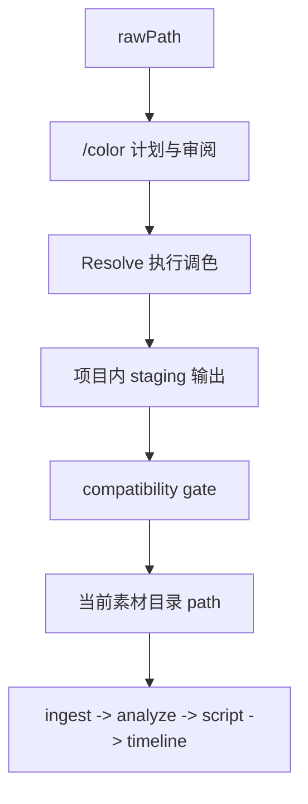

# Kairos DaVinci 独立调色链 v1

## Status

当前状态：评审稿。

本稿的目标不是直接展开 Resolve 工程细节或节点参数细节，而是先把 Kairos 里的达芬奇调色链正式收口成一条独立工作流，并明确它和主链、目录配置、当前素材目录之间的边界。

本稿当前确认的新结论是：

- `DaVinci color` 继续是独立增强链路，不是主链固定前置步骤。
- 主链继续只认“当前素材目录”，不引入 raw/graded 多版本资产协议。
- 每个素材根的当前目录继续由现有 `path` / `localPath` 表示。
- `/color` 额外引入可选 `rawPath` / `rawLocalPath`，只供调色链使用。
- `/color` 的调色结果不是“切换 adopted pointer”，而是“经过 staging + 校验后，覆盖当前素材目录里的受管输出”。
- v1 的正式分组策略是纯目录分组，不依赖 Analyze / Script / Timeline。

本稿刻意不解决以下问题，它们留到下一轮：

- Resolve 工程长期管理与对象命名
- 具体节点树、still、match、LUT / PowerGrade 细节

## Summary

Kairos 当前已经承认一条稳定事实：主链消费的是项目当前采用的素材目录，而不是强制要求原始素材始终在线。此前设计里已经为 `DaVinci color` 预留了“独立增强链路”的位置，但一直没有把目录语义和主链接入方式定死。

本稿确认的 v1 方向是：

- 不把调色流程和剪辑主链耦合。
- 不让 Analyze / Script / Timeline 感知调色内部状态。
- 不新增 raw/graded 资产版本协议。
- 保持用户和系统的主链心智模型不变：项目里仍然只有“当前素材目录”。

调色链只做两件事：

1. 从可选的 `rawPath` 读取原始素材。
2. 在用户确认后，把经过校验的调色结果覆盖到当前素材目录。

因此，主链看到的仍然只是一个普通素材根；调色链只是这个素材根的独立维护工具。

## Problem Statement

如果直接把调色链设计成“主链前置阶段”，会立刻遇到三个问题。

第一，剪辑主链会被迫理解 raw/graded 版本关系。这样不但会把 ingest / analyze / script / timeline 都拖进版本模型，还会让“到底当前在用哪一版素材”变成系统级状态，而不是目录级事实。

第二，调色与剪辑会被错误耦合。实际项目里，有的素材根需要调色，有的不需要；有的调完就覆盖当前目录，有的仍然保持人工流程。把它写成统一 adopted-media 协议，复杂度远超 v1 所需。

第三，如果当前素材目录和调色输出目录分裂成两套概念，就必须新增显式“采纳”协议、版本切换协议和大量兼容逻辑，而这并不是这轮讨论真正想解决的问题。

因此，本稿选择更窄、更稳的 v1：

- 主链目录语义不变
- `/color` 是目录维护链，而不是资产版本链
- `rawPath` 是调色输入，不是主链正式输入

## Core Model

### 1. 素材根语义

对每个素材根，v1 固定三层语义：

- `path` / `localPath`
  - 当前素材根工作目录
  - Kairos 主链实际读取目录
  - `/color` 的当前输出目录
- `rawPath` / `rawLocalPath`
  - 可选原始素材目录
  - 只供 `/color` 使用
  - 不进入主链正式心智模型
- `rootId`
  - 稳定身份
  - 不能因为当前目录内容变化或调色覆盖而重新生成

这意味着：

- 没有 `rawPath` 的素材根，仍然是有效主链素材根，只是不参与 `/color`
- 有 `rawPath` 的素材根，才会出现在 `/color`
- `/color` 不切换当前目录，只维护当前目录里的输出内容

### 2. `rawPath` 的正式语义

`rawPath` 不是固定保留目录名。

它是一个由用户明确维护的可选字段，可能：

- 位于当前素材根目录内部
- 位于当前素材根目录外部

v1 不要求它必须叫 `raw/`，也不要求所有素材根都提供它。

### 3. 当前素材目录的正式语义

当前素材目录继续是主链唯一正式入口。

也就是说，后续 ingest / analyze / script / timeline / export 都继续只认：

- `path` / `localPath`

系统不再引入：

- 当前采用版本指针
- raw/graded 资产映射协议
- 版本切换后的双轨引用

## Workflow

### 1. `/color` 的正式位置

新增官方 Console 路由：

- `/color`

新增官方 Supervisor job：

- `color`

`/color` 和以下路由并列：

- `/analyze`
- `/style`
- `/script`
- `/timeline-export`
- `/project`

它不是 `/project` 下的附属按钮，也不是 Agent-only 临时流程页，而是正式一级工作流入口。

### 2. `/color` 的正式职责

`/color` 负责：

- 发现哪些素材根配置了 `rawPath`
- 编辑 root 级调色配置
- 从 `rawPath` 生成调色计划
- 启动 Resolve 执行调色
- 在 staging 完成后做 compatibility gate
- 在用户确认后，将当前输出目录更新为新结果

`/color` 不负责：

- 驱动 Analyze / Script / Timeline
- 生成主链语义产物
- 让后续流程理解 raw/graded 版本关系

### 3. v1 正式链路



正式执行顺序如下：

1. `/color` 从 `rawPath` 扫描视频素材
2. 按目录结构生成调色分组和计划
3. 用户审阅计划
4. `color` job 驱动 Resolve 执行
5. Resolve 先输出到 staging
6. Kairos 对 staging 做 compatibility gate
7. gate 通过后，用户明确确认覆盖当前输出
8. Kairos 将 staging promote 到当前素材目录
9. 主链继续无感读取当前素材目录

## Grouping

### 1. v1 分组策略

v1 的正式分组策略是：

- 纯目录分组

具体规则固定为：

- 递归扫描 `rawPath`
- 每个“直接包含媒体文件的叶子目录”形成一个正式调色组
- 如果 `rawPath` 根目录自身直接包含媒体文件，则根目录本身也是一个组
- 组身份来自相对目录路径

例如：

```text
raw/
  day01/
    car/
      A001.mp4
      A002.mp4
    camp/
      B001.mp4
  day02/
    drone/
      C001.mp4
```

则 v1 正式组为：

- `day01/car`
- `day01/camp`
- `day02/drone`

### 2. 为什么不用 Analyze 场景

v1 明确不依赖 Analyze。

因此，以下信息都不是 `/color` 的正式输入：

- `spans`
- `asset-reports`
- `script`
- `timeline`
- 场景语义或叙事角色

这条边界是为了保证：

- `/color` 可以先于主链运行
- `/color` 可以独立反复运行
- 调色链不会反向拖住主链实现

## Scope

### 1. v1 要覆盖的能力

v1 目标是接近完整一调流程，但边界仍然清晰。

正式纳入 v1 的能力包括：

- 设备色彩空间解析
- CST / 输入变换
- 白平衡修正
- 曝光修正
- 目录组级 hero clip / reference still
- 组内 shot match
- 可选 LUT / PowerGrade
- 长 GOP 渲染输出

### 2. v1 明确不做

以下能力不进入本稿的 v1：

- 照片调色
- 独立音频调色链
- 基于 Analyze 语义的镜头聚类
- 时间线级 look 设计
- 复杂二级局部调色
- 依赖叙事目标的跨组匹配

## Output Contract

### 1. 当前目录是正式输出根

当前素材根的 `path` / `localPath` 本身就是 `/color` 的正式输出根。

因此 v1 不再引入：

- 独立 graded root 指针
- 版本目录切换协议
- 采纳后 path 改写

相反，v1 的语义是：

- `path` 始终不变
- `/color` 只是更新 `path` 下的当前输出内容

### 2. staging 是强制中间层

为了避免 Resolve 直接改写当前工作目录，v1 强制引入 staging。

建议的正式落盘位置是：

- `projects/<projectId>/.tmp/color/<jobId>/render/`

Resolve 只写 staging。
只有在 validation 通过且用户确认后，Kairos 才能把 staging promote 到当前素材目录。

### 3. 覆盖当前输出是受控例外

v1 明确允许：

- 用户确认后覆盖当前素材目录里的旧 graded 输出

但这条规则必须满足：

- 永远不能覆盖或删除 `rawPath`
- 必须先经过 compatibility gate
- 必须由用户显式确认
- 必须由 Kairos promote，不允许 Resolve 直接写当前工作目录

也就是说，`/color` 对一般 export-path-safety 是一条受控例外：

- 普通导出链路默认不允许覆盖
- `/color` 允许覆盖“当前 graded 输出”
- 但绝不允许动 raw 输入

### 4. promote 的正式语义

promote 不是简单复制文件，而是“把当前素材目录同步成新的受管输出镜像”。

v1 的正式语义应为：

- 对 manifest 中已有文件做覆盖
- 创建新文件
- 删除旧 manifest 中存在、但新 manifest 已不存在的旧 graded 文件
- 删除范围仅限当前受管输出集合
- 绝不进入 `rawPath` 子树

这条规则的目的是避免当前素材目录里长期残留旧的 graded 文件，导致主链误 ingest 过期素材。

## Compatibility Gate

### 1. 为什么需要 gate

因为主链不会理解调色内部状态，所以 `/color` 只能在“新输出仍然可被主链当作同一批当前素材”时，才允许无感 promote。

否则，虽然目录还是同一个，但实际媒体事实已经变化，主链缓存和分析结果会失真。

### 2. v1 的硬校验项

v1 至少校验以下项目：

- 相对路径是否镜像保留
- basename 是否保持一致
- 文件集合数量是否一致
- kind 是否一致
- 分辨率是否一致
- fps 是否一致
- 时长是否一致或只在极小技术误差内波动
- 关键元信息是否保真

其中“关键元信息”至少包括：

- `capturedAt`
- 容器 / EXIF 侧 creation metadata
- `create_time`
- GPS / 空间相关元信息
- chronology / spatial inference / Pharos 对齐依赖的其他核心字段

### 3. gate 的结果语义

如果 gate 通过：

- 允许用户确认 promote
- 主链可继续无感使用当前目录

如果 gate 失败：

- 禁止 promote 到当前目录
- 必须向用户说明失败原因
- 该批次不能直接接入主链

本稿当前不允许“带着失败 gate 强行覆盖当前输出”这种路径。

## Mainflow Boundary

### 1. 主链不感知 `/color` 内部状态

以下信息不应成为主链正式输入：

- 当前 color batch
- Resolve 项目状态
- raw/graded 映射
- still / match / look 审阅结果

主链继续只读取：

- 当前素材目录
- 其中已有的正式媒体文件

### 2. scanner 对 `rawPath` 的处理

若 `rawPath` 位于当前素材目录内部，主链 scanner 必须显式排除该子树。

若 `rawPath` 位于当前素材目录外部，则主链无需做额外排除。

因此，v1 要把“排除 `rawPath`”视为 ingest 的正式目录规则，而不是颜色链私有约定。

### 3. roots without `rawPath`

没有 `rawPath` 的素材根：

- 继续是有效主链素材根
- 不出现在 `/color`
- 不受 `/color` 影响

这能覆盖两类真实场景：

- 本身已经是当前可剪版本的素材根
- 某些素材根根本不打算走达芬奇调色

## Data Model

### 1. 用户可见配置扩展

`project-brief` 的路径映射块新增可选字段：

- `原始路径：...`

现有字段语义保持：

- `路径：...` 继续表示当前素材目录

### 2. 设备本地映射扩展

设备路径映射新增：

- `rawLocalPath?: string`

现有字段保持：

- `localPath` 继续表示当前素材目录

### 3. 项目级 `color/` 数据

v1 新增项目级 `color/` 目录，至少包括：

- `color/config.json`
  - root 级调色配置
  - 输出 preset
  - clip overrides
- `color/current.json`
  - 当前 UI 状态
  - 最近一次 batch 摘要
  - 当前可 promote / 待确认状态
- `color/batches/<batchId>/plan.json`
  - 本轮目录组、素材清单、默认参考素材
- `color/batches/<batchId>/review.json`
  - 用户审阅结果
- `color/batches/<batchId>/manifest.json`
  - raw -> staging -> current 的镜像清单
- `color/batches/<batchId>/validation.json`
  - compatibility gate 结果

### 4. root-level preset

v1 的输出 preset 以素材根为单位配置，不是全项目统一，也不是逐素材配置。

原因是：

- 不同素材根常常对应不同来源盘、不同题材或不同交付习惯
- 逐素材配置对 v1 来说过细
- 全项目统一则无法满足真实多机位 / 多来源项目

## Console

### 1. `/color` 页面最小职责

`/color` 页面至少应包含这些功能区：

- 可调色素材根列表
- `rawPath` 配置
- 输出 preset 配置
- 分组预览
- 本轮 batch 状态
- validation 结果
- promote 确认入口

### 2. root 状态机

每个素材根在 `/color` 中至少有以下状态：

- `not_configured`
  - 没有 `rawPath`
- `ready`
  - 已配置 raw，可生成计划
- `planned`
  - 已生成计划，待执行
- `running`
  - 正在 Resolve 执行
- `staged`
  - staging 完成，待 validation / 待确认
- `blocked`
  - gate 失败或执行失败

v1 不要求把 `/color` 状态写成复杂 workflow 协议，只要求这些用户可见状态在 UI 上可恢复、可刷新、可继续。

## Supervisor

### 1. `color` job 的正式属性

新增：

- `jobType = color`
- `executionMode = deterministic`

它不依赖 ML，也不复用 `export-resolve`。

### 2. `color` job 的最小阶段

v1 至少拆为：

- `plan`
- `execute`
- `validate`
- `await_confirm`
- `promote`

其中：

- `execute` 结束后不能直接改当前素材目录
- 必须先落 staging
- 必须先完成 validation
- promote 必须等用户确认

## Open Items For Next Round

以下两部分被明确留到下一轮讨论，它们不是本稿的缺漏，而是刻意延后冻结：

### 1. Resolve 工程管理

下一轮需要明确：

- 一个 Kairos 项目如何映射到 Resolve 项目
- 是否长期复用单一 Resolve 工程
- bin / still / gallery / render queue 的结构
- batch 命名和对象命名规则

### 2. 调色细节

下一轮需要明确：

- 色彩空间配置 schema
- 节点树顺序
- hero clip 选择规则
- reference still 策略
- shot match 粒度
- LUT / PowerGrade 插入位
- 曝光与白平衡自动修正边界

## Success Criteria

v1 成功的最低标准是：

- 用户可以给某个素材根配置 `rawPath`
- `/color` 可以独立从 `rawPath` 生成目录分组和调色计划
- `color` job 可以驱动 Resolve 输出 staging
- Kairos 可以对 staging 做 compatibility gate
- 用户可以在确认后覆盖当前素材目录里的旧 graded 输出
- 主链无需理解调色内部状态，继续把当前素材目录当普通素材根使用

## Notes

本稿落地时，先作为 archive 评审稿存在。

在 Resolve 工程管理和调色细节冻结之前，不同步以下正式主文档：

- `README.md`
- `AGENTS.md`
- `designs/current-solution-summary.md`
- `designs/architecture.md`

这些同步工作应放到下一轮，在调色链正式收口为稳定方案后一起完成。
