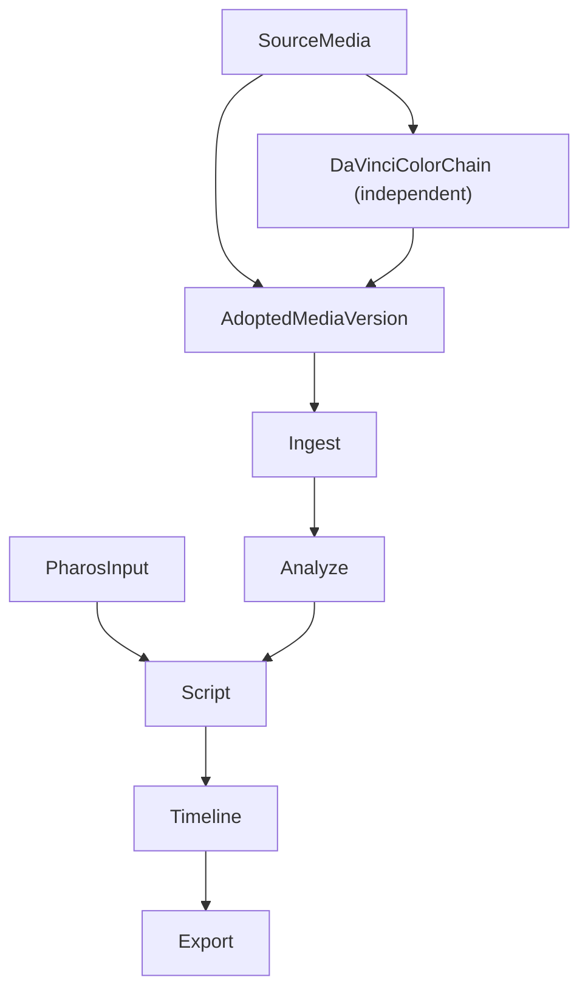
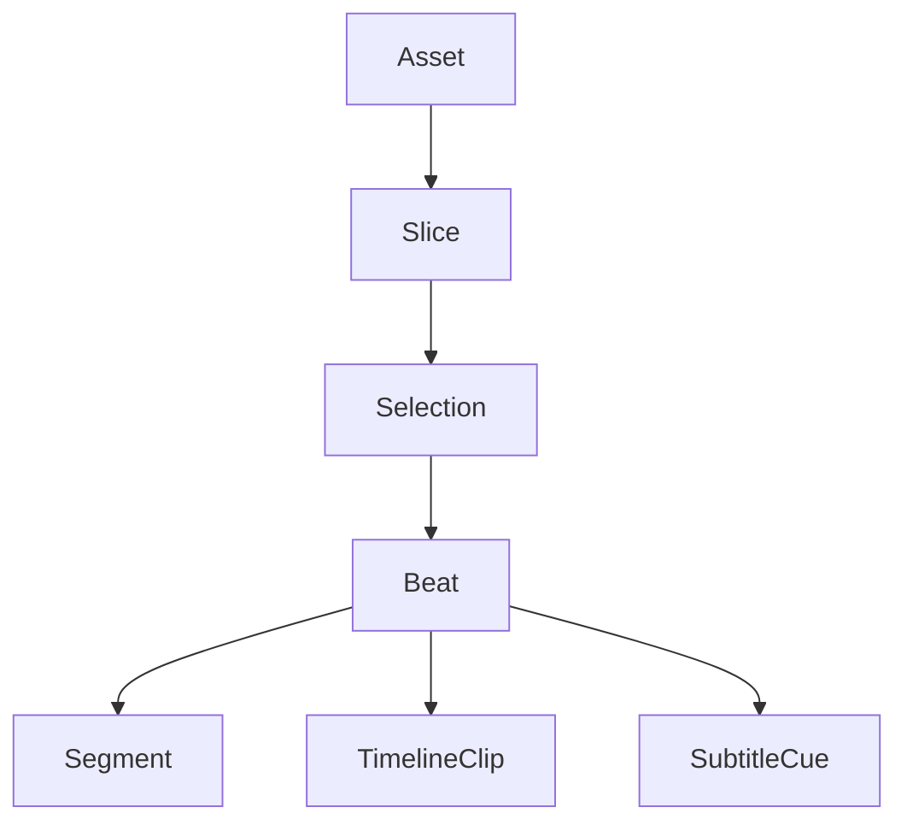

# Kairos — 当前方案总结

> 本文档用于把当前已经稳定的 Kairos 方案收口成一份浓缩入口。
> 它不是新的 ADR，也不替代迭代设计文档；它的职责是先回答“Kairos 现在到底是什么、怎么工作、哪些结论已经稳定”。

## 1. 当前产品形态

Kairos 当前需要区分两层：

- **正式流程定义**：以 `Pharos` 为主输入来源，围绕项目素材、分析结果、脚本编排与时间线落地组织完整工作流
- **当前实现形态**：以 `Node.js core + Agent skill` 作为临时承载形态，已经覆盖正式流程中的多个阶段，但还不等于正式流程的全部实现

在这个前提下，Kairos 当前的正式方案可以概括为：

- 一个以 `KTEP` 为核心协议的后期编排系统
- 一个以 `projects/<projectId>/` 为中心的项目化存储体系
- 一条以 `Pharos -> ingest -> analyze -> script -> timeline -> export` 为骨架的正式主流程
- `Pharos` 输入当前固定镜像到项目内 `pharos/<trip_id>/plan.json + record.json? + gpx/`
  - 项目初始化当前会直接创建 `projects/<projectId>/pharos/`
  - Console 读取项目配置时会补齐缺失的 `pharos/` 根目录，并在 `/ingest-gps` 明确提示这个固定投放位置
- 一条与主链解耦的 `DaVinci color` 独立增强链路
- 一组运行在 Agent 环境中的工作流技能，以及面向不同 NLE / 导出目标的适配层

这意味着：

- Kairos 不把 NLE 当作主数据中心，而把它们视为执行器或导出目标
- 当前的 `Node.js core + Agent skill` 是对正式流程的临时承载形态，而不是正式流程本身的唯一边界
- 仓库根目录的 `AGENTS.md` 是当前 agent 启动时的统一引导入口，用来收口必读文档、rules、skills 和正式运行入口
- 本地运行与任务编排当前已收口到 `Supervisor + React console (apps/kairos-console/)`
- `素材分析` 与 `风格分析` 在当前控制台里直接以主路由展示监控，而不是再跳一次独立监控入口
- 风格档案、风格来源配置与风格分析参考产物当前已收口为 **Workspace 级共享资产**：
  - `config/styles/`
  - `config/style-sources.json`
  - `analysis/reference-transcripts/`
  - `analysis/style-references/`
  - `config/style-sources.json` 是当前唯一正式 style 索引；`config/styles/*.md` 只承载 profile 正文，不再配套 `catalog.json`
- Workspace 风格档案当前不再只是“给人读的风格长文”，而是 Script 阶段的正式输入之一：
  - 章节里应尽量明确阶段节奏、素材角色、运镜语言、功能位分配与禁区
  - 参数表里应尽量提供稳定 key，便于 `script / recall / outline` 直接消费
  - 这些内容默认表示“观测到的高频偏好”，不是自动变成所有脚本都必须照抄的硬模板
- `scripts/kairos-supervisor.* start` 只启动 `Supervisor + React console`，不会顺带拉起 ML，也不会自动恢复旧 job
- `projects/<projectId>/.tmp/media-analyze/progress.json` 与 `<workspaceRoot>/.tmp/style-analysis/{category}/progress.json` 都只是 durable progress cache，不等于 live job
- Kairos 官方管理的顶层流程在结束态必须回收到 `ML stopped`
- workspace `style-analysis` 当前正式收口为 deterministic prep：
  - `health-check -> clip -> probe -> shot-detect -> transcribe -> keyframes -> vlm -> video-complete -> awaiting_agent|completed`
  - prep job 负责把 reference transcript、per-video report 与 workspace progress 正式落盘
  - 最终 `config/styles/{category}.md` 继续由 Agent 基于这些 prep 产物写成
- 未来如果引入桌面 UI 或更多 provider / adapter，应建立在这套协议与项目模型上，而不是推翻它
- 某些项目会直接消费调色后的素材版本而非原始素材；因此主链面向的是“当前采用的素材版本”，而不是固定绑定“永远使用原始素材”

## 1.1 当前变更纪律

凡是需求、行为、接口、工作流、正式入口或用户路径变更，当前正式顺序固定为：

1. 先进入 `Plan` 模式；如果宿主没有显式 `Plan mode`，先产出结构化计划并确认
2. 计划确认后，先更新相关设计文档
3. 再开始实现
4. 实现完成后，回查并同步受影响的设计文档、rules 和 skills

如果变更影响正式入口、监控页、工作流主路径或用户操作方式，还必须同步更新：

- `README.md`
- `AGENTS.md`
- `designs/current-solution-summary.md`
- `designs/architecture.md`

## 1.2 2026-04-08 语义协议切换

当前主链已经开始从旧的 `slice + 五轴语义 + 单阶段 arrangement` 切到新的 model-driven arrangement 准备链：

- Analyze 的正式素材单元现在优先叫 `span`
- 项目内正式持久化路径已切到 `store/spans.json`
- `span` 当前正式承载三块主信息：
  - `materialPatterns[]`
  - `grounding`
- 项目级正式词集当前只保留一层，并挂到 `project-brief`：
  - `材料模式短语`
- Script prep 当前正式链路为：
  - `Analyze -> Material Overview -> Script Brief -> Segment Plan -> Material Slots -> Bundle Lookup -> Chosen SpanIds -> Beat / Script`
- `Bundle` 当前是 `materialPatterns` 驱动的粗索引入口，不承担叙事骨架身份
- `Segment` 当前是 LLM-first 的项目级动态段落结果，不是固定 archetype 闭集
- Timeline / script selection 当前开始优先传递 `spanId`；`sliceId` 只作为兼容字段继续存在一段时间

## 2. 正式主流程

这里的正式关系是：

- `Pharos` 是正式流程的主输入之一，主要驱动脚本规划、拍摄语义和素材对齐
- `Pharos` 当前不再通过用户填写外部路径接入；每个项目固定扫描 `projects/<projectId>/pharos/`
- 如果项目迁移后缺少这个目录，Console 当前应先自动补齐，再向用户展示固定目录和投放提示
- `project-brief.md` 中的 `## Pharos` 当前只承担 trip 筛选语义；未填写时默认纳入全部可解析 trip，填写 `包含 Trip：...` 时只消费这些 trip
- `AdoptedMediaVersion` 表示项目当前采用的素材版本，它可以是原始素材，也可以是独立调色链路产出的版本
- `DaVinciColorChain` 是独立链路，不属于主链中的固定顺序步骤
- 如果项目没有 `Pharos`，主链允许退化为基于素材、brief、行程和分析结果的兼容路径，但这属于 fallback，而不是正式主定义

### Ingest

- 通过逻辑素材源导入项目当前采用的素材版本
- 真实本机目录路径不写死进项目，而是通过设备本地映射维护
- 保留素材真值，例如 `capturedAt`、`rawTags`、基础 metadata
- 对同目录同 basename 的保护音轨 sidecar，当前正式策略是作为视频资产上的 `protectionAudio` 绑定信息记录，而不是重新放开通用独立音频 ingest
- 如果输入素材来自独立调色/转换链路，该链路必须先保证关键元信息被保留下来

### Analyze

- 当前正式策略是“粗扫优先 + 自动细扫”
- 当前 Analyze 的稳定执行顺序已经是：
  - 有音轨视频：`coarse-scan -> audio-analysis -> finalize -> deferred scene detect(if needed)`
  - 无音轨视频：`coarse-scan -> finalize -> deferred scene detect(if needed)`
  - `scene detect` 不再是所有视频的 unconditional coarse 前置税，而是只在最终确实需要 shot 结构时延后触发
- `coarse-scan` 当前已经切到素材级动态并发：
  - 同一素材在 coarse 阶段最多只允许一个关键帧抽取 `ffmpeg`
  - 多条素材可根据 free memory 目标并发数并行推进
- 视频内音轨的 ASR 已进入正式分析链路，而不再只是附属信息
- `transcript / transcriptSegments / speechCoverage / placeHints / inferredGps` 都属于分析层结果
- `asset report.clipTypeGuess` 当前表示 finalize 后的语义结论；视频素材的正式 `visualSummary + decision` 只在 `finalize` 单次 unified VLM 中产出，前置阶段只保留 cheap planning inputs
- Analyze 现在按素材分阶段持久化可恢复状态：
  - `analysis/prepared-assets/<assetId>.json` 保存 coarse prepared checkpoint（keyframes / `hasAudioTrack` / source context 等输入）
  - `analysis/audio-checkpoints/<assetId>.json` 保存 selected transcript / transcript source / audio health / protection routing 中间态
  - `analysis/asset-reports/<assetId>.json` 用 `fineScanCompletedAt / fineScanSliceCount` 标记细扫完成态
- `audio-analysis` 当前已经切到两级素材队列：
  - 本地 health / routing 队列负责 embedded 与 protection 的轻量健康检查
  - ASR 队列只对最终选中的一路音轨转写，并按 free memory 目标并发数动态扩缩
- 如果视频绑定了 `protectionAudio`，Analyze 当前会先做双健康检查再选边：
  - `alignment === mismatch` 时强制保留 embedded
  - protection 缺失、不可访问或健康检查失败时回退 embedded
  - protection 只有在健康分数明显更优时才会成为正式 transcript 来源
- 一旦选择了 protection，它就不再只是 finalize prompt 的辅助信号，而会直接覆盖正式 `report.transcriptSegments`
- ML server 当前会在 `VLM` 和 `Whisper` 之间互斥卸载，避免两套模型同时常驻显存
- ML server 当前的 ASR 也已经收口成显式队列：
  - Torch backend 会把等待窗口内的独立请求聚合后做单次批推理
  - MLX backend 共享 admission/queue 语义，但保持单推理通道，不做真实 multi-audio batch
- `retry / resume` 后的 ETA 当前按阶段重置，并且在当前阶段完成样本少于 `3` 条时不显示，避免沿用上一轮进度口径后产生夸张倒计时
- `interestingWindows` 不再只有单一语义：
  - `startMs / endMs` 保留“为什么这里重要”的 focus/evidence window
  - `editStartMs / editEndMs` 表示更适合后续编排消费的 edit-friendly bounds
- `talking-head` 当前有 audio-led window strategy，会优先把连续 speech windows 收口成更适合原声消费的窗口，而不是继续沿用宽泛视觉窗口
- `drive` 类素材当前正式保留 `speech` 与 `visual` 两条语义支路：
  - `interestingWindows` / slices 可携带 `semanticKind`
  - `speech` path 面向 transcript / source speech
  - `visual` path 面向景色 summary 与 `speedCandidate`
  - 两类窗口不再默认 merge 成同一种“有语音就等于可直接剪原声”的窗口
- `drive` 类素材可在分析层直接挂 `speedCandidate` metadata（例如 `2x / 5x / 10x` 建议档位），但 Analyze 不直接替下游决定最终速度

### Script

- 正式脚本编排已经不是“整段 narration + 粗引用素材”的模型
- 当前正式模型是 `segment + beat + selection`
- `script-brief` 是当前脚本阶段的正式人工审查入口
- 当前 `/script` 页已经收口为：
  - 先选择 workspace `styleCategory`，并立即自动保存
  - Agent 生成初版 `script-brief`
  - 用户在 `/script` 审查并手动保存 brief
  - 用户点击 `准备给 Agent`
  - 关键 handoff 会通过持续可见的 workflow prompt 和显式 hana modal 提示用户“下一步去哪里”，而不再只靠淡色行内文案
- 当前 Console 里的 `script` job 已收口为 **deterministic prep**，只负责校验前置条件并刷新确定性材料
- `script/current.json` 的唯一正式作者是 **Agent**
- `script/script-brief.json` 当前承载脚本阶段的正式流程状态真值：
  - `choose_style`
  - `await_brief_draft`
  - `review_brief`
  - `ready_to_prepare`
  - `ready_for_agent`
  - `script_generated`
- `script/script-brief.md` 会同步机器可恢复的 workflow 元信息；即使 `.json` 丢失，也能恢复脚本阶段状态
- 如果用户已经修改过当前 brief，而又想让 Agent 重新生成初版 brief，正式路径是在 `/script` 点击 `重新生成初版 brief` 并通过 UI 明确确认覆盖
- 用户审查闸门存在于 Agent 写脚本之前，而不是召回和编排全部完成之后
- Script 阶段当前从 **Workspace 风格库** 里选择用户指定的 `style category`，项目只保存“本项目使用哪一个分类”，不再把风格档案作为项目内资产持有
- 当前 style profile 应同时提供两层信息：
  - 面向人的长文解释：为什么这种 intro / montage 会这样组织
  - 面向下游的直接提示：节奏阶段、`aerial / timelapse / drive / talking-head / broll / nat sound` 角色、运镜语法、`开场建场 / 地理重置 / 情绪释放` 功能位、素材禁区 / 镜头禁区、稳定参数表
- Script / recall / outline 当前应优先直接消费这些 style sections / parameters / antiPatterns，而不是只把风格档案当作“语气说明”再让 LLM 从长文里二次猜测镜头组织规则
- 当前脚本 / outline 默认优先消费 Analyze 给出的 `editSourceInMs / editSourceOutMs`，而不是继续把 tight evidence window 当成最终可剪子区间
- 模型仍可把 `selection.sourceInMs / sourceOutMs` 写得更细，但系统会先 clamp 到 outline fallback window，避免再次无意识裁得过短
- 如果某拍最终保留原声，Script / Timeline 当前会把命中的 `selection.sourceInMs / sourceOutMs` 向外吸附到完整 `transcriptSegments` 边界；若完整一句原声长于原 beat 目标时长，会优先延长该 beat，而不是切在句中

### Timeline / Export

- 时间线与导出围绕 `KTEP` 展开
- 字幕已有两条正式路径：
  - 旁白路径：默认来自 `beat.text`
  - 原声路径：当某拍保留原声时，可直接来自 `slice.transcriptSegments`
- 旁白路径已支持显式 `beat.utterances[]`，可以在一个 beat 内表达多段配音与头部 / 中间 / 尾部停顿；字幕只覆盖有声岛，不再默认铺满整个 beat
- `preserveNatSound / muteSource` 是脚本层的显式覆盖信号；未显式标注时，时间线层可结合 transcript 匹配度、`speechCoverage` 与段落角色推论是否保留原声
- 当视频资产已绑定保护音轨，且 Analyze 的保守推荐明确偏向 `protection` 时，时间线可把视频原音静音，并额外挂一条对齐的 `nat` 音轨作为原声兜底
- 当前字幕时长已不再是简单平均分配，而是会参考说话速度和标点停顿做节奏估算
- 当前时间线不再把“短 source + 长 beat”当成默认慢放来源：
  - 对带 `editSourceInMs / editSourceOutMs` 的新 slice，时间线优先使用 edit-friendly bounds
  - 只有旧 slice / 旧 selection 缺少 edit bounds 时，才保留 legacy fallback stretch
- 如果确实需要速度蒙太奇，当前正式路径是显式填写 `beat.actions.speed`
- `IKtepScriptAction.speed` 当前的正式语义是“请求加速”，只有 `drive / aerial` clip 会实际消费；混合 beat 中其他类型 clip 会强制保持 `1x`
- `placeClips()` 当前会优先把 clip 总时长贴到 `beat.targetDurationMs`，而不是让显式 `speed` beat 按原始 source 时长自由漂移
- 时间线 / 草稿输出规格已收口为项目级运行时配置：`timelineWidth / timelineHeight / timelineFps`，默认值为 `3840x2160 @ 30fps`
- 当某拍不走 source speech 时，时间线会把命中的带音轨视频 clip 标记为静音意图；导出到 Jianying 时会落成静音视频片段
- 剪映导出不再走外部 `jianying-mcp` / 独立 `Jianying Server` 路线，而是由 Node 侧调用 vendored `pyJianYingDraft` 本地 CLI
- 当前剪映 backend 会直写 `draft_info.json` / `draft_meta_info.json`，并补齐本地素材注册元数据
- 剪映导出当前正式遵循“两段式新目录导出”：
  - 先在 `projects/<projectId>/adapters/jianying-staging/<draftName>` 生成项目内 staging 草稿
  - staging 成功后，再复制到真实 `jianyingDraftRoot/<draftName>`
  - 两侧目录都必须是全新目录，禁止覆盖、清空或删除已有草稿目录
- 对带 `speed` 的剪映导出，当前适配层会做 backend compatibility normalization，修正 `pyJianYingDraft` 的微秒级重算偏差，但不会回写正式 `timeline/current.json`
- Resolve、剪映或其他导出目标都应建立在同一套正式时间线语义之上

## 3. 协议与数据骨架

### KTEP 是正式交换协议

- 协议名：`kairos.timeline`
- 当前版本：`1.0`
- Zod schema 与协议校验器共同定义正式数据边界

### 核心对象关系

### 当前正式语义

- `asset`：素材真值层，保存原始资产事实
- `slice`：分析后得到的候选时间窗，同时可带两层时间语义
  - `sourceInMs / sourceOutMs`：focus / evidence window
  - `editSourceInMs / editSourceOutMs`：edit-friendly bounds
- `selection`：脚本 / 时间线真正使用的子区间
- `beat`：当前正式的最小编排单元
- `segment`：叙事层面的段落容器

关键结论：

- `slice` 不承诺整段都会被用到
- `selection` 才决定到底使用 `slice` 里的哪几秒；如果没有显式再裁，默认应优先落在 Analyze 给出的 edit-friendly bounds 上
- `beat` 统一承接文案、画面选择、字幕和时间线编排
- `segment.narration` 若存在，应理解为 beat 级文本的聚合预览，而不是时间线摆放的唯一真源

## 4. 项目布局与存储边界

### 项目目录

当前正式项目模型围绕 `projects/<projectId>/` 展开，主要包括：

- `config/`：逻辑素材源、运行时配置、人工 itinerary，以及项目级结构化配置
- `store/`：项目元数据与清单
- `analysis/`：资产分析报告，以及 Analyze 的 durable resume cache（如 `prepared-assets/`、`audio-checkpoints/`）
- `script/`、`timeline/`、`subtitles/`、`adapters/`：脚本、时间线与适配器状态
- `gps/`：项目级外部轨迹资源与归一化缓存
- `pharos/`：项目内固定 `Pharos` 镜像目录，按 `trip_id` 分子目录；解析后的共享快照写入 `analysis/pharos-context.json`
- `.tmp/`：流水线临时产物、进度、代理音频、关键帧等可清理内容

另外还有一组 **Workspace 级共享资产**，不属于单个项目目录：

- `config/styles/`：正式风格档案库
- `config/style-sources.json`：风格来源配置
- `analysis/reference-transcripts/`：风格分析的参考转写
- `analysis/style-references/`：逐参考视频分析结果与分类汇总

### 三类边界

- 项目内正式产物：可同步、可复用、可作为正式输入继续流转
- 设备本地映射：`config/device-media-maps.local.json`，只描述当前设备能访问到的素材真实目录，默认不纳入同步
- 临时产物：`.tmp/`，默认不属于 `Canonical Project Store`
- 可恢复中间态：`analysis/prepared-assets/` 与 `analysis/audio-checkpoints/` 用于跨进程恢复 Analyze；它们是 durable resume cache，不是 Script / Timeline 的正式输入，且在 stage 语义调整后允许安全失效并重建

### 当前稳定约定

- `config/ingest-roots.json` 保存逻辑素材源，而不是设备绝对路径
- `config/project-brief.md` 是路径映射的人类输入入口；进入 Ingest 前会同步到 `config/ingest-roots.json` 与 `config/device-media-maps.local.json`
- `config/project-brief.json`、`config/manual-itinerary.json`、`script/script-brief.json` 与 `config/review-queue.json` 是当前项目级 Console 结构化事实源
- `config/style-sources.json` 是当前 **Workspace 级** Console 结构化事实源
- `project-brief` 的每个 root block 允许额外声明 `飞行记录路径`，作为该素材根目录对应的 DJI FlightRecord 日志入口；实际识别不依赖强文件名，而是以文件头/可解析性为准
- `config/runtime.json` 是项目级运行时配置入口
- 如果需要解密 DJI v13/v14 FlightRecord，`config/runtime.json` 可提供 `djiOpenAPIKey`
- `config/styles/` 保存 **Workspace 级** 正式风格档案；这些档案当前应同时包含长文 section 与可直接被脚本阶段消费的参数 / 禁区 / 节奏语法提示
- `gps/tracks/*.gpx` 与 `gps/merged.json` 是当前项目级外部轨迹资源入口
- `gps/same-source/tracks/*.gpx` 与 `gps/same-source/index.json` 是 dense same-source GPS 的项目内缓存入口，仅用于内部索引 / 惰性查找
- `gps/derived.json` 是项目级 `project-derived-track` 缓存，统一收口 embedded-derived 与 manual-itinerary-derived 的弱空间来源
- 主链消费的是项目当前采用的素材版本，而不是强制要求原始素材始终在线

### 当前运行与控制面

- 本地运行时当前由 `Supervisor` 承载，Dashboard 默认在 `127.0.0.1:8940`，ML 默认在 `127.0.0.1:8910`
- `apps/kairos-console/` 是当前正式 React 控制台，采用“工作流优先”的顶层路由：
  - `/`
  - `/ingest-gps`
  - `/analyze`
  - `/style`
  - `/script`
  - `/timeline-export`
  - `/project`
- `Analyze` 与 `Style` 当前都直接在主路由展示监控内容：
  - `/analyze` 直接展示 Analyze monitor
  - `/style` 直接展示 Workspace 风格库与当前分类的 Style monitor
- Console 刷新时，默认项目选择优先跟随最新的 active project-scoped job；只有当前没有活跃项目 job 时，才回落到本地记住的上次选择
- 如果多个项目共用同一个 `project.name`，项目选择器必须直接显示 `projectId`，避免把 monitor / progress 请求落到错误项目
- 旧 `/analyze/monitor` 与 `/style/monitor/:categoryId?` 只保留为兼容跳转
- 旧静态进度页脚本只保留兼容 / 调试用途，新的正式监控能力应优先落在 `Supervisor + React console` 这条链路
- React Analyze monitor 现在已经直接承认多阶段并发语义：
  - `coarse-scan` 展示素材级 worker、checkpoint 数和活跃素材
  - `audio-analysis` 展示 local queue、ASR queue、活跃 worker 和排队数
  - `fine-scan` 继续展示 `已预抽 / 已识别 / ready queue / active workers`
  - hero 区不再把并发阶段误写成单一“当前素材”
- `scripts/kairos-supervisor.* start` 当前只负责拉起 `Supervisor + React console`，不会自动启动 ML，也不会自动恢复或重放旧 job；需要继续分析时，必须显式重新发起对应 job
- `projects/<projectId>/.tmp/media-analyze/progress.json` 是 durable progress cache，不等于“当前一定有 live analyze job 在跑”；运维判断必须至少同时核对：
  - `Supervisor` job 里是否存在 `running analyze`
  - `progress.json` 的 `LastWriteTime / updatedAt` 是否仍在推进
  - GPU / ML 是否出现与当前阶段一致的活跃迹象
- workspace `style-analysis` 也遵守同一条 live-job 规则；stale progress 只能显示 cached/idle，不能伪装成仍在运行

### 元信息保真原则

只要主链消费的是转换、调色、导出或其他链路生成的派生素材版本，就必须保证这些版本保留正式流程依赖的关键元信息。

至少包括：

- 媒体创建时间（容器 / EXIF / 媒体侧 creation metadata）
- 文件 `create_time`
- GPS / 空间相关元信息
- 后续与 `Pharos`、chronology、空间推断对齐所需的其他核心字段

也就是说，派生素材版本可以替代原始素材进入主链，但不能因为转换而破坏时间语义、空间语义和后续匹配能力。

## 5. 脚本编排与审查闸门

当前正式的脚本工作流应理解为：

1. `project brief` 提供全片约束
2. `material overview` 提供全量素材边界、强弱与缺口
3. 用户在 `/script` 选择 workspace 风格分类，并自动保存
4. Agent 生成 `material-overview.md` 与初版 `script-brief`
5. 用户回到 `/script` 审查并手动保存 brief
6. `/script` 会通过显眼的 prompt / modal 提示下一步；用户点击 `准备给 Agent` 后，Console 只刷新确定性 prep 材料
7. Agent 再继续推进 `segment plan`、`material slots`、bundle lookup、`chosenSpanIds`、beat 试写与选择
8. Agent 写入 `script/current.json`
9. 再由 `selection` 与 `beat` 共同落成时间线和字幕

因此，当前稳定结论包括：

- `Pharos` 是正式脚本流程的主输入；没有 `Pharos` 时才回落到兼容路径
- `segment plan` 是 Agent 阶段的正式闸门，但不再拆成 drafts / approved 两套持久化协议
- Console 不再默认生成 `material digest`、`segment plan drafts`、`approved segment plan` 或 `segment candidates`
- `script` prep 只有在 `script-brief.workflowState = ready_to_prepare` 后才允许运行；成功后推进到 `ready_for_agent`
- 若用户修改过 brief，又想回到“Agent 重生初版 brief”，必须先在 `/script` 完成覆盖确认
- `script-brief` 已经分层，而不是只有一份统管全文的脚本说明
- `beat` 和 `selection` 比旧的“段落 narration + slice 粗引用”模型更接近当前真实编排方式

## 6. 时空语义的当前正式口径

### 时间

- 视频等容器素材的拍摄时间以 `create_time(UTC)` 为主来源
- 照片拍摄时间优先级为：`EXIF DateTimeOriginal(+OffsetTimeOriginal) > EXIF CreateDate(+OffsetTimeDigitized/OffsetTime) > EXIF GPSDateTime > container > filename > filesystem`
- 不再依赖 `path-timezones`
- 高置信 `exif` / `manual` 当前不会再因为文件名日期不一致而被硬阻塞
- `manual-itinerary` 正文不直接修正拍摄时间，但末尾“素材时间校正”结构化配置会在 rerun ingest 后作为 `manual` capture time 真值覆盖弱时间源
- 如果 ingest 发现弱时间源和项目时间线明显冲突，会把待校正素材写入 Console 的卡片式“素材时间校正”，并同步回 `manual-itinerary`
- 当前时间阻塞同时覆盖三类场景：
  - 弱时间源明显超出 `manual-itinerary` / 项目时间线范围
  - 弱时间源的当前 `capturedAt` 与文件名完整时间戳存在显著残余漂移
  - 项目存在已纳入 `Pharos` trip 时，素材时间明显超出 trip 的整体时间边界
- 时间修正当前正式语义是：
  - 用户可直接在 UI 里 `保持当前 / 使用建议 / 手动修正`
  - 手动修正优先填写 `正确时间 + 时区`
  - `正确日期` 优先用 `suggestedDate` 自动补齐；没有时再用当前时间在所选时区对应的本地日期；只有仍无法确定时才需要用户手填

### 空间

当前正式空间优先级是：

1. `embedded GPS`
2. `project GPX`
3. `project-derived-track`
4. `none`

补充约定：

- `embedded GPS` 的正式语义是“素材同源、可直接绑定到该素材时间段的 GPS 真值”
- 当前同源 GPS 包括：
  - DJI / QuickTime / EXIF 的文件内 GPS
  - 与素材同 basename 的 sidecar `.SRT`
  - 来自 root 级 `飞行记录路径` 的 DJI FlightRecord 日志（常见文件名可能是 `DJIFlightRecord_*.txt` 或 `FlightRecord_*.txt`），在 ingest 时按文件头识别、切分并成功绑定到该素材的轨迹片段
- 照片若自身 EXIF 带 GPS，直接作为 `embedded GPS` 真值；只有没有自身 GPS 时，才继续按拍摄时间走 project GPX / `project-derived-track`
- 项目级 GPX 是第二优先级资源，统一收口到 `gps/tracks/*.gpx` 与 `gps/merged.json`
- sidecar `.SRT` / FlightRecord 这类 dense same-source 轨迹不再内联进 `store/assets.json`；它们会规范化写到 `gps/same-source/tracks/*.gpx`，并在 `gps/same-source/index.json` 里登记
- 绑定成功后，资产上的 `embeddedGps` 只保留轻量引用：`trackId / pointCount / representative / startTime / endTime / sourcePath`
- 这里使用 GPX 只是内部存储格式；绑定到素材后的正式语义仍然是 `embedded GPS`，不会变成第二优先级的 `project GPX`
- `project-derived-track` 是第三优先级的项目级弱空间层，缓存落在 `gps/derived.json`
- `project-derived-track` 在 ingest 阶段刷新，当前 v1 会保守地合并两类条目：
  - 已有 embedded GPS 的素材派生出的稀疏时间点
  - `manual-itinerary` 编译出的稀疏时间窗 / 锚点
- DJI FlightRecord 日志不属于普通 `project GPX`；它是 root 伴随遥测输入，只有在成功绑定到单个素材后才按 `embedded GPS` 进入主链
- `manual-itinerary` 不再作为 analyze 时的独立顶层 fallback；它的项目级输出并入 `project-derived-track`
- 如果用户修改了 `config/manual-itinerary.md`，应先重新跑一次 ingest，让 `gps/derived.json` 刷新后再 analyze
- 最终采用的空间结果挂在 `IAssetCoarseReport.inferredGps`，而不是回写到素材真值层

## 7. 正式流程与当前实现的边界

### 正式流程中已经有稳定定义的部分

- `KTEP + Zod + validator` 协议边界
- 项目化 store 与 `projects/` 布局
- `Pharos-first` 的正式主流程定义
- logical roots + device-local maps
- coarse-first analyze 与 ASR 进入正式分析链路
- `segment + beat + selection` 的编排方向
- 双路径字幕
- 照片 EXIF 时间优先链、Analyze 前时间线强阻塞，以及 `embedded GPS > project GPX > project-derived-track`
- `DaVinci color` 作为独立增强链路，而非主链固定步骤
- 派生素材版本必须保留关键元信息

### 当前实现已经覆盖的部分

- 项目化 ingest / analyze / script / timeline 准备链路
- 无 `Pharos` 场景下的兼容使用方式
- 以项目素材和分析结果驱动的临时版本工作流
- 项目级 GPX / embedded GPS / project-derived-track 的时空语义收口

### 仍然属于后续补齐或持续演进的部分

- 更完整的 `Pharos-first` 全链路落地
- 更完整的桌面 UI / Tauri 壳
- 更丰富的 provider / adapter 扩展
- 更完整的 revision / backup / migration 体系
- 更强的地图可视化、项目级 geocode cache、轨迹审阅能力

这些后续工作应建立在正式流程定义之上，而不是把当前临时实现直接等同为正式方案本体。

## 8. 历史文档怎么使用

如果你需要查看设计脉络，而不是只看当前浓缩结论，可继续阅读 `archive/` 下的这些文档：

- [2026-03-28--middle-version-protocol-first.md](./archive/2026-03-28--middle-version-protocol-first.md)
  - 适合查看 `KTEP`、`slice / selection / beat`、双路径字幕、项目结构调整等设计推导
- [2026-03-29--m1-protocol-and-store.md](./archive/2026-03-29--m1-protocol-and-store.md)
  - 适合查看协议与核心存储的落地口径
- [2026-04-01--remove-path-timezones-use-utc-create-time.md](./archive/2026-04-01--remove-path-timezones-use-utc-create-time.md)
  - 适合查看时间链路与空间优先级收口的决策背景
- [phase1-plan.md](./archive/phase1-plan.md)
  - 适合作为早期里程碑计划的历史参考，而不是当前方案的直接入口

## 9. 阅读顺序建议

如果你想快速理解当前 Kairos：

1. 先读本文
2. 再读 [requirements.md](./requirements.md)
3. 再读 [architecture.md](./architecture.md)
4. 若需要项目目录与数据落点，再读 [project-structure.md](./project-structure.md)
5. 若需要历史推导，再回到各迭代设计文档
