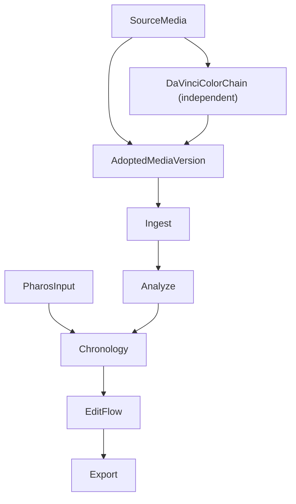
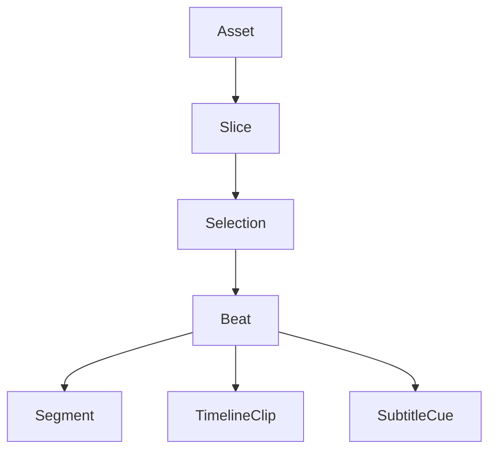

# Kairos — 当前方案总结

> 本文档用于把当前已经稳定的 Kairos 方案收口成一份浓缩入口。
> 它不是新的 ADR，也不替代迭代设计文档；它的职责是先回答“Kairos 现在到底是什么、怎么工作、哪些结论已经稳定”。

## 1. 当前产品形态

Kairos 当前需要区分两层：

- **正式流程定义**：以 `Pharos` 为主输入来源，围绕项目素材、分析结果、脚本编排与时间线落地组织完整工作流
- **当前实现形态**：以 `Node.js core + Agent skill` 作为临时承载形态，已经覆盖正式流程中的多个阶段，但还不等于正式流程的全部实现

在这个前提下，Kairos 当前的正式方案可以概括为：

- 一个以 `KTEP` 为核心协议的后期编排系统
- 一个以 `projects/<projectId>/` 为中心的项目化存储体系
- 一条以 `Pharos -> ingest -> analyze -> chronology -> edit-flow -> export` 为骨架的正式主流程
- `Pharos` 输入当前固定镜像到项目内 `pharos/<trip_id>/plan.json + record.json? + gpx/`
  - 项目初始化当前会直接创建 `projects/<projectId>/pharos/`
  - Console 读取项目配置时会补齐缺失的 `pharos/` 根目录，并在 `/ingest-gps` 明确提示这个固定投放位置
  - Pyxis 对普通事件完成时间的过长二次确认属于 Pharos 上游 UI 防误保护，不改变 `record.json.actual_time` schema；Kairos 仍只消费写入后的实际时间真相
  - Pyxis 非旅行期省电门控属于移动端运行策略，只控制 GPS、GPX、语音与 BLE 自动启动；它不新增 WebDAV/JSON 字段，也不改变 Kairos 的 Pharos 镜像、解析、素材匹配或 chronology 归属逻辑
- 一条与主链解耦的 `DaVinci color` 独立增强链路
  - 当前已经有最小 `/color` 控制面与项目级 `color/` runtime/archive store
  - 当前 `/color` 会自动发现已配置 `rawPath` 的素材根，派生约定命名与阻塞状态
  - 当前 `/color` 已支持同机 vendored Resolve backend 驱动的 color action 链：`prepare_root -> sync_groups -> execute_root -> sync_batch_metadata -> sync_batch_sidecars -> validate_batch -> prepare_all_roots -> export_all_roots`
  - 当前 `/color` 的长期用户配置已收口到 `config/project-brief.json` root mapping 上的最小 `color.renderPreset + color.colorSpaceProfile + color.transformPresetKey`
    - `color.renderPreset` 当前正式使用 `bitrateKbps`（单位 `kb/s`）；不再接受旧的 bitrate 别名字段
    - `color.colorSpaceProfile` 当前正式表示“技术输入类型”，不是 creative look，也不再承载 gamut/primaries 细节
    - workspace 级默认技术预设映射当前正式放在 `config/color-transform-presets.json`
    - workspace 级 LUT 资产当前正式放在 `config/luts/`
  - 当前 `/color` 的页面结构正式收口为 `Root 摘要 -> 当前 Root Hero -> 所有 Root 常驻可编辑配置 -> Groups -> 次级诊断/归档`
  - 当前 `/color` 要求所有 root 的用户可编辑项都直接可见且同页可维护；折叠区只保留只读技术信息和 batch/archive 历史
  - `resolveProjectName / rootNamespace / gradingTimelineName / Group naming` 当前全部按约定生成，只展示，不允许用户配置
    - Resolve Project 名称固定为 `${projectBrief.name} [Color]`
    - root namespace / grading timeline 固定从 root `label` 派生
  - 当前 `color/current.json` 承载 root current truth，`color/groups/<rootId>.json` 承载 formal host group + clip repair snapshot，`color/batches/<batchId>/...` 承载 root-scoped batch archive
  - 当前 DaVinci Resolve scripting 相关知识已落成本地文档 `.ai/knowledge/davinci-resolve-scripting.md`；任何 `/color`、Resolve export、DRX/DRT、LUT、render job、Group、node graph 或 vendored host 变更都必须先读该文档，再按安装版 Resolve `README.txt` 校验版本敏感 API
  - 当前 `prepare_root` 已正式承担 `rawLocalPath -> Resolve root bin / root grading timeline / Resolve Groups` 的真实同步，不再只是轻量容器占位
  - 当前大素材 root 的 `prepare_root` 默认按稳定顺序拆成 50-clip chunks，并限制本机 probe / source-truth / lowlight 并发，避免一次性把整 root 塞进 Node 和 Resolve host 内存；chunk 只作为导入批次，全部追加到同一条 root grading timeline，chunk 进度与可恢复状态写入 `color/current.json`
  - 当前自动 DRP 快照只在 root 全部 chunks 导入完成后生成一次；每个 chunk 后只即时 `SaveProject()`；自动快照默认使用 `latest-only`，只覆盖当前 latest DRP，不新增时间戳归档；其它 Resolve 工程备份交由用户通过 `/color` 的 `覆盖最新 / 归档快照` 手动保存或外部 `.drp` 登记入口完成
    - grading timeline 必须按该 root 的 dominant `(width, height, fps)` 规格创建
    - 自动 Group 只使用创意 / review 标签语义；`log` 是前置分组轴，后续 addon 只在同一 log bucket 内叠加，不跨 log 合并
    - `log` 先读显式 sidecar 真值，再回退 root `color.colorSpaceProfile`
    - 当前每条 clip 在其 `logProfile` 下只选择一个最高优先级 addon：`portrait-review -> lowlight -> colorCastClass -> exposureSceneClass`
    - `portrait-review` 当前由 `orientationStatus=portrait` 产生，用于把竖屏素材在当前 log 下拆出单独 Group 供人工 review；它不改变竖屏 repair/template 或横屏 timeline transform 规则
    - `lowlight` 当前正式由每条 clip 的中点单帧视觉分类产生，是 creative-first 标签，不是 noise-only 诊断
    - `colorCastClass` 当前由便宜的单帧 proxy 数值分类产生：默认取 clip 中点帧；若该 clip 能按 workspace profile/device 或 root `transformPresetKey` 解析到技术 LUT，则先用同路径 `.cube` 做 proxy 技术转换，再排除天空/高饱和/黄橙车头/曝光异常区域并估计中性像素偏移。强冷蓝中性偏移归入 `cool-cyan`，绿青混合中性偏移归入 `green-cyan`，且 `prepare_root` 会对同一 root / 同一 log profile 的连续素材做轻量平滑：夹在多个冷色锚点之间、且指标不冲突的短 clip 会跟随进入同一偏色分桶；已诊断为 `white-reference-underexposed` 的 clip 不参与这种弱连续性提升。它只表示需要单独白平衡/色偏处理的 `cool-cyan / green-cyan / green / warm / mixed` 分桶，不声称色偏原因一定是前挡膜；`neutral / unknown` 不参与分桶以避免 Group 爆炸
    - `exposureSceneClass` 当前由便宜的中点单帧 proxy 数值分类产生，并且必须基于解 log / 技术 LUT 后的 proxy 画面；只有明显 `high-contrast / overexposed / underexposed` 在未命中更高优先级 addon 时才参与分桶，`normal / unknown` 不参与分桶；`high-contrast` 也覆盖逆光/剪影或车内窗外这类高光面积可能较窄但亮暗尾部跨度很大的场景；`overexposed` 保持保守，只覆盖明确剪白或高亮面积/亮度明显偏高的画面，不再把泛洗白路面或高键灰雾画面批量纳入；`underexposed` 也覆盖雪景等低饱和高键白参考区域被压灰且无真实高光尾部的场景，metrics 需保留 `white-reference-underexposed` 诊断原因以及白参考覆盖率、目标 EV 提亮量、提亮后高光余量；该子类保持 `exposureSceneClass=underexposed`，但 Resolve Group addon 使用 `white-reference-underexposed`
    - `gyro` 正式回到 clip repair 维度；它只决定该 clip 的第 1 个 Gyro 节点是否默认/重申开启，不再参与 Group 分桶
    - `gyroEligible` 是显式声明判定：同名 `.gyroflow` 视为用户已准备稳定工程；带 Gyroscope 且型号受支持的 Sony XML sidecar 可开启 Gyro。默认 prepare 不深扫嵌入式私有 telemetry；DJI `dvtm_*` 不扫描、不单独开启 Gyro，也不能用来猜测 log profile
    - 素材技术真值优先级固定为 `显式 sidecar > root fallback`
    - DJI 若没有显式技术输入，正式结果就是 `unknown`，不得强行识别成 `dlog-m`
  - 当前 `prepare_root` 在 Resolve-side mutation 前，还会先做当前 root 的 LUT preflight：
    - 只同步当前 root 实际引用到且 workspace 中存在同路径文件的 LUT
    - 同步源固定为 `config/luts/<relative-path>`
    - 同步目标固定为当前设备 Resolve 默认 LUT 目录
    - 同步策略固定为“只补缺，不覆盖、不删除”
  - 当前默认技术预设是 Group Pre-Clip 的技术底板，不是 creative look：
    - root `color.transformPresetKey` 优先于 workspace profile/device 映射，并直接表示 Resolve LUT 路径
    - `config/color-transform-presets.json` 维护 `profile -> { deviceFamily/default -> Resolve LUT path }`
    - 用户不手写 regex；设备族归一与别名匹配由 Kairos 根据素材 metadata 真值内置处理
    - 当前 round 只支持 LUT preset
    - 仅在 Kairos 新建或空白 Group Pre-Clip 图上自动应用
    - 已有用户 grade 的 Group 必须跳过，不允许被默认底板覆盖
  - 当前 Group 真相完全以 Resolve 为准；`/color` 通过 `sync_groups` 镜像最新现状，同步后的非空 Group 直接进入 `ready`
  - 当前 Resolve-first creative / repair 分层已经收口为：
    - `Group Post-Clip` 是唯一主 creative 真相
    - `Clip` 是固定 repair/local-exception 层，不是主 creative 面
    - `/color` 只准备、镜像并执行这些结构，不把 creative 参数重新搬回 Console
  - 当前 `prepare_root` 还必须把每条可执行视频 clip 规范化到固定 repair 节点图：
    - 当前正式路径只在同 clip 旧 repair 已经是 canonical 时用 Resolve `CopyGrades` 沿用；legacy / brand-new clip 统一从 canonical donor 重建
    - 所有可执行视频 clip 固定布局为 `Gyro -> Dehaze -> User1 -> User2 -> NR`
    - `Gyro` 固定是第 1 节点：每次 `prepare_root` 都必须按最终 `gyroEligible` 布尔判定重申 node1 开关；`gyroEligible=true` 请求开启并进入 `ready-to-load`，`gyroEligible=false` 仍预留但请求关闭并进入 `seeded-disabled`
    - `ready-to-load` 只表示 Gyroflow OFX shell 存在且 Kairos 已请求正确 node 启停；它不是 Gyroflow 已执行 source-specific `Load for current file` 的证据
    - `Dehaze` 固定是第 2 节点且默认禁用
    - `User1 / User2` 是最小用户区，默认开启；用户扩展节点必须放在 `Dehaze` 之后、`NR` 之前
    - `NR` 对所有视频 clip 固定预留在尾部，默认禁用，正式开关入口只有 Resolve
    - `lowlight` 继续是 creative-first 标签，不自动开启 `Dehaze / NR`
    - ZV-E1 / Sony 竖屏素材不禁用 Gyro；Kairos 先从 ffprobe 解析 `rotation/display matrix`，timeline 显示旋转继续按 ffprobe 方向取反，但 Gyroflow 日志方向与 ffprobe 口径相反：源 `rotation=90` 会写 `RotationAngle=-90` 并使用 `config/gyroflow-portrait--90.drt`，源 `rotation=-90/270` 会写 `RotationAngle=90` 并使用 `config/gyroflow-portrait-90.drt`
    - 竖屏方向 DRT 缺失时，素材导入、Group、LUT 和 timeline transform 继续执行，但该 clip 的 Gyro node 不自动开启，并标记 `pending-orientation-template`
    - 竖屏素材在 root grading timeline 上自动写入 `RotationAngle / ZoomX / ZoomY / ZoomGang / Pan / Tilt`，默认旋转并放大填满横屏单 clip 导出；当 Gyroflow/DRT 输出层把竖屏内容落成横屏帧内的小 16:9 画面时，timeline transform 必须额外放大到填满画布
    - 如果已有 prepared root 的 portrait DRT hash 缺失或过期，`prepare_root` 只重跑命中的 chunk，并对 stale portrait clip 先执行 `ResetAllGrades()` 清掉旧 repair/OFX state，再重新应用方向 DRT；prepare 完成后的最终 `sync_groups` 会写回当前 DRT hash，后续 hash 未变时仍按 canonical repair preserve 路径执行
    - 旧非规范 clip 图记为 `legacy-layout`；本轮允许在 workspace `config/default.drt` 存在时破坏性重建到新规范，规范图重跑保留用户区状态与用户手动切换的 Dehaze/NR 状态，但仍会按 `gyroEligible` 重申 Gyro node1 开关；如果 DRT 缺失，bulk prepare 跳过自动 repair seed 并标记 `pending-template`
    - workspace `config/default.drt` 是唯一正式 cold-start / legacy rebuild 来源；`config/default.drx` 不再作为大批量自动 fallback
    - live Resolve 验证显示，干净 DRT donor 路径可以在渲染时触发 Gyroflow source-specific load；当前 DRX 路径只能作为人工诊断材料，不能当成 load 证据
  - 当前 `sync_groups` 已扩展成 group + clip 双层镜像：
    - group 侧至少镜像 `logProfile / orientationStatus / lowlight / colorCastClass / exposureSceneClass / postClipCreativeStatus`
    - clip 侧至少镜像 `gyroEligible / gyroflowStatus / dehazeStatus / nrStatus / clipRepairStatus / layoutStatus / orientationStatus / repairTemplateKey / timelineTransform`
  - 当前 `/color` 进入页面或切换项目时会自动执行 Resolve host preflight，并把结果正式缓存到 `color/current.json.hostPreflight`
  - 当前 `/color` 会把 Resolve 工程同步快照落到项目内 `color/resolve-projects/<safe-project-name>/`；自动快照只在 root prepare 全部 chunks 完成后生成一次且默认只覆盖 `latest.drp`；手动 DRP 保存拆成 `覆盖最新` 与 `归档快照` 两种保存策略，前者只替换 latest，后者写入 `snapshots/<timestamp>...drp` 并刷新 latest；两者都会维护 `color/resolve-project-map.json`；外部 GUI 导出的 `.drp` 可登记为 latest archive entry
  - 当前 `prepare_root / sync_groups / execute_root / prepare_all_roots / export_all_roots` 都先经过 preflight 守卫；宿主 blocked 或 render preset 不受支持时，动作会在 Resolve 变更前直接失败。`sync_batch_metadata / sync_batch_sidecars / validate_batch` 是 Node 侧 batch 后处理/校验动作，不需要 Resolve host preflight
  - 当前成功重跑 `prepare_root` 会清理上一轮 Resolve host 短时崩溃留下的动作级 blocker；`color/current.json.blockingReasons` 不得在 root 已 `synced/ready` 时继续显示旧的 DRT import 等 transient 错误
  - 当前 color host 的正式兼容下限为 `DaVinci Resolve Studio >= 18.5`；低版本 / 非 Studio 是硬阻塞，部分兼容降级则显示为 `degraded`
  - 当前 host retry 只覆盖短时 host/app 故障，不覆盖缺配置、缺素材、render preset 不支持、validation fail 等语义错误
  - 当前 `execute_root` 的正式导出合同已经切到 “root timeline 是真相，batch 只是 clip 子集执行粒度”：
    - root `renderPreset` 是唯一导出配置真相；Group 不再决定 render preset、batch 所属或执行顺序
    - batch 默认覆盖该 root grading timeline 上的全部可执行 clips，但可显式携带 `clipKeys[]` 作为 retry / subset 选择
    - Resolve 宿主按 `rawRelativePath` 父目录分组，为每个目录复制正式 root grading timeline 并修剪到该目录 clips；所有 render jobs 创建成功后才能调用一次 render all
    - 正式输出命名继续收口为 `sourceStem + targetExtension`；宿主必须使用 Resolve File Name = Source Name，不设置 `CustomName` 或 prefix/suffix
    - Windows Resolve 21 + MP4/H.265 固定码率不依赖该平台上不稳定的公开 `VideoQuality` render setting；宿主必须每次从 Kairos root `renderPreset` 生成干净 render preset XML、导入、加载并直接 `ExportRenderPreset(presetName)` 校验 named preset，把 `h264_datarate` 与 `encoder_command_param_map.bitrate` 写成 `root.color.renderPreset.bitrateKbps`，并把 `encoder_command_param_map.rc` 固定为 `CBR`；不得从当前 Deliver 页保存 preset 再 patch，也不得用 `SaveAsNewRenderPreset` 的当前 UI 粘滞状态当校验真相
    - Windows H.265 root 默认走 Intel Quick Sync preset 语义：transient preset 必须写入并校验 `RecordFormatSubType=hvc1_qsv`、`EncodingProfile=Main10` 对应的 `h264_profile=2`、`preset=balance`、`rc=CBR`、`bitrate=<bitrateKbps>`；encoder map 不得再保留质量模式 `quality` 字段；任一项校验失败不得启动 render
    - Windows generated preset 同时必须清空 `RecordPrefix / RecordSuffix / DestSuffix`，保持 `RecordClipUniqueName=false`、`UsePrefixAndSuffixFromSrc=1`、`RecordAllowDupImg=1`，并在 named preset 校验中确认这些 Source Name / duplicate-name 字段；`UsePrefixAndSuffixFromSrc=0` 已 live-test 证明会 queue 成 `00000000.mp4 and more`；Windows Resolve 21 live probe 证明 `RecordAllowDupImg=0` 即使 queue 中 `OutputFilename` 是 source name，也会实际输出到单层 `Event_Version.../<sourceName>.mp4`；`AlternateInFolder` 不是可靠的直出根目录判据，用户手动正确配置可导出为 `AlternateInFolder=1` 仍直出
    - 每个 `AddRenderJob()` 后必须用 `GetRenderJobList()` 校验 `OutputFilename` 已经是本批 Source Name；不匹配时删除该 job 并在 `StartRendering()` 前失败
    - 非 Windows 主机继续走 Resolve 公共 render setting 路径；当 `VideoQuality` 可用时，直接由它承载 `root.color.renderPreset.bitrateKbps`
    - `execute_root` 必须以当前 root `localPath` 为唯一输出 root；项目目录只保存 batch JSON archive，不能承载视频 staging
    - 覆盖已有最终目标前，`/color` 必须先生成最终 `dayX/Cxxxx.ext` 覆盖预览并用 `overwritePlanHash` 锁定确认范围；hash 缺失或变化时不允许启动 Resolve
    - 每个目录级临时时间线直接渲染到最终 `localPath/<relativeDir>/`；Kairos 不创建项目级视频 holding 目录；仅允许把 Resolve 在最终 TargetDir 内生成的单层 `Event_Version...` 临时子目录中的唯一源名文件提升回最终路径
    - 任一 `AddRenderJob()` 失败时不得启动渲染；若 Resolve 输出出现 `V1-0001_C1611.ext` / `C1611_001.ext` 这类前后缀文件名，batch 直接失败
  - 当前 `execute_root` 成功后只写 render manifest，不再自动修复 metadata、同步 sidecar 或触发 validation：
    - `latestBatchStatus = rendered`
    - `latestValidationStatus = pending`
    - `manifest.metadataRepair.status = pending`
    - `manifest.managedSidecarSet = []`
  - 当前 `sync_batch_metadata` 是显式后处理动作：按指定或 latest batch 对最终输出做 metadata normalize，使用受限 ffmpeg 并发并写入文件级进度，更新 `manifest.metadataRepair` 与 `entries[].outputMetadataSnapshot`
  - 当前 `sync_batch_sidecars` 是显式后处理动作：只复制同 basename 的 `.srt/.wav/.flac/.m4a/.aac/.mp3`，更新 `entries[].sidecars` 与 `managedSidecarSet`；`.xml/.gyroflow` 不作为导出 sidecar
  - 当前后处理动作允许从 `plan.json + 已存在最终输出` 恢复缺失的 `manifest.json`；只有所有计划输出都已存在时才允许恢复，否则仍视为 render batch 失败并要求重跑 `execute_root`
  - 当前 `validate_batch` 已扩展为写入 summary 统计、top-level blockingReasons 和 warning-only 诊断，供 `/color` 直接显示 validation 失败原因
    - 源有 `capturedAt / GPS` 但 metadata 尚未同步时是硬阻塞，提示先运行 `sync_batch_metadata`
    - 源目录存在应同步 sidecar 但 manifest/输出缺失时是硬阻塞，提示先运行 `sync_batch_sidecars`
    - `.xml/.gyroflow` 不参与 sidecar validation
  - 当前 `promote_batch` 已退出正式导出链；视频在 `execute_root` 渲染成功后成为 rendered batch，metadata / sidecar / validation 由用户在 `/color` 手动触发
  - 当前 `/color` 还正式提供项目级批处理入口：
    - `Prepare All Roots`：按当前 read model 的 enabled root priority 顺序依次执行 `prepare_root`
    - `Export All Roots`：按同一顺序依次执行 `execute_root`，每个 root 只完成 render all、最终 replace 和 manifest 记录；metadata / sidecar / validation 后处理由用户逐 root 手动触发
    - 项目级动作遇到单个 root 失败时继续后续 roots，但只要存在失败 root，整个 job 最终仍记为 failed
  - 当前 `/color` 继续保持单页，但已正式消费 `color/batches/<batchId>/plan|manifest|validation` 归档，并按 root 展示可折叠的 `Host Diagnostics / Recent Batches / Validation Failures`
  - 当前 Resolve 宿主路线已经冻结并落地为“同机 vendored Resolve backend（`vendor/resolve-color-host/` + fixed `.venv`）”，不再把 MCP 作为 color 主线
- 一组运行在 Agent 环境中的工作流技能，以及面向不同 NLE / 导出目标的适配层

这意味着：

- Kairos 不把 NLE 当作主数据中心，而把它们视为执行器或导出目标
- 当前的 `Node.js core + Agent skill` 是对正式流程的临时承载形态，而不是正式流程本身的唯一边界
- 仓库根目录的 `AGENTS.md` 是当前 agent 启动时的统一引导入口，用来收口必读文档、rules、skills 和正式运行入口
- 本地运行与任务编排当前已收口到 `Supervisor + React console (apps/kairos-console/)`
- 只要改动影响正式本地运行入口、Supervisor API、`/analyze`、`/style`、`/color` 或 `apps/kairos-console/`，验证就必须同时包含根仓 `pnpm build` 与 `npm --prefix apps/kairos-console run build`
- 根仓 `pnpm build` 不能被视为已经覆盖 React console 产物；前端 bundle 必须显式重建
- `素材分析` 与 `风格分析` 在当前控制台里直接以主路由展示监控，而不是再跳一次独立监控入口
- `DaVinci color` 当前也已有独立主路由 `/color`，并已收口为最小 `renderPreset` 配置（含 `bitrateKbps` / `kb/s`）+ root/project 级 deterministic 控制面 + runtime/archive 状态面；正式顺序为 `Prepare Root -> Sync Groups -> Execute Root -> Validate`，并补充 `Prepare All Roots / Export All Roots`
- `/color` 当前还会主动暴露宿主诊断与 batch 归档，而不是把宿主问题和 validation 历史藏在动作失败或磁盘 JSON 里
- 剪辑规则、风格来源配置与风格分析参考产物当前已收口为 **Workspace 级共享资产**，但职责已经拆开：
  - `config/edit-rules/*.md`：人工维护的正式 `剪辑规则` 库，也是唯一规则正文来源；规则列表由 markdown frontmatter / 文件名扫描得到
  - 项目 / edit unit 只保存 `editRuleCategory`；代码不再从 `config/edit-rules.json` 读取规则正文或派生结构
  - `edits/<editId>/planning/flow-plan.json`：LLM 基于规则 markdown、项目上下文和 capability registry 生成的显式执行计划，人工确认后才允许执行其中声明的 capability step
  - `config/styles/`
  - `config/style-sources.json`
  - `analysis/reference-transcripts/`
  - `analysis/style-references/`
  - `config/style-sources.json` 是当前唯一正式 style-reference 索引；`config/styles/*.md` 是 profile 正文，不再维护独立 `catalog.json`
- Workspace 风格档案当前升级为 `layered-v1` 分层档案：
  - 每个 `styleCategory` 仍对应一个 `config/styles/{category}.md`，front matter 必须带 `styleProfileVersion: layered-v1`
  - 正文固定分为 `literary`（文学 / 旁白字幕表达）、`artistic`（影像气质 / 审美母题）与 `editingTechnical`（剪辑节奏 / 镜头语法 / 素材角色）三层
  - 正文必须抽象为“风格生成法则”，不能复述参考视频内容；`literary` 分析旁白写法机制，`artistic` 分析审美母题 / 情绪光谱 / 空间时间观，`editingTechnical` 分析可迁移剪辑技法
  - 样本地名、事件、人物和单次遭遇只能作为 `evidenceNotes` 或短例证，不能成为 layer summary 或章节主体；reviewer 必须阻塞复述型草稿
  - 风格分析不生成正式剪辑规则；三层内容默认只是 evidence-backed observation / soft preference
  - 只有剪辑规则自由正文经 Codex Agent 结构化写入 confirmed `flow-plan.json.styleUsage` 后，Edit Flow capability 才允许读取对应层；`hard` 约束只能来自剪辑规则或 confirmed Flow Plan 的显式提升
  - 如果剪辑规则要求使用风格层而 `/edit` 未选择 `styleCategory`，或选择的是旧的 legacy 非分层 profile，Edit Flow 必须阻塞并提示重跑 `/style`
- `scripts/kairos-supervisor.* start` 只启动 `Supervisor + React console`，不会顺带拉起 ML，也不会自动恢复旧 job
- `projects/<projectId>/.tmp/media-analyze/progress.json` 与 `<workspaceRoot>/.tmp/style-analysis/{category}/progress.json` 都只是 durable progress cache，不等于 live job
- Kairos 官方管理的 ML-backed 顶层流程在结束态必须回收到 `ML stopped`；`spatial-refresh / chronology-build` 是 no-ML deterministic job，`span-rebuild` 会进入 ML lifecycle 调用本地 qwen 文本 LM，但不重跑 VLM / ASR
- workspace `style-analysis` 当前正式收口为 deterministic prep：
  - `health-check -> clip -> probe -> shot-detect -> transcribe -> keyframes -> vlm -> video-complete -> awaiting_agent|completed`
  - prep job 负责把 reference transcript、per-video report 与 workspace progress 正式落盘
  - `/style` 默认不再盲目回到 `defaultCategory`；应优先落到“当前最相关”的分类：显式 `categoryId` -> live job -> 最近完成 job -> 最近 cached progress -> `defaultCategory` -> 第一个分类
  - `/style` monitor 不应只显示粗阶段；当前视频、`keyframes` 抽帧进度、`vlm` 识别进度和视频队列摘要都属于正式可见运行态
  - 最终 `config/styles/{category}.md` 继续由 Agent 基于这些 prep 产物写成，但当前正式要求已经改成 clean-context subagent 流水线：
    - deterministic prep 额外写 `analysis/style-references/{category}/agent-summary.json`
    - `style-profile-synthesizer` 只读取 packetized summary，先产出包含三层的 `style-draft.json`
    - `style-profile-reviewer` 只读取 summary + draft，写 `style-review.json`
    - reviewer blockers 当前是最终 style profile 的硬闸门；缺层、证据不足却强断言、或把 `editingTechnical` 冒充新剪辑规则都必须阻塞
    - 正式执行后端必须使用宿主提供的真实 clean-context Agent/SubAgent 链；官方路径不允许外接 `ILlmClient`
- 未来如果引入桌面 UI 或更多 provider / adapter，应建立在这套协议与项目模型上，而不是推翻它
- 某些项目会直接消费调色后的素材版本而非原始素材；因此主链面向的是“当前采用的素材版本”，而不是固定绑定“永远使用原始素材”
- `project-brief` 的路径映射块当前可选带 `原始路径` 与有序 `备选路径N / 原始路径N`
  - `project-brief.json` 是路径单真值；运行时直接从 `path -> 备选路径N` 与 `rawPath -> 原始路径N` 中选择当前可读目录
  - `device-media-maps.local.json` 已退出正式配置与缓存路径
  - 若解析后的 `rawLocalPath` 位于当前素材目录内部，主链 ingest 会显式排除该子树，避免 raw 与当前输出被一起纳入正式扫描

## 1.1 当前变更纪律

凡是需求、行为、接口、工作流、正式入口或用户路径变更，当前正式顺序固定为：

1. 先进入 `Plan` 模式；如果宿主没有显式 `Plan mode`，先产出结构化计划并确认
2. 计划确认后，先更新相关设计文档
3. 再开始实现
4. 实现完成后，回查并同步受影响的设计文档、rules 和 skills

如果变更影响正式入口、监控页、工作流主路径或用户操作方式，还必须同步更新：

- `README.md`
- `AGENTS.md`
- `designs/current-solution-summary.md`
- `designs/architecture.md`

## 1.2 2026-04-08 语义协议切换

当前主链已经开始从旧的 `slice + 五轴语义 + 单阶段 arrangement` 切到新的 model-driven arrangement 准备链：

- Analyze 的正式素材单元现在优先叫 `span`
- 项目内正式持久化路径已切到 `store/spans.json`
- `analysis/asset-reports/*.json` 是 Analyze 的完整事实真相；`store/spans.json` 与 `media/chronology.json` 是可丢弃、可重建的派生索引
- Analyze 不再自动生成 `store/spans.json` 或 `media/chronology.json`；它只维护 `analysis/asset-reports/*.json`
- `/chronology` 是 downstream truth materialize + review 页：先显式运行 `span-rebuild` span-builder 生成候选 stripped spans，并通过本地 qwen 文本 LM 按 8 个 candidate span 一批生成 provisional 中文 `materialPatterns[]`；LM 返回 ordered pattern rows，代码按 chunk 顺序写回并做 slot 校验，但不再裁决 speech drop、visual-only 或口播时间收缩。Analyze 必须为 keep 的非音频素材产出视觉描述，`span-rebuild` 遇到缺失 report 或缺失 `visualObservation` 必须失败而不是补猜；新 fine-scan report 要让 `fineScanWindows[]` 保存来源 `interestingWindow` 血统和 speech/mixed 窗口的裁剪 transcript truth，`span-rebuild` 优先消费这些窗口自带事实；旧 report 只在 fine-scan window 缺 `semanticKind`、自身或来源证据为 `speech-window` 且与 report transcriptSegments 重叠时保守恢复 speech truth；明确 `semanticKind=visual` 的窗口即使 transcript overlap 也不自动转 speech。如果存在 speech/mixed candidate span，span-builder 写 `store/spans.json` 后把 meta 标为 `pending-speech-review`，并写 `.tmp/chronology/speech-window-agent-handoff.md`，提示用户去 Codex/Agent 启用 SubAgents 做最终 speech-window 裁切并写回 fresh spans；speech-window review SubAgent shard 上限约 1500 candidates，主 Agent 合并所有 shard 后才写最终文件；再运行 `chronology-build` 生成 / 刷新 Chronology V2。页面必须显示 active job 进度，`span-rebuild` 进度写入 `.tmp/chronology/progress.json`，包含 chunk、失败列表补处理、retry/warning 摘要；已完成部分和 failed span 列表写入 `.tmp/chronology/span-rebuild.partial.json`；`chronology-build` 还必须显示 GPS reverse-geocode 地名解析进度
- `store/spans.meta.json` 记录 `schemaVersion/status/generatedAt/inputsHash/assetCount/reportCount/spanCount/warnings`，并在需要时记录 `speechReview.status / candidateCount / handoffPath / updatedAt`；`pending-speech-review` 表示 Agent speech-window review 尚未完成，Chronology 与 Edit Flow capability 只接受 `status=fresh` 的 spans
- `media/chronology.json` 当前正式升级为 Chronology V2 项目级编年史文档：`schemaVersion: "2.0"`，顶层包含 `status / inputsHash / assetIndex / events`
- Chronology V2 的正式事件只暴露 `event / route / gap`、确认状态、时间地点、路线和 `spanIds`；不得持久化 `origin / source / pharosRefs / assetIds / confidence / materialChannels / speechAnchors`
- `/chronology` UI 展示与日期筛选必须按项目 Pharos trip 的 `timezone` 格式化 `startAt/endAt`；缺少有效 trip timezone 时才回退浏览器时区。磁盘上的 Chronology V2 仍保存 ISO 时间真值，不为显示改写数据
- Pharos 只作为生成输入进入编年史；生成后必须折叠成普通 `event / route / gap`，下游不得感知某事件来自 Pharos
- `chronology-build` 当前采用 Pharos 单点优先：span 与 `expected / unexpected` 且非 `continuous` 的 `actualTimeStart/actualTimeEnd` 存在有意义重叠时可直接归入该 Pharos 单点事件；多个 Pharos point window 同时覆盖同一 span 时，先按 `actual_captures[]` 显式拍摄类型/设备排序，仍同分时优先更窄的 actual window；Pharos 单点事件是 route 硬边界，`continuous` 只作为 route 时间 / summary 上下文，不把多个事件间 route 强行合并，且其 route prose 不得写入 `event.location / route.from / route.to`
- Pharos 单点事件来自人工行程事实，生成后默认 `reviewStatus=confirmed`；无素材命中的 Pharos `gap` 仍默认 `pending`
- 项目级 `chronology-build` 写入 `media/chronology.json` 必须使用 GPS reverse-geocode service；显式无 service、cache/provider miss 或任一 route/event GPS anchor 反查失败时直接失败并保留既有 chronology，不允许回退到素材标签、`materialPatterns`、manual itinerary 或 Pharos continuous route prose
- 未直接命中 Pharos 单点的 span 按 chronology 顺序连续聚合：优先使用 Pharos trip GPX、项目 `gps/merged.json`、`gps/derived.json`、report 中的 `pharos|gpx|derived-track` 坐标，最后才用 embedded GPS 兜底；单 span 起止 `<=200m` 视作静态候选，相邻代表点 `<=400m` 可合并为同一地点事件；移动中的非 route 观察可在相邻时间间隔 `<=5min` 且两点间速度连续合理时合并为同一 event；跨长时间间隔、跨不连续轨迹或跨 Pharos 单点事件不全局合并；`route` 只由结构化 `drive` 素材和 route cluster 的短间隔伴随片段产生，不能由 `materialPatterns / visualObservation / transcript` 的关键词触发；反查地名、标题和素材语义只用于显示与摘要，不参与 event/route 聚合判定。普通非 Pharos 照片是附属素材：不参与一阶 event/route 切分，不单独生成 event；照片先按时间范围优先挂到 route，剩余照片再按时间最近挂到普通 event 的 `spanIds`
- `assetIndex[]` 只保留 `assetId / sortCapturedAt` 作为兼容索引；`sortCapturedAt` 必须等于对应 `asset.capturedAt`，事件关联素材必须永远从 `spanIds -> spans -> assetId` 反查
- `interestingWindows[]` 继续表示细扫前计划，只保存候选窗口、编辑边界、reason、稳定 `windowId` 和可选语义；它不是细扫结果，speed 决策不再进入 span 生成流程
- `fineScanWindows[]` 是细扫后窗口结果，保存 recognized/dropped 状态、窗口时间、来源 `sourceInterestingWindowIds / sourceWindowReason`、帧引用与一句 `visualObservation`；speech/mixed 窗口还保存裁剪后的 `transcript / transcriptSegments / speechCoverage`，visual 窗口不得因 transcript overlap 自动继承 speech truth；recognized 窗口缺视觉描述属于 Analyze/fine-scan 失败
- `span` 当前正式承载脚本/时间线消费索引：
  - `materialPatterns: string[]`
  - `visualObservation?: string`
  - 素材事实字段，例如 source/edit 时间窗、transcript、transcriptSegments、speechCoverage
- 新生成的 span 只由 `store/assets.json + analysis/asset-reports/*.json` 生成；不得读取 Pharos context、GPS cache 或 chronology；所有 keep 的非音频素材必须已有 report，所有派生 material span 必须已有 `visualObservation`；本地 qwen 文本 LM 只接收 span 级 `type / semanticKind / transcript / transcriptSegments / visualObservation`，返回 ordered `materialPatterns`；代码严格校验 materialPatterns 前四个槽，但不再让 Supervisor 本地 qwen 决定 speech keep/drop、visual-only 转换或口播时间裁切。第 1 项是素材自身可观察的拍摄视角/构图形态，不得重复 `type` 的照片/视频载体语义，也不得写“建场/记录/成果”等后续剪辑用途；任一必需槽缺失或冲突都进入 failed span 列表并在主 chunk 后单条补处理，补处理仍不合格则阻塞本次 rebuild，不做启发式改写或兼容映射
- 素材主键使用 `materialIdPolicyVersion=human-source-v1`：root 配置必须有稳定 `rootCode`；`asset.id` 是短 source locator，例如 `C0506_zve1_day1`；`span.id` 在 asset id 后追加 type、可选 semanticKind 与整数秒 source range，例如 `C0506_zve1_day1_drive_speech_s0-7`，照片 span 为 `<assetId>_photo`。`analysis/asset-reports/<assetId>.json`、analysis checkpoints、chronology、material-slots 与 timeline manifest 都消费这些可读主键；旧 UUID 或 `asset__` / `span__` 前缀式 Flow Plan 必须 stale 后重建。
- 新生成的 span 不持久化 `speedCandidate / pharosRefs / grounding / spatialEvidence / location / routeRole / chronology event` 字段；旧 spans 可临时读取兼容，但下一次 `span-rebuild` 必须写成 stripped spans
- `materialPatterns` 是 span-builder 阶段由 LM 从候选 span 文本事实生成的中文脚本可消费短语数组，不再是 `{ phrase, confidence, evidenceRefs }` 对象数组；prompt 要求每个 candidate span 正好 7 项。前四项固定为 `拍摄视角/构图形态 / 当前环境 / 天气光线 / 口播语音`，其中视角使用受控词表、环境为提取短语、天气光线只写可观察自然现象、口播语音只写 provisional `有口播语音 / 无口播语音`；最终 speech 裁切、drop、visual-only 和 slot4 修正由后置 Codex Agent/SubAgent 负责。第 5 项是 LLM 给出的短情景故事或 `情景不明`，第 6-7 项是 LLM 给出的短 factual free tags；代码只校验，不把旧词或冲突词启发式替换成新词；`labels`、`report.summary`、GPS / 时间 / Pharos 归属不得写入或传入生成上下文
- `span` 不再持久化旧五轴语义树：`narrativeFunctions / shotGrammar / viewpointRoles / subjectStates / span.evidence`
- `span-rebuild` 只写 `store/spans.json` 与 `store/spans.meta.json`，不写 chronology；如果本地文本 LM 不可用则失败且不改写 spans；`chronology-build` 必须先确认 spans fresh，再从 corrected assets + spans + Pharos context 生成 `media/chronology.json`
- `spatial-refresh` 只刷新已有 asset reports 的空间字段，并标记 spans / chronology stale；它不自动重建 downstream indexes
- 若 fine-scan report 缺少完整 `fineScanWindows[]`，重建必须失败并提示重新 Analyze/fine-scan；不使用旧 `store/spans.json` 或空 recognized window 兜底
- 对 `source-speech` 而言，`store/spans.json` 当前不做 6000ms 口播聚类；候选窗口只合并同 asset、同 semanticKind、重叠或间隔 `<=250ms` 的近重复窗口，随后 `span-rebuild` 可按可用口播 segment 收缩单 span、转 visual-only 或 drop
  - 细粒度语音边界与停顿继续保留在 `transcriptSegments`
  - 行车口播是否进入 route 由 chronology 生成处理，不由 span 决定
- 项目级正式词集当前只保留一层，并挂到 `project-brief`：
  - `材料模式短语`
- Edit Flow 当前正式链路为：
- `Analyze -> Chronology Review -> Edit Unit Initialization -> Codex Agent Flow Artifacts -> Export`
- Edit Flow 以 `status=confirmed` 的 Chronology V2 进入；旧数组 v1 或未确认 V2 必须阻塞并要求回到 `/chronology`，fresh spans / assets / asset reports 只在具体 capability 的 `inputRefs` 声明时阻塞，`trip.event_table` 只消费 `media/chronology.json`
- `edits/<editId>/config/edit-unit.json` 是一个剪辑单元的初始化真相，保存 `editId / editRuleCategory / styleCategory`
- `config/edit-rules/*.md` 是用户维护的流程定义入口；Codex Agent 不得为适配 Flow Plan、skill、schema 或测试自动改写规则内容，规则与系统合同冲突时只能标记产物 stale、阻塞或请求用户确认规则变更；`edits/<editId>/planning/flow-plan.json` 是 Codex Agent 维护的执行计划真相；capability registry 是可执行原子库，不是固定阶段链
- 当前 Flow Plan 使用 `plannerPolicyVersion=codex-agent-v1`、`materialIdPolicyVersion=human-source-v1` 和 `materialTimePolicyVersion=normalized-captured-at-v1`；旧 policy、旧素材主键或旧时间语义生成的 confirmed plan 必须 stale 后由 Codex Agent 重新生成
- `/edit` 只负责 Edit Unit 初始化和只读审查，不提供生成 Flow、确认 Flow、运行 step、运行下一步或确认 gate 的按钮；Supervisor 不再提供 `edit-flow` job 或 `/edit-flow/confirm` 写入口
- `trip.event_table` / `material.archive` 是可选能力，只在剪辑规则明确要求独立事件表、行程表、素材档案、素材库文档或单独人工审查产物时出现；`edit.framework` 可直接声明 chronology / spans / assets 作为输入
- `edit.framework` 是剪辑 handoff，不是证据索引：`全片章节` 只做宏观概览，`分段操作稿` 是唯一可执行 FW beat 边界，不再输出单独 `beat 边界索引`；全文不得出现 chronology/event/route/gap/span/asset id，`spans` 列必须写可审查的类型数量与视频语音拆分，`叙事` 只写客观画面/声音总结；系统合同不规定固定的素材召回提示章节名，是否输出额外 handoff 区块只由用户维护的剪辑规则决定
- `script.generate` 只有在 confirmed Flow Plan 明确需要前置文本稿 / beat 稿时才出现；旅行纪录片规则默认不强制它
- `material.recall` 只输出 `material-slots.json`；`segment-plan.json` 不再是正式输出或下游输入；素材事实输入固定为 `edit-framework.md + store/spans.json + store/assets.json`，人工规则输入来自 confirmed Flow Plan 当前 step context / notes；真实 span 时间由修正后的 `asset.capturedAt + sourceInMs/sourceOutMs` 计算，不消费完整 chronology 或 asset reports
- `timeline.generate` 是 deterministic Resolve rough-cut 创建步骤，不得要求 `edits/<editId>/script/current.json` 或 `segment-plan.json`
- 每个 capability 的输出由 `outputRefs` 决定；`timeline.generate` 的正式输出是 Resolve timeline，并同时写 `.tmp/edit-flow/<editId>/timeline/current.srt` 作为手动导入达芬奇的原声字幕；`.tmp/edit-flow/<editId>/timeline/current.json` 只作为本机临时 KTEP/manifest 审计文件
- Edit Flow selection 当前开始优先传递 `spanId`；`sliceId` 只作为兼容字段继续存在一段时间

## 2. 正式主流程

```mermaid
flowchart TD
  pharos[PharosInput]
  sourceMedia[SourceMedia]
  colorChain["DaVinciColorChain (independent)"]
  adoptedMedia[AdoptedMediaVersion]
  ingest[Ingest]
  analyze[Analyze]
  chronology[Chronology]
  editFlow[EditFlow]
  exportFlow[Export]

  sourceMedia --> adoptedMedia
  sourceMedia --> colorChain
  colorChain --> adoptedMedia
  adoptedMedia --> ingest
  ingest --> analyze
  pharos --> chronology
  analyze --> chronology
  chronology --> editFlow
  editFlow --> exportFlow
```

这里的正式关系是：

- `Pharos` 是正式流程的主输入之一，主要驱动编年史生成、Edit Flow 规划、拍摄语义和素材对齐
- `Pharos` 当前不再通过用户填写外部路径接入；每个项目固定扫描 `projects/<projectId>/pharos/`
- 如果项目迁移后缺少这个目录，Console 当前应先自动补齐，再向用户展示固定目录和投放提示
- `project-brief.md` 中的 `## Pharos` 当前只承担 trip 筛选语义；未填写时默认纳入全部可解析 trip，填写 `包含 Trip：...` 时只消费这些 trip
- `Pharos` 解析当前属于 Ingest / GPS 刷新阶段：`analysis/pharos-context.json` 保存项目内 `pharos/` 输入 fingerprint 与 parser version，`plan.json / record.json / gpx/*.gpx`、trip 筛选或 parser 语义变化时必须自动重建；Analyze 不隐式补跑 Pharos 解析
- planned shot 的素材归属当前正式拆成独立时间层：`chronology-build` 只按 `record.json` 的 `actual_time` 处理 Pharos 直接归属，只有 `expected / unexpected` 且有完整 actual time 的非 `continuous` 记录可直接吃掉存在有意义时间重叠的 span；多个单点事件时间窗重叠时，只使用 `record.json.actual_captures[]` 等显式拍摄类型/设备字段作归属优先级，仍同分时优先更窄的 actual window，不从描述、地点或 note 文本猜测“航拍/上空”等语义；`continuous` 记录只提供 route 上下文，`pending / abandoned` 与 `plan` 的 planned time segment 不参与直接归属，shot GPS 字段不参与时间归属
- planned shot 的空间真值当前正式拆成独立 GPX 层：无论 `drive` 还是单机位 shot，都只使用 trip `gpx/*.gpx` 按素材/span 时间反算位置；`plan.gps / gps_start / gps_end / actual_gps` 仅保留人读语义
- Pharos 上游协议 hash 不匹配时，Kairos 必须先完成协议同步：重读当前 `../Pharos/designs`、同步设计文档 / rules / skills / 代码影响、刷新 `.ai/pharos-protocol-baseline.json` 并验证匹配后，才继续普通 Pharos 实现
- `AdoptedMediaVersion` 表示项目当前采用的素材版本，它可以是原始素材，也可以是独立调色链路产出的版本
- `DaVinciColorChain` 是独立链路，不属于主链中的固定顺序步骤
- 如果项目没有 `Pharos`，主链允许退化为基于素材、brief、行程和分析结果的兼容路径，但这属于 fallback，而不是正式主定义
- `/chronology` 是 Analyze 与 Edit Flow 之间的正式审查页：它承载时空真相刷新、事件确认/驳回、轻编辑、合并和拆分；空间刷新入口应逐步从 `/analyze` 收口到这里

### Ingest

- 通过逻辑素材源导入项目当前采用的素材版本
- 真实本机目录路径不写死进项目，而是通过设备本地映射维护
- 保留素材真值，例如 `capturedAt`、`rawTags`、基础 metadata
- 对本次成功扫描到的 root，Ingest 是当前目录镜像同步而不是只追加：同一 root 中扫描不到的旧资产必须从 `store/assets.json` 与后续 chronology 中移除；未挂载 / missing root 的既有资产保持不动
- 每个 root 可声明 `captureTimePolicy`：`auto` 为默认；`manual-required` 用于延时导出等容器时间不可信的目录，并可通过 `requiredKinds` 限定 `video / photo`
- `manual-required` 命中的素材如果没有单素材 `manual` capture time override，Ingest 必须生成“素材时间校正” blocker 并阻止 Analyze；这类 blocker 要求用户显式填写正确日期和正确时间，不能从当前文件时间或建议日期自动视为已解决
- 项目内跨设备时钟漂移当前正式收口为 root 级配置，而不是继续让 timeline 末端猜顺序：
  - `config/project-brief.json` 对应 mapping 的 `clockOffsetMs?` 表示该素材 root 在当前项目内的统一时钟偏移，但只在 Ingest / 迁移写入资产时应用
  - 单素材 `captureTimeOverrides` 继续存在，并直接写成最终 `asset.capturedAt`，不再额外叠加 root offset
  - `store/assets.json` 的 `asset.capturedAt` 是正式素材排序与召回时间真值；`rawCapturedAt` / metadata 只用于审计原始解析时间
  - `media/chronology.json` 的 `assetIndex[].sortCapturedAt` 只是兼容镜像，生成时等于对应 `asset.capturedAt`
- 对同目录同 basename 的保护音轨 sidecar，当前正式策略是作为视频资产上的 `protectionAudio` 绑定信息记录，而不是重新放开通用独立音频 ingest
- 如果输入素材来自独立调色/转换链路，该链路必须先保证关键元信息被保留下来

### Analyze

- 当前正式策略是“粗扫优先 + 自动细扫”
- 当前 Analyze 的稳定执行顺序已经是：
  - 有音轨视频：`coarse-scan -> audio-analysis -> finalize -> deferred scene detect(if needed)`
  - 无音轨视频：`coarse-scan -> finalize -> deferred scene detect(if needed)`
  - `scene detect` 不再是所有视频的 unconditional coarse 前置税，而是只在最终确实需要 shot 结构时延后触发
 - `finalize` 当前会把每次 unified VLM 原始输出落到 `projects/<projectId>/.tmp/media-analyze/finalize-attempts/<assetId>/attempt-*.json`
 - 如果 unified `finalize` 返回 invalid JSON，Analyze 不再立即判整轮失败，而是自动按更高 token 预算重试；当前预算序列为 `512 -> 768 -> 1152`
 - `finalize` prompt 当前会明确要求 `decision_reasons` 保持短列表，避免模型在长枚举里把 JSON 截断
- `coarse-scan` 当前已经切到素材级动态并发：
  - 同一素材在 coarse 阶段最多只允许一个关键帧抽取 `ffmpeg`
  - 多条素材可根据 free memory 目标并发数并行推进
- 视频内音轨的 ASR 已进入正式分析链路，而不再只是附属信息
- `transcript / transcriptSegments / speechCoverage / placeHints / inferredGps` 都属于分析层结果
- `asset report.clipTypeGuess` 当前表示 finalize 后的语义结论；视频素材的正式 `visualSummary + decision` 只在 `finalize` 单次 unified VLM 中产出，前置阶段只保留 cheap planning inputs
- Analyze 现在按素材分阶段持久化可恢复状态：
  - `analysis/prepared-assets/<assetId>.json` 保存 coarse prepared checkpoint（keyframes / `hasAudioTrack` / source context 等输入）
  - `analysis/audio-checkpoints/<assetId>.json` 保存 selected transcript / transcript source / audio health / protection routing 中间态
  - `analysis/asset-reports/<assetId>.json` 用 `fineScanCompletedAt / fineScanSliceCount` 标记细扫完成态
- `/chronology` 当前提供轻量空间刷新入口，对应 Supervisor `spatial-refresh` deterministic job：
  - 先刷新项目 GPX merged cache、`gps/derived.json` 与 `analysis/pharos-context.json`
  - 只重算已有 `analysis/asset-reports/*.json` 的 `gpsSummary / inferredGps / pharosMatches / locationText` 等空间字段
  - 标记 `store/spans.meta.json` 与 `media/chronology.json` stale，要求随后显式运行 `span-rebuild` 与 `chronology-build`
  - 不启动 ML，不抽帧，不转写，不生成缺失 report；没有 report 的素材仍需要正式 Analyze
- 如果只修正 `analysis/pharos-context.json` 内的 Pharos shot 执行语义（例如 parser version 升级后新增 `actual_captures[]`），且不需要重算 asset reports 或 span 内容，可直接运行 `chronology-build`；该路径不得标记 spans stale，也不得要求重新生成 `materialPatterns[]`
- `audio-analysis` 当前已经切到两级素材队列：
  - 本地 health / routing 队列负责 embedded 与 protection 的轻量健康检查
  - ASR 队列只对最终选中的一路音轨转写，并按 free memory 目标并发数动态扩缩
- 当前默认 ASR 质量目标已经切到跨平台一致：
  - Apple Silicon 继续使用 `mlx-whisper / whisper-large-v3-turbo`
  - Windows + CUDA 与 CPU fallback 当前优先使用完整可用的本地 `faster-whisper / large-v3`（CTranslate2）checkpoint，默认目标从 `turbo` 切回完整 `large-v3`
  - 默认口径不再让 Windows 以较弱 `small` 档或 `turbo` 档换速度，优先保证中文转写质量
- Analyze 当前正式把项目级 ASR caller 固定为中文优先：
  - `/asr` 请求默认传 `language='zh'`
  - TS 侧会在 refined transcript segmentation 之后，把 Han 文本统一归一为简体中文
  - 英文、数字和其他脚本保持原样，不做 LLM 改写
- 非 MLX 路径当前不允许在正式 `/asr` 请求里隐式卡住等待远端模型下载：
  - 如果 `large-v3` 的本地 CTranslate2 checkpoint 或完整 HF cache 已可用，本轮就用它
  - 如果当前只发现不完整 cache，Kairos 应直接回退到完整可用的本地 Whisper checkpoint，而不是把 Analyze 卡死
- ASR 当前在 Apple Silicon / MLX 与 `faster-whisper` 路径都会请求词级时间戳，避免继续把 TS 细分建立在粗 segment 猜测上
- Kairos 在 TS 侧统一重建更细的 `transcriptSegments`：
  - 有 `words` 时按词级停顿、标点与长度约束细分
  - 没有 `words` 时按 segment 文本的标点与长度做保守细分
- `report.transcriptSegments` 当前正式表示 refined transcript segmentation，而不是直接照搬后端的粗 segment
- `report.transcript`、`report.transcriptSegments`、source-speech span transcript 与 subtitle 输入当前统一使用简体归一后的文本
- 如果视频绑定了 `protectionAudio`，Analyze 当前会先做双健康检查再选边：
  - `alignment === mismatch` 时强制保留 embedded
  - protection 缺失、不可访问或健康检查失败时回退 embedded
  - protection 只有在健康分数明显更优时才会成为正式 transcript 来源
- 一旦选择了 protection，它就不再只是 finalize prompt 的辅助信号，而会直接覆盖正式 `report.transcriptSegments`
- ML server 当前会在 `VLM` 和 `Whisper` 之间互斥卸载，避免两套模型同时常驻显存
- Analyze 当前在 `audio-analysis -> finalize` 交接时也遵守这条互斥规则：进入 `VLM` 前必须先卸载 `Whisper`，不再为了单素材热路径保留双驻留
- 当前 VLM 默认模型已切到 `Qwen3.5-9B`：
  - Apple Silicon / MLX 本地优先目录：`models/Qwen3.5-9B-MLX-8bit`
  - Apple Silicon / MLX 无本地目录时的默认 ID：`mlx-community/Qwen3.5-9B-MLX-8bit`
  - Apple Silicon / MLX 仍保留旧本地目录 `models/Qwen3-VL-4B-Instruct-8bit` 作为 fallback，避免未下载新模型的机器直接不可用
  - transformers 本地优先目录：`models/Qwen3_5-9B`
  - transformers 无本地目录时的默认 ID：`Qwen/Qwen3.5-9B`
- ML server 当前的 ASR 也已经收口成显式队列：
  - 非 MLX backend 继续共享 admission/queue 语义，并在同一常驻 `faster-whisper` 模型上顺序完成活跃素材的正式转写
  - MLX backend 共享 admission/queue 语义，但保持单推理通道，不做真实 multi-audio batch
- `retry / resume` 后的 ETA 当前按阶段重置，并且在当前阶段完成样本少于 `3` 条时不显示，避免沿用上一轮进度口径后产生夸张倒计时
- `interestingWindows` 不再只有单一语义：
  - `startMs / endMs` 保留“为什么这里重要”的 focus/evidence window
  - `editStartMs / editEndMs` 表示更适合后续编排消费的 edit-friendly bounds
- `talking-head` 当前有 audio-led window strategy，会优先把连续 speech windows 收口成更适合原声消费的窗口，而不是继续沿用宽泛视觉窗口
- `drive` 类素材当前正式保留 `speech` 与 `visual` 两条语义支路：
  - `interestingWindows` / slices 可携带 `semanticKind`
  - `speech` path 面向 transcript / source speech
  - `visual` path 面向景色 summary 与 edit-friendly bounds
  - 两类窗口不再默认 merge 成同一种“有语音就等于可直接剪原声”的窗口
- speed 策略不再进入 span 生成流程；如果需要加速，后续单独流程或显式 `beat.actions.speed` 负责
- `locationText` 当前正式改为“由最终选中的 GPS 坐标反查得到的地点名”：
  - 中国境内坐标优先 Amap，境外优先 Geoapify
  - cache key 固定为 `lng,lat` 各保留 `6` 位小数
  - 地点字符串格式对齐 `../Nostos/tools/scan-tool/geocode.ts` 的 balanced location 规则，优先行政区 + 镇街 + 最近 AOI/POI
  - 如果素材/span 命中了 planned `Pharos shot`，`locationText` 的 Pharos 空间候选只允许来自 trip GPX 的按时取点，而不是 shot 自带 GPS
  - `drive` 使用素材/span 的首尾时刻各取一个 GPX 点做反查；同地收口为一个地点，不同地点写成 `A -> B`
  - 非 `drive` 使用素材/span 的中间时刻 GPX 点做反查；没有命中有效 GPX 点时，再回落到当前空间优先级选中的单点 GPS
  - Chronology V2 的 route 端点使用 route 自身 `startAt/endAt` 反查，普通非 Pharos event 使用 event midpoint 反查；`Pharos continuous.location` 和 manual-itinerary route prose 只允许进入上下文 / summary，不允许冒充地点字段
  - `chronology-build` 读取 `gps/reverse-geocode-cache.json` 并对未缓存 provider 请求串行限速；用于 chronology 的地名解析结果参与 inputs hash
  - manual-itinerary / route-stage 文本继续留在 `summary`、decision reasons、`routeRole` 等字段，不再冒充 `locationText`
  - 若未配置 `amapWebServiceKey / geoapifyApiKey` 或反查失败，`locationText` 保持空

### Edit Flow

- `/edit` 是 Chronology 之后的正式剪辑入口；新工作不再经过固定 `/script -> /timeline` 阶段链。
- 用户从 Workspace 剪辑规则库选择 `editRuleCategory`，可选一个 layered `styleCategory`；`/edit` 只保存 `edits/<editId>/config/edit-unit.json` 并只读展示既有产物。
- Codex Agent 是规则解释和 Agent/SubAgent 执行的唯一正式主体：它读取 raw markdown、capability registry、project brief、Pharos / chronology / analysis 可用性摘要，生成并维护 `flow-plan.json` 与后续产物。
- `edits/<editId>/planning/flow-plan.json` 必须是 `plannerPolicyVersion=codex-agent-v1`、edit-rule hash 匹配且 confirmed，才允许下游 step 被信任。
- 每个 step 只按 `capabilityId / inputRefs / outputRefs / gate / execution / notes` 执行；代码不得关键词解析规则 markdown 来推断 chronology、素材权重、默认章节或结构禁区。
- 剪辑规则中适用于某个 capability 的人工规则必须由 Codex Agent 写入对应 Flow Plan step `notes`；Agent/SubAgent packet 必须注入当前 step context，confirmed step notes 高于 skill 通用口径和 agent 启发式。
- `execution` 可表达 SubAgent 粒度和连续天阈值打包：例如 `shardBy=day` 搭配 `shardPacking={base:"day", metric:"chronologyEventCount"|"materialRefCount", maxPerShard, preserveOrder:true}`。
- 所有 Edit Flow `sharded-agent` 都必须写入 `codexSubagentProfile={reasoningEffort:"high", forkContext:false, speed:"standard"}`，执行时由 confirmed Flow Plan step 直接启动 Codex SubAgent，不 fork 当前长上下文，只传有界 step/shard 上下文。
- step 轻量执行记录写入 `edits/<editId>/runs/current.json`，每条 record 记录 `stepId / capabilityId / status / inputSnapshot / outputPaths / review / error`；不得把完整 KTEP、timeline clip 列表、Resolve clip 明细、源字幕正文或 `hostSummary.clips` 内联进 `current.json`，完整审计必须写到 capability 自己的 declared/temporary artifact。`timeline.generate` 的 clip 级审计只属于 `.tmp/edit-flow/<editId>/timeline/current.json`，源语音字幕只属于 `.tmp/edit-flow/<editId>/timeline/current.srt` 等 timeline artifact。不再默认创建 `runs/<runId>/record.json` 子目录。需要历史归档时另写 archive，UI 和正式进度读取 current state。
- `trip.event_table` 只消费 confirmed `media/chronology.json`，但不再是默认 planning 前置；素材级 spans / assets 由 `edit.framework` 或 `material.recall` 按各自 `inputRefs` 精确消费；Resolve 素材同步由 `resolve.media_sync` 独立负责。
- `edit.framework` 的人工审查输出必须以 `全片章节 + 分段操作稿 + 缺口 + 人工审查点` 为核心结构；`分段操作稿` 是给后续素材召回的唯一可执行 FW beat handoff，每行必须有稳定 FW beat id。不得另写 `beat 边界索引`，全文不得泄漏 chronology/event/route/gap/span/asset id；额外 handoff 区块只在用户维护的剪辑规则明确要求时输出，系统合同不预设固定标题。
- 当前 capability registry v1 是固定注册表，而不是从某个规则样例反推：
  - `pharos.parse`
  - `trip.event_table`
  - `material.archive`
  - `edit.framework`
  - `material.recall`
  - `script.generate`
  - `resolve.media_sync`
  - `timeline.generate`
  - `resolve.lock_rough_cut`
  - `postlock.subtitle_narration`
- registry 中的 capability 都是可选原子；Flow Plan 不应因为 registry 里存在 `trip.event_table` 或 `material.archive` 就默认生成这些 planning markdown。
- `script.generate` 是可选 capability，只在剪辑规则明确要求前置文本稿 / beat 稿时出现；它不是旅行纪录片规则的强制步骤。
- `material.recall` 的正式输出只有 `edits/<editId>/script/material-slots.json`；`segment-plan.json` 不再是正式产物，也不能作为下游输入；素材事实只消费 `edit-framework.md + store/spans.json + store/assets.json`，人工规则只消费 Flow Plan 当前 step context / notes，不消费完整 chronology 或 asset reports。
- `material-slots.json` 是素材召回与粗剪建议的唯一结构化产物：按 FW/segment 分组，每个 slot 保留 `chosenSpanIds` 作为选择真相；`treatments` 是稀疏覆盖表，缺少 `treatments[spanId]`、`audio` 或 `speed` 时按默认 `{audio:0,speed:1}` 读取，只有静音、非 0dB 增益或非 1 倍速才写字段。生成和合并阶段必须把 `speed` 写成 `1..5` 的整数倍；如果上游临时输出给出小数或超过 `5x`，下游读取会规整到该范围，而不是把规划流程直接打失败。`mixed`、`audio:*`、`speed:*` 或自然语言解析式建议不得进入正式字段。
- `resolve.media_sync` 是 deterministic runner，从 confirmed chronology / fresh spans / assets / root path 映射把事件素材同步进达芬奇 Media Pool；chronology 在这里仅用于 Resolve Media Pool bin 组织和工程归档，不是 `material.recall` 的语义接口；不新增 `media-archive.json`，达芬奇 Media Pool 本身是素材归档真相。重复运行必须复用已有 MediaPoolItem：事件目录一致则跳过，事件目录变化则只移动到新目录不重导入，并在同步结束后清理空事件目录；run record 只记录 imported / reused / moved / pruned 摘要。
- `/edit` 还提供项目级 Resolve `[Edit]` 工程维护动作：用户可手动触发素材路径重链，后端按 `project-brief` root 的当前可读路径与 primary/alternate 候选生成映射，Resolve host 精确加载现有 `${projectBrief.name} [Edit]`，核对 `Kairos Project Media` 与目标 edit timeline 后调用 `RelinkClips` 并 `SaveProject()`；该动作只返回重链/未映射/不可读/缺失目标/跳过非文件/旧路径剩余等摘要，不自动导出 DRP，也不属于 Flow Plan step 执行。Resolve compound/timeline 等非文件 item 不参与重链，缺失本机目标只作为 warning，不阻塞其它可重链素材。
- `timeline.generate` 是 deterministic runner，从 `edit-framework.md + material-slots.json + store/spans.json + store/assets.json + confirmed media/chronology.json` 读取输入，不要求 `script/current.json` 或 `segment-plan.json`，并只按 `material-slots` 的选择和顺序从已同步的 Resolve Media Pool 落位；chronology 只用于 Resolve path/bin/context 映射，不得改变 chosen spans。
- `timeline.generate` 必须通过 Resolve host 创建/更新粗剪 timeline；Resolve 成功后写 `.tmp/edit-flow/<editId>/timeline/current.json` 本机临时 KTEP/manifest 审计，并从已选中、实际有声的 source-speech spans 生成 `.tmp/edit-flow/<editId>/timeline/current.srt`，供用户手动导入达芬奇。被选中且实际有声的 speech/mixed 非照片 clip 在落 Resolve 前默认扩展 source handle：头部 `240ms`、尾部 `720ms`，并 clamp 到素材时长；SRT 仍按 transcriptSegments 的真实时间映射到扩展后的 clip 内部。照片默认是 `1000ms` 静帧，只有剪辑规则 / confirmed Flow Plan 或运行时 `timelineStillDurationMs` 显式声明时才改变；非静音视频 clip 及其 linked audio clip 会被设置为 Resolve clip color `Orange`，作为用户在 Edit/Fairlight Timeline Index 中筛选后手动执行音频归一化的正式标记。Resolve 不可用、Media Pool 缺素材、source range 回读校验失败、非静音 clip color 无法写入或图片 still duration 不匹配时不能作为 KTEP-only 成功兜底。
- `timeline.generate` 成功后自动尝试导出项目级 Resolve `[Edit]` 工程 DRP，默认保存策略为 `latest-only`，只覆盖 `edits/resolve-projects/<safe-project-key>/<Resolve项目名>.drp`；所有 editId 共享同一 Resolve 工程和 `edits/resolve-project-map.json`。用户手动保存剪辑 DRP 时可选择 `覆盖最新` 或 `归档快照`，只有归档模式会额外写 `edits/resolve-projects/<safe-project-key>/snapshots/<timestamp>...drp`。自动快照失败只写 `drpSnapshotWarning` / run warning，不回滚已生成 timeline。
- `postlock.subtitle_narration` 的旁白框架阶段必须以当前 Resolve timeline 的字幕轨为口播边界真相，并以 clip-level packet 为唯一时间线事实源：`.tmp/edit-flow/<editId>/postlock/current-timeline-clip-packet.json` 不能预先按 day/event/route/type 合并或丢失 clip 边界。正式正文使用剪辑规则附录的 Markdown pack-list v2：顶层是 `口播 pack / 行车 pack / 航拍 pack / 照片序列 / 延时 / 延时序列 / 普通视觉` 等叙事单元，`整体` 或 `摘要` 写 pack 级理解，`clips` 保留 leaf clip 描述；行车 / 开车无口播 clip 可以在正文中按相邻连续关系形成 pack，航拍 clip 可以按相邻相关关系形成 pack，照片序列和同编年史事件的延时序列可以合并为一个顶层条目。clip-map 是轻量 v2 边界索引，只允许写 `schemaVersion / format / sourcePacket / entries / packs`；`entries[]` 只存 `marker + clips` 并覆盖所有 Resolve video clip，`packs[]` 只存 `title + entries`，不得复制 packet 中可反查的 `assetIds / spanIds / previousClipIds / summary` 等事实。普通无字幕非照片 clip 在 leaf 层只能归属一次，pack 只作为写作组织和后续字幕审查上下文。无字幕视觉事实只来自 `visualObservation`：生成器不得使用 `materialPatterns` 生成、分类或兜底视觉描述；`semanticKind=speech/mixed` 但当前 Resolve clip 无字幕时，先按当前 item 实际 source range 匹配同 asset 的重叠 visual span，其次匹配 `<=15s` 最近 visual span，最后才使用当前 speech/mixed span 自带 `visualObservation`。无字幕视觉 / 航拍 / 延时正文必须贴近剪辑规则附录，用场景 / 动作短句交代路线、事件和画面推进关系，不得把 `visualObservation` 压缩成 `雨后湿滑、高速路面、道路延伸、车流穿行` 这类逗号标签串。口播 pack 必须从当前字幕内容提炼短摘要，不能只写地点 / 事件 + `口播`，不能粘贴字幕全文，也不能泄漏 `口播信息待人工复核` / `待人工复核` 这类内部占位。口播 clip 只有相邻、时间连续且字幕表达连续或同一话题时才可合并；允许合并时须在 packet 中留下显式 merge group 证据，跨事件边界不能只因字幕片段重叠就合并。正式写入 `edits/<editId>/postlock/narration-framework.md` 前必须生成 `edits/<editId>/postlock/narration-framework.clip-map.json` 并通过 `node scripts/validate-postlock-narration-framework.mjs projects/<projectId> <editId>`，失败不得写成功或 awaiting-review run record。
- `postlock.subtitle_narration` 的最终字幕审查稿 `edits/<editId>/postlock/subtitle-review.md` 只有在 `narration-framework.md` 经人工确认后才可生成；输出必须是三列 markdown 表格：`对应旁白框架条目（若合并写多个） / 事件和GPS位置信息 / 生成旁白字幕`。审查稿必须参考 Flow Plan 授权的 `styleUsage.literary` 风格档案，并参考当前 Resolve timeline 每个 clip 或 clip 序列组的真实时长；连续相邻的行车或航拍视频可以先聚类判断整体动机，再按 CLIP 分开编写，首尾 CLIP 可承上启下并参考前后口播但不得覆盖已有口播字幕。照片和照片序列均不生成字幕；若保留对应行，`生成旁白字幕` 必须写 `不生成字幕`。被聚类且标记为 `开车` 的片段必须结合位置、路线 / 道路名推断与前置视觉分析景观事实来写，无法确定时写 `位置待确认`，不得编造。
- Resolve Media Pool 的项目全局 `Kairos Project Media` bin 由 `resolve.media_sync` 按 chronology event title 同步，避免 spanId/assetId 一级分组污染人工审查，也避免按 editId 重复归档素材；粗剪 timeline 固定放在 `Kairos Timelines` bin。粗剪创建只走 Resolve 原生 API（当前为 `MediaPool.AppendToTimeline`），不走 FCPXML。当前 `speed > 1` 仅作为待办请求保留，不应用到 Resolve 粗剪；`audio <= -100` 的视频素材保留 linked audio item 并禁用该 audio item，照片可无 audio item。`audio > -100` 的视频 clip 及其 linked audio clip 设置为 `Orange` clip color，便于用户在 Edit/Fairlight Timeline Index 批量选择并执行 Resolve 内建音频归一化。非 `0 dB` clip gain 必须由 host live probe `TimelineItem.GetProperty()` 并验证可写属性，不能猜 `Volume` key。
- `resolve.lock_rough_cut` 只表示人工审查并锁定已经生成的 Resolve rough-cut timeline，不负责创建 timeline。
- capability runner 可以复用旧 script/timeline 内部脚本、clean-context Agent stage 或确定性工具，但这些实现必须挂到 registry，而不是藏在固定阶段代码里。
- `KTEP 2.0` 当前正式把 source-speech beat 升级为双通道：
  - `audioSelections[]` 负责原声音频锚点与 timing truth
  - `visualSelections[]` 负责同拍内必须保留的陪衬视觉证据
  - 旧的 beat 级 `selections[]` 不再是正式协议；需要通过 Edit Flow 重新生成相关 capability outputs
- 如果某拍最终保留原声，Edit Flow 的 KTEP/subtitle capability 会先按 `audioSelections[]` 构建 merged audio units，而不是破坏性重写整拍画面选择
- `source-speech` 当前正式以“过滤后的口语 transcript cues + merged audio units”作为边界真值：
  - 相邻 spoken gaps `<= 3000ms` 且不存在强句末边界时，默认合并成同一个 audio unit
  - merged unit 默认保留前 `120ms`、后 `180ms` breathing，并严格 clamp 到可用 source range
  - 导航播报、录制口令、设备提示不再参与 audio unit，也不再进入 source-speech 字幕
  - 时间线当前应优先信任 Analyze 产出的 refined transcript segments；只有单条 cue 仍然过长时，才允许二次硬切
  - 当仍需拆长 cue 时，时间码应按 cue 长度 / 语速加权映射，而不是整段平均切分
  - `spans.json` 不应为同一段 source-speech material 机械保留多条近邻小 span；Analyze 应优先合并附近 speech spans，把真正的语音细节留在 `transcriptSegments`

### Timeline / Export

- `timeline.generate` 围绕 Resolve rough-cut timeline 展开；`KTEP` 只保留为 `.tmp/edit-flow/<editId>/timeline/current.json` manifest / audit，源语音 SRT 只保留为 `.tmp/edit-flow/<editId>/timeline/current.srt` 供手动导入达芬奇。
- `timeline.generate` 不再调用 segment-cut refiner/reviewer，不写 `timeline/rough-cut-base.json`、`timeline/segment-cuts/`、`timeline/reviews/` 或 `timeline/agent-pipeline.json` 作为正式内部门槛。
- deterministic placement 只按 `material-slots.json` 中的 FW/slot/chosenSpanIds 顺序落位；route 只使用被召回的 chosen spans，不整体铺开。
- `material-slots.json.treatments` 是静音/加速唯一正式覆盖来源：缺省读取为 `audio=0,speed=1`，因此默认有声正常速 span 不需要写 entry；被选中的非照片 span 只要有 transcript、transcriptSegments、`semanticKind=speech/mixed` 或 `materialPatterns=有口播语音` 就禁止写或解析出 `audio<=-100`，这个保护覆盖 `drive / broll / aerial / timelapse / talking-head`，不以 `talking-head` 为边界；`coverageAudit` 负责暴露未选入的 speech-backed 非照片 span，但代码不得把它们盲目追加进主粗剪时间线，扩召回应回到 `material.recall` 的选择逻辑与人工审查；无口播行车/航拍可由 treatment 显式静音/整数倍加速，且 `speed` 必须在 `1..5` 内；照片默认仍由素材召回写 `{audio:-100}`，时长由 timeline 规则处理。
- `resolve.media_sync` 会先按 chronology event title 同步项目全局 `Kairos Project Media` media pool bin；这是 Resolve 工程归档组织，不参与 `material.recall` 语义判断。达芬奇 Media Pool 是素材归档真相，重复运行应复用或移动已有 MediaPoolItem，不清空 namespace、不重导入；如果事件分类子目录一致则跳过，若不一致则移动到新目录，最后清理空事件目录。`timeline.generate` 的 Resolve timeline 固定放在 `Kairos Timelines`。
- `timeline.generate` 再从已同步 Media Pool 读取素材，用 Resolve 原生 `AppendToTimeline` 创建/替换粗剪 timeline；静音视频通过禁用 linked audio item 实现，有声 speech/mixed 非照片 clip 默认保留 `240ms` 头部和 `720ms` 尾部 source handle，所有非静音视频 clip 及其 linked audio clip 会设置 Resolve clip color `Orange`，作为用户在 Edit/Fairlight Timeline Index 中筛选后手动执行音频归一化的正式标记。Resolve host 成功创建/更新粗剪 timeline 且 source range / still duration / 非静音 clip color 回读校验通过后才写临时 `.tmp/edit-flow/<editId>/timeline/current.json` 审计，并从有声 source-speech clip 的 `transcriptSegments` 映射出 `.tmp/edit-flow/<editId>/timeline/current.srt`；没有分段时才用整段 `transcript` 兜底。Resolve 不可用、Media Pool 缺素材、原生 append/静音失败、source range 错误、图片时长不匹配、非静音 clip color 无法写入或非 0 dB clip gain 无法 live probe 设置时直接阻塞。当前 `speed>1` 不阻塞，但会被忽略并记录为 pending。
- 字幕当前分为粗剪伴随 SRT 与 post-lock 文本路径：
  - 粗剪伴随路径：`timeline.generate` 从已选中、实际有声的 source-speech spans 写 `.tmp/edit-flow/<editId>/timeline/current.srt`，供手动导入达芬奇
  - post-lock 旁白路径：默认来自 `beat.text`
  - post-lock 原声路径：当某拍保留原声时，来自 `beat.audioSelections[]` 对应的 merged audio units
- 旁白路径已支持显式 `beat.utterances[]`，可以在一个 beat 内表达多段配音与头部 / 中间 / 尾部停顿；字幕只覆盖有声岛，不再默认铺满整个 beat
- `preserveNatSound / muteSource` 是脚本层的显式覆盖信号；未显式标注时，时间线层当前默认只要 `audioSelections[]` 有可用 `transcriptSegments` / `speechCoverage`，就优先保留原声
- source-speech 当前正式落成“单视频轨串剪 + 独立 `dialogue` 音频轨”：
  - `visualSelections[]` 在单条视频轨上顺排，不做双视频轨 overlay
  - `audioSelections[]` 生成独立 `dialogue` 音频 clip，`nat` 音轨只保留给 protection/ambient fallback
- 当视频资产已绑定保护音轨，且 Analyze 的保守推荐明确偏向 `protection` 时，时间线会把对应原声 clip 路由到 `nat` 或 `dialogue` fallback，不再依赖视频主轨直接承载原声
- 当前字幕时长已不再是简单平均分配，而是会参考说话速度和标点停顿做节奏估算
- 当 beat 走 source speech 时，字幕现在会先做文本清洗，再按短分句切 cue；若某个 cue 明显噪声化、重复化或清洗后仍不可读，会只跳过该 cue，而不是让整拍静默；若整段都不可读，则保留原声但不再回退到 `beat.text`
- 最终可听的 `dialogue` / `nat` clip 当前会在导出编排层做非破坏性响度归一化，目标 `-16 LUFS`，并以 `audioGainDb` 记录 clip gain
- 当前时间线不再把“短 source + 长 beat”当成默认慢放来源：
  - 对带 `editSourceInMs / editSourceOutMs` 的新 slice，时间线优先使用 edit-friendly bounds
  - 只有旧 slice / 旧 selection 缺少 edit bounds 时，才保留 legacy fallback stretch
- 时间线当前新增 chronology guardrail：
  - 对主轴明确偏时间/路程推进的风格，placement 会优先保持 beat 内和 beat 间的 corrected `asset.capturedAt` 单调递增
  - placement 会先尝试同段内安全重排；若仍无法恢复合法顺序，则拒绝静默生成错序时间线
  - chronology guard、beat 排序与 selection 排序当前都必须统一读取 `media/chronology.json`，不再允许 timeline 私自回退到原始 `asset.capturedAt`
- 如果确实需要速度蒙太奇，当前正式路径仍可显式填写 `beat.actions.speed`
- `IKtepScriptAction.speed` 当前的正式语义是“请求加速”，只有 `drive / aerial` clip 会实际消费；混合 beat 中其他类型 clip 会强制保持 `1x`
- 时间线不再从 Analyze/span 的 `speedCandidate` 自动加速；silent `drive / aerial` 需要加速时必须有显式 `actions.speed` 或后续独立速度流程产物
- deterministic timeline 不再有段级 Agent reviewer；召回回退、跨段换料、非 `drive/aerial` 加速、dropped asset 进入召回、有 speech truth 的非照片 span 被静音，以及需要静音的照片/素材未写 treatment 覆盖等问题由 `material-slots` contract 和 timeline build 前置校验直接阻塞。
- `timeline.generate` 当前默认按 span 的自然 source 时长 / edit-friendly bounds 摆放 clip；有声 speech/mixed 非照片 clip 会在 source 边界外再加默认 head/tail handle（`240ms` / `720ms`，受素材边界约束），避免口播被硬切到 transcript 末帧。`speed` 来自 `material-slots.json.treatments` 覆盖值，缺省为 `1`；读取时会把 raw speed 规整为 `1..5` 的整数倍。
- 照片不作为预算容器；除非剪辑规则 / confirmed Flow Plan 或运行时 `timelineStillDurationMs` 明确声明，`timeline.generate` 默认按 `1000ms` 处理照片静帧。Resolve 原生脚本 API 没有稳定 still-duration setter，host 只能在 append 后回读校验；若 Resolve 当前偏好导致实际静帧不等于有效 Kairos 时长，必须阻塞而不是静默接受。
- photo-only beat 当前默认不生成字幕；没有可用原声的视频 beat 允许尽可能用旁白完整组织
- 时间线 / 草稿输出规格已收口为项目级运行时配置：`timelineWidth / timelineHeight / timelineFps`，默认值为 `3840x2160 @ 30fps`
- Resolve host 失败时，Timeline 当前必须明确阻塞；不能静默退回 KTEP-only assembly。
- 当某拍不走 source speech 时，时间线会把命中的带音轨视频 clip 标记为静音意图；导出到 Jianying 时会落成静音视频片段
- 剪映导出不再走外部 `jianying-mcp` / 独立 `Jianying Server` 路线，而是由 Node 侧调用 vendored `pyJianYingDraft` 本地 CLI
- 当前剪映 backend 会直写 `draft_info.json` / `draft_meta_info.json`，并补齐本地素材注册元数据
- 剪映导出当前正式遵循“两段式新目录导出”：
  - 先在 `projects/<projectId>/adapters/jianying-staging/<draftName>` 生成项目内 staging 草稿
  - staging 成功后，再复制到真实 `jianyingDraftRoot/<draftName>`
  - 两侧目录都必须是全新目录，禁止覆盖、清空或删除已有草稿目录
- 对带 `speed` 的剪映导出，当前适配层会做 backend compatibility normalization，修正 `pyJianYingDraft` 的微秒级重算偏差，但不会回写正式 Resolve rough cut 或 locked rough-cut 记录
- Resolve、剪映或其他导出目标都应建立在同一套正式时间线语义之上

## 3. 协议与数据骨架

### KTEP 是正式交换协议

- 协议名：`kairos.timeline`
- 当前版本：`1.0`
- Zod schema 与协议校验器共同定义正式数据边界

### 核心对象关系

```mermaid
flowchart TD
  asset[Asset]
  slice[Slice]
  selection[Selection]
  beat[Beat]
  segment[Segment]
  timeline[TimelineClip]
  subtitle[SubtitleCue]

  asset --> slice
  slice --> selection
  selection --> beat
  beat --> segment
  beat --> timeline
  beat --> subtitle
```

### 当前正式语义

- `asset`：素材真值层，保存原始资产事实
- `slice`：分析后得到的候选时间窗，同时可带两层时间语义
  - `sourceInMs / sourceOutMs`：focus / evidence window
  - `editSourceInMs / editSourceOutMs`：edit-friendly bounds
- `selection`：脚本 / 时间线真正使用的子区间
- `beat`：当前正式的最小编排单元
- `segment`：叙事层面的段落容器

关键结论：

- `slice` 不承诺整段都会被用到
- `selection` 才决定到底使用 `slice` 里的哪几秒；如果没有显式再裁，默认应优先落在 Analyze 给出的 edit-friendly bounds 上
- `beat` 统一承接文案、画面选择、字幕和时间线编排
- `segment.narration` 若存在，应理解为 beat 级文本的聚合预览，而不是时间线摆放的唯一真源

## 4. 项目布局与存储边界

### 项目目录

当前正式项目模型围绕 `projects/<projectId>/` 展开，主要包括：

- `config/`：逻辑素材源、运行时配置、人工 itinerary，以及项目级结构化配置
- `store/`：项目元数据与清单
- `analysis/`：资产分析报告，以及 Analyze 的 durable resume cache（如 `prepared-assets/`、`audio-checkpoints/`）
- `edits/`、`timeline/`、`subtitles/`、`adapters/`：edit-unit 计划、能力运行记录、时间线与适配器状态
- `gps/`：项目级外部轨迹资源与归一化缓存
- `pharos/`：项目内固定 `Pharos` 镜像目录，按 `trip_id` 分子目录；解析后的共享快照写入 `analysis/pharos-context.json`
- `.tmp/`：流水线临时产物、进度、代理音频、关键帧等可清理内容

另外还有一组 **Workspace 级共享资产**，不属于单个项目目录：

- `config/edit-rules/`：正式剪辑规则库
- `config/edit-rules/*.md`：正式剪辑规则库，frontmatter / 文件名即分类发现来源
- `config/styles/`：正式风格档案库
- `config/style-sources.json`：风格来源配置
- `analysis/reference-transcripts/`：风格分析的参考转写
- `analysis/style-references/`：逐参考视频分析结果与分类汇总

### 三类边界

- 项目内正式产物：可同步、可复用、可作为正式输入继续流转
- 路径候选解析：`project-brief` 的主路径与备选路径直接解析当前设备可读目录，不再维护单独 device map 文件
- 临时产物：`.tmp/`，默认不属于 `Canonical Project Store`
- 可恢复中间态：`analysis/prepared-assets/` 与 `analysis/audio-checkpoints/` 用于跨进程恢复 Analyze；它们是 durable resume cache，不是 Edit Flow 的正式输入，且在 stage 语义调整后允许安全失效并重建

### 当前稳定约定

- `config/project-brief.json` 保存项目级素材 root 单真值，包括主路径、原始路径和有序备选路径
- `config/project-brief.md` 是路径映射的人类镜像；进入 Ingest / Analyze / Export / Color 前直接从这些路径候选解析当前可读目录
- `/ingest-gps` 当前正式用结构化 `素材 Root` 编辑器维护这些路径映射，并在保存时写入 `config/project-brief.json` 后回写 `config/project-brief.md`
- `/ingest-gps` 当前也是正式 Ingest / GPS 刷新入口：保存配置只保存事实，不自动扫描大目录；`运行 Ingest` 才触发 Supervisor `ingest` job 并刷新 `store/assets.json / gps/derived.json / analysis/pharos-context.json`，既有 spans / chronology 随之过期但不自动重建
- `/ingest-gps` 的 `刷新 GPS 缓存` 触发 Supervisor `gps-refresh` job，刷新项目级 GPX merged cache、`gps/derived.json` 与 `analysis/pharos-context.json`，不重新扫描素材
- `/analyze` 不隐式补跑 ingest；它只消费既有 `store/assets.json`、项目 GPX / `gps/derived.json` 与 Pharos context，也不生成 spans / chronology
- `/chronology` 的 `spatial-refresh` 触发 `spatial-refresh` job，用于在已有 Analyze 产物存在时轻量刷新 report 空间层并标记 spans / chronology stale；新增 `.SRT`、FlightRecord、素材 root 或 capture-time 修正仍必须先走 Ingest
- `config/project-brief.json`、`config/manual-itinerary.json`、`edits/<editId>/planning/flow-plan.json`、`edits/<editId>/runs/` 与 `config/review-queue.json` 是当前项目级 Console 结构化事实源
- 拍摄时间修正的 canonical 输入只在 `config/manual-itinerary.json.captureTimeOverrides` / `config/manual-itinerary.md` 末尾“素材时间校正”区；`review-queue.json` 不再镜像或反写 `capture-time-correction`
- `edits/<editId>/planning/`、`edits/<editId>/runs/` 与 capability-owned output directories 是正式剪辑层；新 Edit Flow 不再使用 root-level `script/`、`timeline/`、`subtitles/` 作为正式入口
- `edits/resolve-project-map.json` 与 `edits/resolve-projects/<safe-project-key>/` 是剪辑侧项目级 Resolve `[Edit]` 工程 DRP 备份 truth；它不随 editId 拆分，latest 文件名保留 Resolve 项目名并只替换文件系统非法字符；DRP 保存策略分为 `latest-only` 与 `archive`，前者只覆盖 latest，后者额外进入 `snapshots/`。剪辑工程素材路径重链只保存 Resolve 工程本体，不写该 DRP map。
- `config/style-sources.json` 是当前 **Workspace 级** Console 结构化事实源
- `config/edit-rules/*.md` 是当前 **Workspace 级** 剪辑规则事实源；`edits/<editId>/planning/flow-plan.json` 是每个 edit unit 的已确认执行计划
- `project-brief` 的每个 root block 允许额外声明 `飞行记录路径`，作为该素材根目录对应的 DJI FlightRecord 日志入口；实际识别不依赖强文件名，而是以文件头/可解析性为准
- `config/runtime.json` 是项目级运行时配置入口
- 如果需要解密 DJI v13/v14 FlightRecord，`config/runtime.json` 可提供 `djiOpenAPIKey`
- `config/styles/` 保存 **Workspace 级** 文案 / 艺术风格参考；这些档案不再承担粗剪结构规则
- `gps/tracks/*.gpx` 与 `gps/merged.json` 是当前项目级外部轨迹资源入口
- `gps/same-source/tracks/*.gpx` 与 `gps/same-source/index.json` 是 dense same-source GPS 的项目内缓存入口，仅用于内部索引 / 惰性查找
- `gps/derived.json` 是项目级 `project-derived-track` 缓存，统一收口 embedded-derived 与 manual-itinerary-derived 的弱空间来源
- 主链消费的是项目当前采用的素材版本，而不是强制要求原始素材始终在线

### 当前运行与控制面

- 本地运行时当前由 `Supervisor` 承载，Dashboard 默认在 `127.0.0.1:8940`，ML 默认在 `127.0.0.1:8910`
- `apps/kairos-console/` 是当前正式 React 控制台，采用“工作流优先”的顶层路由：
  - `/`
  - `/ingest-gps`
  - `/analyze`
  - `/chronology`
  - `/style`
  - `/edit`
  - `/timeline-export`
  - `/project`
- `Analyze`、`Chronology` 与 `Style` 当前都直接在主路由展示监控内容：
  - `/analyze` 直接展示 Analyze monitor
  - `/chronology` 直接展示 span-rebuild / chronology-build / spatial-refresh 与 Chronology V2 审查
  - `/style` 直接展示 Workspace 风格库与当前分类的 Style monitor
- `/ingest-gps` 当前直接展示 Ingest / GPS job 控制面；active job 与最近结果必须来自 Supervisor job truth，不能从 stale config 或 progress cache 推断
- Console 刷新时，默认项目选择优先跟随最新的 active project-scoped job；只有当前没有活跃项目 job 时，才回落到本地记住的上次选择
- 如果多个项目共用同一个 `project.name`，项目选择器必须直接显示 `projectId`，避免把 monitor / progress 请求落到错误项目
- 旧 `/analyze/monitor` 与 `/style/monitor/:categoryId?` 只保留为兼容跳转
- 旧静态进度页脚本只保留兼容 / 调试用途，新的正式监控能力应优先落在 `Supervisor + React console` 这条链路
- React Analyze monitor 现在已经直接承认多阶段并发语义：
  - `coarse-scan` 展示素材级 worker、checkpoint 数和活跃素材
  - `audio-analysis` 展示 local queue、ASR queue、活跃 worker 和排队数
  - `fine-scan` 继续展示 `已预抽 / 已识别 / ready queue / active workers`
  - hero 区不再把并发阶段误写成单一“当前素材”
- `scripts/kairos-supervisor.* start` 当前只负责拉起 `Supervisor + React console`，不会自动启动 ML，也不会自动恢复或重放旧 job；需要继续分析时，必须显式重新发起对应 job
- `projects/<projectId>/.tmp/media-analyze/progress.json` 是 durable progress cache，不等于“当前一定有 live analyze job 在跑”；运维判断必须至少同时核对：
  - `Supervisor` job 里是否存在 `running analyze`；若处于 `/chronology`，则核查 `running spatial-refresh / span-rebuild / chronology-build`
  - `progress.json` 的 `LastWriteTime / updatedAt` 是否仍在推进
  - 对 `analyze`，GPU / ML 是否出现与当前阶段一致的活跃迹象；对 `spatial-refresh / chronology-build`，不应期待 Kairos ML service 活动；`span-rebuild` 的 provisional materialPatterns 文本归纳看本地 qwen text-LM 进度
- Analyze 新 job 的续跑阶段不读取 `progress.json.step` 作为恢复指针，而是重新从 `analysis/asset-reports`、`analysis/prepared-assets` 与 `analysis/fine-scan-checkpoints` 推导待办；`store/spans.json` 不参与待 fine-scan 判断。如果 coarse report 已全部存在且只剩 fine-scan，首个 live progress 应直接显示 `fine-scan-prefetch`，不能把监控页误拉回 `prepare`。
- workspace `style-analysis` 也遵守同一条 live-job 规则；stale progress 只能显示 cached/idle，不能伪装成仍在运行

### 元信息保真原则

只要主链消费的是转换、调色、导出或其他链路生成的派生素材版本，就必须保证这些版本保留正式流程依赖的关键元信息。

至少包括：

- 媒体创建时间（容器 / EXIF / 媒体侧 creation metadata）
- 文件 `create_time`
- GPS / 空间相关元信息
- 后续与 `Pharos`、chronology、空间推断对齐所需的其他核心字段

也就是说，派生素材版本可以替代原始素材进入主链，但不能因为转换而破坏时间语义、空间语义和后续匹配能力。

## 5. Edit Flow 编排与审查闸门

当前正式的剪辑工作流应理解为：

1. `project brief` 提供全片约束
2. confirmed `media/chronology.json` 提供时空顺序和事件真相
3. 用户在 `/edit` 选择 workspace `剪辑规则`，可选 layered `styleCategory`
4. `/edit` 保存 `edits/<editId>/config/edit-unit.json`
5. Codex Agent 读取规则 markdown、能力 registry 和项目上下文，生成 / 更新 `edits/<editId>/planning/flow-plan.json`
6. Console 只读展示 step capability、runner、输入、输出、gate 和状态
7. Codex Agent 逐步运行 capability step；每步 run record 写入 `edits/<editId>/runs/current.json`
8. 带 `gate=human` 的 step 必须通过产物审查后，后续依赖 step 才能继续；这不是 Console runner 动作
9. `timeline.generate` 输出 Resolve rough cut timeline，并写本机临时 `.tmp/edit-flow/<editId>/timeline/current.json` 审计与 `.tmp/edit-flow/<editId>/timeline/current.srt` 原声字幕；成功后尝试以 `latest-only` 保存项目级 `[Edit]` DRP，失败只进入 warning
10. 导出阶段消费已存在且通过校验的正式 timeline / locked rough cut 或其它 capability outputs

因此，当前稳定结论包括：

- `Pharos` 是正式 Edit Flow 的主输入之一；没有 `Pharos` 时才回落到兼容路径
- Flow Plan 是执行计划真相，不是 UI 提示文本
- Console 不再把 `script` job 或固定 `timeline` job 作为正式用户入口
- `script.generate` 可复用旧脚本/beat helper，但只有在 Flow Plan 声明时才运行
- `timeline.generate` 不依赖 `script/current.json`，只依赖 Flow Plan 声明的输入
- `beat`、`selection`、素材召回、KTEP 与字幕都是 capability-owned outputs，不是全局必经中间层

## 6. 时空语义的当前正式口径

### 时间

- 视频等容器素材的拍摄时间以 `create_time(UTC)` 为主来源
- 照片拍摄时间优先级为：`EXIF DateTimeOriginal(+OffsetTimeOriginal) > EXIF CreateDate(+OffsetTimeDigitized/OffsetTime) > EXIF GPSDateTime > container > filename > filesystem`
- 当 `DateTimeOriginal/SubSecDateTimeOriginal` 本身没有时区、但同秒 `CreateDate/SubSecCreateDate` 带显式时区或可用 `OffsetTimeDigitized/OffsetTime` 解释时，Ingest 可以把这个同秒 CreateDate 时区借给原始拍摄时间；不得用 GPS、地名、文件名或不同秒的 CreateDate 猜时区
- 不再依赖 `path-timezones`
- 高置信 `exif` / `manual` 当前不会再因为文件名日期不一致而被硬阻塞
- `manual-itinerary` 正文不直接修正拍摄时间，但末尾“素材时间校正”结构化配置会在 rerun ingest 后作为 `manual` capture time 真值覆盖弱时间源
- 对声明 `captureTimePolicy.mode=manual-required` 的 root，命中的素材不再被视为“弱时间可疑”，而是“必须人工确认”；用户必须补 `正确日期 / 正确时间 / 时区` 并 rerun ingest 后才会解除阻塞
- 如果 ingest 发现弱时间源和项目时间线明显冲突，会把待校正素材写入 Console 的卡片式“素材时间校正”，并同步回 `manual-itinerary`
- 用户只需要维护“素材时间校正”这一份；`导入 / GPS Review` 不能再作为 capture-time 编辑面，也不能把 review 字段反写回 `manual-itinerary`
- 当前时间阻塞同时覆盖三类场景：
  - 弱时间源明显超出 `manual-itinerary` / 项目时间线范围
  - 弱时间源的当前 `capturedAt` 与文件名完整时间戳存在显著残余漂移
  - 项目存在已纳入 `Pharos` trip 时，素材时间明显超出 trip 的整体时间边界
- 时间修正当前正式语义是：
  - 用户可直接在 UI 里 `保持当前 / 使用建议 / 手动修正`
  - 手动修正优先填写 `正确时间 + 时区`
  - `正确日期` 优先用 `suggestedDate` 自动补齐；没有时再用当前时间在所选时区对应的本地日期；只有仍无法确定时才需要用户手填
  - `/ingest-gps` 现在应并列提供两层修正 UI：单素材 `CaptureTimeOverridesEditor` 与 root 级设备时钟偏移 editor
  - root 级 editor 使用 `±HH:MM:SS` 输入，并保存到 matching `project-brief` root mapping 的 `clockOffsetMs`；该偏移在下一次 Ingest / 迁移时落入 corrected `asset.capturedAt`

### 空间

当前正式空间优先级是：

1. `embedded GPS`
2. `Pharos GPX`
3. 普通 `project GPX`
4. `project-derived-track`
5. `none`

补充约定：

- `embedded GPS` 的正式语义是“素材同源、可直接绑定到该素材时间段的 GPS 真值”
- 当前同源 GPS 包括：
  - DJI / QuickTime / EXIF 的文件内 GPS
  - 与素材同 basename 的 sidecar `.SRT`
  - 来自 root 级 `飞行记录路径` 的 DJI FlightRecord 日志（常见文件名可能是 `DJIFlightRecord_*.txt` 或 `FlightRecord_*.txt`），在 ingest 时按文件头识别、切分并成功绑定到该素材的轨迹片段
- 照片若自身 EXIF 带 GPS，直接作为 `embedded GPS` 真值；只有没有自身 GPS 时，才继续按拍摄时间走 project GPX / `project-derived-track`
- Pharos GPX 是第二优先级资源，只在素材/span 有 planned shot 时间归属且 `pharos/<trip_id>/gpx/*.gpx` 能按时间取点时产出 `source:'pharos'`
- 普通项目级 GPX 是第三优先级资源，统一收口到 `gps/tracks/*.gpx` 与 `gps/merged.json`
- sidecar `.SRT` / FlightRecord 这类 dense same-source 轨迹不再内联进 `store/assets.json`；它们会规范化写到 `gps/same-source/tracks/*.gpx`，并在 `gps/same-source/index.json` 里登记
- 绑定成功后，资产上的 `embeddedGps` 只保留轻量引用：`trackId / pointCount / representative / startTime / endTime / sourcePath`
- 这里使用 GPX 只是内部存储格式；绑定到素材后的正式语义仍然是 `embedded GPS`，不会变成第二优先级的 `project GPX`
- `project-derived-track` 是第四优先级的项目级弱空间层，缓存落在 `gps/derived.json`
- `project-derived-track` 在 ingest 阶段刷新，当前 v1 会保守地合并两类条目：
  - 已有 embedded GPS 的素材派生出的稀疏时间点
  - `manual-itinerary` 编译出的稀疏时间窗 / 锚点
- DJI FlightRecord 日志不属于普通 `project GPX`；它是 root 伴随遥测输入，只有在成功绑定到单个素材后才按 `embedded GPS` 进入主链
- `manual-itinerary` 不再作为 analyze 时的独立顶层 fallback；它的项目级输出并入 `project-derived-track`
- 如果用户修改了 `config/manual-itinerary.md`，应先重新跑一次 ingest，让 `gps/derived.json` 刷新后再 analyze
- 最终采用的空间结果挂在 `IAssetCoarseReport.inferredGps`，而不是回写到素材真值层
- planned `Pharos shot` 当前不是独立空间优先级层；它只提供“这个素材/span 属于哪个 planned shot”的时间归属语义
- planned `Pharos shot` 的空间真值统一来自项目内 `project/pharos/<trip_id>/gpx/*.gpx` 的按时取点：
  - `drive` 使用素材/span 的 start/end 时刻各取一个 GPX 点
  - 非 `drive` 使用素材/span 的 midpoint 时刻取一个 GPX 点
  - 若对应时刻没有有效 GPX 点，保留 `pharos ref`，但不产出 `source:'pharos'` 的坐标，也不回退到 shot 的计划/实际 GPS
- 如果素材已有 `embedded GPS`，包括同名 `.SRT` 或 DJI FlightRecord 成功绑定后的 same-source 轨迹，Pharos GPX 只能保留 shot 归属 / route evidence，不能覆盖最终 `inferredGps`
- planned shot 若缺少完整 `record.json.actual_time`，当前正式视为不可匹配素材；planned time 只保留计划/展示语义，不再作为素材归属 fallback

## 7. 正式流程与当前实现的边界

### 正式流程中已经有稳定定义的部分

- `KTEP + Zod + validator` 协议边界
- 项目化 store 与 `projects/` 布局
- `Pharos-first` 的正式主流程定义
- logical roots + device-local maps
- coarse-first analyze 与 ASR 进入正式分析链路
- `segment + beat + selection` 的编排方向
- 双路径字幕
- 照片 EXIF 时间优先链、Analyze 前时间线强阻塞，以及 `embedded GPS > Pharos GPX > 普通 project GPX > project-derived-track`
- `DaVinci color` 作为独立增强链路，而非主链固定步骤
- 派生素材版本必须保留关键元信息

### 当前实现已经覆盖的部分

- 项目化 ingest / analyze / script / timeline 准备链路
- 无 `Pharos` 场景下的兼容使用方式
- 以项目素材和分析结果驱动的临时版本工作流
- 项目级 GPX / embedded GPS / project-derived-track 的时空语义收口

### 仍然属于后续补齐或持续演进的部分

- 更完整的 `Pharos-first` 全链路落地
- 更完整的桌面 UI / Tauri 壳
- 更丰富的 provider / adapter 扩展
- 更完整的 revision / backup / migration 体系
- 更强的地图可视化、项目级 geocode cache、轨迹审阅能力

这些后续工作应建立在正式流程定义之上，而不是把当前临时实现直接等同为正式方案本体。

## 8. 历史文档怎么使用

如果你需要查看设计脉络，而不是只看当前浓缩结论，可继续阅读 `archive/` 下的这些文档：

- [2026-03-28--middle-version-protocol-first.md](./archive/2026-03-28--middle-version-protocol-first.md)
  - 适合查看 `KTEP`、`slice / selection / beat`、双路径字幕、项目结构调整等设计推导
- [2026-03-29--m1-protocol-and-store.md](./archive/2026-03-29--m1-protocol-and-store.md)
  - 适合查看协议与核心存储的落地口径
- [2026-04-01--remove-path-timezones-use-utc-create-time.md](./archive/2026-04-01--remove-path-timezones-use-utc-create-time.md)
  - 适合查看时间链路与空间优先级收口的决策背景
- [phase1-plan.md](./archive/phase1-plan.md)
  - 适合作为早期里程碑计划的历史参考，而不是当前方案的直接入口

## 9. 阅读顺序建议

如果你想快速理解当前 Kairos：

1. 先读本文
2. 再读 [requirements.md](./requirements.md)
3. 再读 [architecture.md](./architecture.md)
4. 若需要项目目录与数据落点，再读 [project-structure.md](./project-structure.md)
5. 若需要历史推导，再回到各迭代设计文档
