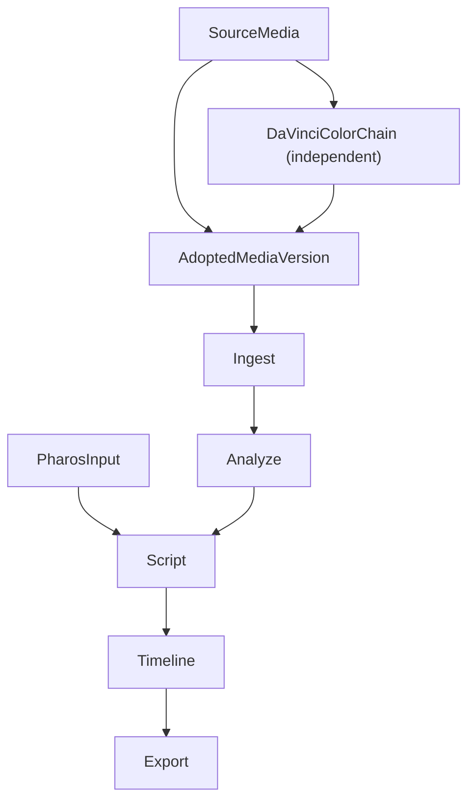
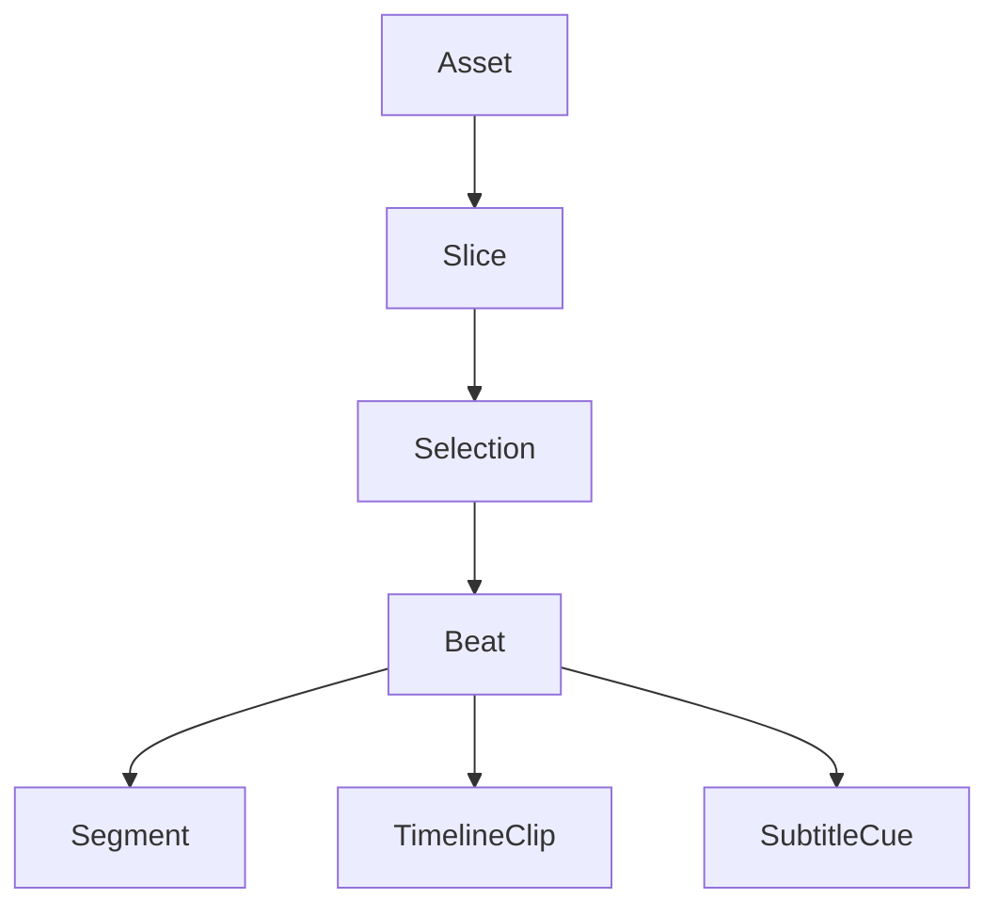

# Kairos — 当前方案总结

> 本文档用于把当前已经稳定的 Kairos 方案收口成一份浓缩入口。
> 它不是新的 ADR，也不替代迭代设计文档；它的职责是先回答“Kairos 现在到底是什么、怎么工作、哪些结论已经稳定”。

## 1. 当前产品形态

Kairos 当前需要区分两层：

- **正式流程定义**：以 `Pharos` 为主输入来源，围绕项目素材、分析结果、脚本编排与时间线落地组织完整工作流
- **当前实现形态**：以 `Node.js core + Agent skill` 作为临时承载形态，已经覆盖正式流程中的多个阶段，但还不等于正式流程的全部实现

在这个前提下，Kairos 当前的正式方案可以概括为：

- 一个以 `KTEP` 为核心协议的后期编排系统
- 一个以 `projects/<projectId>/` 为中心的项目化存储体系
- 一条以 `Pharos -> ingest -> analyze -> script -> timeline -> export` 为骨架的正式主流程
- `Pharos` 输入当前固定镜像到项目内 `pharos/<trip_id>/plan.json + record.json? + gpx/`
  - 项目初始化当前会直接创建 `projects/<projectId>/pharos/`
  - Console 读取项目配置时会补齐缺失的 `pharos/` 根目录，并在 `/ingest-gps` 明确提示这个固定投放位置
- 一条与主链解耦的 `DaVinci color` 独立增强链路
  - 当前已经有最小 `/color` 控制面与项目级 `color/` runtime/archive store
  - 当前 `/color` 会自动发现已配置 `rawPath` 的素材根，派生约定命名与阻塞状态
  - 当前 `/color` 已支持同机 vendored Resolve backend 驱动的 color action 链：`prepare_root -> sync_groups -> execute_root -> validate_batch -> prepare_all_roots -> export_all_roots`
  - 当前 `/color` 的长期用户配置已收口到 `config/project-brief.json` root mapping 上的最小 `color.renderPreset + color.colorSpaceProfile + color.transformPresetKey`
    - `color.renderPreset` 当前正式使用 `bitrateKbps`（单位 `kb/s`）；不再接受旧的 bitrate 别名字段
    - `color.colorSpaceProfile` 当前正式表示“技术输入类型”，不是 creative look，也不再承载 gamut/primaries 细节
    - workspace 级默认技术预设映射当前正式放在 `config/color-transform-presets.json`
    - workspace 级 LUT 资产当前正式放在 `config/luts/`
  - 当前 `/color` 的页面结构正式收口为 `Root 摘要 -> 当前 Root Hero -> 所有 Root 常驻可编辑配置 -> Groups -> 次级诊断/归档`
  - 当前 `/color` 要求所有 root 的用户可编辑项都直接可见且同页可维护；折叠区只保留只读技术信息和 batch/archive 历史
  - `resolveProjectName / rootNamespace / gradingTimelineName / Group naming` 当前全部按约定生成，只展示，不允许用户配置
    - Resolve Project 名称固定为 `${projectBrief.name} [Color]`
    - root namespace / grading timeline 固定从 root `label` 派生
  - 当前 `color/current.json` 承载 root current truth，`color/groups/<rootId>.json` 承载 formal host group + clip repair snapshot，`color/batches/<batchId>/...` 承载 root-scoped batch archive
  - 当前 DaVinci Resolve scripting 相关知识已落成本地文档 `.ai/knowledge/davinci-resolve-scripting.md`；任何 `/color`、Resolve export、DRX/DRT、LUT、render job、Group、node graph 或 vendored host 变更都必须先读该文档，再按安装版 Resolve `README.txt` 校验版本敏感 API
  - 当前 `prepare_root` 已正式承担 `rawLocalPath -> Resolve root bin / root grading timeline / Resolve Groups` 的真实同步，不再只是轻量容器占位
  - 当前大素材 root 的 `prepare_root` 默认按稳定顺序拆成 50-clip chunks，并限制本机 probe / source-truth / lowlight 并发，避免一次性把整 root 塞进 Node 和 Resolve host 内存；chunk 只作为导入批次，全部追加到同一条 root grading timeline，chunk 进度与可恢复状态写入 `color/current.json`
  - 当前自动 DRP 快照只在 root 全部 chunks 导入完成后生成一次；每个 chunk 后只即时 `SaveProject()`，其它 Resolve 工程备份交由用户通过 `/color` 的手动保存或外部 `.drp` 登记入口完成
    - grading timeline 必须按该 root 的 dominant `(width, height, fps)` 规格创建
    - 自动 Group 只使用创意标签语义：`log / lowlight / colorCastClass`
    - `log` 先读显式 sidecar 真值，再回退 root `color.colorSpaceProfile`
    - `lowlight` 当前正式由每条 clip 的首帧视觉分类产生，是 creative-first 标签，不是 noise-only 诊断
    - `colorCastClass` 当前由便宜的单帧 proxy 数值分类产生：默认取 clip 中点帧；若该 clip 能按 workspace profile/device 或 root `transformPresetKey` 解析到技术 LUT，则先用同路径 `.cube` 做 proxy 技术转换，再排除天空/高饱和/黄橙车头/曝光异常区域并估计中性像素偏移。强冷蓝中性偏移归入 `cool-cyan`，绿青混合中性偏移归入 `green-cyan`，且 `prepare_root` 会对同一 root / 同一 log profile 的连续素材做轻量平滑：夹在多个冷色锚点之间、且指标不冲突的短 clip 会跟随进入同一偏色分桶。它只表示需要单独白平衡/色偏处理的 `cool-cyan / green-cyan / green / warm / mixed` 分桶，不声称色偏原因一定是前挡膜；`neutral / unknown` 不参与分桶以避免 Group 爆炸
    - `gyro` 正式回到 clip repair 维度；它只决定该 clip 的第 1 个 Gyro 节点是否默认/重申开启，不再参与 Group 分桶
    - `gyroEligible` 是显式声明判定：同名 `.gyroflow` 视为用户已准备稳定工程；带 Gyroscope 且型号受支持的 Sony XML sidecar 可开启 Gyro。默认 prepare 不深扫嵌入式私有 telemetry；DJI `dvtm_*` 不扫描、不单独开启 Gyro，也不能用来猜测 log profile
    - 素材技术真值优先级固定为 `显式 sidecar > root fallback`
    - DJI 若没有显式技术输入，正式结果就是 `unknown`，不得强行识别成 `dlog-m`
  - 当前 `prepare_root` 在 Resolve-side mutation 前，还会先做当前 root 的 LUT preflight：
    - 只同步当前 root 实际引用到且 workspace 中存在同路径文件的 LUT
    - 同步源固定为 `config/luts/<relative-path>`
    - 同步目标固定为当前设备 Resolve 默认 LUT 目录
    - 同步策略固定为“只补缺，不覆盖、不删除”
  - 当前默认技术预设是 Group Pre-Clip 的技术底板，不是 creative look：
    - root `color.transformPresetKey` 优先于 workspace profile/device 映射，并直接表示 Resolve LUT 路径
    - `config/color-transform-presets.json` 维护 `profile -> { deviceFamily/default -> Resolve LUT path }`
    - 用户不手写 regex；设备族归一与别名匹配由 Kairos 根据素材 metadata 真值内置处理
    - 当前 round 只支持 LUT preset
    - 仅在 Kairos 新建或空白 Group Pre-Clip 图上自动应用
    - 已有用户 grade 的 Group 必须跳过，不允许被默认底板覆盖
  - 当前 Group 真相完全以 Resolve 为准；`/color` 通过 `sync_groups` 镜像最新现状，同步后的非空 Group 直接进入 `ready`
  - 当前 Resolve-first creative / repair 分层已经收口为：
    - `Group Post-Clip` 是唯一主 creative 真相
    - `Clip` 是固定 repair/local-exception 层，不是主 creative 面
    - `/color` 只准备、镜像并执行这些结构，不把 creative 参数重新搬回 Console
  - 当前 `prepare_root` 还必须把每条可执行视频 clip 规范化到固定 repair 节点图：
    - 当前正式路径只在同 clip 旧 repair 已经是 canonical 时用 Resolve `CopyGrades` 沿用；legacy / brand-new clip 统一从 canonical donor 重建
    - 所有可执行视频 clip 固定布局为 `Gyro -> Dehaze -> User1 -> User2 -> NR`
    - `Gyro` 固定是第 1 节点：每次 `prepare_root` 都必须按最终 `gyroEligible` 布尔判定重申 node1 开关；`gyroEligible=true` 请求开启并进入 `ready-to-load`，`gyroEligible=false` 仍预留但请求关闭并进入 `seeded-disabled`
    - `ready-to-load` 只表示 Gyroflow OFX shell 存在且 Kairos 已请求正确 node 启停；它不是 Gyroflow 已执行 source-specific `Load for current file` 的证据
    - `Dehaze` 固定是第 2 节点且默认禁用
    - `User1 / User2` 是最小用户区，默认开启；用户扩展节点必须放在 `Dehaze` 之后、`NR` 之前
    - `NR` 对所有视频 clip 固定预留在尾部，默认禁用，正式开关入口只有 Resolve
    - `lowlight` 继续是 creative-first 标签，不自动开启 `Dehaze / NR`
    - ZV-E1 / Sony 竖屏素材不禁用 Gyro；Kairos 先从 ffprobe 解析 `rotation/display matrix`，timeline 显示旋转继续按 ffprobe 方向取反，但 Gyroflow 日志方向与 ffprobe 口径相反：源 `rotation=90` 会写 `RotationAngle=-90` 并使用 `config/gyroflow-portrait--90.drt`，源 `rotation=-90/270` 会写 `RotationAngle=90` 并使用 `config/gyroflow-portrait-90.drt`
    - 竖屏方向 DRT 缺失时，素材导入、Group、LUT 和 timeline transform 继续执行，但该 clip 的 Gyro node 不自动开启，并标记 `pending-orientation-template`
    - 竖屏素材在 root grading timeline 上自动写入 `RotationAngle / ZoomX / ZoomY / ZoomGang / Pan / Tilt`，默认旋转并放大填满横屏单 clip 导出；当 Gyroflow/DRT 输出层把竖屏内容落成横屏帧内的小 16:9 画面时，timeline transform 必须额外放大到填满画布
    - 如果已有 prepared root 的 portrait DRT hash 缺失或过期，`prepare_root` 只重跑命中的 chunk，并对 stale portrait clip 先执行 `ResetAllGrades()` 清掉旧 repair/OFX state，再重新应用方向 DRT；prepare 完成后的最终 `sync_groups` 会写回当前 DRT hash，后续 hash 未变时仍按 canonical repair preserve 路径执行
    - 旧非规范 clip 图记为 `legacy-layout`；本轮允许在 workspace `config/default.drt` 存在时破坏性重建到新规范，规范图重跑保留用户区状态与用户手动切换的 Dehaze/NR 状态，但仍会按 `gyroEligible` 重申 Gyro node1 开关；如果 DRT 缺失，bulk prepare 跳过自动 repair seed 并标记 `pending-template`
    - workspace `config/default.drt` 是唯一正式 cold-start / legacy rebuild 来源；`config/default.drx` 不再作为大批量自动 fallback
    - live Resolve 验证显示，干净 DRT donor 路径可以在渲染时触发 Gyroflow source-specific load；当前 DRX 路径只能作为人工诊断材料，不能当成 load 证据
  - 当前 `sync_groups` 已扩展成 group + clip 双层镜像：
    - group 侧至少镜像 `logProfile / lowlight / colorCastClass / postClipCreativeStatus`
    - clip 侧至少镜像 `gyroEligible / gyroflowStatus / dehazeStatus / nrStatus / clipRepairStatus / layoutStatus / orientationStatus / repairTemplateKey / timelineTransform`
  - 当前 `/color` 进入页面或切换项目时会自动执行 Resolve host preflight，并把结果正式缓存到 `color/current.json.hostPreflight`
  - 当前 `/color` 会把 Resolve 工程同步快照落到项目内 `color/resolve-projects/<safe-project-name>/`；自动快照只在 root prepare 全部 chunks 完成后生成一次，手动 `保存 DRP 快照` 可随时 `SaveProject()` 并导出轻量 `.drp`，两者都会维护 `latest.drp` 与 `color/resolve-project-map.json`；外部 GUI 导出的 `.drp` 可登记为 latest
  - 当前 `prepare_root / sync_groups / execute_root / prepare_all_roots / export_all_roots` 都先经过 preflight 守卫；宿主 blocked 或 render preset 不受支持时，动作会在 Resolve 变更前直接失败
  - 当前成功重跑 `prepare_root` 会清理上一轮 Resolve host 短时崩溃留下的动作级 blocker；`color/current.json.blockingReasons` 不得在 root 已 `synced/ready` 时继续显示旧的 DRT import 等 transient 错误
  - 当前 color host 的正式兼容下限为 `DaVinci Resolve Studio >= 18.5`；低版本 / 非 Studio 是硬阻塞，部分兼容降级则显示为 `degraded`
  - 当前 host retry 只覆盖短时 host/app 故障，不覆盖缺配置、缺素材、render preset 不支持、validation fail 等语义错误
  - 当前 `execute_root` 的正式导出合同已经切到 “root timeline 是真相，batch 只是 clip 子集执行粒度”：
    - root `renderPreset` 是唯一导出配置真相；Group 不再决定 render preset、batch 所属或执行顺序
    - batch 默认覆盖该 root grading timeline 上的全部可执行 clips，但可显式携带 `clipKeys[]` 作为 retry / subset 选择
    - Resolve 宿主按 `rawRelativePath` 父目录分组，为每个目录复制正式 root grading timeline 并修剪到该目录 clips；所有 render jobs 创建成功后才能调用一次 render all
    - 正式输出命名继续收口为 `sourceStem + targetExtension`；宿主必须使用 Resolve File Name = Source Name，不设置 `CustomName` 或 prefix/suffix
    - Windows Resolve 21 + MP4/H.265 固定码率不依赖该平台上不稳定的公开 `VideoQuality` render setting；宿主必须每次从 Kairos root `renderPreset` 生成干净 render preset XML、导入、加载并直接 `ExportRenderPreset(presetName)` 校验 named preset，把 `h264_datarate` 与 `encoder_command_param_map.bitrate` 写成 `root.color.renderPreset.bitrateKbps`，并把 `encoder_command_param_map.rc` 固定为 `CBR`；不得从当前 Deliver 页保存 preset 再 patch，也不得用 `SaveAsNewRenderPreset` 的当前 UI 粘滞状态当校验真相
    - Windows H.265 root 默认走 Intel Quick Sync preset 语义：transient preset 必须写入并校验 `RecordFormatSubType=hvc1_qsv`、`EncodingProfile=Main10` 对应的 `h264_profile=2`、`preset=balance`、`rc=CBR`、`bitrate=<bitrateKbps>`；任一项校验失败不得启动 render
    - Windows generated preset 同时必须清空 `RecordPrefix / RecordSuffix / DestSuffix`，保持 `RecordClipUniqueName=false`、`UsePrefixAndSuffixFromSrc=1`，并在 named preset 校验中保持 `AlternateInFolder/ReelInFolder/ClipInFolder/UseVersionNameForFolder/SrcDirPreserveLevel=0`；`UsePrefixAndSuffixFromSrc=0` 已 live-test 证明会 queue 成 `00000000.mp4 and more`；若 Resolve 当前 UI 粘滞状态仍输出单层 `Event_Version.../<sourceName>.mp4`，host 只允许在唯一匹配且目录内单文件时提升回正式 `TargetDir/<sourceName>.mp4`，否则失败
    - 每个 `AddRenderJob()` 后必须用 `GetRenderJobList()` 校验 `OutputFilename` 已经是本批 Source Name；不匹配时删除该 job 并在 `StartRendering()` 前失败
    - 非 Windows 主机继续走 Resolve 公共 render setting 路径；当 `VideoQuality` 可用时，直接由它承载 `root.color.renderPreset.bitrateKbps`
    - `execute_root` 必须以当前 root `localPath` 为唯一输出 root；项目目录只保存 batch JSON archive，不能承载视频 staging
    - 覆盖已有最终目标前，`/color` 必须先生成最终 `dayX/Cxxxx.ext` 覆盖预览并用 `overwritePlanHash` 锁定确认范围；hash 缺失或变化时不允许启动 Resolve
    - 每个目录级临时时间线直接渲染到最终 `localPath/<relativeDir>/`；Kairos 不创建项目级视频 holding 目录；仅允许把 Resolve 在最终 TargetDir 内生成的单层 `Event_Version...` 临时子目录中的唯一源名文件提升回最终路径
    - 任一 `AddRenderJob()` 失败时不得启动渲染；若 Resolve 输出出现 `V1-0001_C1611.ext` / `C1611_001.ext` 这类前后缀文件名，batch 直接失败
  - 当前 `execute_root` 在写 manifest 前必须先做最终文件 metadata normalize：
    - `creation_time` 改写为源文件 `capturedAt`
    - 源文件带 GPS 时，容器位置标签也必须改写到最终输出，且能被 `ffprobe` 读回
  - 当前 `validate_batch` 已扩展为写入 summary 统计、top-level blockingReasons 和 warning-only 诊断，供 `/color` 直接显示 validation 失败原因
    - `capturedAt / GPS` 仍是硬门槛
    - `create_time` 当前是 warning-only
  - 当前 `promote_batch` 已退出正式导出链；视频与同 basename 的 `.srt/.xml/.gyroflow/.wav/.flac/.m4a/.aac/.mp3` sidecar 在 `execute_root` 成功验证后即是当前 root 输出
  - 当前 `/color` 还正式提供项目级批处理入口：
    - `Prepare All Roots`：按当前 read model 的 enabled root priority 顺序依次执行 `prepare_root`
    - `Export All Roots`：按同一顺序依次执行 `execute_root`，每个 root 内部完成 render all、最终 replace、metadata 修复和 validation
    - 项目级动作遇到单个 root 失败时继续后续 roots，但只要存在失败 root，整个 job 最终仍记为 failed
  - 当前 `/color` 继续保持单页，但已正式消费 `color/batches/<batchId>/plan|manifest|validation` 归档，并按 root 展示可折叠的 `Host Diagnostics / Recent Batches / Validation Failures`
  - 当前 Resolve 宿主路线已经冻结并落地为“同机 vendored Resolve backend（`vendor/resolve-color-host/` + fixed `.venv`）”，不再把 MCP 作为 color 主线
- 一组运行在 Agent 环境中的工作流技能，以及面向不同 NLE / 导出目标的适配层

这意味着：

- Kairos 不把 NLE 当作主数据中心，而把它们视为执行器或导出目标
- 当前的 `Node.js core + Agent skill` 是对正式流程的临时承载形态，而不是正式流程本身的唯一边界
- 仓库根目录的 `AGENTS.md` 是当前 agent 启动时的统一引导入口，用来收口必读文档、rules、skills 和正式运行入口
- 本地运行与任务编排当前已收口到 `Supervisor + React console (apps/kairos-console/)`
- 只要改动影响正式本地运行入口、Supervisor API、`/analyze`、`/style`、`/color` 或 `apps/kairos-console/`，验证就必须同时包含根仓 `pnpm build` 与 `npm --prefix apps/kairos-console run build`
- 根仓 `pnpm build` 不能被视为已经覆盖 React console 产物；前端 bundle 必须显式重建
- `素材分析` 与 `风格分析` 在当前控制台里直接以主路由展示监控，而不是再跳一次独立监控入口
- `DaVinci color` 当前也已有独立主路由 `/color`，并已收口为最小 `renderPreset` 配置（含 `bitrateKbps` / `kb/s`）+ root/project 级 deterministic 控制面 + runtime/archive 状态面；正式顺序为 `Prepare Root -> Sync Groups -> Execute Root -> Validate`，并补充 `Prepare All Roots / Export All Roots`
- `/color` 当前还会主动暴露宿主诊断与 batch 归档，而不是把宿主问题和 validation 历史藏在动作失败或磁盘 JSON 里
- 剪辑规则、风格来源配置与风格分析参考产物当前已收口为 **Workspace 级共享资产**，但职责已经拆开：
  - `config/edit-rules/`：人工维护的正式 `剪辑规则` 库，驱动脚本结构、剪辑框架、人工 gate 与粗剪约束
  - `config/edit-rules.json`：剪辑规则分类索引；项目 / edit unit 只保存 `editRuleCategory`
  - `config/styles/`
  - `config/style-sources.json`
  - `analysis/reference-transcripts/`
  - `analysis/style-references/`
  - `config/style-sources.json` 是当前唯一正式 style-reference 索引；`config/styles/*.md` 只承载文案 / 艺术气质参考，不再承载粗剪结构规则
- Workspace 风格档案当前降级为“文案 / 艺术风格参考”：
  - 风格分析不再尝试从参考视频抽象正式剪辑规则
  - `config/styles/*.md` 只服务最终旁白、字幕文本、语言气质和表达禁区
  - 粗剪结构默认不读取 style profile；缺少 style reference 不阻塞 Script / Timeline，只在最终旁白和字幕表达阶段提示缺参考
- `scripts/kairos-supervisor.* start` 只启动 `Supervisor + React console`，不会顺带拉起 ML，也不会自动恢复旧 job
- `projects/<projectId>/.tmp/media-analyze/progress.json` 与 `<workspaceRoot>/.tmp/style-analysis/{category}/progress.json` 都只是 durable progress cache，不等于 live job
- Kairos 官方管理的顶层流程在结束态必须回收到 `ML stopped`
- workspace `style-analysis` 当前正式收口为 deterministic prep：
  - `health-check -> clip -> probe -> shot-detect -> transcribe -> keyframes -> vlm -> video-complete -> awaiting_agent|completed`
  - prep job 负责把 reference transcript、per-video report 与 workspace progress 正式落盘
  - `/style` 默认不再盲目回到 `defaultCategory`；应优先落到“当前最相关”的分类：显式 `categoryId` -> live job -> 最近完成 job -> 最近 cached progress -> `defaultCategory` -> 第一个分类
  - `/style` monitor 不应只显示粗阶段；当前视频、`keyframes` 抽帧进度、`vlm` 识别进度和视频队列摘要都属于正式可见运行态
  - 最终 `config/styles/{category}.md` 继续由 Agent 基于这些 prep 产物写成，但当前正式要求已经改成 clean-context subagent 流水线：
    - deterministic prep 额外写 `analysis/style-references/{category}/agent-summary.json`
    - `style-profile-synthesizer` 只读取 packetized summary，先产出 `style-draft.json`
    - `style-profile-reviewer` 只读取 summary + draft，写 `style-review.json`
    - reviewer blockers 当前是最终 style profile 的硬闸门；不能再把单次 synthesize 直接落成正式 profile
    - 正式执行后端必须使用宿主提供的 packet runner / 真实 subagent 链；官方路径不允许外接 `ILlmClient` fallback
    - workspace / project runtime 可通过 `config/runtime.json` 的 `agentPacketRunnerCommand` / `agentPacketRunnerArgs` / `agentPacketRunnerCwd` 声明这个 packet runner
- 未来如果引入桌面 UI 或更多 provider / adapter，应建立在这套协议与项目模型上，而不是推翻它
- 某些项目会直接消费调色后的素材版本而非原始素材；因此主链面向的是“当前采用的素材版本”，而不是固定绑定“永远使用原始素材”
- `project-brief` 的路径映射块当前可选带 `原始路径` 与有序 `备选路径N / 原始路径N`
  - `project-brief.json` 是路径单真值；运行时直接从 `path -> 备选路径N` 与 `rawPath -> 原始路径N` 中选择当前可读目录
  - `device-media-maps.local.json` 已退出正式配置与缓存路径
  - 若解析后的 `rawLocalPath` 位于当前素材目录内部，主链 ingest 会显式排除该子树，避免 raw 与当前输出被一起纳入正式扫描

## 1.1 当前变更纪律

凡是需求、行为、接口、工作流、正式入口或用户路径变更，当前正式顺序固定为：

1. 先进入 `Plan` 模式；如果宿主没有显式 `Plan mode`，先产出结构化计划并确认
2. 计划确认后，先更新相关设计文档
3. 再开始实现
4. 实现完成后，回查并同步受影响的设计文档、rules 和 skills

如果变更影响正式入口、监控页、工作流主路径或用户操作方式，还必须同步更新：

- `README.md`
- `AGENTS.md`
- `designs/current-solution-summary.md`
- `designs/architecture.md`

## 1.2 2026-04-08 语义协议切换

当前主链已经开始从旧的 `slice + 五轴语义 + 单阶段 arrangement` 切到新的 model-driven arrangement 准备链：

- Analyze 的正式素材单元现在优先叫 `span`
- 项目内正式持久化路径已切到 `store/spans.json`
- `span` 当前正式承载三块主信息：
  - `materialPatterns[]`
  - `grounding`
- Analyze 自动生成的 `materialPatterns` 当前默认不再填 `excerpt`
  - `excerpt` 字段仅保留兼容可选，不再把整段 transcript / description / itinerary 文本塞进去
- 对 `source-speech` 而言，`store/spans.json` 当前应持久化“稳定可复用的语音素材 span”，而不是把同一资产里相隔几秒的短语音窗机械拆成多条 span
  - 细粒度语音边界与停顿继续保留在 `transcriptSegments`
  - 附近的 speech windows / shot-split speech slices 应先在 Analyze 侧收口，再进入 `spans.json`
- 项目级正式词集当前只保留一层，并挂到 `project-brief`：
  - `材料模式短语`
- Script prep 当前正式链路为：
- `Analyze -> Material Overview -> Script Brief -> Segment Plan -> Material Slots -> Bundle Lookup -> Chosen SpanIds -> Beat / Script`
- `Chosen SpanIds -> Beat / Script` 不再等价于“一个 chosen span 直接落成一个 beat”
- `material-slots` 负责高召回收集证据，outline 负责在不破坏证据链的前提下做 deterministic 去噪与相邻非口播 evidence 聚合，再交给 `beat-writer`
- `material-slots` 的 deterministic base draft 是正式高召回下限；`route-slot-planner` 可以补充 / 重排，但不能把 base `chosenSpanIds` 静默裁掉
- `Bundle` 当前是 `materialPatterns` 驱动的粗索引入口，不承担叙事骨架身份
- `Segment` 当前是 LLM-first 的项目级动态段落结果，不是固定 archetype 闭集
- Timeline / script selection 当前开始优先传递 `spanId`；`sliceId` 只作为兼容字段继续存在一段时间

## 2. 正式主流程

```mermaid
flowchart TD
  pharos[PharosInput]
  sourceMedia[SourceMedia]
  colorChain["DaVinciColorChain (independent)"]
  adoptedMedia[AdoptedMediaVersion]
  ingest[Ingest]
  analyze[Analyze]
  script[Script]
  timeline[Timeline]
  exportFlow[Export]

  sourceMedia --> adoptedMedia
  sourceMedia --> colorChain
  colorChain --> adoptedMedia
  adoptedMedia --> ingest
  ingest --> analyze
  pharos --> script
  analyze --> script
  script --> timeline
  timeline --> exportFlow
```

这里的正式关系是：

- `Pharos` 是正式流程的主输入之一，主要驱动脚本规划、拍摄语义和素材对齐
- `Pharos` 当前不再通过用户填写外部路径接入；每个项目固定扫描 `projects/<projectId>/pharos/`
- 如果项目迁移后缺少这个目录，Console 当前应先自动补齐，再向用户展示固定目录和投放提示
- `project-brief.md` 中的 `## Pharos` 当前只承担 trip 筛选语义；未填写时默认纳入全部可解析 trip，填写 `包含 Trip：...` 时只消费这些 trip
- planned shot 的素材归属当前正式拆成独立时间层：只按 `plan` 里的计划时间段匹配，不再把 shot 的 `actualTime*` 或任意 shot GPS 字段当成 planned shot 归属依据
- planned shot 的空间真值当前正式拆成独立 GPX 层：无论 `drive` 还是单机位 shot，都只使用 trip `gpx/*.gpx` 按素材/span 时间反算位置；`plan.gps / gps_start / gps_end / actual_gps` 仅保留人读语义
- `AdoptedMediaVersion` 表示项目当前采用的素材版本，它可以是原始素材，也可以是独立调色链路产出的版本
- `DaVinciColorChain` 是独立链路，不属于主链中的固定顺序步骤
- 如果项目没有 `Pharos`，主链允许退化为基于素材、brief、行程和分析结果的兼容路径，但这属于 fallback，而不是正式主定义

### Ingest

- 通过逻辑素材源导入项目当前采用的素材版本
- 真实本机目录路径不写死进项目，而是通过设备本地映射维护
- 保留素材真值，例如 `capturedAt`、`rawTags`、基础 metadata
- 项目内跨设备时钟漂移当前正式收口为 root 级配置，而不是继续让 timeline 末端猜顺序：
  - `config/project-brief.json` 对应 mapping 的 `clockOffsetMs?` 表示该素材 root 在当前项目内的统一时钟偏移
  - 单素材 `captureTimeOverrides` 继续存在，但只作为 root offset 之上的例外层
  - `media/chronology.json` 的 `sortCapturedAt` 是正式时序真值，优先级为 `capturedAtOverride -> asset.capturedAt + root.clockOffsetMs -> asset.capturedAt`
- 对同目录同 basename 的保护音轨 sidecar，当前正式策略是作为视频资产上的 `protectionAudio` 绑定信息记录，而不是重新放开通用独立音频 ingest
- 如果输入素材来自独立调色/转换链路，该链路必须先保证关键元信息被保留下来

### Analyze

- 当前正式策略是“粗扫优先 + 自动细扫”
- 当前 Analyze 的稳定执行顺序已经是：
  - 有音轨视频：`coarse-scan -> audio-analysis -> finalize -> deferred scene detect(if needed)`
  - 无音轨视频：`coarse-scan -> finalize -> deferred scene detect(if needed)`
  - `scene detect` 不再是所有视频的 unconditional coarse 前置税，而是只在最终确实需要 shot 结构时延后触发
 - `finalize` 当前会把每次 unified VLM 原始输出落到 `projects/<projectId>/.tmp/media-analyze/finalize-attempts/<assetId>/attempt-*.json`
 - 如果 unified `finalize` 返回 invalid JSON，Analyze 不再立即判整轮失败，而是自动按更高 token 预算重试；当前预算序列为 `512 -> 768 -> 1152`
 - `finalize` prompt 当前会明确要求 `decision_reasons` 保持短列表，避免模型在长枚举里把 JSON 截断
- `coarse-scan` 当前已经切到素材级动态并发：
  - 同一素材在 coarse 阶段最多只允许一个关键帧抽取 `ffmpeg`
  - 多条素材可根据 free memory 目标并发数并行推进
- 视频内音轨的 ASR 已进入正式分析链路，而不再只是附属信息
- `transcript / transcriptSegments / speechCoverage / placeHints / inferredGps` 都属于分析层结果
- `asset report.clipTypeGuess` 当前表示 finalize 后的语义结论；视频素材的正式 `visualSummary + decision` 只在 `finalize` 单次 unified VLM 中产出，前置阶段只保留 cheap planning inputs
- Analyze 现在按素材分阶段持久化可恢复状态：
  - `analysis/prepared-assets/<assetId>.json` 保存 coarse prepared checkpoint（keyframes / `hasAudioTrack` / source context 等输入）
  - `analysis/audio-checkpoints/<assetId>.json` 保存 selected transcript / transcript source / audio health / protection routing 中间态
  - `analysis/asset-reports/<assetId>.json` 用 `fineScanCompletedAt / fineScanSliceCount` 标记细扫完成态
- `audio-analysis` 当前已经切到两级素材队列：
  - 本地 health / routing 队列负责 embedded 与 protection 的轻量健康检查
  - ASR 队列只对最终选中的一路音轨转写，并按 free memory 目标并发数动态扩缩
- 当前默认 ASR 质量目标已经切到跨平台一致：
  - Apple Silicon 继续使用 `mlx-whisper / whisper-large-v3-turbo`
  - Windows + CUDA 与 CPU fallback 当前优先使用完整可用的本地 `faster-whisper / large-v3`（CTranslate2）checkpoint，默认目标从 `turbo` 切回完整 `large-v3`
  - 默认口径不再让 Windows 以较弱 `small` 档或 `turbo` 档换速度，优先保证中文转写质量
- Analyze 当前正式把项目级 ASR caller 固定为中文优先：
  - `/asr` 请求默认传 `language='zh'`
  - TS 侧会在 refined transcript segmentation 之后，把 Han 文本统一归一为简体中文
  - 英文、数字和其他脚本保持原样，不做 LLM 改写
- 非 MLX 路径当前不允许在正式 `/asr` 请求里隐式卡住等待远端模型下载：
  - 如果 `large-v3` 的本地 CTranslate2 checkpoint 或完整 HF cache 已可用，本轮就用它
  - 如果当前只发现不完整 cache，Kairos 应直接回退到完整可用的本地 Whisper checkpoint，而不是把 Analyze 卡死
- ASR 当前在 Apple Silicon / MLX 与 `faster-whisper` 路径都会请求词级时间戳，避免继续把 TS 细分建立在粗 segment 猜测上
- Kairos 在 TS 侧统一重建更细的 `transcriptSegments`：
  - 有 `words` 时按词级停顿、标点与长度约束细分
  - 没有 `words` 时按 segment 文本的标点与长度做保守细分
- `report.transcriptSegments` 当前正式表示 refined transcript segmentation，而不是直接照搬后端的粗 segment
- `report.transcript`、`report.transcriptSegments`、source-speech span transcript 与 subtitle 输入当前统一使用简体归一后的文本
- 如果视频绑定了 `protectionAudio`，Analyze 当前会先做双健康检查再选边：
  - `alignment === mismatch` 时强制保留 embedded
  - protection 缺失、不可访问或健康检查失败时回退 embedded
  - protection 只有在健康分数明显更优时才会成为正式 transcript 来源
- 一旦选择了 protection，它就不再只是 finalize prompt 的辅助信号，而会直接覆盖正式 `report.transcriptSegments`
- ML server 当前会在 `VLM` 和 `Whisper` 之间互斥卸载，避免两套模型同时常驻显存
- Analyze 当前在 `audio-analysis -> finalize` 交接时也遵守这条互斥规则：进入 `VLM` 前必须先卸载 `Whisper`，不再为了单素材热路径保留双驻留
- 当前 transformers VLM 默认模型已切到 `Qwen3.5-9B`：
  - 本地优先目录：`models/Qwen3_5-9B`
  - 无本地目录时的默认 ID：`Qwen/Qwen3.5-9B`
  - Apple Silicon 的 MLX 路径暂时继续使用 `Qwen3-VL-4B-Instruct-8bit`，直到引入兼容的 MLX 版本
- ML server 当前的 ASR 也已经收口成显式队列：
  - 非 MLX backend 继续共享 admission/queue 语义，并在同一常驻 `faster-whisper` 模型上顺序完成活跃素材的正式转写
  - MLX backend 共享 admission/queue 语义，但保持单推理通道，不做真实 multi-audio batch
- `retry / resume` 后的 ETA 当前按阶段重置，并且在当前阶段完成样本少于 `3` 条时不显示，避免沿用上一轮进度口径后产生夸张倒计时
- `interestingWindows` 不再只有单一语义：
  - `startMs / endMs` 保留“为什么这里重要”的 focus/evidence window
  - `editStartMs / editEndMs` 表示更适合后续编排消费的 edit-friendly bounds
- `talking-head` 当前有 audio-led window strategy，会优先把连续 speech windows 收口成更适合原声消费的窗口，而不是继续沿用宽泛视觉窗口
- `drive` 类素材当前正式保留 `speech` 与 `visual` 两条语义支路：
  - `interestingWindows` / slices 可携带 `semanticKind`
  - `speech` path 面向 transcript / source speech
  - `visual` path 面向景色 summary 与 `speedCandidate`
  - 两类窗口不再默认 merge 成同一种“有语音就等于可直接剪原声”的窗口
- `drive` 类素材可在分析层直接挂 `speedCandidate` metadata（例如 `2x / 5x / 10x` 建议档位），但 Analyze 不直接替下游决定最终速度
- `locationText` 当前正式改为“由最终选中的 GPS 坐标反查得到的地点名”：
  - 中国境内坐标优先 Amap，境外优先 Geoapify
  - cache key 固定为 `lng,lat` 各保留 `6` 位小数
  - 地点字符串格式对齐 `../Nostos/tools/scan-tool/geocode.ts` 的 balanced location 规则，优先行政区 + 镇街 + 最近 AOI/POI
  - 如果素材/span 命中了 planned `Pharos shot`，`locationText` 的 Pharos 空间候选只允许来自 trip GPX 的按时取点，而不是 shot 自带 GPS
  - `drive` 使用素材/span 的首尾时刻各取一个 GPX 点做反查；同地收口为一个地点，不同地点写成 `A -> B`
  - 非 `drive` 使用素材/span 的中间时刻 GPX 点做反查；没有命中有效 GPX 点时，再回落到当前空间优先级选中的单点 GPS
  - manual-itinerary / route-stage 文本继续留在 `summary`、decision reasons、`routeRole` 等字段，不再冒充 `locationText`
  - 若未配置 `amapWebServiceKey / geoapifyApiKey` 或反查失败，`locationText` 保持空

### Script

- 正式脚本编排已经不是“整段 narration + 粗引用素材”的模型
- 当前正式模型是 `segment + beat + selection`
- `script-brief` 是当前脚本阶段的正式人工审查入口
- 当前 `/script` 页已经收口为：
  - 先选择 workspace `editRuleCategory`，并立即自动保存；`styleCategory` 只作为可选文案 / 艺术风格参考
  - 一旦 `editRuleCategory` 改变，当前 edit unit 的旧 `material-overview / brief draft / segment-plan / material-slots / outline / edits/<editId>/script/current.json` 必须立即失效并清空，edit unit 回到“重新起稿”
  - 单独改变 `styleCategory` 不再清空粗剪结构产物，只影响最终旁白和字幕表达参考
  - Agent 生成初版 `script-brief`
  - 用户在 `/script` 审查并手动保存 brief
  - 用户点击 `准备给 Agent`
  - 关键 handoff 会通过持续可见的 workflow prompt 和显式 hana modal 提示用户“下一步去哪里”，而不再只靠淡色行内文案
- 当前 Console 里的 `script` job 已收口为 **deterministic prep**，只负责校验前置条件并刷新确定性材料
- `edits/<editId>/script/current.json` 的唯一正式作者是 **Agent**；旧 `script/current.json` 只作为 `edits/main` 兼容读取路径
  - Agent 内部当前正式要求已经改成 clean-context staged pipeline，而不是单一共享 writer 上下文：
  - `[main agent]` 只负责流程路由、前置条件核对、packet 准备、用户 handoff 与 reviewer 闸门执行
  - `[main agent]` 不得把缺失的 subagent / reviewer 阶段静默折叠成一次本地起稿
  - `overview-cartographer` 只写 `edits/<editId>/script/material-overview.md`
  - `brief-editor` 只写初版 `script-brief`
  - `segment-architect` 只写 `edits/<editId>/script/segment-plan.json`
  - `buildMaterialSlotsDocument()` 当前是 `edits/<editId>/script/material-slots.json` 的唯一正式作者
  - `route-slot-planner` 已退出正式写入链；若保留，只能做非权威审查 / 诊断，不能改写 `chosenSpanIds`
  - `beat-writer` 只写 `edits/<editId>/script/current.json`
  - `beat-writer` 当前只允许改写表达层字段：`text`、`utterances`、`notes`、`muteSource`、`preserveNatSound`
  - `beat-writer` 不得增删或改写 `audioSelections`、`visualSelections`、`linkedSpanIds` 这类召回事实
  - `script-reviewer` 审 `material-slots` 时必须把 silent span drops / recall regression 当 blocker
  - `script-reviewer` 只做阶段审查，不直接生成正式稿
  - `script-reviewer` 的 blocker 是推进下一阶段和落成该 edit unit `edits/<editId>/script/current.json` 的硬闸门
  - 如果当前宿主策略或用户授权不允许 formal subagent / reviewer 链执行，主代理必须先停下说明原因，不能继续按“单代理兼任全部阶段”落稿
  - Script 当前新增一层正式内部提示资产：
  - `edits/<editId>/script/spatial-story.json` + `spatial-story.md` 用现有 chronology / spans / Pharos / GPS 真值生成空间叙事提示
  - `edits/<editId>/script/agent-contract.json` 锁定用户 goals / constraints / review notes、edit rule must / forbidden、GPS narrative hints、Pharos must-cover hints、chronology guardrails
  - 每个阶段都必须读取各自的 `edits/<editId>/script/agent-packets/{stage}.json`
  - reviewer 结果写入 `edits/<editId>/script/reviews/{stage}.json`
  - 流水线推进状态写入 `edits/<editId>/script/agent-pipeline.json`
  - packet 是 stage subagent 的唯一正式上下文；runtime 不得在 packet 外重复附加主线程历史、`previousDraft` 或 `revisionBrief`
  - 正式 script stage 执行后端必须使用宿主 packet runner / 真实 clean-context subagent 链；官方路径不允许外接 `ILlmClient` fallback
  - workspace / project runtime 可通过 `config/runtime.json` 的 `agentPacketRunnerCommand` / `agentPacketRunnerArgs` / `agentPacketRunnerCwd` 声明这个 packet runner
  - 首轮 stage 调用默认应保持 lean packet，只在 reviewer 要求返工时再把 previous draft 带回 writer
  - `edits/<editId>/script/current.json` 的正式落盘形状固定为 bare `IKtepScript[]`；若 transport 返回 `{ "segments": [...] }`，必须由 stage runner 在持久化前解包，不能再变成主代理的临时补锅动作
  - `script-current` 每个 attempt 只允许一次正式 `beat-writer` 调用；不能先额外跑一轮 full-script writer 再进入 reviewer 链
  - writer / reviewer 调用失败时，`edits/<editId>/script/agent-pipeline.json` 必须立即写出真实失败态，不能继续停留在旧阶段的 `pending`
- `edits/<editId>/script/script-brief.json` 当前承载脚本阶段的正式流程状态真值：
  - `choose_style`
  - `await_brief_draft`
  - `review_brief`
  - `ready_to_prepare`
  - `ready_for_agent`
  - `script_generated`
- `edits/<editId>/script/script-brief.md` 会同步机器可恢复的 workflow 元信息；即使 `.json` 丢失，也能恢复脚本阶段状态；旧 `script/script-brief.*` 只作为 `main` 的兼容读取来源
- 如果用户已经修改过当前 brief，而又想让 Agent 重新生成初版 brief，正式路径是在 `/script` 点击 `重新生成初版 brief` 并通过 UI 明确确认覆盖
- 用户审查闸门存在于 Agent 写脚本之前，而不是召回和编排全部完成之后
- Script 阶段当前从 **Workspace 剪辑规则库** 里选择用户指定的 `editRuleCategory`，项目 / edit unit 只保存“本轮使用哪一个剪辑规则”，不再让风格档案承担结构控制职责
- 当前旅行类默认剪辑规则固定为：
  - 先用当前 Pharos `plan / record / gpx` 建构行程整体印象
  - 再用素材分析补漏，重点结合口播、GPS、record 与实际素材缺口
  - 先生成按天、重点时间、行车、航拍与关键事件组织的初版剪辑框架文本
  - 人工 review 调整结构，通过后才进入第一次粗剪
  - 第一次粗剪定稿后锁定 Resolve timeline，再生成源语音字幕和单篇旁白稿
- 当现有剪辑规则明确偏 `chronology / route continuity / continuous process` 时，顺时序不再只是 prompt 偏好，而是脚本编排的正式执行结果：
  - Script prep 会先基于 `sortCapturedAt + chronology + Pharos trip/day/shot` 建立单调递增的时间带
  - `segment plan / material slots` 只能在各自合法时间带内召回素材
  - `beat` 顺序默认保持时间单调递增，不允许后段跨窗回捞前段素材
- Script prep 当前不再为粗剪自动推导总预算：
  - style / arrangement signals 只约束顺序、阶段完整、素材角色、功能位和禁区，不默认推出总时长或段落预算
  - `targetDurationMs` 继续保留为可选审阅提示；除非用户明确给出成片时长、交付窗口或某段硬时长，否则不要在 brief / segment plan / material-slots / beat 中自动补全
  - 粗剪默认目标改为尽量列入有效素材：关键过程视频、可保留原声、阶段证据和事件节点默认都应进入 beat / timeline
- Script prep 当前不再把粗剪理解成代表性抽样：
  - `analysis/material-bundles.json` 必须覆盖 `store/spans.json` 的全量有效 spans
- `material-slots` 可以展开成多 slot / 多 beat 的高召回清单，优先保留过程证据、阶段证据、事件节点和可用原声，不再默认一段只保留少数代表素材
- 只应移除空白、坏段和高重叠近重复，不应因为“已经有代表镜头”就把其他有效过程素材吞掉
- 如果 stage writer 试图把 deterministic base 里的独立有效 span 静默删掉，runner 应先恢复高召回保底，再交 reviewer 判定是否仍有问题
- 关键过程视频现在有正式 guardrail：
  - 只要某条视频承载不可替代的时间推进、事件推进、人物关系推进或有效原声，就应保留成独立 beat
  - 不允许被泛化的 summary 段落或“更好看”的静态成果材料静默吞掉
- 当前脚本 / outline 默认优先消费 Analyze 给出的 `editSourceInMs / editSourceOutMs`，而不是继续把 tight evidence window 当成最终可剪子区间
- 模型仍可把 `selection.sourceInMs / sourceOutMs` 写得更细，但系统会先 clamp 到 outline fallback window，避免再次无意识裁得过短
- `KTEP 2.0` 当前正式把 source-speech beat 升级为双通道：
  - `audioSelections[]` 负责原声音频锚点与 timing truth
  - `visualSelections[]` 负责同拍内必须保留的陪衬视觉证据
  - 旧的 beat 级 `selections[]` 不再是正式协议；项目需要重跑 Script 与 Timeline
- 如果某拍最终保留原声，Script / Timeline 当前会先按 `audioSelections[]` 构建 merged audio units，而不是破坏性重写整拍画面选择
- `source-speech` 当前正式以“过滤后的口语 transcript cues + merged audio units”作为边界真值：
  - 相邻 spoken gaps `<= 3000ms` 且不存在强句末边界时，默认合并成同一个 audio unit
  - merged unit 默认保留前 `120ms`、后 `180ms` breathing，并严格 clamp 到可用 source range
  - 导航播报、录制口令、设备提示不再参与 audio unit，也不再进入 source-speech 字幕
  - 时间线当前应优先信任 Analyze 产出的 refined transcript segments；只有单条 cue 仍然过长时，才允许二次硬切
  - 当仍需拆长 cue 时，时间码应按 cue 长度 / 语速加权映射，而不是整段平均切分
  - `spans.json` 不应为同一段 source-speech material 机械保留多条近邻小 span；Analyze 应优先合并附近 speech spans，把真正的语音细节留在 `transcriptSegments`

### Timeline / Export

- 时间线与导出围绕 `KTEP` 展开
- `Script -> Timeline` 之间当前新增一个正式内部子阶段：
  - deterministic prep 先写 `timeline/rough-cut-base.json`
  - `segment-cut-refiner` 再按段写 `timeline/segment-cuts/<segmentId>.json`
  - `segment-cut-reviewer` 写 `timeline/reviews/<segmentId>.json`
  - pipeline state 写 `timeline/agent-pipeline.json`
  - 只有 reviewer 通过后的段级产物，才允许继续落成 `edits/<editId>/timeline/current.json`
- 字幕已有两条正式路径：
  - 旁白路径：默认来自 `beat.text`
  - 原声路径：当某拍保留原声时，来自 `beat.audioSelections[]` 对应的 merged audio units
- 旁白路径已支持显式 `beat.utterances[]`，可以在一个 beat 内表达多段配音与头部 / 中间 / 尾部停顿；字幕只覆盖有声岛，不再默认铺满整个 beat
- `preserveNatSound / muteSource` 是脚本层的显式覆盖信号；未显式标注时，时间线层当前默认只要 `audioSelections[]` 有可用 `transcriptSegments` / `speechCoverage`，就优先保留原声
- source-speech 当前正式落成“单视频轨串剪 + 独立 `dialogue` 音频轨”：
  - `visualSelections[]` 在单条视频轨上顺排，不做双视频轨 overlay
  - `audioSelections[]` 生成独立 `dialogue` 音频 clip，`nat` 音轨只保留给 protection/ambient fallback
- 当视频资产已绑定保护音轨，且 Analyze 的保守推荐明确偏向 `protection` 时，时间线会把对应原声 clip 路由到 `nat` 或 `dialogue` fallback，不再依赖视频主轨直接承载原声
- 当前字幕时长已不再是简单平均分配，而是会参考说话速度和标点停顿做节奏估算
- 当 beat 走 source speech 时，字幕现在会先做文本清洗，再按短分句切 cue；若某个 cue 明显噪声化、重复化或清洗后仍不可读，会只跳过该 cue，而不是让整拍静默；若整段都不可读，则保留原声但不再回退到 `beat.text`
- 最终可听的 `dialogue` / `nat` clip 当前会在导出编排层做非破坏性响度归一化，目标 `-16 LUFS`，并以 `audioGainDb` 记录 clip gain
- 当前时间线不再把“短 source + 长 beat”当成默认慢放来源：
  - 对带 `editSourceInMs / editSourceOutMs` 的新 slice，时间线优先使用 edit-friendly bounds
  - 只有旧 slice / 旧 selection 缺少 edit bounds 时，才保留 legacy fallback stretch
- `timeline/rough-cut-base.json` 当前正式负责锁定每段的：
  - `segmentId` 与时间带 guard
  - beat 列表与已锁定 span 归属
  - 允许调整的候选 window 边界
  - 默认 speech window / merged audio units
  - 默认 `speedCandidate` 与 silent montage 的速度建议
  - 默认 subtitle cue 草稿
- 时间线当前新增 chronology guardrail：
  - 对主轴明确偏时间/路程推进的风格，placement 会优先保持 beat 内和 beat 间的 `sortCapturedAt` 单调递增
  - placement 会先尝试同段内安全重排；若仍无法恢复合法顺序，则拒绝静默生成错序时间线
  - chronology guard、beat 排序与 selection 排序当前都必须统一读取 `media/chronology.json`，不再允许 timeline 私自回退到原始 `asset.capturedAt`
- 如果确实需要速度蒙太奇，当前正式路径仍可显式填写 `beat.actions.speed`
- `IKtepScriptAction.speed` 当前的正式语义是“请求加速”，只有 `drive / aerial` clip 会实际消费；混合 beat 中其他类型 clip 会强制保持 `1x`
- 对 silent `drive / aerial` 粗剪 beat，如果 Analyze 已给出 `speedCandidate` 且脚本没有显式写 `actions.speed`，时间线默认会按 `2x` 自动加速
- `segment-cut-refiner` 只允许在本段内拆并 / 重排 beat、在候选边界内调 window、覆盖 `drive / aerial` 速度、细化 source-speech 保留策略与字幕切分
- `segment-cut-reviewer` 必须把以下问题视为 blocker：
  - 召回回退或静默丢 span
  - 跨段换料或跨时间带回捞
  - 非 `drive / aerial` 素材被加速
  - source-speech 误判、speech window 越界、字幕不可读或严重错时
  - chronology / Pharos / style guardrail 漂移
- `placeClips()` 与 `planSubtitles()` 当前正式优先消费 reviewed segment-cut 产物，而不是把原始 `edits/<editId>/script/current.json` 当作全部粗剪决策来源
- `placeClips()` 当前默认按 selection 的自然 source 时长 / edit-friendly bounds 摆放 clip，不再用 `beat.targetDurationMs` 或 `segment.targetDurationMs` 驱动粗剪裁剪与扩展
- 如果同一 `asset` 同时被召回成 source-speech 与 silent `drive / aerial`，时间线当前正式应先保留 source-speech 窗口，再把 silent montage 裁成非重叠 remainder；重叠部分不得双重入线
- 如果同一 `drive / aerial asset` 在粗剪里被多个 silent beat 重复引用，后出现的 beat 也必须扣掉前面已经消费过的 source window，只保留新的 remainder，避免同源重复双放
- `placeClips()` 不再把单张照片当作预算容器；照片默认是 `1s` 静默停留，只有脚本显式要求更长 `holdMs` 时才拉长
- photo-only beat 当前默认不生成字幕；没有可用原声的视频 beat 允许尽可能用旁白完整组织
- 时间线 / 草稿输出规格已收口为项目级运行时配置：`timelineWidth / timelineHeight / timelineFps`，默认值为 `3840x2160 @ 30fps`
- 如果段级审查产物缺失、reviewer 未通过或 packet runner 失败，Timeline 当前必须明确阻塞；不能静默退回旧的 raw-beat assembly
- 当某拍不走 source speech 时，时间线会把命中的带音轨视频 clip 标记为静音意图；导出到 Jianying 时会落成静音视频片段
- 剪映导出不再走外部 `jianying-mcp` / 独立 `Jianying Server` 路线，而是由 Node 侧调用 vendored `pyJianYingDraft` 本地 CLI
- 当前剪映 backend 会直写 `draft_info.json` / `draft_meta_info.json`，并补齐本地素材注册元数据
- 剪映导出当前正式遵循“两段式新目录导出”：
  - 先在 `projects/<projectId>/adapters/jianying-staging/<draftName>` 生成项目内 staging 草稿
  - staging 成功后，再复制到真实 `jianyingDraftRoot/<draftName>`
  - 两侧目录都必须是全新目录，禁止覆盖、清空或删除已有草稿目录
- 对带 `speed` 的剪映导出，当前适配层会做 backend compatibility normalization，修正 `pyJianYingDraft` 的微秒级重算偏差，但不会回写正式 `edits/<editId>/timeline/current.json`
- Resolve、剪映或其他导出目标都应建立在同一套正式时间线语义之上

## 3. 协议与数据骨架

### KTEP 是正式交换协议

- 协议名：`kairos.timeline`
- 当前版本：`1.0`
- Zod schema 与协议校验器共同定义正式数据边界

### 核心对象关系

```mermaid
flowchart TD
  asset[Asset]
  slice[Slice]
  selection[Selection]
  beat[Beat]
  segment[Segment]
  timeline[TimelineClip]
  subtitle[SubtitleCue]

  asset --> slice
  slice --> selection
  selection --> beat
  beat --> segment
  beat --> timeline
  beat --> subtitle
```

### 当前正式语义

- `asset`：素材真值层，保存原始资产事实
- `slice`：分析后得到的候选时间窗，同时可带两层时间语义
  - `sourceInMs / sourceOutMs`：focus / evidence window
  - `editSourceInMs / editSourceOutMs`：edit-friendly bounds
- `selection`：脚本 / 时间线真正使用的子区间
- `beat`：当前正式的最小编排单元
- `segment`：叙事层面的段落容器

关键结论：

- `slice` 不承诺整段都会被用到
- `selection` 才决定到底使用 `slice` 里的哪几秒；如果没有显式再裁，默认应优先落在 Analyze 给出的 edit-friendly bounds 上
- `beat` 统一承接文案、画面选择、字幕和时间线编排
- `segment.narration` 若存在，应理解为 beat 级文本的聚合预览，而不是时间线摆放的唯一真源

## 4. 项目布局与存储边界

### 项目目录

当前正式项目模型围绕 `projects/<projectId>/` 展开，主要包括：

- `config/`：逻辑素材源、运行时配置、人工 itinerary，以及项目级结构化配置
- `store/`：项目元数据与清单
- `analysis/`：资产分析报告，以及 Analyze 的 durable resume cache（如 `prepared-assets/`、`audio-checkpoints/`）
- `script/`、`timeline/`、`subtitles/`、`adapters/`：脚本、时间线与适配器状态
- `gps/`：项目级外部轨迹资源与归一化缓存
- `pharos/`：项目内固定 `Pharos` 镜像目录，按 `trip_id` 分子目录；解析后的共享快照写入 `analysis/pharos-context.json`
- `.tmp/`：流水线临时产物、进度、代理音频、关键帧等可清理内容

另外还有一组 **Workspace 级共享资产**，不属于单个项目目录：

- `config/edit-rules/`：正式剪辑规则库
- `config/edit-rules.json`：剪辑规则分类索引
- `config/styles/`：正式风格档案库
- `config/style-sources.json`：风格来源配置
- `analysis/reference-transcripts/`：风格分析的参考转写
- `analysis/style-references/`：逐参考视频分析结果与分类汇总

### 三类边界

- 项目内正式产物：可同步、可复用、可作为正式输入继续流转
- 路径候选解析：`project-brief` 的主路径与备选路径直接解析当前设备可读目录，不再维护单独 device map 文件
- 临时产物：`.tmp/`，默认不属于 `Canonical Project Store`
- 可恢复中间态：`analysis/prepared-assets/` 与 `analysis/audio-checkpoints/` 用于跨进程恢复 Analyze；它们是 durable resume cache，不是 Script / Timeline 的正式输入，且在 stage 语义调整后允许安全失效并重建

### 当前稳定约定

- `config/project-brief.json` 保存项目级素材 root 单真值，包括主路径、原始路径和有序备选路径
- `config/project-brief.md` 是路径映射的人类镜像；进入 Ingest / Analyze / Export / Color 前直接从这些路径候选解析当前可读目录
- `/ingest-gps` 当前正式用结构化 `素材 Root` 编辑器维护这些路径映射，并在保存时写入 `config/project-brief.json` 后回写 `config/project-brief.md`
- `config/project-brief.json`、`config/manual-itinerary.json`、`edits/<editId>/script/script-brief.json` 与 `config/review-queue.json` 是当前项目级 Console 结构化事实源
- `edits/<editId>/script/`、`edits/<editId>/timeline/`、`edits/<editId>/subtitles/` 是正式剪辑层；`script/`、`timeline/`、`subtitles/` 只作为 legacy `edits/main` 兼容路径
- `config/style-sources.json` 是当前 **Workspace 级** Console 结构化事实源
- `config/edit-rules.json` 是当前 **Workspace 级** 剪辑规则结构化事实源
- `project-brief` 的每个 root block 允许额外声明 `飞行记录路径`，作为该素材根目录对应的 DJI FlightRecord 日志入口；实际识别不依赖强文件名，而是以文件头/可解析性为准
- `config/runtime.json` 是项目级运行时配置入口
- 如果需要解密 DJI v13/v14 FlightRecord，`config/runtime.json` 可提供 `djiOpenAPIKey`
- `config/styles/` 保存 **Workspace 级** 文案 / 艺术风格参考；这些档案不再承担粗剪结构规则
- `gps/tracks/*.gpx` 与 `gps/merged.json` 是当前项目级外部轨迹资源入口
- `gps/same-source/tracks/*.gpx` 与 `gps/same-source/index.json` 是 dense same-source GPS 的项目内缓存入口，仅用于内部索引 / 惰性查找
- `gps/derived.json` 是项目级 `project-derived-track` 缓存，统一收口 embedded-derived 与 manual-itinerary-derived 的弱空间来源
- 主链消费的是项目当前采用的素材版本，而不是强制要求原始素材始终在线

### 当前运行与控制面

- 本地运行时当前由 `Supervisor` 承载，Dashboard 默认在 `127.0.0.1:8940`，ML 默认在 `127.0.0.1:8910`
- `apps/kairos-console/` 是当前正式 React 控制台，采用“工作流优先”的顶层路由：
  - `/`
  - `/ingest-gps`
  - `/analyze`
  - `/style`
  - `/script`
  - `/timeline-export`
  - `/project`
- `Analyze` 与 `Style` 当前都直接在主路由展示监控内容：
  - `/analyze` 直接展示 Analyze monitor
  - `/style` 直接展示 Workspace 风格库与当前分类的 Style monitor
- Console 刷新时，默认项目选择优先跟随最新的 active project-scoped job；只有当前没有活跃项目 job 时，才回落到本地记住的上次选择
- 如果多个项目共用同一个 `project.name`，项目选择器必须直接显示 `projectId`，避免把 monitor / progress 请求落到错误项目
- 旧 `/analyze/monitor` 与 `/style/monitor/:categoryId?` 只保留为兼容跳转
- 旧静态进度页脚本只保留兼容 / 调试用途，新的正式监控能力应优先落在 `Supervisor + React console` 这条链路
- React Analyze monitor 现在已经直接承认多阶段并发语义：
  - `coarse-scan` 展示素材级 worker、checkpoint 数和活跃素材
  - `audio-analysis` 展示 local queue、ASR queue、活跃 worker 和排队数
  - `fine-scan` 继续展示 `已预抽 / 已识别 / ready queue / active workers`
  - hero 区不再把并发阶段误写成单一“当前素材”
- `scripts/kairos-supervisor.* start` 当前只负责拉起 `Supervisor + React console`，不会自动启动 ML，也不会自动恢复或重放旧 job；需要继续分析时，必须显式重新发起对应 job
- `projects/<projectId>/.tmp/media-analyze/progress.json` 是 durable progress cache，不等于“当前一定有 live analyze job 在跑”；运维判断必须至少同时核对：
  - `Supervisor` job 里是否存在 `running analyze`
  - `progress.json` 的 `LastWriteTime / updatedAt` 是否仍在推进
  - GPU / ML 是否出现与当前阶段一致的活跃迹象
- workspace `style-analysis` 也遵守同一条 live-job 规则；stale progress 只能显示 cached/idle，不能伪装成仍在运行

### 元信息保真原则

只要主链消费的是转换、调色、导出或其他链路生成的派生素材版本，就必须保证这些版本保留正式流程依赖的关键元信息。

至少包括：

- 媒体创建时间（容器 / EXIF / 媒体侧 creation metadata）
- 文件 `create_time`
- GPS / 空间相关元信息
- 后续与 `Pharos`、chronology、空间推断对齐所需的其他核心字段

也就是说，派生素材版本可以替代原始素材进入主链，但不能因为转换而破坏时间语义、空间语义和后续匹配能力。

## 5. 脚本编排与审查闸门

当前正式的脚本工作流应理解为：

1. `project brief` 提供全片约束
2. `material overview` 提供全量素材边界、强弱与缺口
3. 用户在 `/script` 选择 workspace `剪辑规则`，并自动保存 `editRuleCategory`
4. Agent 生成 `edits/<editId>/script/material-overview.md` 与初版 `script-brief`
5. 用户回到 `/script` 审查并手动保存 brief
6. `/script` 会通过显眼的 prompt / modal 提示下一步；用户点击 `准备给 Agent` 后，Console 只刷新确定性 prep 材料
7. Agent 再继续推进 `segment plan`、`material slots`、bundle lookup、`chosenSpanIds`、beat 试写与选择
8. Agent 写入 `edits/<editId>/script/current.json`
9. 再由 `selection` 与 `beat` 共同落成时间线和字幕

因此，当前稳定结论包括：

- `Pharos` 是正式脚本流程的主输入；没有 `Pharos` 时才回落到兼容路径
- `segment plan` 是 Agent 阶段的正式闸门，但不再拆成 drafts / approved 两套持久化协议
- Console 不再默认生成 `material digest`、`segment plan drafts`、`approved segment plan` 或 `segment candidates`
- `script` prep 只有在 `script-brief.workflowState = ready_to_prepare` 后才允许运行；成功后推进到 `ready_for_agent`
- 若用户修改过 brief，又想回到“Agent 重生初版 brief”，必须先在 `/script` 完成覆盖确认
- `script-brief` 已经分层，而不是只有一份统管全文的脚本说明
- `beat` 和 `selection` 比旧的“段落 narration + slice 粗引用”模型更接近当前真实编排方式

## 6. 时空语义的当前正式口径

### 时间

- 视频等容器素材的拍摄时间以 `create_time(UTC)` 为主来源
- 照片拍摄时间优先级为：`EXIF DateTimeOriginal(+OffsetTimeOriginal) > EXIF CreateDate(+OffsetTimeDigitized/OffsetTime) > EXIF GPSDateTime > container > filename > filesystem`
- 不再依赖 `path-timezones`
- 高置信 `exif` / `manual` 当前不会再因为文件名日期不一致而被硬阻塞
- `manual-itinerary` 正文不直接修正拍摄时间，但末尾“素材时间校正”结构化配置会在 rerun ingest 后作为 `manual` capture time 真值覆盖弱时间源
- 如果 ingest 发现弱时间源和项目时间线明显冲突，会把待校正素材写入 Console 的卡片式“素材时间校正”，并同步回 `manual-itinerary`
- 当前时间阻塞同时覆盖三类场景：
  - 弱时间源明显超出 `manual-itinerary` / 项目时间线范围
  - 弱时间源的当前 `capturedAt` 与文件名完整时间戳存在显著残余漂移
  - 项目存在已纳入 `Pharos` trip 时，素材时间明显超出 trip 的整体时间边界
- 时间修正当前正式语义是：
  - 用户可直接在 UI 里 `保持当前 / 使用建议 / 手动修正`
  - 手动修正优先填写 `正确时间 + 时区`
  - `正确日期` 优先用 `suggestedDate` 自动补齐；没有时再用当前时间在所选时区对应的本地日期；只有仍无法确定时才需要用户手填
  - `/ingest-gps` 现在应并列提供两层修正 UI：单素材 `CaptureTimeOverridesEditor` 与 root 级设备时钟偏移 editor
  - root 级 editor 使用 `±HH:MM:SS` 输入，并保存到 matching `project-brief` root mapping 的 `clockOffsetMs`

### 空间

当前正式空间优先级是：

1. `embedded GPS`
2. `project GPX`
3. `project-derived-track`
4. `none`

补充约定：

- `embedded GPS` 的正式语义是“素材同源、可直接绑定到该素材时间段的 GPS 真值”
- 当前同源 GPS 包括：
  - DJI / QuickTime / EXIF 的文件内 GPS
  - 与素材同 basename 的 sidecar `.SRT`
  - 来自 root 级 `飞行记录路径` 的 DJI FlightRecord 日志（常见文件名可能是 `DJIFlightRecord_*.txt` 或 `FlightRecord_*.txt`），在 ingest 时按文件头识别、切分并成功绑定到该素材的轨迹片段
- 照片若自身 EXIF 带 GPS，直接作为 `embedded GPS` 真值；只有没有自身 GPS 时，才继续按拍摄时间走 project GPX / `project-derived-track`
- 项目级 GPX 是第二优先级资源，统一收口到 `gps/tracks/*.gpx` 与 `gps/merged.json`
- sidecar `.SRT` / FlightRecord 这类 dense same-source 轨迹不再内联进 `store/assets.json`；它们会规范化写到 `gps/same-source/tracks/*.gpx`，并在 `gps/same-source/index.json` 里登记
- 绑定成功后，资产上的 `embeddedGps` 只保留轻量引用：`trackId / pointCount / representative / startTime / endTime / sourcePath`
- 这里使用 GPX 只是内部存储格式；绑定到素材后的正式语义仍然是 `embedded GPS`，不会变成第二优先级的 `project GPX`
- `project-derived-track` 是第三优先级的项目级弱空间层，缓存落在 `gps/derived.json`
- `project-derived-track` 在 ingest 阶段刷新，当前 v1 会保守地合并两类条目：
  - 已有 embedded GPS 的素材派生出的稀疏时间点
  - `manual-itinerary` 编译出的稀疏时间窗 / 锚点
- DJI FlightRecord 日志不属于普通 `project GPX`；它是 root 伴随遥测输入，只有在成功绑定到单个素材后才按 `embedded GPS` 进入主链
- `manual-itinerary` 不再作为 analyze 时的独立顶层 fallback；它的项目级输出并入 `project-derived-track`
- 如果用户修改了 `config/manual-itinerary.md`，应先重新跑一次 ingest，让 `gps/derived.json` 刷新后再 analyze
- 最终采用的空间结果挂在 `IAssetCoarseReport.inferredGps`，而不是回写到素材真值层
- planned `Pharos shot` 当前不是独立空间优先级层；它只提供“这个素材/span 属于哪个 planned shot”的时间归属语义
- planned `Pharos shot` 的空间真值统一来自项目内 `project/pharos/<trip_id>/gpx/*.gpx` 的按时取点：
  - `drive` 使用素材/span 的 start/end 时刻各取一个 GPX 点
  - 非 `drive` 使用素材/span 的 midpoint 时刻取一个 GPX 点
  - 若对应时刻没有有效 GPX 点，保留 `pharos ref`，但不产出 `source:'pharos'` 的坐标，也不回退到 shot 的计划/实际 GPS
- planned shot 若缺少可归一化的 planned time，当前正式视为不可匹配，而不是回退到 `actualTime*` 做弱匹配

## 7. 正式流程与当前实现的边界

### 正式流程中已经有稳定定义的部分

- `KTEP + Zod + validator` 协议边界
- 项目化 store 与 `projects/` 布局
- `Pharos-first` 的正式主流程定义
- logical roots + device-local maps
- coarse-first analyze 与 ASR 进入正式分析链路
- `segment + beat + selection` 的编排方向
- 双路径字幕
- 照片 EXIF 时间优先链、Analyze 前时间线强阻塞，以及 `embedded GPS > project GPX > project-derived-track`
- `DaVinci color` 作为独立增强链路，而非主链固定步骤
- 派生素材版本必须保留关键元信息

### 当前实现已经覆盖的部分

- 项目化 ingest / analyze / script / timeline 准备链路
- 无 `Pharos` 场景下的兼容使用方式
- 以项目素材和分析结果驱动的临时版本工作流
- 项目级 GPX / embedded GPS / project-derived-track 的时空语义收口

### 仍然属于后续补齐或持续演进的部分

- 更完整的 `Pharos-first` 全链路落地
- 更完整的桌面 UI / Tauri 壳
- 更丰富的 provider / adapter 扩展
- 更完整的 revision / backup / migration 体系
- 更强的地图可视化、项目级 geocode cache、轨迹审阅能力

这些后续工作应建立在正式流程定义之上，而不是把当前临时实现直接等同为正式方案本体。

## 8. 历史文档怎么使用

如果你需要查看设计脉络，而不是只看当前浓缩结论，可继续阅读 `archive/` 下的这些文档：

- [2026-03-28--middle-version-protocol-first.md](./archive/2026-03-28--middle-version-protocol-first.md)
  - 适合查看 `KTEP`、`slice / selection / beat`、双路径字幕、项目结构调整等设计推导
- [2026-03-29--m1-protocol-and-store.md](./archive/2026-03-29--m1-protocol-and-store.md)
  - 适合查看协议与核心存储的落地口径
- [2026-04-01--remove-path-timezones-use-utc-create-time.md](./archive/2026-04-01--remove-path-timezones-use-utc-create-time.md)
  - 适合查看时间链路与空间优先级收口的决策背景
- [phase1-plan.md](./archive/phase1-plan.md)
  - 适合作为早期里程碑计划的历史参考，而不是当前方案的直接入口

## 9. 阅读顺序建议

如果你想快速理解当前 Kairos：

1. 先读本文
2. 再读 [requirements.md](./requirements.md)
3. 再读 [architecture.md](./architecture.md)
4. 若需要项目目录与数据落点，再读 [project-structure.md](./project-structure.md)
5. 若需要历史推导，再回到各迭代设计文档
